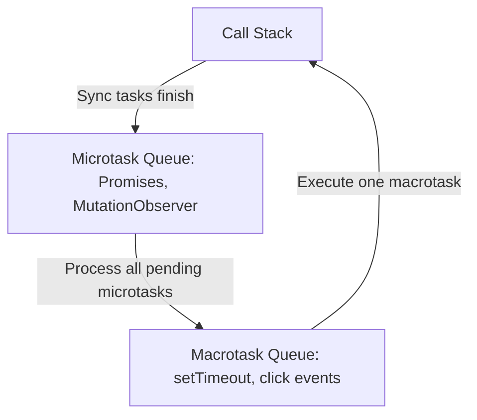

# JavaScript Frontend Engineering

JavaScript is a dynamic, single-threaded, prototype-based language that runs natively inside all major web browsers, powering interactive web logic and client-side scripting.

---

<ProgressTracker currentSection=1 totalSections=3 />

## 1. Browser Event Loop: Microtasks vs Macrotasks

The browser schedules tasks to execute sequentially on the single main thread.



* **Microtasks**: Execute immediately after the current script finishes, before the browser repaints the UI.
* **Macrotasks**: Wait in line for the next loop iteration, allowing UI renders to occur in between tasks.

---

<ProgressTracker currentSection=2 totalSections=3 />

## 2. Functional Closures

A **closure** is the combination of a function bundled together with references to its surrounding state (the lexical environment). Closures allow inner functions to access outer scope variables even after the outer function has returned.

### Code Demonstration: Closure Instance
<Tabs>
  <Tab label="Syntax & Example">

```javascript
function createCounter(incrementStep) {
  let count = 0; // Private state variable
  
  return function() {
    count += incrementStep;
    return count;
  };
}

const incrementByTwo = createCounter(2);
console.log(incrementByTwo()); // Output: 2
console.log(incrementByTwo()); // Output: 4
```

  </Tab>
  <Tab label="Interactive Playground">
    <InteractiveExample 
      language="javascript"
      initialCode="function createCounter(incrementStep) {\n  let count = 0; // Private state variable\n  \n  return function() {\n    count += incrementStep;\n    return count;\n  };\n}\n\nconst incrementByTwo = createCounter(2);\nconsole.log(incrementByTwo()); // Output: 2\nconsole.log(incrementByTwo()); // Output: 4" 
      instruction="Execute and edit this JAVASCRIPT example."
    />
  </Tab>
</Tabs>

---

<ProgressTracker currentSection=3 totalSections=3 />

## 3. Asynchronous Operations: Promises & Async/Await

### Promises & Chaining
<Tabs>
  <Tab label="Syntax & Example">

```javascript
function fetchUserData() {
  return new Promise((resolve, reject) => {
    setTimeout(() => {
      const success = true;
      if (success) {
        resolve({ id: 101, user: "admin" });
      } else {
        reject("Network timeout error");
      }
    }, 100);
  });
}

// Chaining
fetchUserData()
  .then(data => console.log("Received Data:", data))
  .catch(err => console.error("Error:", err));
```

  </Tab>
  <Tab label="Interactive Playground">
    <InteractiveExample 
      language="javascript"
      initialCode="function fetchUserData() {\n  return new Promise((resolve, reject) => {\n    setTimeout(() => {\n      const success = true;\n      if (success) {\n        resolve({ id: 101, user: \"admin\" });\n      } else {\n        reject(\"Network timeout error\");\n      }\n    }, 100);\n  });\n}\n\n// Chaining\nfetchUserData()\n  .then(data => console.log(\"Received Data:\", data))\n  .catch(err => console.error(\"Error:\", err));" 
      instruction="Execute and edit this JAVASCRIPT example."
    />
  </Tab>
</Tabs>

### Modern Async/Await Syntax
<Tabs>
  <Tab label="Syntax & Example">

```javascript
async function executeTransaction() {
  try {
    const user = await fetchUserData();
    console.log(`Processing profile for ${user.user}`);
  } catch (error) {
    console.error("Transaction aborted:", error);
  }
}
```

  </Tab>
  <Tab label="Interactive Playground">
    <InteractiveExample 
      language="javascript"
      initialCode="async function executeTransaction() {\n  try {\n    const user = await fetchUserData();\n    console.log(`Processing profile for ${user.user}`);\n  } catch (error) {\n    console.error(\"Transaction aborted:\", error);\n  }\n}" 
      instruction="Execute and edit this JAVASCRIPT example."
    />
  </Tab>
</Tabs>

---

### Knowledge Verification Check

<Quiz 
  question="How does Java achieve platform independence?" 
  options=["By compiling code directly to raw hardware machine instructions.", "By compiling source code to bytecode, which is then executed by the Java Virtual Machine (JVM).", "By dynamically translating Java into Javascript at runtime.", "By executing code directly from raw `.java` text files."] 
  answerIndex=1 
  explanation="Java code is compiled into platform-neutral bytecode (`.class` files), which the JVM translates into machine instructions for the host platform." 
/>

<Quiz 
  question="In the JVM memory model, where are objects allocated and where are local variables stored?" 
  options=["Objects on the Stack, local variables on the Heap.", "Objects and local variables are both stored on the Stack.", "Objects on the Heap, local variables on the Stack.", "Objects and local variables are both stored on the Heap."] 
  answerIndex=2 
  explanation="The Heap memory area is used for dynamic allocation of objects, while the Stack contains method frames storing local variables and reference pointers." 
/>

<Quiz 
  question="What is the primary role of the Java Garbage Collector (GC)?" 
  options=["To optimize SQL queries in databases.", "To automatically reclaim memory by deleting objects that are no longer reachable in the application code.", "To compile Java files into JAR archives.", "To monitor system file permissions."] 
  answerIndex=1 
  explanation="The JVM Garbage Collector manages memory by automatically tracking object reachability and freeing up Heap space occupied by unreachable objects." 
/>

<Quiz 
  question="Which access modifier in Java restricts visibility strictly to the declaring class itself?" 
  options=["public", "protected", "private", "default (no modifier)"] 
  answerIndex=2 
  explanation="The `private` access modifier limits access exclusively to fields, methods, or constructors within the class where they are declared." 
/>

<Quiz 
  question="What is a major difference between an interface and an abstract class in Java?" 
  options=["Interfaces can hold instance fields, abstract classes cannot.", "A class can implement multiple interfaces, but can extend only one abstract class.", "Interfaces must contain method bodies, abstract classes cannot.", "Abstract classes cannot declare constructors."] 
  answerIndex=1 
  explanation="Java supports single class inheritance (only one abstract class can be extended) but multiple interface implementation." 
/>

<Quiz 
  question="What does the `@RestController` annotation do in a Spring Boot application?" 
  options=["It registers the class as a database access repository.", "It combines `@Controller` and `@ResponseBody`, serializing return values (like objects) directly into HTTP responses (typically JSON).", "It launches a background compilation process.", "It maps a class to a container load balancer."] 
  answerIndex=1 
  explanation="`@RestController` simplifies REST API creation. It tells Spring Boot that handlers return serialized data objects rather than routing to HTML templates." 
/>

<Quiz 
  question="In Spring Boot, how does the `@Autowired` annotation facilitate dependency injection?" 
  options=["It automatically compiles dependencies on startup.", "It allows the Spring context to automatically resolve and inject matching bean dependencies into fields, constructors, or setters.", "It downloads external dependencies from Maven Central.", "It starts a new server thread for bean instances."] 
  answerIndex=1 
  explanation="`@Autowired` directs Spring Boot's dependency injection container to automatically wire matching bean components into the decorated construct." 
/>

<Quiz 
  question="What is the key difference between Checked and Unchecked exceptions in Java?" 
  options=["Checked exceptions occur at runtime, unchecked exceptions occur at compile time.", "Checked exceptions must be declared in throws or caught; unchecked exceptions (RuntimeException) do not require compile-time handling.", "Unchecked exceptions can never be caught in code.", "Checked exceptions consume more CPU cycles to process."] 
  answerIndex=1 
  explanation="Checked exceptions are verified at compile time. Unchecked exceptions extend `RuntimeException` and represent programming bugs (like NullPointerException) that are resolved at runtime." 
/>

<Quiz 
  question="How does a Java `HashMap` resolve collision when two keys have the same hash code?" 
  options=["It overwrites the old key-value pair immediately.", "It throws a RuntimeException.", "It stores colliding nodes in a linked list (or red-black tree) associated with that hash bucket.", "It resizes the map dynamically to double its size."] 
  answerIndex=2 
  explanation="HashMap uses chaining. Colliding entries are placed in a linked list at the bucket index. If the bucket exceeds a threshold (8), Java 8+ converts it to a red-black tree." 
/>

<Quiz 
  question="What are the states that a Java Thread can enter during its lifecycle?" 
  options=["Active, Inactive, Completed.", "NEW, RUNNABLE, BLOCKED, WAITING, TIMED_WAITING, TERMINATED.", "Starting, Working, Finished.", "Local, Global, Shared."] 
  answerIndex=1 
  explanation="Java threads follow a strict state diagram represented by the `Thread.State` enum: NEW, RUNNABLE, BLOCKED, WAITING, TIMED_WAITING, and TERMINATED." 
/>

<Quiz 
  question="What is the difference between method overloading and method overriding in Java?" 
  options=["Overloading is done in subclassing, overriding is done within the same class.", "Overloading is determined at compile-time (same method name, different signatures), overriding at runtime (replaces parent method in subclass).", "Overloading changes return type only, overriding changes parameters.", "There is no difference; they are synonymous."] 
  answerIndex=1 
  explanation="Method overloading is compile-time polymorphism (same name, different arguments). Method overriding is run-time polymorphism (subclass overrides parent method with identical signature)." 
/>

<Quiz 
  question="What does the `synchronized` keyword enforce in Java?" 
  options=["It forces compilation to run synchronously.", "It ensures that only one thread can execute a block or method on a locked object at any given time, preventing race conditions.", "It automatically runs code in parallel across all CPU cores.", "It updates local fields directly to database records."] 
  answerIndex=1 
  explanation="`synchronized` utilizes monitor locks (intrinsic locks) on objects, ensuring mutually exclusive thread access to critical sections of multi-threaded code." 
/>
