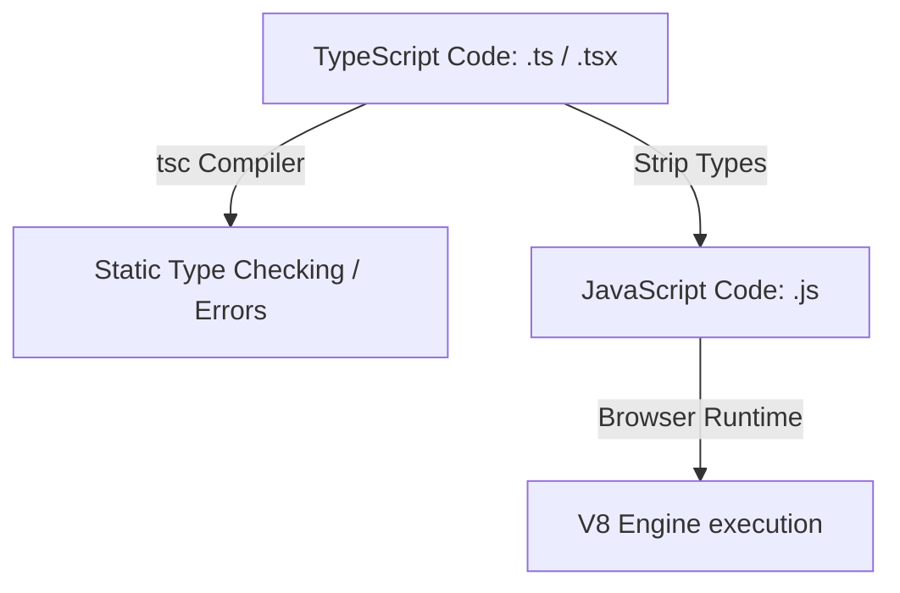

# TypeScript Frontend Engineering

TypeScript is a strongly typed superset of JavaScript that compiles directly down to clean JavaScript. It adds compile-time static type-checking and autocomplete support to catch bugs early in development.

## Installation & Tooling

To install and configure TypeScript on your project:
1. Ensure **Node.js & npm** are installed on your machine.
2. Install the TypeScript compiler globally or locally in your project:
   ```bash
   # Global installation
   npm install -g typescript
   ```
3. Initialize the default TypeScript compiler configuration file (`tsconfig.json`):
   ```bash
   tsc --init
   ```
4. Verify the compiler is active:
   ```bash
   tsc --version
   ```

---

## 1. Compilation & Runtime Flow

TypeScript only exists during development; the compiler (`tsc`) strips away all type annotations before deploying to production.



---

## 2. Types vs Interfaces

| Feature | `interface` | `type` alias |
| :--- | :--- | :--- |
| **Declaration Merging** | Yes (automatic extension of identical names) | No (throws compile-time duplicate error) |
| **Extends / Implements** | Extends other interfaces using `extends` | Combined using union `\|` or intersection `&` |
| **Use Case** | Ideal for defining API responses, OOP classes | Ideal for union types, primitive aliases, tuple types |

### Code Demonstration: Types & Interfaces
```typescript
// 1. Interface with inheritance
interface Identifiable {
  id: number;
}

interface UserProfile extends Identifiable {
  username: string;
  role: 'admin' | 'editor' | 'viewer'; // Union type
}

// 2. Type intersection and alias
type Timestamp = number;
type AuditLogs = UserProfile & {
  lastActive: Timestamp;
};
```

---

## 3. Generics (Reusable Type Templates)

Generics allow code components to accept types as variables, ensuring type safety across dynamic functions.

```typescript
// Generic API Response Container
interface ApiResponse<T> {
  data: T;
  status: number;
  message: string;
}

// Concrete schemas
interface ProductRecord {
  title: string;
  sku: string;
}

// Usage enforces compile-time type validation of response.data fields
function handleProductResponse(response: ApiResponse<ProductRecord>) {
  console.log(`Product SKU: ${response.data.sku}`);
}
```

---

## 4. Best Practices
* **Avoid `any`**: Using `any` disables TypeScript's safety features. Use `unknown` if the type is unknown, and narrow it down using type guards.
* **Enable `strict` Mode**: Turn on `"strict": true` in `tsconfig.json` to prevent null-pointer exceptions and enforce strict typing rules.
