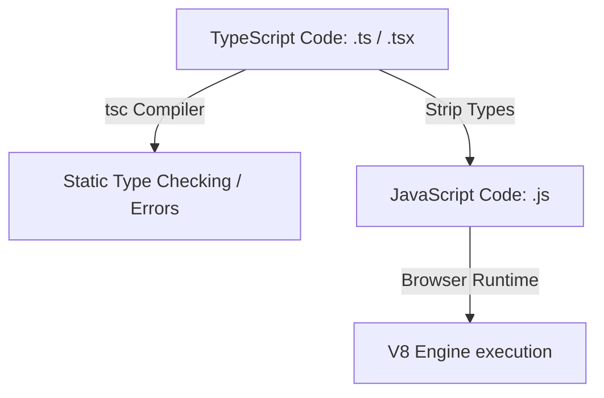

# TypeScript Frontend Engineering

TypeScript is a strongly typed superset of JavaScript that compiles directly down to clean JavaScript. It adds compile-time static type-checking and autocomplete support to catch bugs early in development.

<ProgressTracker currentSection=1 totalSections=5 />

## Installation & Tooling

To install and configure TypeScript on your project:
1. Ensure **Node.js & npm** are installed on your machine.
2. Install the TypeScript compiler globally or locally in your project:
   ```bash
   # Global installation
   npm install -g typescript
   ```
3. Initialize the default TypeScript compiler configuration file (`tsconfig.json`):
   ```bash
   tsc --init
   ```
4. Verify the compiler is active:
   ```bash
   tsc --version
   ```

---

<ProgressTracker currentSection=2 totalSections=5 />

## 1. Compilation & Runtime Flow

TypeScript only exists during development; the compiler (`tsc`) strips away all type annotations before deploying to production.



---

<ProgressTracker currentSection=3 totalSections=5 />

## 2. Types vs Interfaces

| Feature | `interface` | `type` alias |
| :--- | :--- | :--- |
| **Declaration Merging** | Yes (automatic extension of identical names) | No (throws compile-time duplicate error) |
| **Extends / Implements** | Extends other interfaces using `extends` | Combined using union `\|` or intersection `&` |
| **Use Case** | Ideal for defining API responses, OOP classes | Ideal for union types, primitive aliases, tuple types |

### Code Demonstration: Types & Interfaces
```typescript
// 1. Interface with inheritance
interface Identifiable {
  id: number;
}

interface UserProfile extends Identifiable {
  username: string;
  role: 'admin' | 'editor' | 'viewer'; // Union type
}

// 2. Type intersection and alias
type Timestamp = number;
type AuditLogs = UserProfile & {
  lastActive: Timestamp;
};
```

---

<ProgressTracker currentSection=4 totalSections=5 />

## 3. Generics (Reusable Type Templates)

Generics allow code components to accept types as variables, ensuring type safety across dynamic functions.

```typescript
// Generic API Response Container
interface ApiResponse<T> {
  data: T;
  status: number;
  message: string;
}

// Concrete schemas
interface ProductRecord {
  title: string;
  sku: string;
}

// Usage enforces compile-time type validation of response.data fields
function handleProductResponse(response: ApiResponse<ProductRecord>) {
  console.log(`Product SKU: ${response.data.sku}`);
}
```

---

<ProgressTracker currentSection=5 totalSections=5 />

## 4. Best Practices
* **Avoid `any`**: Using `any` disables TypeScript's safety features. Use `unknown` if the type is unknown, and narrow it down using type guards.
* **Enable `strict` Mode**: Turn on `"strict": true` in `tsconfig.json` to prevent null-pointer exceptions and enforce strict typing rules.

---

### Knowledge Verification Check

<Quiz 
  question="What is the primary difference between a Docker Image and a Docker Container?" 
  options=["Images are running instances of containers.", "An image is an immutable, read-only template; a container is a runnable, isolated instance created from that image.", "Images are used in production; containers in development.", "There is no functional difference."] 
  answerIndex=1 
  explanation="An image represents the application and its dependencies. A container is a runtime instantiation of that blueprint containing an isolated file system and execution space." 
/>

<Quiz 
  question="In a Dockerfile, what is the difference between `RUN` and `CMD` instructions?" 
  options=["`RUN` executes commands during image build time; `CMD` specifies default commands to run when the container starts.", "`RUN` runs only in background; `CMD` runs in foreground.", "`RUN` starts the container; `CMD` compiles dependencies.", "They are completely interchangeable."] 
  answerIndex=0 
  explanation="`RUN` commands execute on top of intermediate layers to build the image. `CMD` provides the runtime entry point commands when executing `docker run`." 
/>

<Quiz 
  question="What are Docker Volumes used for?" 
  options=["To control container CPU priority.", "To persist data generated and used by Docker containers, bypassing the container's writable storage layer.", "To increase network communication speeds.", "To compress Docker image size."] 
  answerIndex=1 
  explanation="Containers are ephemeral; their data is deleted on termination. Docker Volumes mount directory maps from the host system to maintain persistent state." 
/>

<Quiz 
  question="What does Docker Compose allow developers to do?" 
  options=["Compile Go code into Python applications.", "Define, manage, and run multi-container applications using a single YAML configuration file.", "Deploy containers directly to AWS lambda functions.", "Monitor container CPU usage dynamically."] 
  answerIndex=1 
  explanation="Docker Compose automates orchestration. Running `docker compose up` uses a `docker-compose.yml` config file to build, link, and run networks of service containers." 
/>

<Quiz 
  question="What is the difference between the `EXPOSE` instruction and publishing a port (`-p`) in Docker?" 
  options=["`EXPOSE` maps ports to the host; `-p` is documentation.", "`EXPOSE` is documentation indicating intended ports; `-p` actually binds and forwards host ports to the container.", "`EXPOSE` works only for database containers.", "They behave identically."] 
  answerIndex=1 
  explanation="`EXPOSE` serves as documentation showing which ports are used by the app. The runtime flag `-p hostPort:containerPort` is required to open traffic mapping to the host." 
/>

<Quiz 
  question="How does Docker leverage layer caching during image builds?" 
  options=["It caches database queries.", "It skips rebuilding image layers if the Dockerfile instruction and referenced files have not changed since the last build.", "It stores container outputs in memory.", "It compiles Javascript modules on the fly."] 
  answerIndex=1 
  explanation="Docker processes Dockerfile lines sequentially. If a layer's instruction and its context files match a cached layer, Docker reuses that layer, saving build time." 
/>

<Quiz 
  question="Which Docker network driver connects containers directly to the host's networking stack, bypassing virtualization?" 
  options=["bridge", "host", "overlay", "none"] 
  answerIndex=1 
  explanation="The `host` network driver runs the container's processes directly in the host's network namespaces, matching host port mappings directly." 
/>

<Quiz 
  question="What is a primary benefit of using Multi-stage builds in Dockerfiles?" 
  options=["It lets containers run on different operating systems.", "It reduces the final image size by copying only compiler outputs (artifacts) to a minimal runtime base image, excluding compiler dependencies.", "It speeds up database migration runs.", "It spawns multiple containers at once."] 
  answerIndex=1 
  explanation="Multi-stage builds use multiple `FROM` clauses. Heavy tools and source files are used in build stages, and only finished binaries are copied into final light containers." 
/>

<Quiz 
  question="What is a Docker Registry used for?" 
  options=["To register domain names for containers.", "To store, distribute, and manage Docker Images (e.g. Docker Hub, Amazon ECR).", "To track database schemas.", "To balance network requests."] 
  answerIndex=1 
  explanation="A registry is a repository service. Developers push built images to registries so they can be pulled and run on staging or production servers." 
/>

<Quiz 
  question="In Kubernetes, what is a Pod?" 
  options=["A physical server cabinet.", "The smallest deployable unit representing a single instance of a running process, wrapping one or more tightly coupled containers.", "A database storage volume.", "A network load balancer."] 
  answerIndex=1 
  explanation="Pods share network namespaces, IP addresses, and storage volumes. Containers inside a Pod collaborate closely, acting as a single logical host." 
/>

<Quiz 
  question="What is the difference between Continuous Integration (CI) and Continuous Deployment (CD)?" 
  options=["CI manages databases; CD manages servers.", "CI automates building and testing code on repository commits; CD automates releasing and deploying passing code to production environment.", "CI is done by developers; CD by system admins.", "They are synonyms."] 
  answerIndex=1 
  explanation="CI focuses on code validation and integration (PR testing). CD automates the downstream release pipeline to deploy verified builds directly to environment servers." 
/>

<Quiz 
  question="What is the core principle of Infrastructure as Code (IaC)?" 
  options=["Writing server code using Javascript.", "Managing and provisioning infrastructure resources (servers, databases, networks) using machine-readable definition files rather than manual UI configs.", "Compiling Dockerfiles to native code.", "Running automated unit tests."] 
  answerIndex=1 
  explanation="IaC (e.g. Terraform, CloudFormation) defines infrastructure in config code, allowing infrastructure setup to be version-controlled, reviewed, and reproduced easily." 
/>
