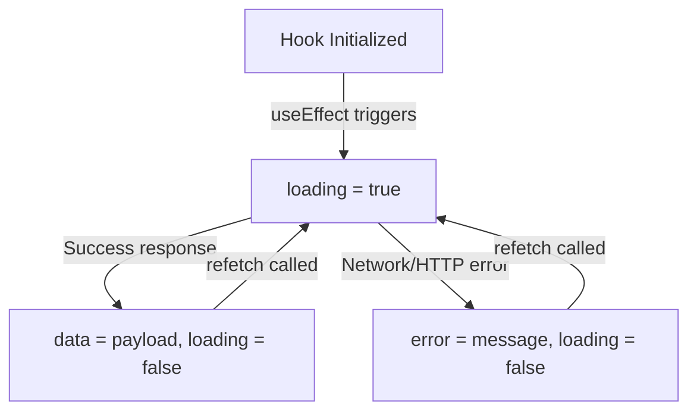

# Data Ingestion with Custom Hooks

Encapsulating API request logic into custom React Hooks isolates networking code from display components. This makes codebase testing and maintenance significantly simpler.

---

<ProgressTracker currentSection=1 totalSections=3 />

## 1. Request States & Hook Lifecycle



---

<ProgressTracker currentSection=2 totalSections=3 />

## 2. Code Implementation: `useApi` Custom Hook

Below is a complete, reusable custom hook supporting `loading`, `error`, `data`, and a manual `refetch` function.

<Tabs>
  <Tab label="Syntax & Example">

```javascript
// useApi.js
import { useState, useEffect, useCallback } from 'react';

export const useApi = (url) => {
  const [data, setData] = useState([]);
  const [loading, setLoading] = useState(false);
  const [error, setError] = useState(null);

  // Memoized fetch function to prevent unnecessary recreation
  const fetchData = useCallback(async () => {
    setLoading(true);
    setError(null);
    try {
      const response = await fetch(url);
      if (!response.ok) {
        throw new Error(`HTTP error! status: ${response.status}`);
      }
      const json = await response.json();
      setData(json);
    } catch (err) {
      setError(err.message || 'Something went wrong');
    } finally {
      setLoading(false);
    }
  }, [url]);

  useEffect(() => {
    fetchData();
  }, [fetchData]);

  // Return data, states, and refetch function for manual refresh
  return { data, loading, error, refetch: fetchData };
};
```

  </Tab>
  <Tab label="Interactive Playground">
    <InteractiveExample 
      language="javascript"
      initialCode="// useApi.js\nimport { useState, useEffect, useCallback } from 'react';\n\nexport const useApi = (url) => {\n  const [data, setData] = useState([]);\n  const [loading, setLoading] = useState(false);\n  const [error, setError] = useState(null);\n\n  // Memoized fetch function to prevent unnecessary recreation\n  const fetchData = useCallback(async () => {\n    setLoading(true);\n    setError(null);\n    try {\n      const response = await fetch(url);\n      if (!response.ok) {\n        throw new Error(`HTTP error! status: ${response.status}`);\n      }\n      const json = await response.json();\n      setData(json);\n    } catch (err) {\n      setError(err.message || 'Something went wrong');\n    } finally {\n      setLoading(false);\n    }\n  }, [url]);\n\n  useEffect(() => {\n    fetchData();\n  }, [fetchData]);\n\n  // Return data, states, and refetch function for manual refresh\n  return { data, loading, error, refetch: fetchData };\n};" 
      instruction="Execute and edit this JAVASCRIPT example."
    />
  </Tab>
</Tabs>

---

<ProgressTracker currentSection=3 totalSections=3 />

## 3. Best Practices
* **Prevent Memory Leaks**: Use clean-up variables inside `useEffect` if components unmount during active fetch operations.
* **Axios vs Fetch**: Consider upgrading to Axios if you need automatic request timeout controls, global interceptors (e.g., to automatically attach JWT authorization headers), or download progress tracking.

---

### Knowledge Verification Check

<Quiz 
  question="How does Node.js handle asynchronous operations if JavaScript is single-threaded?" 
  options=["By spawning a new CPU thread for each async callback.", "Using an Event Loop to offload non-blocking I/O tasks to the OS kernel or a thread pool, processing results sequentially when the call stack is empty.", "By compiling JavaScript code to a multithreaded native application.", "Through cooperative process-forking on multi-core servers."] 
  answerIndex=1 
  explanation="Node.js uses a single-threaded Event Loop that delegates asynchronous tasks (such as network or file operations) to system APIs or libuv's thread pool, processing callbacks sequentially." 
/>

<Quiz 
  question="What are the states of a JavaScript Promise?" 
  options=["Started, Running, Stopped.", "pending, fulfilled, rejected.", "Active, Resolved, Terminated.", "Waiting, Done, Failed."] 
  answerIndex=1 
  explanation="A Promise is always in one of three mutually exclusive states: pending (initial state), fulfilled (operation completed successfully), or rejected (operation failed)." 
/>

<Quiz 
  question="How does `async/await` relate to JavaScript Promises?" 
  options=["It compiles Javascript to native asynchronous C code.", "It is syntactic sugar built on top of Promises, making asynchronous code write and read like synchronous code.", "It deletes Promises entirely from runtime memory.", "It forces callbacks to run in parallel threads."] 
  answerIndex=1 
  explanation="`async` functions automatically return a Promise. The `await` keyword pauses execution of the async function until the awaited Promise resolves, making async code highly readable." 
/>

<Quiz 
  question="What parameters do Express.js middleware functions receive in their execution signature?" 
  options=["Only the request object (`req`).", "The Request (`req`), Response (`res`), and a call-forwarding function (`next`).", "The database client and router instances.", "System process and port information."] 
  answerIndex=1 
  explanation="Express middleware signature accepts `(req, res, next)`. This gives it access to request data, response handling, and control routing to subsequent handlers via `next()`." 
/>

<Quiz 
  question="What is a closure in JavaScript?" 
  options=["A function that automatically closes database connections.", "The combination of a function bundled together with references to its surrounding state (the lexical environment).", "A compile-time block syntax warning.", "An object that cannot hold properties."] 
  answerIndex=1 
  explanation="A closure allows an inner function to access variables from its outer (enclosing) scope even after the outer function has finished executing." 
/>

<Quiz 
  question="What is the difference between CommonJS and ES Modules (ESM) in Node.js?" 
  options=["CommonJS uses `require()` and `module.exports`, while ES Modules use `import` and `export` statements.", "CommonJS is asynchronous, while ESM is synchronous.", "CommonJS runs only in the browser, while ESM runs only in Node.js.", "There is no difference in syntax."] 
  answerIndex=0 
  explanation="CommonJS is Node's historical module system using `require`/`module.exports`. ESM is the ES6 standard using `import`/`export`, which supports static analysis and tree shaking." 
/>

<Quiz 
  question="Which C++ library does Node.js rely on to manage its thread pool and asynchronous event processing?" 
  options=["V8", "libuv", "Webpack", "Boost"] 
  answerIndex=1 
  explanation="Node.js uses the libuv library to handle the event loop, thread pool workers, file system notifications, and asynchronous networking events." 
/>

<Quiz 
  question="How does prototypical inheritance work in JavaScript?" 
  options=["Objects copy all properties from a class blueprint on instantiation.", "Objects inherit properties and methods directly from other objects via a prototype chain link.", "Inheritance is resolved strictly at compile time.", "JavaScript does not support inheritance."] 
  answerIndex=1 
  explanation="Every JS object has a link to a prototype object. When a property or method is requested, JS searches the object first, then traverses up the prototype chain until found or null is reached." 
/>

<Quiz 
  question="What is the scoping difference between `var`, `let`, and `const`?" 
  options=["`var` is block-scoped, while `let` and `const` are function-scoped.", "`var` is function-scoped (or global), while `let` and `const` are block-scoped.", "`const` is globally scoped, while `let` is locally scoped.", "All three share identical scoping rules."] 
  answerIndex=1 
  explanation="`var` is scoped to its declaring function. `let` and `const` are block-scoped (scoped to the nearest `{}` block). Additionally, `const` cannot be reassigned." 
/>

<Quiz 
  question="Which array method returns a single accumulated value by running a callback on each element?" 
  options=["map", "filter", "reduce", "forEach"] 
  answerIndex=2 
  explanation="The `reduce` method executes a reducer function on each array element, accumulating the results into a single value (e.g. summing numbers)." 
/>

<Quiz 
  question="What is the difference between `==` and `===` operators in JavaScript?" 
  options=["`==` is strict equality, while `===` performs type coercion.", "`==` performs type coercion before comparison, while `===` compares both value and type strictly.", "They behave identically.", "`==` is used for objects, `===` is used for primitive types."] 
  answerIndex=1 
  explanation="The loose equality operator (`==`) converts operands to a common type (coercion) before comparing. The strict equality operator (`===`) compares value and type without conversion." 
/>

<Quiz 
  question="What is the purpose of Node's `EventEmitter` class?" 
  options=["To manage browser mouse click events.", "To implement the observer pattern, allowing objects to emit named events that trigger registered listener callbacks.", "To execute database transactions.", "To create child server processes."] 
  answerIndex=1 
  explanation="The `EventEmitter` class in Node's `events` module enables event-driven programming, facilitating asynchronous communication between different components of an app." 
/>
