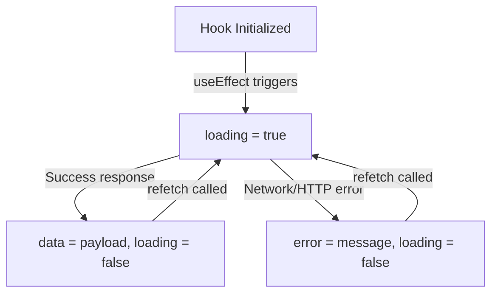

# Data Ingestion with Custom Hooks

Encapsulating API request logic into custom React Hooks isolates networking code from display components. This makes codebase testing and maintenance significantly simpler.

---

## 1. Request States & Hook Lifecycle



---

## 2. Code Implementation: `useApi` Custom Hook

Below is a complete, reusable custom hook supporting `loading`, `error`, `data`, and a manual `refetch` function.

```javascript
// useApi.js
import { useState, useEffect, useCallback } from 'react';

export const useApi = (url) => {
  const [data, setData] = useState([]);
  const [loading, setLoading] = useState(false);
  const [error, setError] = useState(null);

  // Memoized fetch function to prevent unnecessary recreation
  const fetchData = useCallback(async () => {
    setLoading(true);
    setError(null);
    try {
      const response = await fetch(url);
      if (!response.ok) {
        throw new Error(`HTTP error! status: ${response.status}`);
      }
      const json = await response.json();
      setData(json);
    } catch (err) {
      setError(err.message || 'Something went wrong');
    } finally {
      setLoading(false);
    }
  }, [url]);

  useEffect(() => {
    fetchData();
  }, [fetchData]);

  // Return data, states, and refetch function for manual refresh
  return { data, loading, error, refetch: fetchData };
};
```

---

## 3. Best Practices
* **Prevent Memory Leaks**: Use clean-up variables inside `useEffect` if components unmount during active fetch operations.
* **Axios vs Fetch**: Consider upgrading to Axios if you need automatic request timeout controls, global interceptors (e.g., to automatically attach JWT authorization headers), or download progress tracking.
