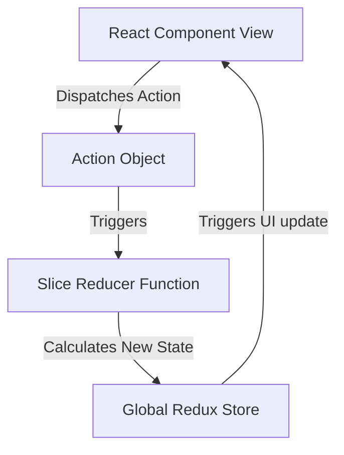

# Redux Toolkit Global State Management

Redux Toolkit (RTK) is the official, opinionated, batteries-included toolset for efficient Redux development. It simplifies store configuration, reduces boilerplate, and uses Immer under the hood to allow writing mutable-like state updates safely.

---

<ProgressTracker currentSection=1 totalSections=2 />

## 1. Redux Data Flow Lifecycle



---

<ProgressTracker currentSection=2 totalSections=2 />

## 2. Code Demonstration: Redux Toolkit Slice & Store

### 1. Creating a Slice
<Tabs>
  <Tab label="Syntax & Example">

```javascript
// itemsSlice.js
import { createSlice } from '@reduxjs/toolkit';

const initialState = {
  items: [],
  status: 'idle', // 'idle' | 'loading' | 'succeeded' | 'failed'
};

const itemsSlice = createSlice({
  name: 'items',
  initialState,
  reducers: {
    addItem: (state, action) => {
      // Immer allows us to write direct "mutating" updates safely
      state.items.push(action.payload);
    },
    removeItem: (state, action) => {
      state.items = state.items.filter(item => item.id !== action.payload);
    },
    setItemsStatus: (state, action) => {
      state.status = action.payload;
    }
  }
});

export const { addItem, removeItem, setItemsStatus } = itemsSlice.actions;
export default itemsSlice.reducer;
```

  </Tab>
  <Tab label="Interactive Playground">
    <InteractiveExample 
      language="javascript"
      initialCode="// itemsSlice.js\nimport { createSlice } from '@reduxjs/toolkit';\n\nconst initialState = {\n  items: [],\n  status: 'idle', // 'idle' | 'loading' | 'succeeded' | 'failed'\n};\n\nconst itemsSlice = createSlice({\n  name: 'items',\n  initialState,\n  reducers: {\n    addItem: (state, action) => {\n      // Immer allows us to write direct \"mutating\" updates safely\n      state.items.push(action.payload);\n    },\n    removeItem: (state, action) => {\n      state.items = state.items.filter(item => item.id !== action.payload);\n    },\n    setItemsStatus: (state, action) => {\n      state.status = action.payload;\n    }\n  }\n});\n\nexport const { addItem, removeItem, setItemsStatus } = itemsSlice.actions;\nexport default itemsSlice.reducer;" 
      instruction="Execute and edit this JAVASCRIPT example."
    />
  </Tab>
</Tabs>

### 2. Configuring the Store
<Tabs>
  <Tab label="Syntax & Example">

```javascript
// store.js
import { configureStore } from '@reduxjs/toolkit';
import itemsReducer from './itemsSlice';

export const store = configureStore({
  reducer: {
    items: itemsReducer
  }
});
```

  </Tab>
  <Tab label="Interactive Playground">
    <InteractiveExample 
      language="javascript"
      initialCode="// store.js\nimport { configureStore } from '@reduxjs/toolkit';\nimport itemsReducer from './itemsSlice';\n\nexport const store = configureStore({\n  reducer: {\n    items: itemsReducer\n  }\n});" 
      instruction="Execute and edit this JAVASCRIPT example."
    />
  </Tab>
</Tabs>

### 3. Integrating with React Components
```jsx
// ItemList.jsx
import React from 'react';
import { useSelector, useDispatch } from 'react-redux';
import { removeItem } from './itemsSlice';

export const ItemList = () => {
  const items = useSelector((state) => state.items.items);
  const dispatch = useDispatch();

  return (
    <ul className="item-list">
      {items.map(item => (
        <li key={item.id}>
          {item.name}
          <button onClick={() => dispatch(removeItem(item.id))}>Delete</button>
        </li>
      ))}
    </ul>
  );
};
```

---

### Knowledge Verification Check

<Quiz 
  question="What makes Go's goroutines much lighter than standard operating system threads?" 
  options=["Goroutines do not consume any RAM.", "Goroutines run inside the browser environment.", "Goroutines start with a very small stack (about 2KB) that grows and shrinks dynamically, and are multiplexed onto OS threads.", "Goroutines run only when the system is idle."] 
  answerIndex=2 
  explanation="Unlike OS threads which have large, fixed-size stacks (typically 1MB-2MB), goroutines start with 2KB stacks managed dynamically by the Go runtime scheduler." 
/>

<Quiz 
  question="How do goroutines communicate and synchronize data in Go?" 
  options=["Through global variables protected by thread locks.", "By using Channels to pass data and signal execution state.", "Using native operating system thread interrupts.", "Through shared database connections."] 
  answerIndex=1 
  explanation="Go uses channels as concurrency primitives to allow goroutines to pass typed data and safely synchronize without manual lock primitives." 
/>

<Quiz 
  question="What is the purpose of a pointer receiver (*StructName) in a Go method definition?" 
  options=["It automatically compiles the method as a static C binary.", "It allows the method to mutate the receiver's fields directly and avoids copying the struct's data on invocation.", "It renders the struct read-only.", "It registers the method with a garbage collection worker."] 
  answerIndex=1 
  explanation="A pointer receiver passes the memory address of the struct instance, enabling direct field modification and optimizing performance by avoiding struct copying." 
/>

<Quiz 
  question="What is the difference between an array and a slice in Go?" 
  options=["Arrays are dynamically sized, while slices have a fixed length.", "Arrays have a fixed size defined at compilation, while slices are dynamic windows pointing to an underlying array.", "Arrays are always passed by reference, while slices are passed by value.", "There is no difference; they are synonyms."] 
  answerIndex=1 
  explanation="Go arrays have a fixed size that is part of their type. Slices are flexible, dynamic wrappers containing a pointer to an underlying array, a length, and a capacity." 
/>

<Quiz 
  question="What is Go's standard approach for handling errors?" 
  options=["Using try-catch blocks to capture runtime exceptions.", "Returning an error interface as the last return value from functions, which the caller must check explicitly.", "Throwing fatal panics that terminate the program immediately.", "Writing errors automatically to a system syslog file."] 
  answerIndex=1 
  explanation="Go does not have standard try/catch blocks. Instead, functions return multiple values, including an error value, which callers inspect using `if err != nil`." 
/>

<Quiz 
  question="How does a class or struct implement an interface in Go?" 
  options=["By using the `implements` keyword in the declaration.", "Implicitly, by defining all methods declared in the interface (no explicit declaration needed).", "By inheriting from an interface helper base class.", "By wrapping the struct inside a package interface container."] 
  answerIndex=1 
  explanation="Go interfaces are implemented implicitly. A struct implements an interface simply by defining methods with matching signatures, enabling clean decoupling." 
/>

<Quiz 
  question="Which scheduling model does Go's runtime scheduler use to multiplex goroutines onto OS threads?" 
  options=["The M:N scheduler model (M goroutines onto N OS threads).", "A round-robin scheduling algorithm directly managed by the CPU.", "A single-threaded loop similar to Javascript.", "A multi-process fork scheduling model."] 
  answerIndex=0 
  explanation="The Go scheduler uses an M:N model (represented by G for goroutines, M for machine threads, and P for logical processors) to run millions of goroutines on a small pool of CPU threads." 
/>

<Quiz 
  question="When does a Go `defer` statement execute its associated function call?" 
  options=["Immediately when the defer line is parsed.", "In a separate background thread.", "When the surrounding function finishes and returns.", "Only if the program panics."] 
  answerIndex=2 
  explanation="A `defer` statement pushes a function call onto a stack. The deferred calls are executed in Last-In-First-Out (LIFO) order right before the surrounding function returns." 
/>

<Quiz 
  question="How are struct fields mapped to JSON properties during marshaling in Go?" 
  options=["By naming fields exactly the same as the JSON keys (case-insensitive).", "Using struct tags defined after field declarations, e.g. `json:\"fieldName\"`.", "By registering the struct inside an XML schema registry.", "Go automatically maps fields dynamically using reflection (no custom tags)."] 
  answerIndex=1 
  explanation="Go uses struct tags containing metadata (e.g. `json:\"id\"`) which the `encoding/json` package parses via reflection to serialize/deserialize fields." 
/>

<Quiz 
  question="How is package-level visibility (public/private) determined in Go?" 
  options=["By using the public or private keyword before declarations.", "Through directory path names.", "By capitalization: identifiers starting with an uppercase letter are public (exported), others are private.", "By declaring them in an external `package.json` configurations file."] 
  answerIndex=2 
  explanation="Go relies on capitalization for visibility. An identifier starting with an uppercase letter is exported (public) and visible outside its package; lowercase is unexported." 
/>

<Quiz 
  question="What is cap(slice) in Go?" 
  options=["The number of elements currently stored in the slice.", "The maximum length a slice can grow to before raising an exception.", "The capacity: the number of elements in the underlying array, starting from the first element of the slice.", "The memory size of the slice in bytes."] 
  answerIndex=2 
  explanation="The capacity of a slice represents the size of the underlying array allocation from the start of the slice. It is accessed via `cap(s)`, while `len(s)` returns the current item count." 
/>

<Quiz 
  question="What is the purpose of the `select` statement in Go?" 
  options=["To choose database rows from a table.", "To block execution until one of multiple channel operations (sends or receives) is ready to run.", "To implement standard switch cases for string values.", "To pick variables from system arrays."] 
  answerIndex=1 
  explanation="The `select` statement lets a goroutine wait on multiple channel communication operations. It blocks until one of its cases is ready to execute, then runs that case." 
/>
