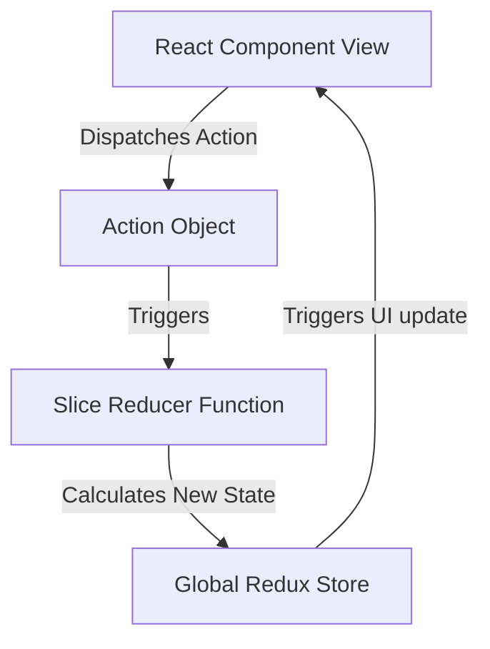

# Redux Toolkit Global State Management

Redux Toolkit (RTK) is the official, opinionated, batteries-included toolset for efficient Redux development. It simplifies store configuration, reduces boilerplate, and uses Immer under the hood to allow writing mutable-like state updates safely.

---

## 1. Redux Data Flow Lifecycle



---

## 2. Code Demonstration: Redux Toolkit Slice & Store

### 1. Creating a Slice
```javascript
// itemsSlice.js
import { createSlice } from '@reduxjs/toolkit';

const initialState = {
  items: [],
  status: 'idle', // 'idle' | 'loading' | 'succeeded' | 'failed'
};

const itemsSlice = createSlice({
  name: 'items',
  initialState,
  reducers: {
    addItem: (state, action) => {
      // Immer allows us to write direct "mutating" updates safely
      state.items.push(action.payload);
    },
    removeItem: (state, action) => {
      state.items = state.items.filter(item => item.id !== action.payload);
    },
    setItemsStatus: (state, action) => {
      state.status = action.payload;
    }
  }
});

export const { addItem, removeItem, setItemsStatus } = itemsSlice.actions;
export default itemsSlice.reducer;
```

### 2. Configuring the Store
```javascript
// store.js
import { configureStore } from '@reduxjs/toolkit';
import itemsReducer from './itemsSlice';

export const store = configureStore({
  reducer: {
    items: itemsReducer
  }
});
```

### 3. Integrating with React Components
```jsx
// ItemList.jsx
import React from 'react';
import { useSelector, useDispatch } from 'react-redux';
import { removeItem } from './itemsSlice';

export const ItemList = () => {
  const items = useSelector((state) => state.items.items);
  const dispatch = useDispatch();

  return (
    <ul className="item-list">
      {items.map(item => (
        <li key={item.id}>
          {item.name}
          <button onClick={() => dispatch(removeItem(item.id))}>Delete</button>
        </li>
      ))}
    </ul>
  );
};
```
