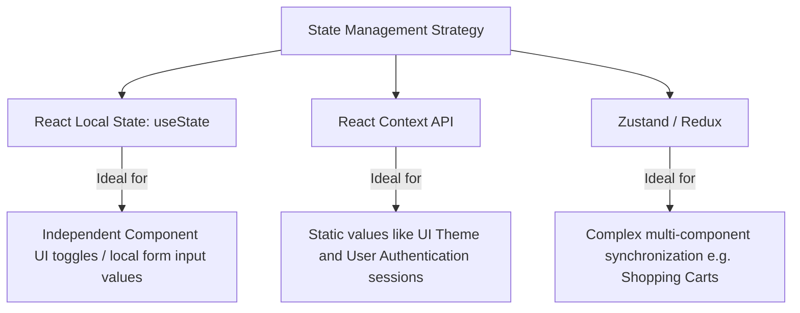

# Client-Side State Management

As frontend applications scale, sharing state between deeply nested components becomes complex. Pass-through props (prop drilling) should be avoided in favor of dedicated state management patterns.

---

## 1. State Management Choices



---

## 2. Code Implementation: Context API vs Zustand

### Option A: Using the Native React Context API
React Context is perfect for dependency injection and small-scale global variables.

```jsx
// ThemeContext.jsx
import React, { createContext, useState, useContext } from 'react';

const ThemeContext = createContext();

export const ThemeProvider = ({ children }) => {
  const [theme, setTheme] = useState('light');
  
  const toggleTheme = () => {
    setTheme(prev => prev === 'light' ? 'dark' : 'light');
  };

  return (
    <ThemeContext.Provider value={{ theme, toggleTheme }}>
      {children}
    </ThemeContext.Provider>
  );
};

export const useTheme = () => useContext(ThemeContext);
```

### Option B: Using Zustand
Zustand is a lightweight, high-performance state management library based on simplified flux principles. Unlike React Context, it does not trigger re-renders for non-subscribed variables.

```javascript
// store.js
import create from 'zustand';

export const useStore = create((set) => ({
  products: [],
  cart: [],
  
  // Actions to mutate state
  setProducts: (items) => set({ products: items }),
  addToCart: (product) => set((state) => ({ cart: [...state.cart, product] })),
  clearCart: () => set({ cart: [] }),
}));
```

---

## 3. Best Practices
* **Keep State Local**: Do not move state to a global store if it's only used by a single component.
* **Avoid Context for High-Frequency Updates**: React Context triggers re-renders on all descendants when the context value object changes. Use Zustand, Recoil, or Redux for high-frequency state updates.
