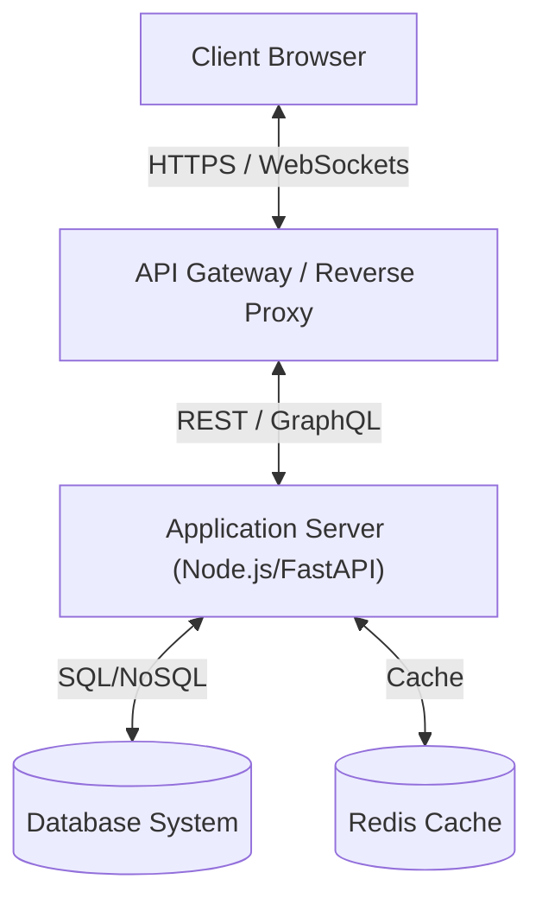

# Full Stack Developer Guide

Welcome to the Full Stack Developer guide. This document serves as a comprehensive reference for designing, building, and maintaining modern web applications from frontend to backend.

---

## 1. Core Architecture Pattern

Modern full-stack web applications leverage a decoupled client-server architecture to ensure high performance, scalability, and clean separation of concerns.



### Frontend vs Backend Architecture

| Tier | Primary Technologies | Core Responsibilities | Key Performance Metrics |
| :--- | :--- | :--- | :--- |
| **Frontend** | React, Next.js, HTML5, CSS3, JavaScript/TypeScript | User interface, State management, Routing, Client-side validation | LCP, FID, CLS, Page Load Time |
| **Backend** | Node.js, Express, FastAPI, Python, Go | Business logic, Data authorization, Database queries, APIs | Latency, Throughput, Error Rate |
| **Data** | PostgreSQL, MongoDB, Redis | Persistent storage, Caching, Relational integrity | Query time, Connection Pool health |

---

## 2. Frontend Development

A great frontend must be responsive, performant, and offer rich aesthetics.

### Key Concepts:
1. **Component-Driven Design**: Build UI components using Atomic Design principles.
2. **State Management**: Use React Context, Redux Toolkit, or Zustand to manage global client state.
3. **Optimized Rendering**: Leverage Server-Side Rendering (SSR), Static Site Generation (SSG), and Incremental Static Regeneration (ISR) via frameworks like Next.js.
4. **Premium Styling**: Use vanilla CSS or modern CSS-in-JS solutions with CSS Variables for theme consistency.

```javascript
// Example React Component with Clean State Handling
import React, { useState, useEffect } from 'react';

export const UserProfile = ({ userId }) => {
  const [user, setUser] = useState(null);
  const [loading, setLoading] = useState(true);

  useEffect(() => {
    let active = true;
    const fetchUser = async () => {
      try {
        const res = await fetch(`/api/users/${userId}`);
        const data = await res.json();
        if (active) setUser(data);
      } catch (err) {
        console.error(err);
      } finally {
        if (active) setLoading(false);
      }
    };
    fetchUser();
    return () => { active = false; };
  }, [userId]);

  if (loading) return <div className="spinner">Loading Profile...</div>;
  if (!user) return <div>User not found.</div>;

  return (
    <div className="profile-card">
      
      <h3>{user.name}</h3>
      <p>{user.email}</p>
    </div>
  );
};
```

---

## 3. Backend & API Engineering

A robust backend exposes structured, secure APIs and executes efficient business logic.

### API Best Practices:
* **RESTful Standards**: Use proper HTTP verbs (`GET`, `POST`, `PUT`, `DELETE`) and status codes (`200 OK`, `201 Created`, `400 Bad Request`, `401 Unauthorized`, `500 Server Error`).
* **Security & Authentication**: Secure API endpoints with JWT, OAuth2, and CORS configurations.
* **Input Validation**: Validate payload schemas strictly at the API boundaries (e.g., using Pydantic or Joi).
* **Database Optimization**: Optimize queries using indexing, pagination, and query logging.
