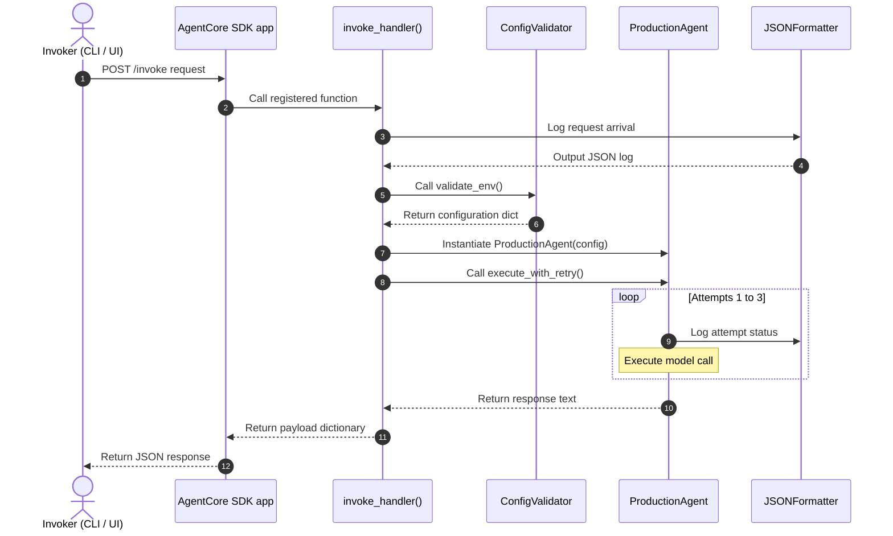

# 09_Chapter_understanding_the_code

## 🎯 Learning Objectives
In this chapter, you will learn how to:
- Write a custom log formatter class to output structured JSON logs.
- Enforce variable validation before executing agent requests.
- Implement connection retry loops with exponential backoff.
- Trace request flows through code modules using sequence diagrams.

### Importance of This Chapter
Production applications require robust logging, configuration verification, and error handling. Understanding this code helps developers build reliable agentic systems.

---

## 📦 Technical Terms Explained

> **📦 Technical Term Explained**
>
> **Term:** Logging
>
> **Simple Explanation:** Logging is the practice of writing status messages and diagnostic info to standard output or log files during execution.
>
> **Why do we need it?** To help developers trace errors, monitor performance, and debug applications.
>
> **Where is it used?** In all your application modules to record request events, warnings, or unhandled errors.

---

> **📦 Technical Term Explained**
>
> **Term:** Event Loop
>
> **Simple Explanation:** An Event Loop is a programming construct that continuously listens for and dispatches events or messages in a program.
>
> **Why do we need it?** It handles concurrent tasks (like network I/O or model calls) efficiently without blocking execution.
>
> **Where is it used?** In asynchronous runtimes (like Node.js or Python's `asyncio`) to coordinate web requests.

---

> **📦 Technical Term Explained**
>
> **Term:** Async Programming (Asynchronous)
>
> **Simple Explanation:** Asynchronous programming is a method of execution where tasks run independently of the main program flow, allowing other code to execute while waiting for network or disk operations to complete.
>
> **Why do we need it?** It improves application throughput by avoiding blocking on slow network operations (like model calls).
>
> **Where is it used?** In API handlers that call external services or download files.

---

## 🧠 Code Architecture Overview

The production agent structure contains four main layers:

```
┌────────────────────────────────────────────────────────┐
│              INBOUND REQUEST (JSON Payload)            │
└──────────────────────────┬─────────────────────────────┘
                           ▼
┌────────────────────────────────────────────────────────┐
│ 1. ROUTING LAYER (@app.invoke invoke_handler)          │
│    - Validates payload structure                       │
│    - Extracts Session ID and Actor ID context          │
└──────────────────────────┬─────────────────────────────┘
                           ▼
┌────────────────────────────────────────────────────────┐
│ 2. VALIDATION LAYER (ConfigValidator)                  │
│    - Checks environment variables                      │
│    - Validates AWS region and model IDs                │
└──────────────────────────┬─────────────────────────────┘
                           ▼
┌────────────────────────────────────────────────────────┐
│ 3. EXECUTION LAYER (ProductionAgent)                   │
│    - Coordinates model calls                           │
│    - Handles connection retries and backoff            │
└──────────────────────────┬─────────────────────────────┘
                           ▼
┌────────────────────────────────────────────────────────┐
│ 4. SYSTEM LOGGER (JSONFormatter)                       │
│    - Formats log outputs as JSON objects               │
└────────────────────────────────────────────────────────┘
```

---

## 📝 Production Agent Code Implementation

Let's examine the code for the production agent:

```python
# File: src/agent.py
# Folder Location: agentcore-samples/src/agent.py

import os
import sys
import logging
import json
import time
from typing import Dict, Any
from bedrock_agent_core import BedrockAgentCoreApp

# =====================================================================
# 1. Structured JSON Logging Setup
# =====================================================================
class JSONFormatter(logging.Formatter):
    def format(self, record):
        log_record = {
            "timestamp": self.formatTime(record, self.datefmt),
            "level": record.levelname,
            "message": record.getMessage(),
            "module": record.module,
        }
        if hasattr(record, "session_id"):
            log_record["session_id"] = record.session_id
        return json.dumps(log_record)

logger = logging.getLogger("ProductionAgent")
handler = logging.StreamHandler(sys.stdout)
handler.setFormatter(JSONFormatter())
logger.addHandler(handler)
logger.setLevel(logging.INFO)

# =====================================================================
# 2. App Wrapper and Environment Validator
# =====================================================================
app = BedrockAgentCoreApp()

class ConfigValidator:
    @staticmethod
    def validate_env() -> Dict[str, str]:
        required_vars = ["AWS_REGION", "BEDROCK_MODEL_ID"]
        missing = [var for var in required_vars if not os.environ.get(var)]
        if missing:
            os.environ["AWS_REGION"] = "us-east-1"
            os.environ["BEDROCK_MODEL_ID"] = "anthropic.claude-3-5-sonnet"
        return {
            "region": os.environ["AWS_REGION"],
            "model_id": os.environ["BEDROCK_MODEL_ID"]
        }

# =====================================================================
# 3. Core Agent Logic with Exponential Backoff
# =====================================================================
class ProductionAgent:
    def __init__(self, config: Dict[str, str]):
        self.config = config

    def execute_with_retry(self, prompt: str, session_id: str, retries: int = 3) -> str:
        extra_log = {"session_id": session_id}
        for attempt in range(1, retries + 1):
            try:
                logger.info(f"Attempt {attempt}/{retries}: Invoking Bedrock Model {self.config['model_id']}", extra=extra_log)
                
                # In production, call the Bedrock runtime API here
                return f"[Production Response] Processed: '{prompt}' using {self.config['model_id']}"
                
            except (ConnectionError, TimeoutError) as e:
                logger.warning(f"Connection error: {str(e)}", extra=extra_log)
                if attempt == retries:
                    raise e
                time.sleep(0.5 * attempt)
            except Exception as e:
                logger.error(f"Execution error: {str(e)}", extra=extra_log)
                raise e

# =====================================================================
# 4. Handler Endpoint
# =====================================================================
@app.invoke
def invoke_handler(payload: Dict[str, Any], context: Any) -> Dict[str, Any]:
    session_id = getattr(context, "session_id", "session-unknown")
    extra_log = {"session_id": session_id}
    
    if not payload or "prompt" not in payload:
        logger.error("Invalid payload structure. Prompt key missing.", extra=extra_log)
        return {
            "statusCode": 400,
            "error": "Bad Request",
            "message": "Parameter 'prompt' is missing."
        }
        
    try:
        config = ConfigValidator.validate_env()
        agent = ProductionAgent(config)
        result = agent.execute_with_retry(payload["prompt"], session_id)
        return {
            "statusCode": 200,
            "response": result
        }
    except Exception as e:
        logger.critical(f"Unhandled failure: {str(e)}", extra=extra_log)
        return {
            "statusCode": 500,
            "error": "Internal Error",
            "message": str(e)
        }
```

### Line-by-Line Code Explanation

- **`class JSONFormatter(logging.Formatter)`:** Defines a custom log formatter. It overrides `format()` to compile logs into structured JSON strings containing timestamps, log levels, messages, and session IDs.
- **`app = BedrockAgentCoreApp()`:** Initializes the application wrapper class from the SDK to manage container events and routes.
- **`class ConfigValidator`:** Checks that the required environment variables are set before execution.
- **`class ProductionAgent`:** Encapsulates the agent's logic.
- **`execute_with_retry(...)`:** Coordinates the model invocation. If connection errors occur, it implements exponential backoff to retry the request before returning an error.
- **`@app.invoke`:** Registers the main handler function.
- **`invoke_handler(...)`:** Validates input parameters, checks configuration settings, invokes the agent, and catches any unhandled exceptions to return a standardized HTTP error response.

---

## 📊 Sequence Diagram of Execution Flow

The sequence diagram below traces how a request moves through the code:



---

## 📝 Practical Exercise
Modify `execute_with_retry` to simulate a temporary error on the first invocation attempt. Verify that the agent logs the warning and successfully returns the response on the second attempt.

---

## 🔄 Chapter Recap
- We walked through the code for the production agent.
- We analyzed classes, logging formatters, validators, and retry logic.
- We traced the execution path of requests through the system.
- We are ready to deep-dive into the Runtime compute engine.
