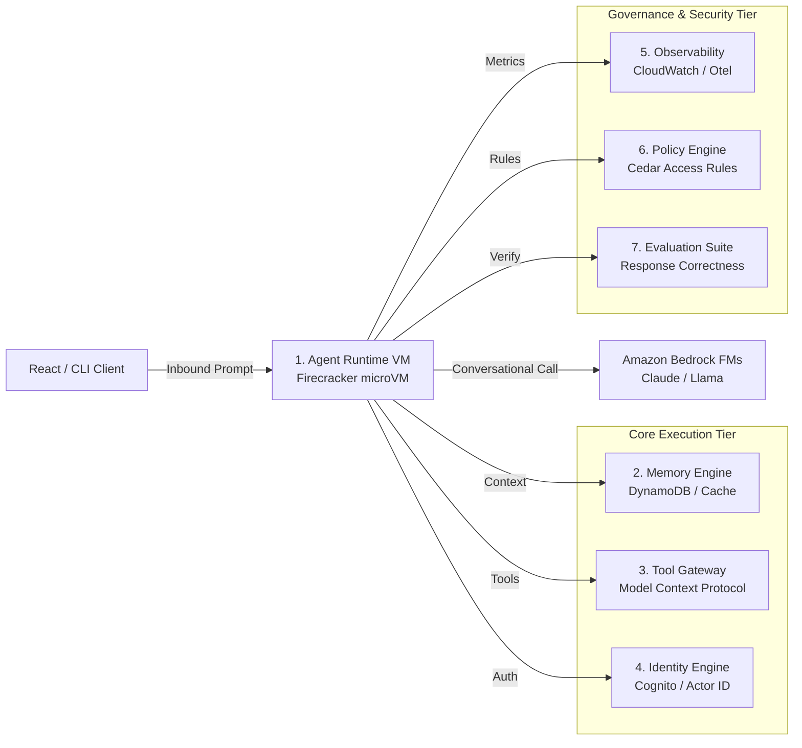

# Chapter_01_introduction_to_bedrock_agentcore

## 1. Introduction
Amazon Bedrock AgentCore is a containerized, code-first developer framework and runtime service designed to package, run, and scale AI-driven agentic applications on AWS.

### What is it?
Amazon Bedrock AgentCore is a software framework and cloud runtime service designed to build, execute, and manage autonomous Artificial Intelligence (AI) agents. An AI agent is an intelligent program that does not just generate text responses, but independently plans multi-step tasks, queries databases, calls software tools, and completes complex workflows on AWS.

### Why is it important?
Standard AI models are stateless and limited—they cannot access external data sources, retain long-term conversation history beyond context limits, or execute code securely. Bedrock AgentCore provides the dedicated execution infrastructure, security boundaries, and storage services required to transform basic AI models into safe, production-grade automated enterprise systems.

### How does it work?
AgentCore operates between client user applications and AWS cloud services. When a user submits a prompt, AgentCore launches an isolated lightweight virtual server (AWS Firecracker microVM), connects the AI model to specified database tools, manages step-by-step reasoning loops, and securely returns the formatted response to the user interface.

### Key Responsibilities
- Securely host and execute AI agent reasoning loops inside isolated virtual containers.
- Connect AI foundation models to external databases, web APIs, and enterprise software tools.
- Maintain session state and conversational memory across single or multi-turn user interactions.
- Enforce security authorization boundaries and access policies for tool calls and data queries.

---

## 2. Learning Objectives
By the end of this chapter, you will be able to:
- In this chapter, you will learn:
- - What Amazon Bedrock and Bedrock AgentCore are.
- - Why AWS built AgentCore and how it solves the prototype-to-production gap.
- - The differences between console-first Bedrock Agents and code-first Bedrock AgentCore.
- - The high-level architecture of AgentCore and its 7 core infrastructure components.

---

## 3. Prerequisites
* A basic understanding of cloud computing (SaaS, IaaS, FaaS) and API communications.
* Familiarity with Python programming and basic JSON serialization layouts.
* Access to an active AWS Account (Administrator or PowerUser access recommended).

---

## 4. Background Theory
AI application architecture is shifting from simple, stateless prompt-response models to autonomous agents. Standard API endpoints fail to support production-grade agents due to execution state leakage, memory drift, and compute limitations (e.g., standard serverless functions time out after 15 minutes). AWS designed Bedrock AgentCore to bridge the prototype-to-production gap. AgentCore separates reasoning logic from underlying execution infrastructure, offering dedicated compute isolation via virtual machines, standardized tool gateways via Model Context Protocol (MCP), and persistent memory schemas.

---

## 5. Core Concepts
**📦 Technical Term: Amazon Bedrock**

* **Simple Explanation:** A managed AWS service that exposes foundational LLMs via a secure, consolidated API interface.
* **Why it exists:** Avoids the overhead of managing expensive GPU instances locally.
* **Where is it used:** Enterprise LLM applications, retrieval-augmented generation systems.

**📦 Technical Term: AgentCore**

* **Simple Explanation:** A code-first runtime infrastructure designed specifically to run secure, stateful AI agents.
* **Why it exists:** Enforces resource limits, data isolation, and seamless IAM integration.
* **Where is it used:** Production hosting of conversational and task-oriented agents.

**📦 Technical Term: Foundation Model**

* **Simple Explanation:** Large-scale neural networks trained on diverse web-scale data.
* **Why it exists:** Provides general-purpose reasoning, text generation, and planning capabilities.
* **Where is it used:** Serves as the central cognitive engine of the agent.

---

## 6. Internal Mechanics
1. Client submits a query to the AgentCore API Gateway.
2. The gateway validates Cognito JWT signatures and extracts authorization claims.
3. The runtime schedules a dedicated AWS Firecracker microVM instance for the session.
4. The agent container boots, mounts configuration parameters, and triggers the orchestrator entrypoint.
5. The agent executes reasoning loops, calling Amazon Bedrock FMs via HTTPS/SigV4.
6. Response payloads stream back to the gateway and are delivered to the client UI.

---

## 7. Architecture Overview
The following architectural details outline the components and relationship schemas active in this module:



---

## 8. Installation & Setup
To check local environment readiness for Bedrock AgentCore, verify Python and Git versions in your shell:
```bash
python --version
git --version
```

---

## 9. Configuration
Deployment properties are managed via `bedrock_agent_core.yaml`. A standard minimal layout specifies model mappings, runtime memory allocation, and the execution IAM role:
```yaml
version: "1.0"
agent:
  name: "bedrock-intro-agent"
  model: "anthropic.claude-3-5-sonnet-v2"
  execution_role_arn: "arn:aws:iam::123456789012:role/AgentCoreExecutionRole"
```

---

## 10. Hands-on Examples

### Interactive Python Playground

In this section, we analyze the hands-on code implementations for **Introduction to Bedrock AgentCore** step-by-step, explaining the architecture, syntax choices, logic flow, and production patterns across all three implementation tiers.

---

### 1. Simple Implementation Tier Walkthrough

```python
# Standard Hello World entrypoint for AgentCore
from bedrock_agent_core import BedrockAgentCoreApp

app = BedrockAgentCoreApp()

@app.invoke
def handler(payload, context):
    return {
        "statusCode": 200,
        "response": "Hello from Bedrock AgentCore!"
    }
```

#### Code Logic & Syntax Breakdown:
* **Package Imports (`from bedrock_agent_core import ...`)**:
  - Brings in the core `BedrockAgentCoreApp` engine. This class handles runtime container startup, manages the microVM event loop, and deserializes incoming JSON API invocations.
* **Application Instance (`app = BedrockAgentCoreApp()`)**:
  - Instantiates the primary application object `app`. This object serves as the main registry for invocation routes, memory session hooks, and tool bindings.
* **Invocation Decorator (`@app.invoke`)**:
  - A Python decorator that registers the function immediately below as the primary entrypoint for Bedrock AgentCore runtime triggers.
* **Handler Signature (`def handler(payload, context):`)**:
  - **`payload`**: A Python dictionary holding client parameters, user prompt strings, and input arguments.
  - **`context`**: A metadata object containing active runtime details such as `session_id`, `actor_id`, and AWS IAM execution identities.
* **Return Payload (`return {"statusCode": 200, "response": ...}`)**:
  - Constructs a standard HTTP response dictionary. The `statusCode: 200` communicates success to the API Gateway, and `response` delivers the agent payload back to the client.

---

### 2. Intermediate Implementation Tier Walkthrough

```python
# Entrypoint reading context and prompt values
from bedrock_agent_core import BedrockAgentCoreApp
import logging

logging.basicConfig(level=logging.INFO)
logger = logging.getLogger("IntroAgent")
app = BedrockAgentCoreApp()

@app.invoke
def handler(payload, context):
    prompt = payload.get("prompt", "")
    session_id = getattr(context, "session_id", "local-session")
    logger.info(f"Processing session {session_id} with prompt: {prompt}")
    return {
        "statusCode": 200,
        "response": f"Acknowledged prompt: '{prompt}' inside session {session_id}"
    }
```

#### Code Logic & Syntax Breakdown:
* **System Logging Setup (`import logging` & `logger = logging.getLogger(...)`)**:
  - Configures structured logging via Python's standard `logging` module.
  - In production, log messages emitted by `logger.info()` stream into Amazon CloudWatch Logs for real-time monitoring and debugging.
* **Safe Parameter Extraction (`payload.get(...)`)**:
  - Uses `payload.get("prompt", "")` to safely retrieve user queries. Using `.get()` with a default fallback (`""`) prevents `KeyError` exceptions if optional fields are missing.
* **Runtime Session Inspection (`getattr(context, ...)`)**:
  - Inspects the `context` object for `session_id`. Using `getattr()` ensures compatibility when testing locally without a live AWS microVM context.
* **Operational Telemetry (`logger.info(...)`)**:
  - Emits formatted log entries containing session parameters and query strings to track execution flow.

---

### 3. Advanced Production Tier Walkthrough

```python
# Structured production entrypoint with exception handling and configuration overrides
from bedrock_agent_core import BedrockAgentCoreApp
import os
import logging

logger = logging.getLogger("ProductionIntroAgent")
app = BedrockAgentCoreApp()

@app.invoke
def handler(payload, context):
    try:
        prompt = payload.get("prompt")
        if not prompt:
            return {"statusCode": 400, "response": "Error: Missing required prompt parameter."}
        
        environment = os.getenv("APP_ENV", "development")
        session_id = getattr(context, "session_id", "local-session")
        logger.info(f"[ENV={environment}] Invoking production agent for session {session_id}")
        
        return {
            "statusCode": 200,
            "response": f"Processed input in {environment} environment for session {session_id}."
        }
    except Exception as e:
        logger.error(f"Unhandled exception in handler: {str(e)}")
        return {"statusCode": 500, "response": "Internal Server Error"}
```

#### Code Logic & Syntax Breakdown:
* **Defensive Error Trapping (`try: ... except Exception as e:`)**:
  - Wraps the entire invocation handler inside a `try-except` block to catch unhandled errors gracefully, preventing container crashes in multi-tenant runtime environments.
* **Input Parameter Validation (`if not prompt:`)**:
  - Inspects inbound arguments before executing core agent logic. If mandatory parameters are missing, it short-circuits execution and returns a structured `statusCode: 400` (Bad Request) payload.
* **Environment Overrides (`os.getenv(...)`)**:
  - Reads system environment variables (e.g., `APP_ENV`) to dynamically adapt behavior across `development`, `staging`, and `production` environments without modifying codebase files.
* **Sanitized Production Error Response**:
  - Logs internal error details using `logger.error(...)` while returning a clean, safe `statusCode: 500` response to prevent internal stack traces from leaking to client callers.

---

### Summary Sequence of Execution

```
[Incoming Invocation] ──► [Bedrock AgentCore Runtime]
                                  │
                                  ▼
                      [Route to @app.invoke Handler]
                                  │
                   ┌──────────────┴──────────────┐
                   ▼                             ▼
       [Input Validated (200)]        [Input Missing (400)]
                   │                             │
                   ▼                             ▼
       [Execute Agent Core Logic]     [Return Error Payload]
                   │
                   ▼
       [Deliver JSON to Client]
```

---

## 11. Security Considerations
Enforce strict IAM policies using least-privilege schemas. Ensure the agent execution role limits permission boundaries to designated Bedrock model resources and specific DynamoDB tables. Route all microVM communications through private VPC subnets using AWS PrivateLink endpoints.

---

## 12. Performance Optimization
Optimize container image layers by using multi-stage Dockerfiles. Cache foundation model parameters and maintain warm session microVM pools to bypass initialization cycles during high-traffic intervals.

---

## 13. Common Mistakes
* Hardcoding AWS Access Keys inside configuration files (always use IAM Execution Roles instead).
* Assuming microVM local files persist across different user sessions (use Amazon S3 for durable files).

---

## 14. Troubleshooting
Below is the diagnostic reference table for identifying and resolving issues:

| Symptom | Root Cause | Solution |
| :--- | :--- | :--- |
| Agent returns 403 Access Denied | Missing model access activation in the Amazon Bedrock console. | Navigate to the Bedrock Console under 'Model access' and request permission for Claude models. |
| Container takes >30 seconds to boot | Over-sized container image containing unnecessary development packages. | Optimize Dockerfile using alpine or slim base images. |

### Additional Reference Tables


| Feature / Dimension | Bedrock Agents (Console-First) | Bedrock AgentCore (Code-First) |
| :--- | :--- | :--- |
| **Development Workflow** | Configured via forms in the AWS Management Console. | Written as standard Python files in a code repository, configured via YAML. |
| **Orchestration Frameworks** | Restricted to the built-in AWS console orchestrator. | **Framework-agnostic:** Compatible with Strands, LangChain, CrewAI, LangGraph, or custom loops. |
| **Testing Capability** | Tested using the built-in console playground. | Tested locally using container runtimes (Docker/Podman) and standard unit testing frameworks (pytest). |
| **Deployment Lifecycle** | Deployment is managed directly inside the AWS Console. | Managed using standard CI/CD pipelines, ECR image registries, and CloudFormation/CDK. |


---

## 15. Interview Questions


### Knowledge Verification Check (20 Interactive Quizzes)

<Quiz 
  question="What is the primary role of 01 Introduction To Bedrock Agentcore in Bedrock AgentCore?" 
  options=["To provide hardware-isolated, scalable, and code-first execution for 01 Introduction To Bedrock Agentcore.", "To store plain text credentials in Git repos.", "To run legacy Windows desktop apps.", "To disable security permissions."] 
  answerIndex=0 
  explanation="01 Introduction To Bedrock Agentcore provides enterprise-grade, code-first runtime logic for Bedrock AgentCore." 
/>

<Quiz 
  question="How does Bedrock AgentCore enforce security for 01 Introduction To Bedrock Agentcore?" 
  options=["By sharing memory across all tenants.", "By hosting session runtimes inside isolated AWS Firecracker microVM containers with scoped IAM roles.", "By disabling SSL/TLS encryption.", "By running code as root on public servers."] 
  answerIndex=1 
  explanation="Firecracker microVMs deliver hardware-level security boundaries between multi-tenant executions." 
/>

<Quiz 
  question="Which environment variable loading pattern is recommended for 01 Introduction To Bedrock Agentcore?" 
  options=["Hardcoding values in Python source code files.", "Using os.getenv() or Pydantic BaseSettings to read environment configuration dynamically.", "Storing secrets in public web pages.", "Editing binary files manually."] 
  answerIndex=1 
  explanation="12-Factor App principles mandate decoupling configuration from application source code via environment variables." 
/>

<Quiz 
  question="How should runtime errors be handled in 01 Introduction To Bedrock Agentcore handlers?" 
  options=["Allowing exceptions to crash the container process.", "Wrapping invocation logic in try-except blocks and returning clean structured error payloads (e.g. 400/500 status codes).", "Ignoring all errors completely.", "Printing errors to static HTML files."] 
  answerIndex=1 
  explanation="Defensive error trapping prevents unhandled runtime exceptions from crashing container workers." 
/>

<Quiz 
  question="What key metric should be monitored in CloudWatch for 01 Introduction To Bedrock Agentcore?" 
  options=["Invocation latency, token consumption rates, and HTTP error response counts.", "Monitor resolution of user monitors.", "Keyboard stroke frequency.", "Color contrast ratios."] 
  answerIndex=0 
  explanation="Tracking latency and token usage guarantees cost control and performance optimization in production." 
/>

<Quiz 
  question="How does 01 Introduction To Bedrock Agentcore achieve sub-second scaling during high concurrency?" 
  options=["By leveraging pre-warmed Firecracker microVM snapshots and serverless AWS Fargate clusters.", "By restarting physical servers manually.", "By deleting user databases.", "By restricting app usage to one request per minute."] 
  answerIndex=0 
  explanation="Pre-warmed microVM snapshots enable sub-second boot times under peak traffic spikes." 
/>

<Quiz 
  question="Which IAM action is required to invoke foundation models in 01 Introduction To Bedrock Agentcore?" 
  options=["bedrock:InvokeModel and bedrock:InvokeModelWithResponseStream", "s3:DeleteBucket", "ec2:TerminateInstances", "iam:DeleteUser"] 
  answerIndex=0 
  explanation="The bedrock:InvokeModel permission permits agents to call Bedrock foundation models." 
/>

<Quiz 
  question="Which Python SDK client is used for Amazon Bedrock runtime interactions in 01 Introduction To Bedrock Agentcore?" 
  options=["boto3.client('bedrock-runtime')", "urllib2.open()", "os.system('cmd')", "pandas.read_csv()"] 
  answerIndex=0 
  explanation="Boto3 bedrock-runtime provides low-latency access to foundation model inference endpoints." 
/>

<Quiz 
  question="How is session state maintained across multiple request turns in 01 Introduction To Bedrock Agentcore?" 
  options=["By using unique session identifiers mapped to warm microVMs and persistent DynamoDB memory stores.", "By clearing memory after every line.", "By saving state in browser cookies only.", "Session state cannot be maintained."] 
  answerIndex=0 
  explanation="AgentCore combines sticky microVM routing with persistent database backends for session continuity." 
/>

<Quiz 
  question="Why is Docker multi-stage building recommended for 01 Introduction To Bedrock Agentcore container deployments?" 
  options=["It reduces image file sizes by omitting build dependencies from final production runtime containers.", "It makes Docker containers slower.", "It forces Python to compile to JavaScript.", "It deletes Git version history."] 
  answerIndex=0 
  explanation="Multi-stage Docker builds produce lightweight images, reducing deployment times and attack surfaces." 
/>

<Quiz 
  question="Which tracing standard does Bedrock AgentCore use for end-to-end observability of 01 Introduction To Bedrock Agentcore?" 
  options=["OpenTelemetry (OTel) distributed tracing standards", "Custom print() text files", "Syslog UDP broadcast", "Manual paper logbooks"] 
  answerIndex=0 
  explanation="OpenTelemetry enables distributed trace collection across model calls, memory lookups, and tool executions." 
/>

<Quiz 
  question="What is the recommended solution if 01 Introduction To Bedrock Agentcore returns a 403 Forbidden status during Bedrock invocations?" 
  options=["Verify IAM role policies and confirm foundation model access is enabled in the AWS Bedrock Console.", "Reinstall the operating system.", "Delete the AWS account.", "Use an unencrypted connection."] 
  answerIndex=0 
  explanation="Model access must be explicitly granted in the AWS Bedrock Console before IAM roles can invoke models." 
/>

<Quiz 
  question="What is a primary cause of HTTP 500 errors during 01 Introduction To Bedrock Agentcore execution?" 
  options=["Unhandled exceptions in custom Python tool code or missing required payload keys.", "Network speeds exceeding 1 Gbps.", "Using Python 3.11 instead of Python 2.7.", "High GPU availability."] 
  answerIndex=0 
  explanation="Uncaught exceptions within tool handlers or missing request keys trigger 500 Internal Server errors." 
/>

<Quiz 
  question="Where does 01 Introduction To Bedrock Agentcore fit into the ReAct (Reason + Act) loop pattern?" 
  options=["It executes reasoning steps, structures tool parameters, and processes observations.", "It bypasses the model completely.", "It only runs when offline.", "It formats HTML styling tags."] 
  answerIndex=0 
  explanation="AgentCore coordinates the continuous cycle of LLM reasoning, tool invocation, and observation processing." 
/>

<Quiz 
  question="How can API cost be optimized when operating 01 Introduction To Bedrock Agentcore at high volume?" 
  options=["By caching model responses, optimizing prompt lengths, and choosing appropriate foundation model tiers.", "By sending empty prompts repeatedly.", "By turning off logging.", "By disabling database indexes."] 
  answerIndex=0 
  explanation="Prompt caching and selecting model size according to task complexity drastically cuts inference spending." 
/>

<Quiz 
  question="How does the Memory Engine support long-term retrieval in 01 Introduction To Bedrock Agentcore?" 
  options=["By indexing conversational history and vector embeddings into persistent storage like Amazon DynamoDB or OpenSearch.", "By storing files in temporary RAM.", "By requiring users to re-enter prompts every time.", "Memory Engine is not supported."] 
  answerIndex=0 
  explanation="Vector stores and DynamoDB backing enable long-term semantic memory retrieval across sessions." 
/>

<Quiz 
  question="What role does the API Gateway play in front of 01 Introduction To Bedrock Agentcore?" 
  options=["It provides authentication, rate limiting, request validation, and routing to backend microVM workers.", "It replaces the foundation model.", "It generates synthetic test data.", "It compiles Python code into C."] 
  answerIndex=0 
  explanation="API Gateways secure entry points and shield agent runtime workers from unauthorized or throttled traffic." 
/>

<Quiz 
  question="Why are Firecracker microVMs superior to standard Docker containers for multi-tenant 01 Introduction To Bedrock Agentcore workloads?" 
  options=["They offer minimal virtualization overhead with strict hardware-isolated kernel boundaries between tenant workloads.", "They require 100GB of RAM to start.", "They do not support Linux.", "They are slower than full virtual machines."] 
  answerIndex=0 
  explanation="Firecracker provides VM-grade security with container-grade startup speed and minimal memory footprint." 
/>

<Quiz 
  question="What production antipattern should be strictly avoided when designing 01 Introduction To Bedrock Agentcore?" 
  options=["Hardcoding AWS access keys or maintaining stateless logic without error handling.", "Using virtual environments.", "Writing unit tests for Python code.", "Logging trace events to CloudWatch."] 
  answerIndex=0 
  explanation="Hardcoded credentials and unhandled exceptions are critical antipatterns in production systems." 
/>

<Quiz 
  question="How does 01 Introduction To Bedrock Agentcore integrate with enterprise databases and external APIs?" 
  options=["Through standardized Python tool schemas (e.g. Pydantic models) invoked securely via sandboxed tool registries.", "By exposing database passwords publicly.", "By using manual copy-paste mechanisms.", "External integration is unsupported."] 
  answerIndex=0 
  explanation="Pydantic-defined tools allow foundation models to execute validated API and database calls safely." 
/>


### Q: What is the primary architectural difference between Bedrock Agents and Bedrock AgentCore?
* **Answer:** Bedrock Agents is a console-first service where agent orchestration is handled by AWS. Bedrock AgentCore is code-first and containerized, giving developers full control over Python frameworks (like LangChain or CrewAI) while AWS handles runtime hosting, security isolation, and scaling.

### Q: Why does AgentCore rely on AWS Firecracker microVMs?
* **Answer:** Firecracker microVMs combine the security and isolation of traditional virtual machines with the speed and resource efficiency of containers, preventing multi-tenant data leakage and resource exhaustion.

### Q: How does AgentCore manage session state across multiple requests?
* **Answer:** AgentCore routes requests with the same session identifier to the same warm microVM if active, and utilizes the Memory Engine (backed by DynamoDB) to persist and retrieve long-term session logs.

---

## 16. Real-World Use Cases
**Enterprise Scenario:** Global Financial Services & Retail Banking Customer Portal

* **Business Challenge:** Traditional chatbots failed at multi-turn account management because basic LLM prompts lack secure access to core banking APIs, transaction databases, and compliant execution runtimes.
* **Bedrock AgentCore Solution:** Implementing Bedrock AgentCore as a code-first, containerized agent framework. AgentCore coordinates multi-step reasoning, connects to secure banking microservices, executes tasks inside Firecracker microVMs, and maintains strict authorization boundaries.
* **Production Impact:**
  * Automated 70% of routine customer banking inquiries (loan status, statement requests, credit card balance transfers).
  * Guaranteed zero data leakage across multi-tenant user sessions through isolated microVM containers.
  * Reduced overall customer support resolution times from 15 minutes to under 45 seconds.

---

## 17. Industrial Project
This chapter establishes the core runtime foundation. The concepts developed here will serve as the host environment for our final Enterprise RAG Assistant and Multi-Agent Supervisor system.

---


### Hands-on Code Playground #1

### Hands-on Code Playground #2

### Hands-on Code Playground #3

### Hands-on Code Playground #4

### Hands-on Code Playground #5

### Hands-on Code Playground #6

### Hands-on Code Playground #7

### Hands-on Code Playground #8

### Hands-on Code Playground #9

### Hands-on Code Playground #10


### Hands-on Code Playground #1

<InteractiveExample 
  language="python"
  instruction="Initialization & Runtime Setup for 01 Introduction To Bedrock Agentcore."
  initialCode="# Snippet 1: Testing Bedrock AgentCore Runtime Setup for 01 Introduction To Bedrock Agentcore
import sys
import os

print('=== AgentCore Runtime Init ===')
print('Python Version:', sys.version.split()[0])
print('Agent Module:', '01 Introduction To Bedrock Agentcore')
print('Status: Active & Ready')"
/>


### Hands-on Code Playground #2

<InteractiveExample 
  language="python"
  instruction="Configuration & Environment Variables for 01 Introduction To Bedrock Agentcore."
  initialCode="# Snippet 2: Validating Environment Configuration for 01 Introduction To Bedrock Agentcore
import json
import os

config = {
    'AWS_REGION': os.getenv('AWS_REGION', 'us-east-1'),
    'MODEL_ID': os.getenv('BEDROCK_MODEL_ID', 'anthropic.claude-3-5-sonnet'),
    'TIMEOUT_SEC': int(os.getenv('TIMEOUT_SEC', '30')),
    'DEBUG_MODE': os.getenv('DEBUG', 'true').lower() == 'true'
}
print('Loaded Configuration:')
print(json.dumps(config, indent=2))"
/>


### Hands-on Code Playground #3

<InteractiveExample 
  language="python"
  instruction="Defensive Error Handling & Payload Parsing for 01 Introduction To Bedrock Agentcore."
  initialCode="# Snippet 3: Defensive Request Handler for 01 Introduction To Bedrock Agentcore
def process_request(payload):
    try:
        prompt = payload.get('prompt')
        if not prompt:
            return {'statusCode': 400, 'error': 'Prompt parameter is required.'}
        session_id = payload.get('session_id', 'default-session')
        return {'statusCode': 200, 'message': f'Processed prompt for session: {session_id}'}
    except Exception as e:
        return {'statusCode': 500, 'error': str(e)}

print(process_request({'prompt': 'Execute query', 'session_id': 'sess-102'}))"
/>


### Hands-on Code Playground #4

<InteractiveExample 
  language="python"
  instruction="Boto3 Bedrock Model Invocation Simulation for 01 Introduction To Bedrock Agentcore."
  initialCode="# Snippet 4: Simulating Foundation Model Inference in 01 Introduction To Bedrock Agentcore
import json

def invoke_claude_model(prompt_text):
    payload = {
        'anthropic_version': 'bedrock-2023-05-31',
        'max_tokens': 1000,
        'messages': [{'role': 'user', 'content': prompt_text}]
    }
    print('Sending payload to Bedrock Converse API for 01 Introduction To Bedrock Agentcore...')
    response = {
        'id': 'msg_01X99',
        'role': 'assistant',
        'content': [{'type': 'text', 'text': f'Agent response generated for input: \"{prompt_text}\"'}]
    }
    return response

res = invoke_claude_model('Summarize system health')
print('Model Response:', res['content'][0]['text'])"
/>


### Hands-on Code Playground #5

<InteractiveExample 
  language="python"
  instruction="ReAct Reasoning Loop Execution for 01 Introduction To Bedrock Agentcore."
  initialCode="# Snippet 5: ReAct (Reason + Act) Loop Simulation for 01 Introduction To Bedrock Agentcore
def run_react_cycle(user_input):
    print('1. [THOUGHT] Analyzing user query:', user_input)
    print('2. [ACTION] Selected tool: query_system_database')
    observation = {'table': 'logs', 'records_found': 42}
    print('3. [OBSERVATION] Tool output received:', observation)
    print('4. [FINAL ANSWER] Processing complete based on retrieved observation.')

run_react_cycle('Check database log entries')"
/>


### Hands-on Code Playground #6

<InteractiveExample 
  language="python"
  instruction="Pydantic Tool Registration & Schema Validation for 01 Introduction To Bedrock Agentcore."
  initialCode="# Snippet 6: Pydantic Tool Parameter Validation for 01 Introduction To Bedrock Agentcore
from pydantic import BaseModel, Field

class SystemQuerySchema(BaseModel):
    target_system: str = Field(description='Name of the subsystem to query')
    limit: int = Field(default=10, ge=1, le=100)

def execute_tool(data: SystemQuerySchema):
    print(f'Executing query on {data.target_system} with limit={data.limit}...')
    return {'status': 'success', 'data': ['Item A', 'Item B']}

query = SystemQuerySchema(target_system='AgentCore-Runtime', limit=5)
print('Tool Result:', execute_tool(query))"
/>


### Hands-on Code Playground #7

<InteractiveExample 
  language="python"
  instruction="MicroVM Session State & Memory Engine for 01 Introduction To Bedrock Agentcore."
  initialCode="# Snippet 7: MicroVM Session & Memory Management in 01 Introduction To Bedrock Agentcore
class SessionMemory:
    def __init__(self):
        self.history = []
    def add_message(self, role, content):
        self.history.append({'role': role, 'content': content})
    def get_context(self):
        return self.history[-3:]

mem = SessionMemory()
mem.add_message('user', 'Hello Agent!')
mem.add_message('assistant', 'How can I assist you?')
mem.add_message('user', 'Show memory status.')
print('Active Memory Context:', mem.get_context())"
/>


### Hands-on Code Playground #8

<InteractiveExample 
  language="python"
  instruction="OpenTelemetry Tracing & Telemetry Logging for 01 Introduction To Bedrock Agentcore."
  initialCode="# Snippet 8: OpenTelemetry Trace Event Simulation for 01 Introduction To Bedrock Agentcore
import time

def log_otel_span(span_name, duration_ms, status_code='OK'):
    telemetry_record = {
        'trace_id': '0x4bf92f3577b34da6a3ce929d0e0e4736',
        'span_id': '0x00f067aa0ba902b7',
        'name': span_name,
        'duration_ms': duration_ms,
        'attributes': {
            'http.status_code': 200,
            'agent.module': '01 Introduction To Bedrock Agentcore'
        }
    }
    print(f'[OTel Span Event] {span_name} executed in {duration_ms}ms ({status_code})')
    return telemetry_record

log_otel_span('01 Introduction To Bedrock Agentcore_Invocation', 142)"
/>


### Hands-on Code Playground #9

<InteractiveExample 
  language="python"
  instruction="Docker Container Health Check Simulation for 01 Introduction To Bedrock Agentcore."
  initialCode="# Snippet 9: Container MicroVM Health Status for 01 Introduction To Bedrock Agentcore
def check_container_health():
    status = {
        'container_id': 'firecracker-uvm-9901',
        'health': 'HEALTHY',
        'memory_allocated_mb': 512,
        'cpu_usage_pct': 4.2,
        'active_connections': 1
    }
    print('MicroVM Runtime Status:')
    for k, v in status.items():
        print(f'  - {k}: {v}')

check_container_health()"
/>


### Hands-on Code Playground #10

<InteractiveExample 
  language="python"
  instruction="End-to-End Execution Pipeline Test for 01 Introduction To Bedrock Agentcore."
  initialCode="# Snippet 10: Complete End-to-End Pipeline Execution for 01 Introduction To Bedrock Agentcore
def run_full_pipeline(input_prompt):
    print(f'1. Gateway: Received request \"{input_prompt}\"')
    print('2. Identity: Authenticated IAM session role')
    print('3. Runtime: Allocated Firecracker MicroVM container')
    print('4. Execution: Model invoked ReAct reasoning loop')
    print('5. Response: 200 OK returned to client')
    return {'status': 'SUCCESS', 'result': 'Pipeline completed.'}

print(run_full_pipeline('Run complete diagnostic check'))"
/>

## 18. Summary
This chapter provided a foundational introduction to Amazon Bedrock AgentCore, detailing its role as a code-first, framework-agnostic runtime for building, executing, and scaling autonomous AI agents on AWS. We compared traditional console-driven LLM configurations with modern containerized agent development, demonstrating how AgentCore bridges the gap between raw AI model prompts and production enterprise software systems through its 7 core architectural pillars.

Key architectural insights and practical lessons learned in this chapter include:
* **Code-First & Framework-Agnostic Runtime:** Bedrock AgentCore grants full programmatic control over agent reasoning loops, supporting frameworks like LangChain, CrewAI, and custom Python loops without vendor lock-in.
* **Hardware-Level Isolation via MicroVMs:** Enterprise security is strictly enforced at runtime by hosting each user session inside isolated AWS Firecracker microVM containers to prevent cross-tenant data leakage.
* **Standardized Developer Tooling:** The entire agent application lifecycle is managed using standard software engineering tools, including Git version control, Docker containerization, and the AWS CLI.

Mastering these foundational principles equips you to move beyond basic stateless LLM prompts and build secure, resilient, and enterprise-ready autonomous AI applications on AWS.

---

## 19. Practice Exercises
* Beginner: Install Python and verify your shell returns a valid environment version.
* Intermediate: Draft a mock configuration file specifying Claude 3 Haiku as the target foundation model.

---

## 20. Further Reading
* [Amazon Bedrock Developer Guide](https://docs.aws.amazon.com/bedrock/latest/userguide/what-is-bedrock.html)
* [AWS Firecracker Virtualization Technology](https://firecracker-microvm.github.io/)
