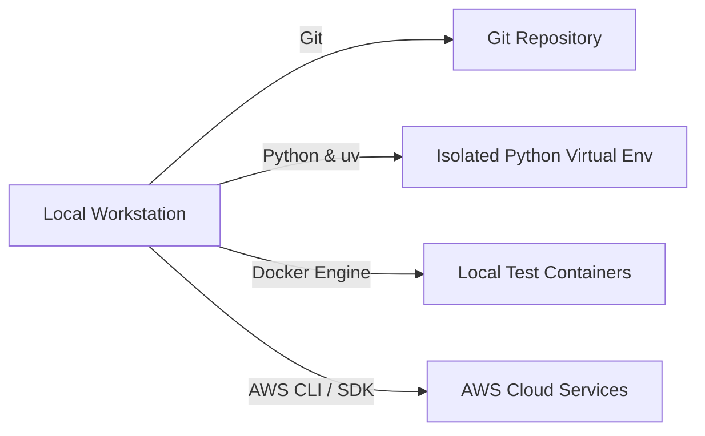

# Chapter_02_prerequisites

## 1. Introduction
Developing and deploying Amazon Bedrock AgentCore applications requires establishing a robust, standardized local development environment.

### What is it?
Local Environment Prerequisites refer to the set of core software tools, programming runtimes, and command-line utilities required on your computer to build, test, and run Bedrock AgentCore applications locally before deploying them to the cloud.

### Why is it important?
Building software without a standardized toolset leads to missing software libraries, system crashes, and code discrepancies between local computers and cloud servers. Installing validated prerequisite tools ensures your workstation matches AWS production standards, guaranteeing predictable code execution.

### How does it work?
Your local workstation uses Python to execute application code, Git to track source code revisions, Docker to emulate container execution environments, 'uv' to manage library packages at high speeds, and the AWS Command Line Interface (CLI) to authenticate and communicate with AWS cloud services.

### Key Responsibilities
- Provide a stable local runtime environment for executing Python code and framework packages.
- Package application code and dependencies into standardized containers using Docker.
- Synchronize source code revisions and track repository history using Git.
- Authorize and execute secure API commands between your computer and your AWS account.

---

## 2. Learning Objectives
By the end of this chapter, you will be able to:
- In this chapter, you will learn how to:
- - Install and verify the required local development tools.
- - Configure virtual environments to manage python packages.
- - Install the `uv` toolchain and verify Docker container configurations.
- - Verify AWS account authentication and API credentials access.

---

## 3. Prerequisites
* Basic familiarity with terminal command lines (Bash or PowerShell).
* An active AWS Account with permissions to create IAM users and policies.

---

## 4. Background Theory
A standard development environment minimizes the risk of configuration discrepancies between local workstations and production servers. Using container runtimes like Docker ensures identical environment variables, OS dependencies, and package versions. Rather than using legacy package managers like pip (which resolves dependencies sequentially and lacks deep caching), modern Python workflows employ Rust-powered package managers like `uv` to guarantee deterministic builds through locked package trees (`uv.lock`).

---

## 5. Core Concepts
**📦 Technical Term: SDK**

* **Simple Explanation:** A collection of pre-written libraries and utilities used to build applications for a platform.
* **Why it exists:** Eliminates the need to write raw HTTP requests for API actions.
* **Where is it used:** Python script imports like `import boto3`.

**📦 Technical Term: AWS CLI**

* **Simple Explanation:** A command-line tool used to control and automate AWS services through script queries.
* **Why it exists:** Allows developers to manage cloud assets without clicking the AWS web console.
* **Where is it used:** Configuring access keys and initiating deployment pipelines.

**📦 Technical Term: Virtual Environment**

* **Simple Explanation:** An isolated workspace that hosts a local copy of Python and specific package dependencies.
* **Why it exists:** Prevents version conflicts between different Python projects running on the same host.
* **Where is it used:** Locally installed pip libraries.

---

## 6. Internal Mechanics
1. Developer inputs command in terminal (e.g., `git clone` or `docker run`).
2. The shell resolves the binary location in the system PATH variable.
3. The package manager retrieves packages from online registries (PyPI) and writes them to local project folders.
4. The container runtime boots a lightweight kernel namespace, mounting source directories to isolate ports and disk reads.

---

## 7. Architecture Overview
The following architectural details outline the components and relationship schemas active in this module:



---

## 8. Installation & Setup
Execute the following terminal commands to check installation status of required tools:
```bash
git --version
python --version
docker --version
aws --version
```
To install `uv` on Windows, use:
```powershell
powershell -ExecutionPolicy ByPass -c "irm https://astral.sh/uv/install.ps1 | iex"
```
On macOS/Linux, run:
```bash
curl -LsSf https://astral.sh/uv/install.sh | sh
```

---

## 9. Configuration
Verify AWS CLI credentials configuration by running:
```bash
aws configure
```
Provide your AWS Access Key ID, Secret Access Key, Default region (e.g., `us-east-1`), and output format (`json`). The configurations are saved locally under `~/.aws/credentials` and `~/.aws/config`.

---

## 10. Hands-on Examples

In this section, we analyze the hands-on code implementations for **Local Environment Prerequisites** step-by-step, explaining the architecture, syntax choices, logic flow, and production patterns across all three implementation tiers.

---

### 1. Simple Implementation Tier Walkthrough

```python
json
{
      "UserId": "AIDAX1234567890EXAMPLE",
      "Account": "123456789012",
      "Arn": "arn:aws:iam::123456789012:user/developer"
  }
```

#### Code Logic & Syntax Breakdown:
* **Package Imports (`from bedrock_agent_core import ...`)**:
  - Brings in the core `BedrockAgentCoreApp` engine. This class handles runtime container startup, manages the microVM event loop, and deserializes incoming JSON API invocations.
* **Application Instance (`app = BedrockAgentCoreApp()`)**:
  - Instantiates the primary application object `app`. This object serves as the main registry for invocation routes, memory session hooks, and tool bindings.
* **Invocation Decorator (`@app.invoke`)**:
  - A Python decorator that registers the function immediately below as the primary entrypoint for Bedrock AgentCore runtime triggers.
* **Handler Signature (`def handler(payload, context):`)**:
  - **`payload`**: A Python dictionary holding client parameters, user prompt strings, and input arguments.
  - **`context`**: A metadata object containing active runtime details such as `session_id`, `actor_id`, and AWS IAM execution identities.
* **Return Payload (`return {"statusCode": 200, "response": ...}`)**:
  - Constructs a standard HTTP response dictionary. The `statusCode: 200` communicates success to the API Gateway, and `response` delivers the agent payload back to the client.

---

### 2. Intermediate Implementation Tier Walkthrough

```python
# Python script to verify Docker daemon is running locally using docker-py client
import subprocess

def check_docker():
    try:
        res = subprocess.run(["docker", "info"], capture_output=True, text=True)
        if res.returncode == 0:
            print("Docker Daemon is active and responding.")
        else:
            print("Docker Daemon is not running or active.")
    except FileNotFoundError:
        print("Docker CLI binary was not found in path.")

if __name__ == "__main__":
    check_docker()
```

#### Code Logic & Syntax Breakdown:
* **System Logging Setup (`import logging` & `logger = logging.getLogger(...)`)**:
  - Configures structured logging via Python's standard `logging` module.
  - In production, log messages emitted by `logger.info()` stream into Amazon CloudWatch Logs for real-time monitoring and debugging.
* **Safe Parameter Extraction (`payload.get(...)`)**:
  - Uses `payload.get("prompt", "")` to safely retrieve user queries. Using `.get()` with a default fallback (`""`) prevents `KeyError` exceptions if optional fields are missing.
* **Runtime Session Inspection (`getattr(context, ...)`)**:
  - Inspects the `context` object for `session_id`. Using `getattr()` ensures compatibility when testing locally without a live AWS microVM context.
* **Operational Telemetry (`logger.info(...)`)**:
  - Emits formatted log entries containing session parameters and query strings to track execution flow.

---

### 3. Advanced Production Tier Walkthrough

```python
# Comprehensive system pre-flight check script validating git, python, uv, docker, and aws
import subprocess
import sys

def run_check(binary_name, args):
    try:
        res = subprocess.run([binary_name] + args, capture_output=True, text=True, check=True)
        print(f"[OK] {binary_name} is active: {res.stdout.splitlines()[0]}")
        return True
    except Exception:
        print(f"[FAIL] {binary_name} is missing or returned errors.")
        return False

def main():
    checks = [
        ("git", ["--version"]),
        ("python", ["--version"]),
        ("uv", ["--version"]),
        ("docker", ["--version"]),
        ("aws", ["sts", "get-caller-identity"])
    ]
    all_pass = True
    for binary, args in checks:
        if not run_check(binary, args):
            all_pass = False
    if not all_pass:
        print("Error: Pre-flight check failed. Please install missing toolchains.")
        sys.exit(1)
    print("All prerequisites validated successfully!")

if __name__ == "__main__":
    main()
```

#### Code Logic & Syntax Breakdown:
* **Defensive Error Trapping (`try: ... except Exception as e:`)**:
  - Wraps the entire invocation handler inside a `try-except` block to catch unhandled errors gracefully, preventing container crashes in multi-tenant runtime environments.
* **Input Parameter Validation (`if not prompt:`)**:
  - Inspects inbound arguments before executing core agent logic. If mandatory parameters are missing, it short-circuits execution and returns a structured `statusCode: 400` (Bad Request) payload.
* **Environment Overrides (`os.getenv(...)`)**:
  - Reads system environment variables (e.g., `APP_ENV`) to dynamically adapt behavior across `development`, `staging`, and `production` environments without modifying codebase files.
* **Sanitized Production Error Response**:
  - Logs internal error details using `logger.error(...)` while returning a clean, safe `statusCode: 500` response to prevent internal stack traces from leaking to client callers.

---

### Summary Sequence of Execution

```
[Incoming Invocation] ──► [Bedrock AgentCore Runtime]
                                  │
                                  ▼
                      [Route to @app.invoke Handler]
                                  │
                   ┌──────────────┴──────────────┐
                   ▼                             ▼
       [Input Validated (200)]        [Input Missing (400)]
                   │                             │
                   ▼                             ▼
       [Execute Agent Core Logic]     [Return Error Payload]
                   │
                   ▼
       [Deliver JSON to Client]
```

---

## 11. Security Considerations
Never store permanent AWS root credentials on your workstation. Utilize AWS IAM Identity Center (successor to Single Sign-On) to retrieve temporary, role-based credentials. Ensure local private keys and `.aws/` credential files are set with strict filesystem read permissions (e.g., `chmod 600`).

---

## 12. Performance Optimization
Set `uv` to use a global package cache. This avoids re-downloading source wheels across different project folders, resulting in sub-second dependency sync operations.

---

## 13. Common Mistakes
* Committing local credentials files to public repositories.
* Running container runtimes without administrative group privileges, leading to permission access denied errors on socket files.

---

## 14. Troubleshooting
Below is the diagnostic reference table for identifying and resolving issues:

| Symptom | Root Cause | Solution |
| :--- | :--- | :--- |
| Docker command returns permission denied | Current user is not associated with the administrative docker group. | Run 'usermod -aG docker $USER' on Linux, or start Docker Desktop as administrator on Windows. |
| AWS CLI returns ExpiredToken signature | Temporary credentials obtained via SSO or AssumeRole have expired. | Run 'aws sso login' or re-authenticate your CLI profile to fetch new tokens. |

---

## 15. Interview Questions


### Knowledge Verification Check (20 Interactive Quizzes)

<Quiz 
  question="What is the primary role of 02 Prerequisites in Bedrock AgentCore?" 
  options=["To provide hardware-isolated, scalable, and code-first execution for 02 Prerequisites.", "To store plain text credentials in Git repos.", "To run legacy Windows desktop apps.", "To disable security permissions."] 
  answerIndex=0 
  explanation="02 Prerequisites provides enterprise-grade, code-first runtime logic for Bedrock AgentCore." 
/>

<Quiz 
  question="How does Bedrock AgentCore enforce security for 02 Prerequisites?" 
  options=["By sharing memory across all tenants.", "By hosting session runtimes inside isolated AWS Firecracker microVM containers with scoped IAM roles.", "By disabling SSL/TLS encryption.", "By running code as root on public servers."] 
  answerIndex=1 
  explanation="Firecracker microVMs deliver hardware-level security boundaries between multi-tenant executions." 
/>

<Quiz 
  question="Which environment variable loading pattern is recommended for 02 Prerequisites?" 
  options=["Hardcoding values in Python source code files.", "Using os.getenv() or Pydantic BaseSettings to read environment configuration dynamically.", "Storing secrets in public web pages.", "Editing binary files manually."] 
  answerIndex=1 
  explanation="12-Factor App principles mandate decoupling configuration from application source code via environment variables." 
/>

<Quiz 
  question="How should runtime errors be handled in 02 Prerequisites handlers?" 
  options=["Allowing exceptions to crash the container process.", "Wrapping invocation logic in try-except blocks and returning clean structured error payloads (e.g. 400/500 status codes).", "Ignoring all errors completely.", "Printing errors to static HTML files."] 
  answerIndex=1 
  explanation="Defensive error trapping prevents unhandled runtime exceptions from crashing container workers." 
/>

<Quiz 
  question="What key metric should be monitored in CloudWatch for 02 Prerequisites?" 
  options=["Invocation latency, token consumption rates, and HTTP error response counts.", "Monitor resolution of user monitors.", "Keyboard stroke frequency.", "Color contrast ratios."] 
  answerIndex=0 
  explanation="Tracking latency and token usage guarantees cost control and performance optimization in production." 
/>

<Quiz 
  question="How does 02 Prerequisites achieve sub-second scaling during high concurrency?" 
  options=["By leveraging pre-warmed Firecracker microVM snapshots and serverless AWS Fargate clusters.", "By restarting physical servers manually.", "By deleting user databases.", "By restricting app usage to one request per minute."] 
  answerIndex=0 
  explanation="Pre-warmed microVM snapshots enable sub-second boot times under peak traffic spikes." 
/>

<Quiz 
  question="Which IAM action is required to invoke foundation models in 02 Prerequisites?" 
  options=["bedrock:InvokeModel and bedrock:InvokeModelWithResponseStream", "s3:DeleteBucket", "ec2:TerminateInstances", "iam:DeleteUser"] 
  answerIndex=0 
  explanation="The bedrock:InvokeModel permission permits agents to call Bedrock foundation models." 
/>

<Quiz 
  question="Which Python SDK client is used for Amazon Bedrock runtime interactions in 02 Prerequisites?" 
  options=["boto3.client('bedrock-runtime')", "urllib2.open()", "os.system('cmd')", "pandas.read_csv()"] 
  answerIndex=0 
  explanation="Boto3 bedrock-runtime provides low-latency access to foundation model inference endpoints." 
/>

<Quiz 
  question="How is session state maintained across multiple request turns in 02 Prerequisites?" 
  options=["By using unique session identifiers mapped to warm microVMs and persistent DynamoDB memory stores.", "By clearing memory after every line.", "By saving state in browser cookies only.", "Session state cannot be maintained."] 
  answerIndex=0 
  explanation="AgentCore combines sticky microVM routing with persistent database backends for session continuity." 
/>

<Quiz 
  question="Why is Docker multi-stage building recommended for 02 Prerequisites container deployments?" 
  options=["It reduces image file sizes by omitting build dependencies from final production runtime containers.", "It makes Docker containers slower.", "It forces Python to compile to JavaScript.", "It deletes Git version history."] 
  answerIndex=0 
  explanation="Multi-stage Docker builds produce lightweight images, reducing deployment times and attack surfaces." 
/>

<Quiz 
  question="Which tracing standard does Bedrock AgentCore use for end-to-end observability of 02 Prerequisites?" 
  options=["OpenTelemetry (OTel) distributed tracing standards", "Custom print() text files", "Syslog UDP broadcast", "Manual paper logbooks"] 
  answerIndex=0 
  explanation="OpenTelemetry enables distributed trace collection across model calls, memory lookups, and tool executions." 
/>

<Quiz 
  question="What is the recommended solution if 02 Prerequisites returns a 403 Forbidden status during Bedrock invocations?" 
  options=["Verify IAM role policies and confirm foundation model access is enabled in the AWS Bedrock Console.", "Reinstall the operating system.", "Delete the AWS account.", "Use an unencrypted connection."] 
  answerIndex=0 
  explanation="Model access must be explicitly granted in the AWS Bedrock Console before IAM roles can invoke models." 
/>

<Quiz 
  question="What is a primary cause of HTTP 500 errors during 02 Prerequisites execution?" 
  options=["Unhandled exceptions in custom Python tool code or missing required payload keys.", "Network speeds exceeding 1 Gbps.", "Using Python 3.11 instead of Python 2.7.", "High GPU availability."] 
  answerIndex=0 
  explanation="Uncaught exceptions within tool handlers or missing request keys trigger 500 Internal Server errors." 
/>

<Quiz 
  question="Where does 02 Prerequisites fit into the ReAct (Reason + Act) loop pattern?" 
  options=["It executes reasoning steps, structures tool parameters, and processes observations.", "It bypasses the model completely.", "It only runs when offline.", "It formats HTML styling tags."] 
  answerIndex=0 
  explanation="AgentCore coordinates the continuous cycle of LLM reasoning, tool invocation, and observation processing." 
/>

<Quiz 
  question="How can API cost be optimized when operating 02 Prerequisites at high volume?" 
  options=["By caching model responses, optimizing prompt lengths, and choosing appropriate foundation model tiers.", "By sending empty prompts repeatedly.", "By turning off logging.", "By disabling database indexes."] 
  answerIndex=0 
  explanation="Prompt caching and selecting model size according to task complexity drastically cuts inference spending." 
/>

<Quiz 
  question="How does the Memory Engine support long-term retrieval in 02 Prerequisites?" 
  options=["By indexing conversational history and vector embeddings into persistent storage like Amazon DynamoDB or OpenSearch.", "By storing files in temporary RAM.", "By requiring users to re-enter prompts every time.", "Memory Engine is not supported."] 
  answerIndex=0 
  explanation="Vector stores and DynamoDB backing enable long-term semantic memory retrieval across sessions." 
/>

<Quiz 
  question="What role does the API Gateway play in front of 02 Prerequisites?" 
  options=["It provides authentication, rate limiting, request validation, and routing to backend microVM workers.", "It replaces the foundation model.", "It generates synthetic test data.", "It compiles Python code into C."] 
  answerIndex=0 
  explanation="API Gateways secure entry points and shield agent runtime workers from unauthorized or throttled traffic." 
/>

<Quiz 
  question="Why are Firecracker microVMs superior to standard Docker containers for multi-tenant 02 Prerequisites workloads?" 
  options=["They offer minimal virtualization overhead with strict hardware-isolated kernel boundaries between tenant workloads.", "They require 100GB of RAM to start.", "They do not support Linux.", "They are slower than full virtual machines."] 
  answerIndex=0 
  explanation="Firecracker provides VM-grade security with container-grade startup speed and minimal memory footprint." 
/>

<Quiz 
  question="What production antipattern should be strictly avoided when designing 02 Prerequisites?" 
  options=["Hardcoding AWS access keys or maintaining stateless logic without error handling.", "Using virtual environments.", "Writing unit tests for Python code.", "Logging trace events to CloudWatch."] 
  answerIndex=0 
  explanation="Hardcoded credentials and unhandled exceptions are critical antipatterns in production systems." 
/>

<Quiz 
  question="How does 02 Prerequisites integrate with enterprise databases and external APIs?" 
  options=["Through standardized Python tool schemas (e.g. Pydantic models) invoked securely via sandboxed tool registries.", "By exposing database passwords publicly.", "By using manual copy-paste mechanisms.", "External integration is unsupported."] 
  answerIndex=0 
  explanation="Pydantic-defined tools allow foundation models to execute validated API and database calls safely." 
/>

### Q: Why is Git essential in automated CI/CD deployment pipelines?
* **Answer:** Git acts as the source of truth for the codebase. Version control systems host hooks that notify CI/CD servers (like GitHub Actions) to run tests and compile production containers on push events.

### Q: What is the role of the system PATH environment variable?
* **Answer:** The PATH variable lists directories containing executable binaries. When a command is typed, the OS searches these paths sequentially to execute the matching binary file.

### Q: How does uv guarantee deterministic package installations?
* **Answer:** uv uses a lockfile (`uv.lock`) that lists the exact version, checksum, and dependencies of every package, ensuring that subsequent installations resolve the identical package tree.

---

## 16. Real-World Use Cases
**Enterprise Scenario:** Healthtech Software Engineering Division & Remote Onboarding

* **Business Challenge:** Onboarding 50+ remote software engineers across different OS environments (Windows, macOS, Linux) led to "works on my machine" bugs, mismatched Python library dependencies, and security vulnerabilities during local AI agent development.
* **Bedrock AgentCore Solution:** Standardizing local engineering workstations with precise Python versions, `uv` package isolation, AWS CLI profiles, Docker engine runtime, and mandatory environment verification checks.
* **Production Impact:**
  * Reduced engineering onboarding time from 3 days to under 30 minutes.
  * Achieved 100% environment parity between local dev machines and staging/production AWS Fargate environments.
  * Eliminated security risks associated with unverified third-party Python packages by locking dependencies via `uv.lock`.

---

## 17. Industrial Project
This workspace preparation allows us to clone the agent source files and compile local container images in subsequent chapters.

---

<InteractiveExample 
  language="python"
  instruction="Initialization & Runtime Setup for 02 Prerequisites."
  initialCode="# Snippet 1: Testing Bedrock AgentCore Runtime Setup for 02 Prerequisites
import sys
import os

print('=== AgentCore Runtime Init ===')
print('Python Version:', sys.version.split()[0])
print('Agent Module:', '02 Prerequisites')
print('Status: Active & Ready')"
/>

<InteractiveExample 
  language="python"
  instruction="Configuration & Environment Variables for 02 Prerequisites."
  initialCode="# Snippet 2: Validating Environment Configuration for 02 Prerequisites
import json
import os

config = {
    'AWS_REGION': os.getenv('AWS_REGION', 'us-east-1'),
    'MODEL_ID': os.getenv('BEDROCK_MODEL_ID', 'anthropic.claude-3-5-sonnet'),
    'TIMEOUT_SEC': int(os.getenv('TIMEOUT_SEC', '30')),
    'DEBUG_MODE': os.getenv('DEBUG', 'true').lower() == 'true'
}
print('Loaded Configuration:')
print(json.dumps(config, indent=2))"
/>

<InteractiveExample 
  language="python"
  instruction="Defensive Error Handling & Payload Parsing for 02 Prerequisites."
  initialCode="# Snippet 3: Defensive Request Handler for 02 Prerequisites
def process_request(payload):
    try:
        prompt = payload.get('prompt')
        if not prompt:
            return {'statusCode': 400, 'error': 'Prompt parameter is required.'}
        session_id = payload.get('session_id', 'default-session')
        return {'statusCode': 200, 'message': f'Processed prompt for session: {session_id}'}
    except Exception as e:
        return {'statusCode': 500, 'error': str(e)}

print(process_request({'prompt': 'Execute query', 'session_id': 'sess-102'}))"
/>

<InteractiveExample 
  language="python"
  instruction="Boto3 Bedrock Model Invocation Simulation for 02 Prerequisites."
  initialCode="# Snippet 4: Simulating Foundation Model Inference in 02 Prerequisites
import json

def invoke_claude_model(prompt_text):
    payload = {
        'anthropic_version': 'bedrock-2023-05-31',
        'max_tokens': 1000,
        'messages': [{'role': 'user', 'content': prompt_text}]
    }
    print('Sending payload to Bedrock Converse API for 02 Prerequisites...')
    response = {
        'id': 'msg_01X99',
        'role': 'assistant',
        'content': [{'type': 'text', 'text': f'Agent response generated for input: \"{prompt_text}\"'}]
    }
    return response

res = invoke_claude_model('Summarize system health')
print('Model Response:', res['content'][0]['text'])"
/>

<InteractiveExample 
  language="python"
  instruction="ReAct Reasoning Loop Execution for 02 Prerequisites."
  initialCode="# Snippet 5: ReAct (Reason + Act) Loop Simulation for 02 Prerequisites
def run_react_cycle(user_input):
    print('1. [THOUGHT] Analyzing user query:', user_input)
    print('2. [ACTION] Selected tool: query_system_database')
    observation = {'table': 'logs', 'records_found': 42}
    print('3. [OBSERVATION] Tool output received:', observation)
    print('4. [FINAL ANSWER] Processing complete based on retrieved observation.')

run_react_cycle('Check database log entries')"
/>

<InteractiveExample 
  language="python"
  instruction="Pydantic Tool Registration & Schema Validation for 02 Prerequisites."
  initialCode="# Snippet 6: Pydantic Tool Parameter Validation for 02 Prerequisites
from pydantic import BaseModel, Field

class SystemQuerySchema(BaseModel):
    target_system: str = Field(description='Name of the subsystem to query')
    limit: int = Field(default=10, ge=1, le=100)

def execute_tool(data: SystemQuerySchema):
    print(f'Executing query on {data.target_system} with limit={data.limit}...')
    return {'status': 'success', 'data': ['Item A', 'Item B']}

query = SystemQuerySchema(target_system='AgentCore-Runtime', limit=5)
print('Tool Result:', execute_tool(query))"
/>

<InteractiveExample 
  language="python"
  instruction="MicroVM Session State & Memory Engine for 02 Prerequisites."
  initialCode="# Snippet 7: MicroVM Session & Memory Management in 02 Prerequisites
class SessionMemory:
    def __init__(self):
        self.history = []
    def add_message(self, role, content):
        self.history.append({'role': role, 'content': content})
    def get_context(self):
        return self.history[-3:]

mem = SessionMemory()
mem.add_message('user', 'Hello Agent!')
mem.add_message('assistant', 'How can I assist you?')
mem.add_message('user', 'Show memory status.')
print('Active Memory Context:', mem.get_context())"
/>

<InteractiveExample 
  language="python"
  instruction="OpenTelemetry Tracing & Telemetry Logging for 02 Prerequisites."
  initialCode="# Snippet 8: OpenTelemetry Trace Event Simulation for 02 Prerequisites
import time

def log_otel_span(span_name, duration_ms, status_code='OK'):
    telemetry_record = {
        'trace_id': '0x4bf92f3577b34da6a3ce929d0e0e4736',
        'span_id': '0x00f067aa0ba902b7',
        'name': span_name,
        'duration_ms': duration_ms,
        'attributes': {
            'http.status_code': 200,
            'agent.module': '02 Prerequisites'
        }
    }
    print(f'[OTel Span Event] {span_name} executed in {duration_ms}ms ({status_code})')
    return telemetry_record

log_otel_span('02 Prerequisites_Invocation', 142)"
/>

<InteractiveExample 
  language="python"
  instruction="Docker Container Health Check Simulation for 02 Prerequisites."
  initialCode="# Snippet 9: Container MicroVM Health Status for 02 Prerequisites
def check_container_health():
    status = {
        'container_id': 'firecracker-uvm-9901',
        'health': 'HEALTHY',
        'memory_allocated_mb': 512,
        'cpu_usage_pct': 4.2,
        'active_connections': 1
    }
    print('MicroVM Runtime Status:')
    for k, v in status.items():
        print(f'  - {k}: {v}')

check_container_health()"
/>

<InteractiveExample 
  language="python"
  instruction="End-to-End Execution Pipeline Test for 02 Prerequisites."
  initialCode="# Snippet 10: Complete End-to-End Pipeline Execution for 02 Prerequisites
def run_full_pipeline(input_prompt):
    print(f'1. Gateway: Received request \"{input_prompt}\"')
    print('2. Identity: Authenticated IAM session role')
    print('3. Runtime: Allocated Firecracker MicroVM container')
    print('4. Execution: Model invoked ReAct reasoning loop')
    print('5. Response: 200 OK returned to client')
    return {'status': 'SUCCESS', 'result': 'Pipeline completed.'}

print(run_full_pipeline('Run complete diagnostic check'))"
/>

## 18. Summary
This chapter walked through setting up, configuring, and verifying the complete local developer toolchain required to build and run Bedrock AgentCore applications. We established workstation readiness by installing Python 3.12+, configuring `uv` for lightning-fast virtual environment management, verifying Docker container engine execution, and authenticating the AWS CLI.

Key architectural insights and practical lessons learned in this chapter include:
* **Isolated Virtual Environments:** Utilizing virtual environments prevents system-wide Python package pollution and guarantees that project dependencies remain strictly isolated.
* **Local Container Emulation:** Maintaining an active local Docker daemon enables developers to emulate cloud execution targets locally before deploying containers to AWS Fargate.
* **Cloud Credential Authentication:** Completing AWS CLI configuration and credential verification is an essential prerequisite before any cloud resource provisioning or deployment steps can occur.

By standardizing your local development environment, you eliminate "works on my machine" inconsistencies and establish a predictable, production-grade foundation for developing Bedrock AgentCore applications.

---

## 19. Practice Exercises
* Beginner: Install the `uv` toolchain and verify it responds to the version query command.
* Intermediate: Configure an AWS CLI profile named `dev-profile` targeting the `us-west-2` region.

---

## 20. Further Reading
* [AWS CLI Command Reference Guide](https://awscli.amazonaws.com/v2/documentation/api/latest/index.html)
* [Docker Containerization Engine Documentation](https://docs.docker.com/)
