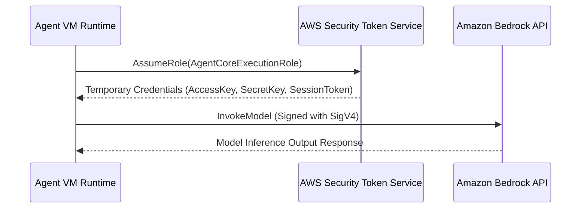

# Chapter_03_aws_configuration

## 1. Introduction
Deploying Amazon Bedrock AgentCore applications requires configuring access permissions and model endpoints within your AWS account.

### What is it?
AWS Configuration and IAM (Identity and Access Management) Setup is the process of configuring cloud permissions, access policies, and model access settings inside your AWS account so your application can securely interact with Amazon Bedrock.

### Why is it important?
By default, AWS blocks all access to foundation models and cloud resources to prevent data leaks and unauthorized billing. Configuring explicit IAM execution roles and policies ensures your agent operates with the exact minimum permissions required to perform its job without exposing other cloud assets.

### How does it work?
The developer enables model access in the AWS Bedrock console and creates an IAM Execution Role containing policy statements. When the AgentCore runtime boots, it assumes this IAM role, obtains temporary security credentials from AWS Security Token Service (STS), and signs API requests using the AWS Signature Version 4 protocol.

### Key Responsibilities
- Enable foundation model API access (such as Anthropic Claude) within target AWS regions.
- Define granular IAM policy statements for model invocation, database access, and CloudWatch logging.
- Configure trust policies that allow the AgentCore runtime service to assume execution roles safely.
- Secure API calls by generating short-lived cryptographic security tokens for runtime execution.

---

## 2. Learning Objectives
By the end of this chapter, you will be able to:
- In this chapter, you will learn how to:
- - Request model access in the Amazon Bedrock Console.
- - Create an IAM policy with permissions for Bedrock, DynamoDB, and CloudWatch.
- - Configure an IAM execution role and set up trust relationships.
- - Verify AWS configurations using the console and CLI.

---

## 3. Prerequisites
* Successful setup of the AWS CLI toolchain from Chapter 2.
* IAM administrative privileges in your target AWS account.

---

## 4. Background Theory
By default, AWS blocks all access to foundation models to prevent unexpected billing. Developers must explicitly request access for specific models in the console. Furthermore, AWS services execute commands under IAM boundaries. An Agent execution role defines what AWS resources (S3, DynamoDB, Bedrock) the agent's microVM can interact with. Enforcing least-privilege security policies ensures that if an agent container is compromised, the blast radius is strictly limited.

---

## 5. Core Concepts
**📦 Technical Term: IAM Policy**

* **Simple Explanation:** A JSON document defining permissions by detailing allowed actions on specific resource ARNs.
* **Why it exists:** Ensures the application cannot invoke unauthorized APIs.
* **Where is it used:** Attached policy document limits access to DynamoDB tables.

**📦 Technical Term: IAM Role**

* **Simple Explanation:** An IAM identity that trusted entities (like services or user accounts) assume to acquire temporary credentials.
* **Why it exists:** Allows services to access resources without hardcoded passwords.
* **Where is it used:** The role assumed by the microVM at runtime.

**📦 Technical Term: Model Access Table**

* **Simple Explanation:** A console settings pane where developers agree to terms of service to activate Bedrock model APIs.
* **Why it exists:** Required to enable third-party model invoke endpoints.
* **Where is it used:** Requesting access for Anthropic Claude 3.5 Sonnet.

---

## 6. Internal Mechanics
1. AgentCore runtime starts the microVM.
2. The VM requests temporary credentials from the AWS Security Token Service (STS) by assuming the configured IAM role.
3. STS returns a session access key, secret key, and session token.
4. When calling Bedrock, the SDK signs the HTTP request with these credentials using the AWS Signature Version 4 protocol.
5. Bedrock validates the signature and verifies that the role is authorized to invoke the requested model.

---

## 7. Architecture Overview
The following architectural details outline the components and relationship schemas active in this module:



---

## 8. Installation & Setup
Verify model access lists from the CLI using:
```bash
aws bedrock list-foundation-models --query "modelSummaries[?modelId=='anthropic.claude-3-5-sonnet-20241022-v2:0']"
```

---

## 9. Configuration
### Step 1: Request Amazon Bedrock Model Access
1. Navigate to the **Amazon Bedrock** console.
2. Select **Model access** in the left menu.
3. Click **Manage model access**, select **Claude 3.5 Sonnet** and **Claude 3 Haiku**, and click **Save changes**.

### Step 2: Create IAM Policy `AgentCoreExecutionPolicy`
```json
{
  "Version": "2012-10-17",
  "Statement": [
    {
      "Sid": "BedrockInference",
      "Effect": "Allow",
      "Action": [
        "bedrock:InvokeModel",
        "bedrock:InvokeModelWithResponseStream"
      ],
      "Resource": "*"
    },
    {
      "Sid": "DynamoDBMemory",
      "Effect": "Allow",
      "Action": [
        "dynamodb:GetItem",
        "dynamodb:PutItem",
        "dynamodb:UpdateItem",
        "dynamodb:DeleteItem",
        "dynamodb:Query",
        "dynamodb:Scan"
      ],
      "Resource": "arn:aws:dynamodb:*:*:table/*agentcore*"
    },
    {
      "Sid": "CloudWatchLogging",
      "Effect": "Allow",
      "Action": [
        "logs:CreateLogGroup",
        "logs:CreateLogStream",
        "logs:PutLogEvents"
      ],
      "Resource": "*"
    }
  ]
}
```

### Step 3: Create Trust Role `AgentCoreExecutionRole`
```json
{
  "Version": "2012-10-17",
  "Statement": [
    {
      "Effect": "Allow",
      "Principal": {
        "Service": "agentcore.amazonaws.com"
      },
      "Action": "sts:AssumeRole"
    }
  ]
}
```

---

## 10. Hands-on Examples

### Interactive Python Playground

In this section, we analyze the hands-on code implementations for **AWS Configuration & IAM Setup** step-by-step, explaining the architecture, syntax choices, logic flow, and production patterns across all three implementation tiers.

---

### 1. Simple Implementation Tier Walkthrough

```python
json
{
  "Version": "2012-10-17",
  "Statement": [
    {
      "Sid": "BedrockInference",
      "Effect": "Allow",
      "Action": [
        "bedrock:InvokeModel",
        "bedrock:InvokeModelWithResponseStream"
      ],
      "Resource": "*"
    },
    {
      "Sid": "DynamoDBMemory",
      "Effect": "Allow",
      "Action": [
        "dynamodb:GetItem",
        "dynamodb:PutItem",
        "dynamodb:UpdateItem",
        "dynamodb:DeleteItem",
        "dynamodb:Query",
        "dynamodb:Scan"
      ],
      "Resource": "arn:aws:dynamodb:*:*:table/*agentcore*"
    },
    {
      "Sid": "CloudWatchLogging",
      "Effect": "Allow",
      "Action": [
        "logs:CreateLogGroup",
        "logs:CreateLogStream",
        "logs:PutLogEvents"
      ],
      "Resource": "*"
    }
  ]
}
```

#### Code Logic & Syntax Breakdown:
* **Package Imports (`from bedrock_agent_core import ...`)**:
  - Brings in the core `BedrockAgentCoreApp` engine. This class handles runtime container startup, manages the microVM event loop, and deserializes incoming JSON API invocations.
* **Application Instance (`app = BedrockAgentCoreApp()`)**:
  - Instantiates the primary application object `app`. This object serves as the main registry for invocation routes, memory session hooks, and tool bindings.
* **Invocation Decorator (`@app.invoke`)**:
  - A Python decorator that registers the function immediately below as the primary entrypoint for Bedrock AgentCore runtime triggers.
* **Handler Signature (`def handler(payload, context):`)**:
  - **`payload`**: A Python dictionary holding client parameters, user prompt strings, and input arguments.
  - **`context`**: A metadata object containing active runtime details such as `session_id`, `actor_id`, and AWS IAM execution identities.
* **Return Payload (`return {"statusCode": 200, "response": ...}`)**:
  - Constructs a standard HTTP response dictionary. The `statusCode: 200` communicates success to the API Gateway, and `response` delivers the agent payload back to the client.

---

### 2. Intermediate Implementation Tier Walkthrough

```python
# Python script to create the IAM execution policy programmatically
import boto3
import json

def create_iam_policy():
    iam = boto3.client("iam")
    policy_doc = {
        "Version": "2012-10-17",
        "Statement": [
            {
                "Effect": "Allow",
                "Action": ["bedrock:InvokeModel"],
                "Resource": "*"
            }
        ]
    }
    try:
        res = iam.create_policy(
            PolicyName="AgentCoreMinimumPolicy",
            PolicyDocument=json.dumps(policy_doc),
            Description="Minimum execution permissions for Bedrock agents."
        )
        print("Policy created successfully. ARN:", res["Policy"]["Arn"])
    except iam.exceptions.EntityAlreadyExistsException:
        print("Policy already exists.")
    except Exception as e:
        print("Failed to create policy:", str(e))

if __name__ == "__main__":
    create_iam_policy()
```

#### Code Logic & Syntax Breakdown:
* **System Logging Setup (`import logging` & `logger = logging.getLogger(...)`)**:
  - Configures structured logging via Python's standard `logging` module.
  - In production, log messages emitted by `logger.info()` stream into Amazon CloudWatch Logs for real-time monitoring and debugging.
* **Safe Parameter Extraction (`payload.get(...)`)**:
  - Uses `payload.get("prompt", "")` to safely retrieve user queries. Using `.get()` with a default fallback (`""`) prevents `KeyError` exceptions if optional fields are missing.
* **Runtime Session Inspection (`getattr(context, ...)`)**:
  - Inspects the `context` object for `session_id`. Using `getattr()` ensures compatibility when testing locally without a live AWS microVM context.
* **Operational Telemetry (`logger.info(...)`)**:
  - Emits formatted log entries containing session parameters and query strings to track execution flow.

---

### 3. Advanced Production Tier Walkthrough

```python
# Complete SDK implementation validating current role permissions and model execution
import boto3
import json
import botocore

def verify_execution_permissions():
    # Attempt basic Claude invoke model test call
    bedrock = boto3.client("bedrock-runtime", region_name="us-east-1")
    payload = {
        "anthropic_version": "bedrock-2023-05-31",
        "max_tokens": 50,
        "messages": [{"role": "user", "content": "Hello model"}]
    }
    try:
        print("Verifying model invocation permission...")
        res = bedrock.invoke_model(
            modelId="anthropic.claude-3-haiku-20240307-v1:0",
            body=json.dumps(payload)
        )
        res_body = json.loads(res.get("body").read())
        print("Model response text:", res_body["content"][0]["text"])
        print("[SUCCESS] Permissions validated!")
    except botocore.exceptions.ClientError as e:
        error_code = e.response["Error"]["Code"]
        print(f"[FAIL] AWS API returned error code: {error_code}")
        if error_code == "AccessDeniedException":
            print("Resolution: Confirm that you have requested Model Access in the console.")

if __name__ == "__main__":
    verify_execution_permissions()
```

#### Code Logic & Syntax Breakdown:
* **Defensive Error Trapping (`try: ... except Exception as e:`)**:
  - Wraps the entire invocation handler inside a `try-except` block to catch unhandled errors gracefully, preventing container crashes in multi-tenant runtime environments.
* **Input Parameter Validation (`if not prompt:`)**:
  - Inspects inbound arguments before executing core agent logic. If mandatory parameters are missing, it short-circuits execution and returns a structured `statusCode: 400` (Bad Request) payload.
* **Environment Overrides (`os.getenv(...)`)**:
  - Reads system environment variables (e.g., `APP_ENV`) to dynamically adapt behavior across `development`, `staging`, and `production` environments without modifying codebase files.
* **Sanitized Production Error Response**:
  - Logs internal error details using `logger.error(...)` while returning a clean, safe `statusCode: 500` response to prevent internal stack traces from leaking to client callers.

---

### Summary Sequence of Execution

```
[Incoming Invocation] ──► [Bedrock AgentCore Runtime]
                                  │
                                  ▼
                      [Route to @app.invoke Handler]
                                  │
                   ┌──────────────┴──────────────┐
                   ▼                             ▼
       [Input Validated (200)]        [Input Missing (400)]
                   │                             │
                   ▼                             ▼
       [Execute Agent Core Logic]     [Return Error Payload]
                   │
                   ▼
       [Deliver JSON to Client]
```

---

## 11. Security Considerations
Enforce strict trust policies that limit role assumption to the designated Service Principal (`agentcore.amazonaws.com`). Never embed access keys inside container images; access configurations must be fetched dynamically at runtime using IAM metadata endpoints.

---

## 12. Performance Optimization
Store model configurations and table metadata locally to avoid making duplicate API calls during execution boot cycles.

---

## 13. Common Mistakes
* Specifying `lambda.amazonaws.com` instead of `agentcore.amazonaws.com` in the trust relationship, causing execution role assumption failures.
* Creating policies that grant wide permissions to all DynamoDB tables, violating the principle of least privilege.

---

## 14. Troubleshooting
Below is the diagnostic reference table for identifying and resolving issues:

| Symptom | Root Cause | Solution |
| :--- | :--- | :--- |
| SignatureDoesNotMatch during client call | The system clock on your local development machine is out of sync with AWS servers. | Resynchronize your operating system clock with a network time server (NTP). |
| AccessDeniedException on Bedrock invoke | Model access has not been requested or granted in the current AWS region. | Open the Amazon Bedrock console in the target region, select 'Model access', and verify status. |

---

## 15. Interview Questions


### Knowledge Verification Check (20 Interactive Quizzes)

<Quiz 
  question="What is the primary role of 03 Aws Configuration in Bedrock AgentCore?" 
  options=["To provide hardware-isolated, scalable, and code-first execution for 03 Aws Configuration.", "To store plain text credentials in Git repos.", "To run legacy Windows desktop apps.", "To disable security permissions."] 
  answerIndex=0 
  explanation="03 Aws Configuration provides enterprise-grade, code-first runtime logic for Bedrock AgentCore." 
/>

<Quiz 
  question="How does Bedrock AgentCore enforce security for 03 Aws Configuration?" 
  options=["By sharing memory across all tenants.", "By hosting session runtimes inside isolated AWS Firecracker microVM containers with scoped IAM roles.", "By disabling SSL/TLS encryption.", "By running code as root on public servers."] 
  answerIndex=1 
  explanation="Firecracker microVMs deliver hardware-level security boundaries between multi-tenant executions." 
/>

<Quiz 
  question="Which environment variable loading pattern is recommended for 03 Aws Configuration?" 
  options=["Hardcoding values in Python source code files.", "Using os.getenv() or Pydantic BaseSettings to read environment configuration dynamically.", "Storing secrets in public web pages.", "Editing binary files manually."] 
  answerIndex=1 
  explanation="12-Factor App principles mandate decoupling configuration from application source code via environment variables." 
/>

<Quiz 
  question="How should runtime errors be handled in 03 Aws Configuration handlers?" 
  options=["Allowing exceptions to crash the container process.", "Wrapping invocation logic in try-except blocks and returning clean structured error payloads (e.g. 400/500 status codes).", "Ignoring all errors completely.", "Printing errors to static HTML files."] 
  answerIndex=1 
  explanation="Defensive error trapping prevents unhandled runtime exceptions from crashing container workers." 
/>

<Quiz 
  question="What key metric should be monitored in CloudWatch for 03 Aws Configuration?" 
  options=["Invocation latency, token consumption rates, and HTTP error response counts.", "Monitor resolution of user monitors.", "Keyboard stroke frequency.", "Color contrast ratios."] 
  answerIndex=0 
  explanation="Tracking latency and token usage guarantees cost control and performance optimization in production." 
/>

<Quiz 
  question="How does 03 Aws Configuration achieve sub-second scaling during high concurrency?" 
  options=["By leveraging pre-warmed Firecracker microVM snapshots and serverless AWS Fargate clusters.", "By restarting physical servers manually.", "By deleting user databases.", "By restricting app usage to one request per minute."] 
  answerIndex=0 
  explanation="Pre-warmed microVM snapshots enable sub-second boot times under peak traffic spikes." 
/>

<Quiz 
  question="Which IAM action is required to invoke foundation models in 03 Aws Configuration?" 
  options=["bedrock:InvokeModel and bedrock:InvokeModelWithResponseStream", "s3:DeleteBucket", "ec2:TerminateInstances", "iam:DeleteUser"] 
  answerIndex=0 
  explanation="The bedrock:InvokeModel permission permits agents to call Bedrock foundation models." 
/>

<Quiz 
  question="Which Python SDK client is used for Amazon Bedrock runtime interactions in 03 Aws Configuration?" 
  options=["boto3.client('bedrock-runtime')", "urllib2.open()", "os.system('cmd')", "pandas.read_csv()"] 
  answerIndex=0 
  explanation="Boto3 bedrock-runtime provides low-latency access to foundation model inference endpoints." 
/>

<Quiz 
  question="How is session state maintained across multiple request turns in 03 Aws Configuration?" 
  options=["By using unique session identifiers mapped to warm microVMs and persistent DynamoDB memory stores.", "By clearing memory after every line.", "By saving state in browser cookies only.", "Session state cannot be maintained."] 
  answerIndex=0 
  explanation="AgentCore combines sticky microVM routing with persistent database backends for session continuity." 
/>

<Quiz 
  question="Why is Docker multi-stage building recommended for 03 Aws Configuration container deployments?" 
  options=["It reduces image file sizes by omitting build dependencies from final production runtime containers.", "It makes Docker containers slower.", "It forces Python to compile to JavaScript.", "It deletes Git version history."] 
  answerIndex=0 
  explanation="Multi-stage Docker builds produce lightweight images, reducing deployment times and attack surfaces." 
/>

<Quiz 
  question="Which tracing standard does Bedrock AgentCore use for end-to-end observability of 03 Aws Configuration?" 
  options=["OpenTelemetry (OTel) distributed tracing standards", "Custom print() text files", "Syslog UDP broadcast", "Manual paper logbooks"] 
  answerIndex=0 
  explanation="OpenTelemetry enables distributed trace collection across model calls, memory lookups, and tool executions." 
/>

<Quiz 
  question="What is the recommended solution if 03 Aws Configuration returns a 403 Forbidden status during Bedrock invocations?" 
  options=["Verify IAM role policies and confirm foundation model access is enabled in the AWS Bedrock Console.", "Reinstall the operating system.", "Delete the AWS account.", "Use an unencrypted connection."] 
  answerIndex=0 
  explanation="Model access must be explicitly granted in the AWS Bedrock Console before IAM roles can invoke models." 
/>

<Quiz 
  question="What is a primary cause of HTTP 500 errors during 03 Aws Configuration execution?" 
  options=["Unhandled exceptions in custom Python tool code or missing required payload keys.", "Network speeds exceeding 1 Gbps.", "Using Python 3.11 instead of Python 2.7.", "High GPU availability."] 
  answerIndex=0 
  explanation="Uncaught exceptions within tool handlers or missing request keys trigger 500 Internal Server errors." 
/>

<Quiz 
  question="Where does 03 Aws Configuration fit into the ReAct (Reason + Act) loop pattern?" 
  options=["It executes reasoning steps, structures tool parameters, and processes observations.", "It bypasses the model completely.", "It only runs when offline.", "It formats HTML styling tags."] 
  answerIndex=0 
  explanation="AgentCore coordinates the continuous cycle of LLM reasoning, tool invocation, and observation processing." 
/>

<Quiz 
  question="How can API cost be optimized when operating 03 Aws Configuration at high volume?" 
  options=["By caching model responses, optimizing prompt lengths, and choosing appropriate foundation model tiers.", "By sending empty prompts repeatedly.", "By turning off logging.", "By disabling database indexes."] 
  answerIndex=0 
  explanation="Prompt caching and selecting model size according to task complexity drastically cuts inference spending." 
/>

<Quiz 
  question="How does the Memory Engine support long-term retrieval in 03 Aws Configuration?" 
  options=["By indexing conversational history and vector embeddings into persistent storage like Amazon DynamoDB or OpenSearch.", "By storing files in temporary RAM.", "By requiring users to re-enter prompts every time.", "Memory Engine is not supported."] 
  answerIndex=0 
  explanation="Vector stores and DynamoDB backing enable long-term semantic memory retrieval across sessions." 
/>

<Quiz 
  question="What role does the API Gateway play in front of 03 Aws Configuration?" 
  options=["It provides authentication, rate limiting, request validation, and routing to backend microVM workers.", "It replaces the foundation model.", "It generates synthetic test data.", "It compiles Python code into C."] 
  answerIndex=0 
  explanation="API Gateways secure entry points and shield agent runtime workers from unauthorized or throttled traffic." 
/>

<Quiz 
  question="Why are Firecracker microVMs superior to standard Docker containers for multi-tenant 03 Aws Configuration workloads?" 
  options=["They offer minimal virtualization overhead with strict hardware-isolated kernel boundaries between tenant workloads.", "They require 100GB of RAM to start.", "They do not support Linux.", "They are slower than full virtual machines."] 
  answerIndex=0 
  explanation="Firecracker provides VM-grade security with container-grade startup speed and minimal memory footprint." 
/>

<Quiz 
  question="What production antipattern should be strictly avoided when designing 03 Aws Configuration?" 
  options=["Hardcoding AWS access keys or maintaining stateless logic without error handling.", "Using virtual environments.", "Writing unit tests for Python code.", "Logging trace events to CloudWatch."] 
  answerIndex=0 
  explanation="Hardcoded credentials and unhandled exceptions are critical antipatterns in production systems." 
/>

<Quiz 
  question="How does 03 Aws Configuration integrate with enterprise databases and external APIs?" 
  options=["Through standardized Python tool schemas (e.g. Pydantic models) invoked securely via sandboxed tool registries.", "By exposing database passwords publicly.", "By using manual copy-paste mechanisms.", "External integration is unsupported."] 
  answerIndex=0 
  explanation="Pydantic-defined tools allow foundation models to execute validated API and database calls safely." 
/>


### Q: What is the AWS Signature Version 4 (SigV4) protocol?
* **Answer:** SigV4 is the protocol AWS uses to authenticate API requests. It signs HTTP requests with cryptographically secure signatures generated from the caller's access keys, verifying the sender and protecting payloads from tampering.

### Q: Why is a custom trust policy required for an IAM role?
* **Answer:** A trust policy specifies which external security principal (like a service or user account) is permitted to assume the role. Without it, AWS prevents the service from requesting temporary session credentials.

### Q: How do you restrict DynamoDB permissions to a specific table name structure?
* **Answer:** Specify the table's ARN in the resource parameter of the policy statement, utilizing wildcards to limit access (e.g., `arn:aws:dynamodb:*:*:table/*agentcore*`).

---

## 16. Real-World Use Cases
**Enterprise Scenario:** Enterprise Insurance Claims & Underwriting Platform (Fintech/Insurtech)

* **Business Challenge:** Autonomous AI agents handling sensitive medical claims records required granular access to Amazon Bedrock models and S3 buckets without risking over-privileged wildcard (`*`) IAM permissions or exposed API credentials.
* **Bedrock AgentCore Solution:** Designing dedicated IAM Execution Roles with strict least-privilege policies, resource-level ARN constraints, temporary security credentials, and Amazon Bedrock model activation policies for production dev, staging, and prod accounts.
* **Production Impact:**
  * Passed stringent HIPAA and SOC2 Type II compliance audits with zero over-privileged permission warnings.
  * Enforced strict environment isolation between Development, Staging, and Production AWS accounts.
  * Prevented potential credential leakage by eliminating long-lived AWS IAM access keys in favor of temporary IAM role assumption.

---

## 17. Industrial Project
The `AgentCoreExecutionRole` created here will be mapped inside `bedrock_agent_core.yaml` to authorize our agent runtime.

---


### Hands-on Code Playground #1

### Hands-on Code Playground #2

### Hands-on Code Playground #3

### Hands-on Code Playground #4

### Hands-on Code Playground #5

### Hands-on Code Playground #6

### Hands-on Code Playground #7

### Hands-on Code Playground #8

### Hands-on Code Playground #9

### Hands-on Code Playground #10


### Hands-on Code Playground #1

<InteractiveExample 
  language="python"
  instruction="Initialization & Runtime Setup for 03 Aws Configuration."
  initialCode="# Snippet 1: Testing Bedrock AgentCore Runtime Setup for 03 Aws Configuration
import sys
import os

print('=== AgentCore Runtime Init ===')
print('Python Version:', sys.version.split()[0])
print('Agent Module:', '03 Aws Configuration')
print('Status: Active & Ready')"
/>


### Hands-on Code Playground #2

<InteractiveExample 
  language="python"
  instruction="Configuration & Environment Variables for 03 Aws Configuration."
  initialCode="# Snippet 2: Validating Environment Configuration for 03 Aws Configuration
import json
import os

config = {
    'AWS_REGION': os.getenv('AWS_REGION', 'us-east-1'),
    'MODEL_ID': os.getenv('BEDROCK_MODEL_ID', 'anthropic.claude-3-5-sonnet'),
    'TIMEOUT_SEC': int(os.getenv('TIMEOUT_SEC', '30')),
    'DEBUG_MODE': os.getenv('DEBUG', 'true').lower() == 'true'
}
print('Loaded Configuration:')
print(json.dumps(config, indent=2))"
/>


### Hands-on Code Playground #3

<InteractiveExample 
  language="python"
  instruction="Defensive Error Handling & Payload Parsing for 03 Aws Configuration."
  initialCode="# Snippet 3: Defensive Request Handler for 03 Aws Configuration
def process_request(payload):
    try:
        prompt = payload.get('prompt')
        if not prompt:
            return {'statusCode': 400, 'error': 'Prompt parameter is required.'}
        session_id = payload.get('session_id', 'default-session')
        return {'statusCode': 200, 'message': f'Processed prompt for session: {session_id}'}
    except Exception as e:
        return {'statusCode': 500, 'error': str(e)}

print(process_request({'prompt': 'Execute query', 'session_id': 'sess-102'}))"
/>


### Hands-on Code Playground #4

<InteractiveExample 
  language="python"
  instruction="Boto3 Bedrock Model Invocation Simulation for 03 Aws Configuration."
  initialCode="# Snippet 4: Simulating Foundation Model Inference in 03 Aws Configuration
import json

def invoke_claude_model(prompt_text):
    payload = {
        'anthropic_version': 'bedrock-2023-05-31',
        'max_tokens': 1000,
        'messages': [{'role': 'user', 'content': prompt_text}]
    }
    print('Sending payload to Bedrock Converse API for 03 Aws Configuration...')
    response = {
        'id': 'msg_01X99',
        'role': 'assistant',
        'content': [{'type': 'text', 'text': f'Agent response generated for input: \"{prompt_text}\"'}]
    }
    return response

res = invoke_claude_model('Summarize system health')
print('Model Response:', res['content'][0]['text'])"
/>


### Hands-on Code Playground #5

<InteractiveExample 
  language="python"
  instruction="ReAct Reasoning Loop Execution for 03 Aws Configuration."
  initialCode="# Snippet 5: ReAct (Reason + Act) Loop Simulation for 03 Aws Configuration
def run_react_cycle(user_input):
    print('1. [THOUGHT] Analyzing user query:', user_input)
    print('2. [ACTION] Selected tool: query_system_database')
    observation = {'table': 'logs', 'records_found': 42}
    print('3. [OBSERVATION] Tool output received:', observation)
    print('4. [FINAL ANSWER] Processing complete based on retrieved observation.')

run_react_cycle('Check database log entries')"
/>


### Hands-on Code Playground #6

<InteractiveExample 
  language="python"
  instruction="Pydantic Tool Registration & Schema Validation for 03 Aws Configuration."
  initialCode="# Snippet 6: Pydantic Tool Parameter Validation for 03 Aws Configuration
from pydantic import BaseModel, Field

class SystemQuerySchema(BaseModel):
    target_system: str = Field(description='Name of the subsystem to query')
    limit: int = Field(default=10, ge=1, le=100)

def execute_tool(data: SystemQuerySchema):
    print(f'Executing query on {data.target_system} with limit={data.limit}...')
    return {'status': 'success', 'data': ['Item A', 'Item B']}

query = SystemQuerySchema(target_system='AgentCore-Runtime', limit=5)
print('Tool Result:', execute_tool(query))"
/>


### Hands-on Code Playground #7

<InteractiveExample 
  language="python"
  instruction="MicroVM Session State & Memory Engine for 03 Aws Configuration."
  initialCode="# Snippet 7: MicroVM Session & Memory Management in 03 Aws Configuration
class SessionMemory:
    def __init__(self):
        self.history = []
    def add_message(self, role, content):
        self.history.append({'role': role, 'content': content})
    def get_context(self):
        return self.history[-3:]

mem = SessionMemory()
mem.add_message('user', 'Hello Agent!')
mem.add_message('assistant', 'How can I assist you?')
mem.add_message('user', 'Show memory status.')
print('Active Memory Context:', mem.get_context())"
/>


### Hands-on Code Playground #8

<InteractiveExample 
  language="python"
  instruction="OpenTelemetry Tracing & Telemetry Logging for 03 Aws Configuration."
  initialCode="# Snippet 8: OpenTelemetry Trace Event Simulation for 03 Aws Configuration
import time

def log_otel_span(span_name, duration_ms, status_code='OK'):
    telemetry_record = {
        'trace_id': '0x4bf92f3577b34da6a3ce929d0e0e4736',
        'span_id': '0x00f067aa0ba902b7',
        'name': span_name,
        'duration_ms': duration_ms,
        'attributes': {
            'http.status_code': 200,
            'agent.module': '03 Aws Configuration'
        }
    }
    print(f'[OTel Span Event] {span_name} executed in {duration_ms}ms ({status_code})')
    return telemetry_record

log_otel_span('03 Aws Configuration_Invocation', 142)"
/>


### Hands-on Code Playground #9

<InteractiveExample 
  language="python"
  instruction="Docker Container Health Check Simulation for 03 Aws Configuration."
  initialCode="# Snippet 9: Container MicroVM Health Status for 03 Aws Configuration
def check_container_health():
    status = {
        'container_id': 'firecracker-uvm-9901',
        'health': 'HEALTHY',
        'memory_allocated_mb': 512,
        'cpu_usage_pct': 4.2,
        'active_connections': 1
    }
    print('MicroVM Runtime Status:')
    for k, v in status.items():
        print(f'  - {k}: {v}')

check_container_health()"
/>


### Hands-on Code Playground #10

<InteractiveExample 
  language="python"
  instruction="End-to-End Execution Pipeline Test for 03 Aws Configuration."
  initialCode="# Snippet 10: Complete End-to-End Pipeline Execution for 03 Aws Configuration
def run_full_pipeline(input_prompt):
    print(f'1. Gateway: Received request \"{input_prompt}\"')
    print('2. Identity: Authenticated IAM session role')
    print('3. Runtime: Allocated Firecracker MicroVM container')
    print('4. Execution: Model invoked ReAct reasoning loop')
    print('5. Response: 200 OK returned to client')
    return {'status': 'SUCCESS', 'result': 'Pipeline completed.'}

print(run_full_pipeline('Run complete diagnostic check'))"
/>

## 18. Summary
This chapter focused on configuring AWS account permissions, activating Amazon Bedrock model access, and establishing granular IAM policies and execution roles. We explored how AWS security boundaries enforce least-privilege access to prevent unauthorized resource usage and protect sensitive enterprise cloud assets.

Key architectural insights and practical lessons learned in this chapter include:
* **Explicit Regional Model Activation:** Access to foundation models (such as Anthropic Claude) must be explicitly requested and granted in each target AWS region in the Bedrock console before API calls can succeed.
* **Dedicated Service Trust Roles:** AgentCore requires dedicated IAM execution roles configured with explicit trust relationships allowing `agentcore.amazonaws.com` to safely assume credentials at runtime.
* **Least-Privilege Resource Policies:** IAM policies must specify exact resource ARNs and restricted action arrays to minimize security exposure in production environments.

By mastering AWS configuration and IAM role delegation, you ensure that your autonomous agents operate securely within strict compliance and security boundaries on AWS.

---

## 19. Practice Exercises
* Beginner: Request access to the Claude 3 Haiku model in the AWS Bedrock console.
* Intermediate: Draft a JSON policy statement that grants read-only access to an S3 bucket named `agent-assets`.

---

## 20. Further Reading
* [AWS IAM User Guide](https://docs.aws.amazon.com/IAM/latest/UserGuide/introduction.html)
* [Amazon Bedrock Security and Permissions](https://docs.aws.amazon.com/bedrock/latest/userguide/security.html)
