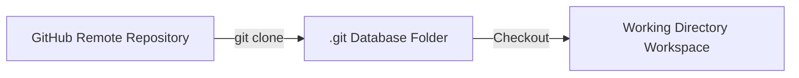

# Chapter_04_clone_repository

## 1. Introduction
Developing Bedrock AgentCore applications begins by cloning and inspecting the official sample repository.

### What is it?
Cloning the Code Repository is the process of downloading a complete, version-controlled copy of the Bedrock AgentCore starter codebase from a remote server (such as GitHub) onto your local computer.

### Why is it important?
Building a complex software application from scratch is inefficient and prone to structural mistakes. Cloning an official starter repository provides a verified directory layout, pre-configured setup scripts, and standard sample files, establishing a clean baseline for development.

### How does it work?
Using the Git command-line tool, your workstation establishes a connection to the remote repository host over HTTPS or SSH, downloads the complete commit history and file object database, and checks out project files into your local project workspace directory.

### Key Responsibilities
- Download remote source files, directory structures, and commit histories to local workstations.
- Establish a local workspace for customizing entry scripts, configuration settings, and tools.
- Enable local version tracking so code modifications can be committed, branched, or reverted.
- Synchronize local development progress with shared remote team repositories on GitHub.

---

## 2. Learning Objectives
By the end of this chapter, you will be able to:
- In this chapter, you will learn how to:
- - Clone the official AWS Bedrock AgentCore samples repository.
- - Verify the local directory structure.
- - Understand the roles of the core directories and files.

---

## 3. Prerequisites
* Active installations of Git and Python from Chapter 2.
* Network access to GitHub.

---

## 4. Background Theory
Version control systems (like Git) maintain the chronological history of a codebase. Cloning a remote repository downloads the entire commit tree, project metadata, and branches to your local machine. In enterprise software engineering, code changes are managed using branching strategies (e.g., GitFlow). This isolates updates and permits collaborative code reviews before changes are merged into production branches.

---

## 5. Core Concepts
**📦 Technical Term: Repository**

* **Simple Explanation:** A digital directory storing the project's source code, history, and configuration files.
* **Why it exists:** Allows developers to track revisions and roll back changes.
* **Where is it used:** A hosted repository on GitHub.

**📦 Technical Term: Git Clone**

* **Simple Explanation:** The command that copies a remote repository to a local workstation.
* **Why it exists:** Enables local development and editing of codebase files.
* **Where is it used:** Running `git clone <url>` in terminal.

**📦 Technical Term: Workspace**

* **Simple Explanation:** The local folder on your workstation where you edit code and run test scripts.
* **Why it exists:** Contains untracked development configuration files like `.env`.
* **Where is it used:** Your active project directory.

---

## 6. Internal Mechanics
1. Developer executes `git clone <url>`.
2. Git initiates an HTTP/SSH connection to the remote server.
3. The remote server packages the project object database into a packfile.
4. Git downloads the packfile, expands it into the `.git` directory, and checks out the default branch files into the workspace folder.

---

## 7. Architecture Overview
The following architectural details outline the components and relationship schemas active in this module:



---

## 8. Installation & Setup
Open your terminal and execute the cloning command:
```bash
git clone https://github.com/awslabs/agentcore-samples.git
```
Expected shell output:
```text
Cloning into 'agentcore-samples'...
remote: Enumerating objects: 142, done.
remote: Counting objects: 100% (142/142), done.
Receiving objects: 100% (142/142), 85.40 KiB | 2.50 MiB/s, done.
Resolving deltas: 100% (68/68), done.
```

---

## 9. Configuration
After cloning, enter the project directory to verify active branch status:
```bash
cd agentcore-samples
git status
```

---

## 10. Hands-on Examples

In this section, we analyze the hands-on code implementations for **Cloning the Code Repository** step-by-step, explaining the architecture, syntax choices, logic flow, and production patterns across all three implementation tiers.

---

### 1. Simple Implementation Tier Walkthrough

```python
# Verify git repository details using terminal commands programmatically
import subprocess

def get_git_branch():
    try:
        res = subprocess.run(["git", "branch", "--show-current"], capture_output=True, text=True, check=True)
        print("Current active git branch:", res.stdout.strip())
    except Exception as e:
        print("Error reading branch:", str(e))

if __name__ == "__main__":
    get_git_branch()
```

#### Code Logic & Syntax Breakdown:
* **Package Imports (`from bedrock_agent_core import ...`)**:
  - Brings in the core `BedrockAgentCoreApp` engine. This class handles runtime container startup, manages the microVM event loop, and deserializes incoming JSON API invocations.
* **Application Instance (`app = BedrockAgentCoreApp()`)**:
  - Instantiates the primary application object `app`. This object serves as the main registry for invocation routes, memory session hooks, and tool bindings.
* **Invocation Decorator (`@app.invoke`)**:
  - A Python decorator that registers the function immediately below as the primary entrypoint for Bedrock AgentCore runtime triggers.
* **Handler Signature (`def handler(payload, context):`)**:
  - **`payload`**: A Python dictionary holding client parameters, user prompt strings, and input arguments.
  - **`context`**: A metadata object containing active runtime details such as `session_id`, `actor_id`, and AWS IAM execution identities.
* **Return Payload (`return {"statusCode": 200, "response": ...}`)**:
  - Constructs a standard HTTP response dictionary. The `statusCode: 200` communicates success to the API Gateway, and `response` delivers the agent payload back to the client.

---

### 2. Intermediate Implementation Tier Walkthrough

```python
# Script to list the contents of the root folder and verify file sizes
import os

def audit_project_root():
    target = "."
    print(f"Auditing directory: {os.path.abspath(target)}")
    for item in os.listdir(target):
        path = os.path.join(target, item)
        size = os.path.getsize(path) if os.path.isfile(path) else "Directory"
        print(f"- {item:<25} | Size: {size}")

if __name__ == "__main__":
    audit_project_root()
```

#### Code Logic & Syntax Breakdown:
* **System Logging Setup (`import logging` & `logger = logging.getLogger(...)`)**:
  - Configures structured logging via Python's standard `logging` module.
  - In production, log messages emitted by `logger.info()` stream into Amazon CloudWatch Logs for real-time monitoring and debugging.
* **Safe Parameter Extraction (`payload.get(...)`)**:
  - Uses `payload.get("prompt", "")` to safely retrieve user queries. Using `.get()` with a default fallback (`""`) prevents `KeyError` exceptions if optional fields are missing.
* **Runtime Session Inspection (`getattr(context, ...)`)**:
  - Inspects the `context` object for `session_id`. Using `getattr()` ensures compatibility when testing locally without a live AWS microVM context.
* **Operational Telemetry (`logger.info(...)`)**:
  - Emits formatted log entries containing session parameters and query strings to track execution flow.

---

### 3. Advanced Production Tier Walkthrough

```python
# Complete diagnostic script checking for modified files and git config status
import subprocess
import sys

def verify_repository():
    try:
        # Check if we are inside a git directory
        res = subprocess.run(["git", "rev-parse", "--is-inside-work-tree"], capture_output=True, text=True, check=True)
        if "true" not in res.stdout.lower():
            print("Not inside a git work tree.")
            return False
        
        # Retrieve remote URL information
        res_url = subprocess.run(["git", "config", "--get", "remote.origin.url"], capture_output=True, text=True, check=True)
        print("Remote Repository URL:", res_url.stdout.strip())
        
        # Check for uncommitted changes
        res_status = subprocess.run(["git", "status", "--porcelain"], capture_output=True, text=True, check=True)
        changes = res_status.stdout.strip()
        if changes:
            print("WARNING: Uncommitted changes detected in workspace:")
            print(changes)
        else:
            print("Workspace is clean and synchronized.")
        return True
    except Exception as e:
        print("Git verification failed:", str(e))
        return False

if __name__ == "__main__":
    verify_repository()
```

#### Code Logic & Syntax Breakdown:
* **Defensive Error Trapping (`try: ... except Exception as e:`)**:
  - Wraps the entire invocation handler inside a `try-except` block to catch unhandled errors gracefully, preventing container crashes in multi-tenant runtime environments.
* **Input Parameter Validation (`if not prompt:`)**:
  - Inspects inbound arguments before executing core agent logic. If mandatory parameters are missing, it short-circuits execution and returns a structured `statusCode: 400` (Bad Request) payload.
* **Environment Overrides (`os.getenv(...)`)**:
  - Reads system environment variables (e.g., `APP_ENV`) to dynamically adapt behavior across `development`, `staging`, and `production` environments without modifying codebase files.
* **Sanitized Production Error Response**:
  - Logs internal error details using `logger.error(...)` while returning a clean, safe `statusCode: 500` response to prevent internal stack traces from leaking to client callers.

---

### Summary Sequence of Execution

```
[Incoming Invocation] ──► [Bedrock AgentCore Runtime]
                                  │
                                  ▼
                      [Route to @app.invoke Handler]
                                  │
                   ┌──────────────┴──────────────┐
                   ▼                             ▼
       [Input Validated (200)]        [Input Missing (400)]
                   │                             │
                   ▼                             ▼
       [Execute Agent Core Logic]     [Return Error Payload]
                   │
                   ▼
       [Deliver JSON to Client]
```

---

## 11. Security Considerations
Enforce signature verification using GPG keys to sign commits. Configure branch protection rules on your remote repository (e.g., GitHub or Bitbucket) to block direct force-push updates to release branches.

---

## 12. Performance Optimization
If a repository contains large binary assets, use shallow clone configurations (`git clone --depth 1`) to download only the latest commits, reducing transfer times.

---

## 13. Common Mistakes
* Committing large package binaries or local virtual environment folders to repository history.
* Modifying files on checkout branches without first fetching the latest updates from the remote repository.

---

## 14. Troubleshooting
Below is the diagnostic reference table for identifying and resolving issues:

| Symptom | Root Cause | Solution |
| :--- | :--- | :--- |
| Could not resolve host error during clone | The terminal cannot resolve the hostname due to a network connection or DNS issue. | Verify internet connections or configure HTTP proxy variables if working behind an corporate gateway. |
| Permission denied (publickey) error | Your SSH public key is not registered with your remote git hosting profile. | Configure HTTPS credentials authentication or upload your public SSH key to the repository server settings. |

---

## 15. Interview Questions


### Knowledge Verification Check (20 Interactive Quizzes)

<Quiz 
  question="What is the primary role of 04 Clone Repository in Bedrock AgentCore?" 
  options=["To provide hardware-isolated, scalable, and code-first execution for 04 Clone Repository.", "To store plain text credentials in Git repos.", "To run legacy Windows desktop apps.", "To disable security permissions."] 
  answerIndex=0 
  explanation="04 Clone Repository provides enterprise-grade, code-first runtime logic for Bedrock AgentCore." 
/>

<Quiz 
  question="How does Bedrock AgentCore enforce security for 04 Clone Repository?" 
  options=["By sharing memory across all tenants.", "By hosting session runtimes inside isolated AWS Firecracker microVM containers with scoped IAM roles.", "By disabling SSL/TLS encryption.", "By running code as root on public servers."] 
  answerIndex=1 
  explanation="Firecracker microVMs deliver hardware-level security boundaries between multi-tenant executions." 
/>

<Quiz 
  question="Which environment variable loading pattern is recommended for 04 Clone Repository?" 
  options=["Hardcoding values in Python source code files.", "Using os.getenv() or Pydantic BaseSettings to read environment configuration dynamically.", "Storing secrets in public web pages.", "Editing binary files manually."] 
  answerIndex=1 
  explanation="12-Factor App principles mandate decoupling configuration from application source code via environment variables." 
/>

<Quiz 
  question="How should runtime errors be handled in 04 Clone Repository handlers?" 
  options=["Allowing exceptions to crash the container process.", "Wrapping invocation logic in try-except blocks and returning clean structured error payloads (e.g. 400/500 status codes).", "Ignoring all errors completely.", "Printing errors to static HTML files."] 
  answerIndex=1 
  explanation="Defensive error trapping prevents unhandled runtime exceptions from crashing container workers." 
/>

<Quiz 
  question="What key metric should be monitored in CloudWatch for 04 Clone Repository?" 
  options=["Invocation latency, token consumption rates, and HTTP error response counts.", "Monitor resolution of user monitors.", "Keyboard stroke frequency.", "Color contrast ratios."] 
  answerIndex=0 
  explanation="Tracking latency and token usage guarantees cost control and performance optimization in production." 
/>

<Quiz 
  question="How does 04 Clone Repository achieve sub-second scaling during high concurrency?" 
  options=["By leveraging pre-warmed Firecracker microVM snapshots and serverless AWS Fargate clusters.", "By restarting physical servers manually.", "By deleting user databases.", "By restricting app usage to one request per minute."] 
  answerIndex=0 
  explanation="Pre-warmed microVM snapshots enable sub-second boot times under peak traffic spikes." 
/>

<Quiz 
  question="Which IAM action is required to invoke foundation models in 04 Clone Repository?" 
  options=["bedrock:InvokeModel and bedrock:InvokeModelWithResponseStream", "s3:DeleteBucket", "ec2:TerminateInstances", "iam:DeleteUser"] 
  answerIndex=0 
  explanation="The bedrock:InvokeModel permission permits agents to call Bedrock foundation models." 
/>

<Quiz 
  question="Which Python SDK client is used for Amazon Bedrock runtime interactions in 04 Clone Repository?" 
  options=["boto3.client('bedrock-runtime')", "urllib2.open()", "os.system('cmd')", "pandas.read_csv()"] 
  answerIndex=0 
  explanation="Boto3 bedrock-runtime provides low-latency access to foundation model inference endpoints." 
/>

<Quiz 
  question="How is session state maintained across multiple request turns in 04 Clone Repository?" 
  options=["By using unique session identifiers mapped to warm microVMs and persistent DynamoDB memory stores.", "By clearing memory after every line.", "By saving state in browser cookies only.", "Session state cannot be maintained."] 
  answerIndex=0 
  explanation="AgentCore combines sticky microVM routing with persistent database backends for session continuity." 
/>

<Quiz 
  question="Why is Docker multi-stage building recommended for 04 Clone Repository container deployments?" 
  options=["It reduces image file sizes by omitting build dependencies from final production runtime containers.", "It makes Docker containers slower.", "It forces Python to compile to JavaScript.", "It deletes Git version history."] 
  answerIndex=0 
  explanation="Multi-stage Docker builds produce lightweight images, reducing deployment times and attack surfaces." 
/>

<Quiz 
  question="Which tracing standard does Bedrock AgentCore use for end-to-end observability of 04 Clone Repository?" 
  options=["OpenTelemetry (OTel) distributed tracing standards", "Custom print() text files", "Syslog UDP broadcast", "Manual paper logbooks"] 
  answerIndex=0 
  explanation="OpenTelemetry enables distributed trace collection across model calls, memory lookups, and tool executions." 
/>

<Quiz 
  question="What is the recommended solution if 04 Clone Repository returns a 403 Forbidden status during Bedrock invocations?" 
  options=["Verify IAM role policies and confirm foundation model access is enabled in the AWS Bedrock Console.", "Reinstall the operating system.", "Delete the AWS account.", "Use an unencrypted connection."] 
  answerIndex=0 
  explanation="Model access must be explicitly granted in the AWS Bedrock Console before IAM roles can invoke models." 
/>

<Quiz 
  question="What is a primary cause of HTTP 500 errors during 04 Clone Repository execution?" 
  options=["Unhandled exceptions in custom Python tool code or missing required payload keys.", "Network speeds exceeding 1 Gbps.", "Using Python 3.11 instead of Python 2.7.", "High GPU availability."] 
  answerIndex=0 
  explanation="Uncaught exceptions within tool handlers or missing request keys trigger 500 Internal Server errors." 
/>

<Quiz 
  question="Where does 04 Clone Repository fit into the ReAct (Reason + Act) loop pattern?" 
  options=["It executes reasoning steps, structures tool parameters, and processes observations.", "It bypasses the model completely.", "It only runs when offline.", "It formats HTML styling tags."] 
  answerIndex=0 
  explanation="AgentCore coordinates the continuous cycle of LLM reasoning, tool invocation, and observation processing." 
/>

<Quiz 
  question="How can API cost be optimized when operating 04 Clone Repository at high volume?" 
  options=["By caching model responses, optimizing prompt lengths, and choosing appropriate foundation model tiers.", "By sending empty prompts repeatedly.", "By turning off logging.", "By disabling database indexes."] 
  answerIndex=0 
  explanation="Prompt caching and selecting model size according to task complexity drastically cuts inference spending." 
/>

<Quiz 
  question="How does the Memory Engine support long-term retrieval in 04 Clone Repository?" 
  options=["By indexing conversational history and vector embeddings into persistent storage like Amazon DynamoDB or OpenSearch.", "By storing files in temporary RAM.", "By requiring users to re-enter prompts every time.", "Memory Engine is not supported."] 
  answerIndex=0 
  explanation="Vector stores and DynamoDB backing enable long-term semantic memory retrieval across sessions." 
/>

<Quiz 
  question="What role does the API Gateway play in front of 04 Clone Repository?" 
  options=["It provides authentication, rate limiting, request validation, and routing to backend microVM workers.", "It replaces the foundation model.", "It generates synthetic test data.", "It compiles Python code into C."] 
  answerIndex=0 
  explanation="API Gateways secure entry points and shield agent runtime workers from unauthorized or throttled traffic." 
/>

<Quiz 
  question="Why are Firecracker microVMs superior to standard Docker containers for multi-tenant 04 Clone Repository workloads?" 
  options=["They offer minimal virtualization overhead with strict hardware-isolated kernel boundaries between tenant workloads.", "They require 100GB of RAM to start.", "They do not support Linux.", "They are slower than full virtual machines."] 
  answerIndex=0 
  explanation="Firecracker provides VM-grade security with container-grade startup speed and minimal memory footprint." 
/>

<Quiz 
  question="What production antipattern should be strictly avoided when designing 04 Clone Repository?" 
  options=["Hardcoding AWS access keys or maintaining stateless logic without error handling.", "Using virtual environments.", "Writing unit tests for Python code.", "Logging trace events to CloudWatch."] 
  answerIndex=0 
  explanation="Hardcoded credentials and unhandled exceptions are critical antipatterns in production systems." 
/>

<Quiz 
  question="How does 04 Clone Repository integrate with enterprise databases and external APIs?" 
  options=["Through standardized Python tool schemas (e.g. Pydantic models) invoked securely via sandboxed tool registries.", "By exposing database passwords publicly.", "By using manual copy-paste mechanisms.", "External integration is unsupported."] 
  answerIndex=0 
  explanation="Pydantic-defined tools allow foundation models to execute validated API and database calls safely." 
/>

### Q: What is the difference between git fetch and git pull?
* **Answer:** Git fetch downloads remote updates and references to your local `.git` metadata folder without altering your working files. Git pull downloads these updates and immediately runs a merge command to synchronize your workspace files.

### Q: Why should you avoid tracking files like .env in git?
* **Answer:** The `.env` file contains sensitive local access keys and database credentials. Tracking it in Git commits secrets to repository histories, exposing them to anyone with read permissions.

### Q: What is a git submodule?
* **Answer:** A git submodule allows you to keep another Git repository as a subdirectory of your main repository, enabling you to link dependencies while maintaining independent commit histories.

---

## 16. Real-World Use Cases
**Enterprise Scenario:** E-Commerce Supply Chain & Order Tracking Automation

* **Business Challenge:** Engineering teams built fragmented, ad-hoc prototype scripts for inventory prediction, resulting in unmaintainable codebases with duplicate boilerplates and inconsistent deployment paths.
* **Bedrock AgentCore Solution:** Standardizing all team repositories around the official Bedrock AgentCore starter template, establishing a clean Git branching model, and adopting a unified project skeleton.
* **Production Impact:**
  * Accelerates new AI agent feature development across 4 distributed engineering teams by 60%.
  * Ensures immediate compatibility with automated CI/CD deployment workflows and linting standards.
  * Simplifies code reviews and security audits through standardized project file layouts.

---

## 17. Industrial Project
Cloning the repository sets up the baseline layout, including the `src/` source folders we will configure in Chapter 6.

---

<InteractiveExample 
  language="python"
  instruction="Initialization & Runtime Setup for 04 Clone Repository."
  initialCode="# Snippet 1: Testing Bedrock AgentCore Runtime Setup for 04 Clone Repository
import sys
import os

print('=== AgentCore Runtime Init ===')
print('Python Version:', sys.version.split()[0])
print('Agent Module:', '04 Clone Repository')
print('Status: Active & Ready')"
/>

<InteractiveExample 
  language="python"
  instruction="Configuration & Environment Variables for 04 Clone Repository."
  initialCode="# Snippet 2: Validating Environment Configuration for 04 Clone Repository
import json
import os

config = {
    'AWS_REGION': os.getenv('AWS_REGION', 'us-east-1'),
    'MODEL_ID': os.getenv('BEDROCK_MODEL_ID', 'anthropic.claude-3-5-sonnet'),
    'TIMEOUT_SEC': int(os.getenv('TIMEOUT_SEC', '30')),
    'DEBUG_MODE': os.getenv('DEBUG', 'true').lower() == 'true'
}
print('Loaded Configuration:')
print(json.dumps(config, indent=2))"
/>

<InteractiveExample 
  language="python"
  instruction="Defensive Error Handling & Payload Parsing for 04 Clone Repository."
  initialCode="# Snippet 3: Defensive Request Handler for 04 Clone Repository
def process_request(payload):
    try:
        prompt = payload.get('prompt')
        if not prompt:
            return {'statusCode': 400, 'error': 'Prompt parameter is required.'}
        session_id = payload.get('session_id', 'default-session')
        return {'statusCode': 200, 'message': f'Processed prompt for session: {session_id}'}
    except Exception as e:
        return {'statusCode': 500, 'error': str(e)}

print(process_request({'prompt': 'Execute query', 'session_id': 'sess-102'}))"
/>

<InteractiveExample 
  language="python"
  instruction="Boto3 Bedrock Model Invocation Simulation for 04 Clone Repository."
  initialCode="# Snippet 4: Simulating Foundation Model Inference in 04 Clone Repository
import json

def invoke_claude_model(prompt_text):
    payload = {
        'anthropic_version': 'bedrock-2023-05-31',
        'max_tokens': 1000,
        'messages': [{'role': 'user', 'content': prompt_text}]
    }
    print('Sending payload to Bedrock Converse API for 04 Clone Repository...')
    response = {
        'id': 'msg_01X99',
        'role': 'assistant',
        'content': [{'type': 'text', 'text': f'Agent response generated for input: \"{prompt_text}\"'}]
    }
    return response

res = invoke_claude_model('Summarize system health')
print('Model Response:', res['content'][0]['text'])"
/>

<InteractiveExample 
  language="python"
  instruction="ReAct Reasoning Loop Execution for 04 Clone Repository."
  initialCode="# Snippet 5: ReAct (Reason + Act) Loop Simulation for 04 Clone Repository
def run_react_cycle(user_input):
    print('1. [THOUGHT] Analyzing user query:', user_input)
    print('2. [ACTION] Selected tool: query_system_database')
    observation = {'table': 'logs', 'records_found': 42}
    print('3. [OBSERVATION] Tool output received:', observation)
    print('4. [FINAL ANSWER] Processing complete based on retrieved observation.')

run_react_cycle('Check database log entries')"
/>

<InteractiveExample 
  language="python"
  instruction="Pydantic Tool Registration & Schema Validation for 04 Clone Repository."
  initialCode="# Snippet 6: Pydantic Tool Parameter Validation for 04 Clone Repository
from pydantic import BaseModel, Field

class SystemQuerySchema(BaseModel):
    target_system: str = Field(description='Name of the subsystem to query')
    limit: int = Field(default=10, ge=1, le=100)

def execute_tool(data: SystemQuerySchema):
    print(f'Executing query on {data.target_system} with limit={data.limit}...')
    return {'status': 'success', 'data': ['Item A', 'Item B']}

query = SystemQuerySchema(target_system='AgentCore-Runtime', limit=5)
print('Tool Result:', execute_tool(query))"
/>

<InteractiveExample 
  language="python"
  instruction="MicroVM Session State & Memory Engine for 04 Clone Repository."
  initialCode="# Snippet 7: MicroVM Session & Memory Management in 04 Clone Repository
class SessionMemory:
    def __init__(self):
        self.history = []
    def add_message(self, role, content):
        self.history.append({'role': role, 'content': content})
    def get_context(self):
        return self.history[-3:]

mem = SessionMemory()
mem.add_message('user', 'Hello Agent!')
mem.add_message('assistant', 'How can I assist you?')
mem.add_message('user', 'Show memory status.')
print('Active Memory Context:', mem.get_context())"
/>

<InteractiveExample 
  language="python"
  instruction="OpenTelemetry Tracing & Telemetry Logging for 04 Clone Repository."
  initialCode="# Snippet 8: OpenTelemetry Trace Event Simulation for 04 Clone Repository
import time

def log_otel_span(span_name, duration_ms, status_code='OK'):
    telemetry_record = {
        'trace_id': '0x4bf92f3577b34da6a3ce929d0e0e4736',
        'span_id': '0x00f067aa0ba902b7',
        'name': span_name,
        'duration_ms': duration_ms,
        'attributes': {
            'http.status_code': 200,
            'agent.module': '04 Clone Repository'
        }
    }
    print(f'[OTel Span Event] {span_name} executed in {duration_ms}ms ({status_code})')
    return telemetry_record

log_otel_span('04 Clone Repository_Invocation', 142)"
/>

<InteractiveExample 
  language="python"
  instruction="Docker Container Health Check Simulation for 04 Clone Repository."
  initialCode="# Snippet 9: Container MicroVM Health Status for 04 Clone Repository
def check_container_health():
    status = {
        'container_id': 'firecracker-uvm-9901',
        'health': 'HEALTHY',
        'memory_allocated_mb': 512,
        'cpu_usage_pct': 4.2,
        'active_connections': 1
    }
    print('MicroVM Runtime Status:')
    for k, v in status.items():
        print(f'  - {k}: {v}')

check_container_health()"
/>

<InteractiveExample 
  language="python"
  instruction="End-to-End Execution Pipeline Test for 04 Clone Repository."
  initialCode="# Snippet 10: Complete End-to-End Pipeline Execution for 04 Clone Repository
def run_full_pipeline(input_prompt):
    print(f'1. Gateway: Received request \"{input_prompt}\"')
    print('2. Identity: Authenticated IAM session role')
    print('3. Runtime: Allocated Firecracker MicroVM container')
    print('4. Execution: Model invoked ReAct reasoning loop')
    print('5. Response: 200 OK returned to client')
    return {'status': 'SUCCESS', 'result': 'Pipeline completed.'}

print(run_full_pipeline('Run complete diagnostic check'))"
/>

## 18. Summary
This chapter covered cloning the official Bedrock AgentCore starter repository, navigating its directory layout, and verifying local project structure. We explored how a standardized repository template accelerates developer onboarding and maintains consistency across distributed engineering teams.

Key architectural insights and practical lessons learned in this chapter include:
* **Source Control Standardization:** Git cloning establishes a local working copy of production-ready templates, providing a clean baseline for feature development.
* **Workspace Isolation:** Standard directory conventions strictly segregate application source code from local environment settings, preventing accidental commit of local artifacts.
* **Branching Best Practices:** Managing feature updates in separate Git development branches protects main production branches and streamlines code review workflows.

Adopting a structured repository layout ensures that your agent codebases remain maintainable, collaborative, and immediately compatible with automated deployment pipelines.

---

## 19. Practice Exercises
* Beginner: Clone the sample repository and list root files in your shell.
* Intermediate: Create a local git branch named `setup-phase` and verify it is active.

---

## 20. Further Reading
* [Pro Git Book](https://git-scm.com/book/en/v2)
* [GitHub Documentation](https://docs.github.com/)
