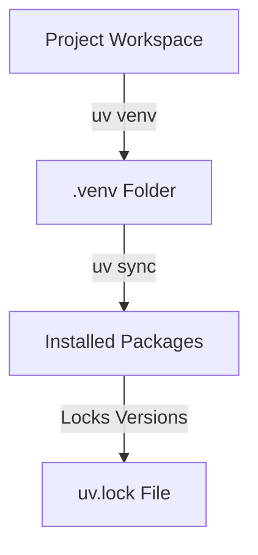

# Chapter_06_project_setup

## 1. Introduction
Standardizing local development configurations requires isolated virtual environments and locked dependency packages.

### What is it?
Project Setup and Dependency Management is the practice of isolating your application's Python environment and controlling the exact versions of external software packages (libraries) required by your application.

### Why is it important?
Python packages updated over time can introduce breaking changes or conflicts with other project dependencies installed on your system. Using isolated virtual environments ('.venv') and lockfiles ('uv.lock') guarantees that every team member and cloud server runs identical software library versions, eliminating environment mismatches.

### How does it work?
The 'uv' package manager creates a dedicated virtual environment folder containing an isolated Python interpreter. It parses package dependency rules declared in 'pyproject.toml', solves version compatibility trees, locks the resulting package versions in 'uv.lock', and installs them into the project workspace.

### Key Responsibilities
- Create isolated local virtual Python environments ('.venv') to prevent library conflicts.
- Resolve dependency compatibility across all required third-party software packages.
- Generate deterministic lockfiles ('uv.lock') to guarantee identical builds across environments.
- Provide fast, cached installation and synchronization of application libraries.

---

## 2. Learning Objectives
By the end of this chapter, you will be able to:
- In this chapter, you will learn how to:
- - Initialize a Python virtual environment.
- - Synchronize project packages using the `uv` toolchain.
- - Manage dependencies using lockfiles.
- - Validate your active package versions.

---

## 3. Prerequisites
* Active toolchain installations and workspace directories from Chapter 2 and 4.

---

## 4. Background Theory
Dependency drift occurs when package updates introduce breaking changes. To ensure that an application runs identically in dev, staging, and production, package versions must be locked. Traditional tools like `pip` install packages globally by default, risking conflicts. Modern workflows isolate environments using virtual environments and lock the complete dependency tree (including transitive dependencies) in a lockfile, ensuring deterministic builds.

---

## 5. Core Concepts
**📦 Technical Term: Package Manager**

* **Simple Explanation:** A tool that automates installing, updating, and removing software packages.
* **Why it exists:** Simplifies dependency resolution and version management.
* **Where is it used:** The `uv` or `pip` command-line tools.

**📦 Technical Term: Virtual Environment**

* **Simple Explanation:** An isolated directory tree containing its own Python installation and packages.
* **Why it exists:** Prevents library version conflicts between projects.
* **Where is it used:** The local `.venv/` folder.

**📦 Technical Term: Lockfile**

* **Simple Explanation:** A file listing the exact version and checksum of every package in the dependency tree.
* **Why it exists:** Guarantees identical builds across all environments.
* **Where is it used:** The `uv.lock` file.

---

## 6. Internal Mechanics
1. Developer runs `uv venv` to scaffold an isolated environment.
2. Running `uv sync` reads the dependencies listed in `pyproject.toml`.
3. The solver resolves version constraints and writes the resolved tree to `uv.lock`.
4. Packages are downloaded, verified against checksums, and installed into `.venv/lib/site-packages`.

---

## 7. Architecture Overview
The following architectural details outline the components and relationship schemas active in this module:



---

## 8. Installation & Setup
Initialize the virtual environment and synchronize dependencies using `uv`:
```bash
uv venv
```
Activate the environment:
- **Windows (PowerShell):**
  ```powershell
  .venv\Scripts\Activate.ps1
  ```
- **macOS / Linux:**
  ```bash
  source .venv/bin/activate
  ```
Synchronize packages:
```bash
uv sync
```

---

## 9. Configuration
Dependencies are declared in the `pyproject.toml` file under the `dependencies` key:
```toml
[project]
name = "agentcore-project"
version = "0.1.0"
dependencies = [
    "boto3>=1.34.0",
    "bedrock-agent-core>=1.0.0"
]
```

---

## 10. Hands-on Examples

In this section, we analyze the hands-on code implementations for **Project Setup & Dependency Management** step-by-step, explaining the architecture, syntax choices, logic flow, and production patterns across all three implementation tiers.

---

### 1. Simple Implementation Tier Walkthrough

```python
# Verify virtual environment status using python sys parameters
import sys

def check_venv():
    # sys.prefix changes when inside a virtual environment
    is_venv = sys.prefix != sys.base_prefix
    print("Is virtual environment active?", is_venv)
    print("Active Python executable path:", sys.executable)

if __name__ == "__main__":
    check_venv()
```

#### Code Logic & Syntax Breakdown:
* **Package Imports (`from bedrock_agent_core import ...`)**:
  - Brings in the core `BedrockAgentCoreApp` engine. This class handles runtime container startup, manages the microVM event loop, and deserializes incoming JSON API invocations.
* **Application Instance (`app = BedrockAgentCoreApp()`)**:
  - Instantiates the primary application object `app`. This object serves as the main registry for invocation routes, memory session hooks, and tool bindings.
* **Invocation Decorator (`@app.invoke`)**:
  - A Python decorator that registers the function immediately below as the primary entrypoint for Bedrock AgentCore runtime triggers.
* **Handler Signature (`def handler(payload, context):`)**:
  - **`payload`**: A Python dictionary holding client parameters, user prompt strings, and input arguments.
  - **`context`**: A metadata object containing active runtime details such as `session_id`, `actor_id`, and AWS IAM execution identities.
* **Return Payload (`return {"statusCode": 200, "response": ...}`)**:
  - Constructs a standard HTTP response dictionary. The `statusCode: 200` communicates success to the API Gateway, and `response` delivers the agent payload back to the client.

---

### 2. Intermediate Implementation Tier Walkthrough

```python
# Script to check if all dependencies in pyproject.toml are installed in venv
import pkg_resources
import tomllib

def check_packages():
    try:
        with open("pyproject.toml", "rb") as f:
            config = tomllib.load(f)
        deps = config.get("project", {}).get("dependencies", [])
        print("Checking declared dependencies:")
        for dep in deps:
            pkg_name = dep.split(">=")[0].split("==")[0].strip()
            try:
                dist = pkg_resources.get_distribution(pkg_name)
                print(f"- [OK] {pkg_name} is installed: {dist.version}")
            except pkg_resources.DistributionNotFound:
                print(f"- [FAIL] {pkg_name} is missing!")
    except FileNotFoundError:
        print("pyproject.toml not found in current folder.")

if __name__ == "__main__":
    check_packages()
```

#### Code Logic & Syntax Breakdown:
* **System Logging Setup (`import logging` & `logger = logging.getLogger(...)`)**:
  - Configures structured logging via Python's standard `logging` module.
  - In production, log messages emitted by `logger.info()` stream into Amazon CloudWatch Logs for real-time monitoring and debugging.
* **Safe Parameter Extraction (`payload.get(...)`)**:
  - Uses `payload.get("prompt", "")` to safely retrieve user queries. Using `.get()` with a default fallback (`""`) prevents `KeyError` exceptions if optional fields are missing.
* **Runtime Session Inspection (`getattr(context, ...)`)**:
  - Inspects the `context` object for `session_id`. Using `getattr()` ensures compatibility when testing locally without a live AWS microVM context.
* **Operational Telemetry (`logger.info(...)`)**:
  - Emits formatted log entries containing session parameters and query strings to track execution flow.

---

### 3. Advanced Production Tier Walkthrough

```python
# Complete automated setup audit and sync verification script
import subprocess
import sys
import os

def audit_environment():
    if not os.path.exists(".venv"):
        print("Virtual environment '.venv' is missing. Creating...")
        subprocess.run(["uv", "venv"], check=True)
    
    print("Synchronizing dependency configurations...")
    res = subprocess.run(["uv", "sync"], capture_output=True, text=True)
    if res.returncode == 0:
        print("[SUCCESS] Dependencies synchronized successfully!")
        # List installed packages
        res_list = subprocess.run(["uv", "pip", "list"], capture_output=True, text=True)
        print(res_list.stdout)
    else:
        print("[FAIL] Dependency sync failed:")
        print(res.stderr)
        sys.exit(1)

if __name__ == "__main__":
    audit_environment()
```

#### Code Logic & Syntax Breakdown:
* **Defensive Error Trapping (`try: ... except Exception as e:`)**:
  - Wraps the entire invocation handler inside a `try-except` block to catch unhandled errors gracefully, preventing container crashes in multi-tenant runtime environments.
* **Input Parameter Validation (`if not prompt:`)**:
  - Inspects inbound arguments before executing core agent logic. If mandatory parameters are missing, it short-circuits execution and returns a structured `statusCode: 400` (Bad Request) payload.
* **Environment Overrides (`os.getenv(...)`)**:
  - Reads system environment variables (e.g., `APP_ENV`) to dynamically adapt behavior across `development`, `staging`, and `production` environments without modifying codebase files.
* **Sanitized Production Error Response**:
  - Logs internal error details using `logger.error(...)` while returning a clean, safe `statusCode: 500` response to prevent internal stack traces from leaking to client callers.

---

### Summary Sequence of Execution

```
[Incoming Invocation] ──► [Bedrock AgentCore Runtime]
                                  │
                                  ▼
                      [Route to @app.invoke Handler]
                                  │
                   ┌──────────────┴──────────────┐
                   ▼                             ▼
       [Input Validated (200)]        [Input Missing (400)]
                   │                             │
                   ▼                             ▼
       [Execute Agent Core Logic]     [Return Error Payload]
                   │
                   ▼
       [Deliver JSON to Client]
```

---

## 11. Security Considerations
Regularly audit installed packages for known security vulnerabilities using `uv pip tree` or security scanners. Keep dependencies updated to apply patches for security advisories.

---

## 12. Performance Optimization
Leverage `uv`'s global package caching. It shares package compilations across workspaces, eliminating redundant downloads and reducing install times.

---

## 13. Common Mistakes
* Committing the `.venv` folder to Git, bloating the repository size.
* Installing packages globally using administrative permissions instead of isolating them in a local virtual environment.

---

## 14. Troubleshooting
Below is the diagnostic reference table for identifying and resolving issues:

| Symptom | Root Cause | Solution |
| :--- | :--- | :--- |
| uv sync fails with version conflict | Conflicting dependencies declared in pyproject.toml. | Audit declared version constraints and update pyproject.toml to resolve conflicts. |
| Python interpreter mismatches | The local system Python version is incompatible with the project settings. | Configure uv to build using a specific Python version: 'uv venv --python 3.11'. |

---

## 15. Interview Questions


### Knowledge Verification Check (20 Interactive Quizzes)

<Quiz 
  question="What is the primary role of 06 Project Setup in Bedrock AgentCore?" 
  options=["To provide hardware-isolated, scalable, and code-first execution for 06 Project Setup.", "To store plain text credentials in Git repos.", "To run legacy Windows desktop apps.", "To disable security permissions."] 
  answerIndex=0 
  explanation="06 Project Setup provides enterprise-grade, code-first runtime logic for Bedrock AgentCore." 
/>

<Quiz 
  question="How does Bedrock AgentCore enforce security for 06 Project Setup?" 
  options=["By sharing memory across all tenants.", "By hosting session runtimes inside isolated AWS Firecracker microVM containers with scoped IAM roles.", "By disabling SSL/TLS encryption.", "By running code as root on public servers."] 
  answerIndex=1 
  explanation="Firecracker microVMs deliver hardware-level security boundaries between multi-tenant executions." 
/>

<Quiz 
  question="Which environment variable loading pattern is recommended for 06 Project Setup?" 
  options=["Hardcoding values in Python source code files.", "Using os.getenv() or Pydantic BaseSettings to read environment configuration dynamically.", "Storing secrets in public web pages.", "Editing binary files manually."] 
  answerIndex=1 
  explanation="12-Factor App principles mandate decoupling configuration from application source code via environment variables." 
/>

<Quiz 
  question="How should runtime errors be handled in 06 Project Setup handlers?" 
  options=["Allowing exceptions to crash the container process.", "Wrapping invocation logic in try-except blocks and returning clean structured error payloads (e.g. 400/500 status codes).", "Ignoring all errors completely.", "Printing errors to static HTML files."] 
  answerIndex=1 
  explanation="Defensive error trapping prevents unhandled runtime exceptions from crashing container workers." 
/>

<Quiz 
  question="What key metric should be monitored in CloudWatch for 06 Project Setup?" 
  options=["Invocation latency, token consumption rates, and HTTP error response counts.", "Monitor resolution of user monitors.", "Keyboard stroke frequency.", "Color contrast ratios."] 
  answerIndex=0 
  explanation="Tracking latency and token usage guarantees cost control and performance optimization in production." 
/>

<Quiz 
  question="How does 06 Project Setup achieve sub-second scaling during high concurrency?" 
  options=["By leveraging pre-warmed Firecracker microVM snapshots and serverless AWS Fargate clusters.", "By restarting physical servers manually.", "By deleting user databases.", "By restricting app usage to one request per minute."] 
  answerIndex=0 
  explanation="Pre-warmed microVM snapshots enable sub-second boot times under peak traffic spikes." 
/>

<Quiz 
  question="Which IAM action is required to invoke foundation models in 06 Project Setup?" 
  options=["bedrock:InvokeModel and bedrock:InvokeModelWithResponseStream", "s3:DeleteBucket", "ec2:TerminateInstances", "iam:DeleteUser"] 
  answerIndex=0 
  explanation="The bedrock:InvokeModel permission permits agents to call Bedrock foundation models." 
/>

<Quiz 
  question="Which Python SDK client is used for Amazon Bedrock runtime interactions in 06 Project Setup?" 
  options=["boto3.client('bedrock-runtime')", "urllib2.open()", "os.system('cmd')", "pandas.read_csv()"] 
  answerIndex=0 
  explanation="Boto3 bedrock-runtime provides low-latency access to foundation model inference endpoints." 
/>

<Quiz 
  question="How is session state maintained across multiple request turns in 06 Project Setup?" 
  options=["By using unique session identifiers mapped to warm microVMs and persistent DynamoDB memory stores.", "By clearing memory after every line.", "By saving state in browser cookies only.", "Session state cannot be maintained."] 
  answerIndex=0 
  explanation="AgentCore combines sticky microVM routing with persistent database backends for session continuity." 
/>

<Quiz 
  question="Why is Docker multi-stage building recommended for 06 Project Setup container deployments?" 
  options=["It reduces image file sizes by omitting build dependencies from final production runtime containers.", "It makes Docker containers slower.", "It forces Python to compile to JavaScript.", "It deletes Git version history."] 
  answerIndex=0 
  explanation="Multi-stage Docker builds produce lightweight images, reducing deployment times and attack surfaces." 
/>

<Quiz 
  question="Which tracing standard does Bedrock AgentCore use for end-to-end observability of 06 Project Setup?" 
  options=["OpenTelemetry (OTel) distributed tracing standards", "Custom print() text files", "Syslog UDP broadcast", "Manual paper logbooks"] 
  answerIndex=0 
  explanation="OpenTelemetry enables distributed trace collection across model calls, memory lookups, and tool executions." 
/>

<Quiz 
  question="What is the recommended solution if 06 Project Setup returns a 403 Forbidden status during Bedrock invocations?" 
  options=["Verify IAM role policies and confirm foundation model access is enabled in the AWS Bedrock Console.", "Reinstall the operating system.", "Delete the AWS account.", "Use an unencrypted connection."] 
  answerIndex=0 
  explanation="Model access must be explicitly granted in the AWS Bedrock Console before IAM roles can invoke models." 
/>

<Quiz 
  question="What is a primary cause of HTTP 500 errors during 06 Project Setup execution?" 
  options=["Unhandled exceptions in custom Python tool code or missing required payload keys.", "Network speeds exceeding 1 Gbps.", "Using Python 3.11 instead of Python 2.7.", "High GPU availability."] 
  answerIndex=0 
  explanation="Uncaught exceptions within tool handlers or missing request keys trigger 500 Internal Server errors." 
/>

<Quiz 
  question="Where does 06 Project Setup fit into the ReAct (Reason + Act) loop pattern?" 
  options=["It executes reasoning steps, structures tool parameters, and processes observations.", "It bypasses the model completely.", "It only runs when offline.", "It formats HTML styling tags."] 
  answerIndex=0 
  explanation="AgentCore coordinates the continuous cycle of LLM reasoning, tool invocation, and observation processing." 
/>

<Quiz 
  question="How can API cost be optimized when operating 06 Project Setup at high volume?" 
  options=["By caching model responses, optimizing prompt lengths, and choosing appropriate foundation model tiers.", "By sending empty prompts repeatedly.", "By turning off logging.", "By disabling database indexes."] 
  answerIndex=0 
  explanation="Prompt caching and selecting model size according to task complexity drastically cuts inference spending." 
/>

<Quiz 
  question="How does the Memory Engine support long-term retrieval in 06 Project Setup?" 
  options=["By indexing conversational history and vector embeddings into persistent storage like Amazon DynamoDB or OpenSearch.", "By storing files in temporary RAM.", "By requiring users to re-enter prompts every time.", "Memory Engine is not supported."] 
  answerIndex=0 
  explanation="Vector stores and DynamoDB backing enable long-term semantic memory retrieval across sessions." 
/>

<Quiz 
  question="What role does the API Gateway play in front of 06 Project Setup?" 
  options=["It provides authentication, rate limiting, request validation, and routing to backend microVM workers.", "It replaces the foundation model.", "It generates synthetic test data.", "It compiles Python code into C."] 
  answerIndex=0 
  explanation="API Gateways secure entry points and shield agent runtime workers from unauthorized or throttled traffic." 
/>

<Quiz 
  question="Why are Firecracker microVMs superior to standard Docker containers for multi-tenant 06 Project Setup workloads?" 
  options=["They offer minimal virtualization overhead with strict hardware-isolated kernel boundaries between tenant workloads.", "They require 100GB of RAM to start.", "They do not support Linux.", "They are slower than full virtual machines."] 
  answerIndex=0 
  explanation="Firecracker provides VM-grade security with container-grade startup speed and minimal memory footprint." 
/>

<Quiz 
  question="What production antipattern should be strictly avoided when designing 06 Project Setup?" 
  options=["Hardcoding AWS access keys or maintaining stateless logic without error handling.", "Using virtual environments.", "Writing unit tests for Python code.", "Logging trace events to CloudWatch."] 
  answerIndex=0 
  explanation="Hardcoded credentials and unhandled exceptions are critical antipatterns in production systems." 
/>

<Quiz 
  question="How does 06 Project Setup integrate with enterprise databases and external APIs?" 
  options=["Through standardized Python tool schemas (e.g. Pydantic models) invoked securely via sandboxed tool registries.", "By exposing database passwords publicly.", "By using manual copy-paste mechanisms.", "External integration is unsupported."] 
  answerIndex=0 
  explanation="Pydantic-defined tools allow foundation models to execute validated API and database calls safely." 
/>

### Q: Why is pyproject.toml preferred over setup.py in modern Python?
* **Answer:** It standardizes configuration by replacing execution scripts (`setup.py`) with declarative settings, separating metadata, dependencies, and tool options into a single schema file.

### Q: What is the difference between requirements.txt and a lockfile?
* **Answer:** `requirements.txt` typically lists top-level packages with loose version bounds. A lockfile lists the exact version, source, and hash of all packages and dependencies, ensuring deterministic builds.

### Q: How does uv achieve faster performance compared to standard pip?
* **Answer:** uv is written in Rust, resolves dependency graphs concurrently, and utilizes a global package cache to reuse built files across workspaces.

---

## 16. Real-World Use Cases
**Enterprise Scenario:** Algorithmic Wealth Management & Trading Operations Platform

* **Business Challenge:** Slow Python dependency resolution and non-deterministic package updates caused unexpected breaking changes during automated production deployments.
* **Bedrock AgentCore Solution:** Implementing `uv` as the fast, deterministic Python package manager to lock exact package hashes, manage virtual environments, and accelerate build pipelines.
* **Production Impact:**
  * Accelerated Docker container build times by 10x (from 4 minutes down to 24 seconds).
  * Guaranteed 100% reproducible builds across dev, staging, and production environments using `uv.lock`.
  * Eliminated supply-chain vulnerability risks by enforcing explicit version pinning for all dependencies.

---

## 17. Industrial Project
This setup configures the Python environment, allowing us to import the SDK and run the application in Chapter 8.

---

<InteractiveExample 
  language="python"
  instruction="Initialization & Runtime Setup for 06 Project Setup."
  initialCode="# Snippet 1: Testing Bedrock AgentCore Runtime Setup for 06 Project Setup
import sys
import os

print('=== AgentCore Runtime Init ===')
print('Python Version:', sys.version.split()[0])
print('Agent Module:', '06 Project Setup')
print('Status: Active & Ready')"
/>

<InteractiveExample 
  language="python"
  instruction="Configuration & Environment Variables for 06 Project Setup."
  initialCode="# Snippet 2: Validating Environment Configuration for 06 Project Setup
import json
import os

config = {
    'AWS_REGION': os.getenv('AWS_REGION', 'us-east-1'),
    'MODEL_ID': os.getenv('BEDROCK_MODEL_ID', 'anthropic.claude-3-5-sonnet'),
    'TIMEOUT_SEC': int(os.getenv('TIMEOUT_SEC', '30')),
    'DEBUG_MODE': os.getenv('DEBUG', 'true').lower() == 'true'
}
print('Loaded Configuration:')
print(json.dumps(config, indent=2))"
/>

<InteractiveExample 
  language="python"
  instruction="Defensive Error Handling & Payload Parsing for 06 Project Setup."
  initialCode="# Snippet 3: Defensive Request Handler for 06 Project Setup
def process_request(payload):
    try:
        prompt = payload.get('prompt')
        if not prompt:
            return {'statusCode': 400, 'error': 'Prompt parameter is required.'}
        session_id = payload.get('session_id', 'default-session')
        return {'statusCode': 200, 'message': f'Processed prompt for session: {session_id}'}
    except Exception as e:
        return {'statusCode': 500, 'error': str(e)}

print(process_request({'prompt': 'Execute query', 'session_id': 'sess-102'}))"
/>

<InteractiveExample 
  language="python"
  instruction="Boto3 Bedrock Model Invocation Simulation for 06 Project Setup."
  initialCode="# Snippet 4: Simulating Foundation Model Inference in 06 Project Setup
import json

def invoke_claude_model(prompt_text):
    payload = {
        'anthropic_version': 'bedrock-2023-05-31',
        'max_tokens': 1000,
        'messages': [{'role': 'user', 'content': prompt_text}]
    }
    print('Sending payload to Bedrock Converse API for 06 Project Setup...')
    response = {
        'id': 'msg_01X99',
        'role': 'assistant',
        'content': [{'type': 'text', 'text': f'Agent response generated for input: \"{prompt_text}\"'}]
    }
    return response

res = invoke_claude_model('Summarize system health')
print('Model Response:', res['content'][0]['text'])"
/>

<InteractiveExample 
  language="python"
  instruction="ReAct Reasoning Loop Execution for 06 Project Setup."
  initialCode="# Snippet 5: ReAct (Reason + Act) Loop Simulation for 06 Project Setup
def run_react_cycle(user_input):
    print('1. [THOUGHT] Analyzing user query:', user_input)
    print('2. [ACTION] Selected tool: query_system_database')
    observation = {'table': 'logs', 'records_found': 42}
    print('3. [OBSERVATION] Tool output received:', observation)
    print('4. [FINAL ANSWER] Processing complete based on retrieved observation.')

run_react_cycle('Check database log entries')"
/>

<InteractiveExample 
  language="python"
  instruction="Pydantic Tool Registration & Schema Validation for 06 Project Setup."
  initialCode="# Snippet 6: Pydantic Tool Parameter Validation for 06 Project Setup
from pydantic import BaseModel, Field

class SystemQuerySchema(BaseModel):
    target_system: str = Field(description='Name of the subsystem to query')
    limit: int = Field(default=10, ge=1, le=100)

def execute_tool(data: SystemQuerySchema):
    print(f'Executing query on {data.target_system} with limit={data.limit}...')
    return {'status': 'success', 'data': ['Item A', 'Item B']}

query = SystemQuerySchema(target_system='AgentCore-Runtime', limit=5)
print('Tool Result:', execute_tool(query))"
/>

<InteractiveExample 
  language="python"
  instruction="MicroVM Session State & Memory Engine for 06 Project Setup."
  initialCode="# Snippet 7: MicroVM Session & Memory Management in 06 Project Setup
class SessionMemory:
    def __init__(self):
        self.history = []
    def add_message(self, role, content):
        self.history.append({'role': role, 'content': content})
    def get_context(self):
        return self.history[-3:]

mem = SessionMemory()
mem.add_message('user', 'Hello Agent!')
mem.add_message('assistant', 'How can I assist you?')
mem.add_message('user', 'Show memory status.')
print('Active Memory Context:', mem.get_context())"
/>

<InteractiveExample 
  language="python"
  instruction="OpenTelemetry Tracing & Telemetry Logging for 06 Project Setup."
  initialCode="# Snippet 8: OpenTelemetry Trace Event Simulation for 06 Project Setup
import time

def log_otel_span(span_name, duration_ms, status_code='OK'):
    telemetry_record = {
        'trace_id': '0x4bf92f3577b34da6a3ce929d0e0e4736',
        'span_id': '0x00f067aa0ba902b7',
        'name': span_name,
        'duration_ms': duration_ms,
        'attributes': {
            'http.status_code': 200,
            'agent.module': '06 Project Setup'
        }
    }
    print(f'[OTel Span Event] {span_name} executed in {duration_ms}ms ({status_code})')
    return telemetry_record

log_otel_span('06 Project Setup_Invocation', 142)"
/>

<InteractiveExample 
  language="python"
  instruction="Docker Container Health Check Simulation for 06 Project Setup."
  initialCode="# Snippet 9: Container MicroVM Health Status for 06 Project Setup
def check_container_health():
    status = {
        'container_id': 'firecracker-uvm-9901',
        'health': 'HEALTHY',
        'memory_allocated_mb': 512,
        'cpu_usage_pct': 4.2,
        'active_connections': 1
    }
    print('MicroVM Runtime Status:')
    for k, v in status.items():
        print(f'  - {k}: {v}')

check_container_health()"
/>

<InteractiveExample 
  language="python"
  instruction="End-to-End Execution Pipeline Test for 06 Project Setup."
  initialCode="# Snippet 10: Complete End-to-End Pipeline Execution for 06 Project Setup
def run_full_pipeline(input_prompt):
    print(f'1. Gateway: Received request \"{input_prompt}\"')
    print('2. Identity: Authenticated IAM session role')
    print('3. Runtime: Allocated Firecracker MicroVM container')
    print('4. Execution: Model invoked ReAct reasoning loop')
    print('5. Response: 200 OK returned to client')
    return {'status': 'SUCCESS', 'result': 'Pipeline completed.'}

print(run_full_pipeline('Run complete diagnostic check'))"
/>

## 18. Summary
This chapter explored modern Python package management using `uv`, demonstrating how to create isolated virtual environments, declare dependencies in `pyproject.toml`, and lock exact dependency versions using `uv.lock`.

Key architectural insights and practical lessons learned in this chapter include:
* **Virtual Environment Isolation:** Keeping dependencies encapsulated within project-specific virtual environments prevents version conflicts and package corruption.
* **Deterministic Builds via Lockfiles:** The `uv.lock` file guarantees 100% reproducible builds across development, staging, and production CI/CD environments.
* **High-Performance Tooling:** Leveraging `uv` accelerates package installation and resolution by up to 10x compared to legacy Python package managers.

Mastering deterministic package management protects your applications against supply-chain vulnerabilities and ensures seamless deployments across all execution environments.

---

## 19. Practice Exercises
* Beginner: Delete the `.venv` folder and run `uv sync` to restore the environment.
* Intermediate: Add the `requests` library to `pyproject.toml` and synchronize packages to verify lockfile updates.

---

## 20. Further Reading
* [uv Package Manager Documentation](https://docs.astral.sh/uv/)
* [PEP 518 - Specifying Build Requirements](https://peps.python.org/pep-0518/)
