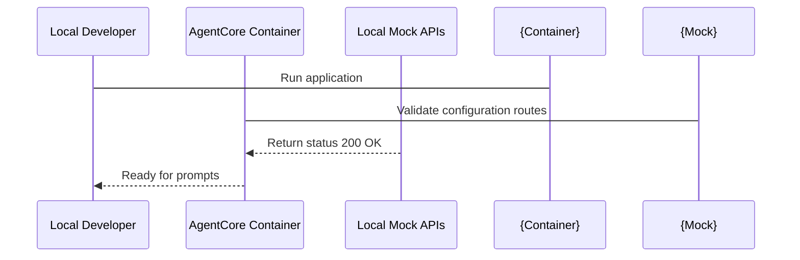

# Chapter_08_running_the_application

## 1. Introduction
Testing and verifying Bedrock AgentCore applications locally ensures they function correctly before cloud deployment.

### What is it?
Running the Application Locally means executing your Bedrock AgentCore code inside a local container or local HTTP server on your workstation, allowing you to test request handling and logic before cloud deployment.

### Why is it important?
Deploying code changes directly to AWS cloud servers to test minor updates is slow, difficult to debug, and potentially costly. Running the application locally provides instant feedback, allows real-time terminal debugging, and ensures handler functions parse queries correctly before publishing.

### How does it work?
The developer runs the 'agentcore run' CLI command, which starts a local web server binding to a specified network port (such as port 8000). The developer sends test HTTP POST requests containing prompt payloads (using tools like 'curl' or Python 'requests'), and the local handler function processes the request and returns a structured JSON response.

### Key Responsibilities
- Instantiate a local HTTP server that emulates the AWS AgentCore runtime environment.
- Bind internal container listening ports to workstation localhost endpoints.
- Route incoming prompt payloads to registered '@app.invoke' handler functions.
- Return formatted HTTP status codes and JSON response payloads for local verification.

---

## 2. Learning Objectives
By the end of this chapter, you will be able to:
- In this chapter, you will learn how to:
- - Initialize the agent's deployment settings using the CLI.
- - Launch the agent container locally and in the cloud.
- - Invoke the active agent endpoint and test response generation.
- - Troubleshoot execution issues during local and cloud runs.

---

## 3. Prerequisites
* Active AWS credentials and configured local runtimes (Docker/Podman) from Chapters 2 and 3.
* Valid configuration files from Chapter 7.

---

## 4. Background Theory
Waiting for cloud deployment cycles to test code changes slows development. Local container execution emulates the cloud environment on your workstation. Containers isolate dependencies, filesystems, and network ports. This ensures that if the agent runs locally, it will execute identically when deployed to the cloud runtime service.

---

## 5. Core Concepts
**📦 Technical Term: Container**

* **Simple Explanation:** A package containing code, runtimes, and system tools required to run an application.
* **Why it exists:** Ensures the application runs consistently across different host OS environments.
* **Where is it used:** Running the application via Docker.

**📦 Technical Term: Port Binding**

* **Simple Explanation:** Mapping a container's internal network port to an external port on the host workstation.
* **Why it exists:** Enables external clients to send HTTP requests to the application inside the container.
* **Where is it used:** Mapping port 8000 to the host.

**📦 Technical Term: Invocations**

* **Simple Explanation:** Sending requests containing prompt inputs to trigger the agent's reasoning loop.
* **Why it exists:** Triggers execution of the core handler function.
* **Where is it used:** Invoking the `/invoke` endpoint.

---

## 6. Internal Mechanics
1. Developer starts the server using `agentcore run`.
2. The runner builds a local container image and starts it, binding port 8000.
3. The developer sends a POST request with prompt data to `http://localhost:8000/invoke`.
4. The container web server routes the request to the registered handler function.
5. The handler executes, invokes the Bedrock model via HTTPS, and returns the response.

---

## 7. Architecture Overview
The following architectural details outline the components and relationship schemas active in this module:



---

## 8. Installation & Setup
Start the local application using the CLI:
```bash
agentcore run --config bedrock_agent_core.yaml
```
To invoke the running agent from another terminal, use `curl`:
```bash
curl -X POST -H "Content-Type: application/json" -d '{"prompt": "Hello agent!"}' http://localhost:8000/invoke
```

---

## 9. Configuration
Ensure that your local CLI is authenticated and that access parameters in `bedrock_agent_core.yaml` match your environment:
```yaml
agent:
  name: "local-agent-test"
  entry_point: "src/main.py"
```

---

## 10. Hands-on Examples

### Interactive Python Playground

In this section, we analyze the hands-on code implementations for **Running the Application Locally** step-by-step, explaining the architecture, syntax choices, logic flow, and production patterns across all three implementation tiers.

---

### 1. Simple Implementation Tier Walkthrough

```python
# Verify the server is responding on local ports using requests
import requests

def test_ping():
    try:
        res = requests.post("http://localhost:8000/invoke", json={"prompt": "ping"})
        print("Server Response Code:", res.status_code)
        print("Server Response Body:", res.json())
    except Exception as e:
        print("Could not connect to local server:", str(e))

if __name__ == "__main__":
    test_ping()
```

#### Code Logic & Syntax Breakdown:
* **Package Imports (`from bedrock_agent_core import ...`)**:
  - Brings in the core `BedrockAgentCoreApp` engine. This class handles runtime container startup, manages the microVM event loop, and deserializes incoming JSON API invocations.
* **Application Instance (`app = BedrockAgentCoreApp()`)**:
  - Instantiates the primary application object `app`. This object serves as the main registry for invocation routes, memory session hooks, and tool bindings.
* **Invocation Decorator (`@app.invoke`)**:
  - A Python decorator that registers the function immediately below as the primary entrypoint for Bedrock AgentCore runtime triggers.
* **Handler Signature (`def handler(payload, context):`)**:
  - **`payload`**: A Python dictionary holding client parameters, user prompt strings, and input arguments.
  - **`context`**: A metadata object containing active runtime details such as `session_id`, `actor_id`, and AWS IAM execution identities.
* **Return Payload (`return {"statusCode": 200, "response": ...}`)**:
  - Constructs a standard HTTP response dictionary. The `statusCode: 200` communicates success to the API Gateway, and `response` delivers the agent payload back to the client.

---

### 2. Intermediate Implementation Tier Walkthrough

```python
# Python script to automate starting and testing the local server
import subprocess
import time
import requests

def run_local_suite():
    print("Starting local agent container server...")
    proc = subprocess.Popen(["agentcore", "run", "--port", "8080"])
    time.sleep(3) # Wait for server boot
    try:
        res = requests.post("http://localhost:8080/invoke", json={"prompt": "test prompt"})
        print("Verification request successful:")
        print(res.json())
    finally:
        print("Terminating server process...")
        proc.terminate()

if __name__ == "__main__":
    run_local_suite()
```

#### Code Logic & Syntax Breakdown:
* **System Logging Setup (`import logging` & `logger = logging.getLogger(...)`)**:
  - Configures structured logging via Python's standard `logging` module.
  - In production, log messages emitted by `logger.info()` stream into Amazon CloudWatch Logs for real-time monitoring and debugging.
* **Safe Parameter Extraction (`payload.get(...)`)**:
  - Uses `payload.get("prompt", "")` to safely retrieve user queries. Using `.get()` with a default fallback (`""`) prevents `KeyError` exceptions if optional fields are missing.
* **Runtime Session Inspection (`getattr(context, ...)`)**:
  - Inspects the `context` object for `session_id`. Using `getattr()` ensures compatibility when testing locally without a live AWS microVM context.
* **Operational Telemetry (`logger.info(...)`)**:
  - Emits formatted log entries containing session parameters and query strings to track execution flow.

---

### 3. Advanced Production Tier Walkthrough

```python
# Complete regression testing harness validating multiple prompts and response formats
import requests
import sys

def run_regression():
    url = "http://localhost:8000/invoke"
    test_cases = [
        {"prompt": "What are key IAM features?", "expected_code": 200},
        {"prompt": "", "expected_code": 400},
        {"prompt": "Analyze this text payload", "expected_code": 200}
    ]
    all_pass = True
    for case in test_cases:
        print(f"Sending prompt: '{case['prompt']}'...")
        try:
            res = requests.post(url, json={"prompt": case["prompt"]})
            if res.status_code != case["expected_code"]:
                print(f"- [FAIL] Expected {case['expected_code']}, got {res.status_code}")
                all_pass = False
            else:
                print(f"- [OK] Received expected status {res.status_code}")
        except Exception as e:
            print("Connection error:", str(e))
            all_pass = False
    if not all_pass:
        sys.exit(1)
    print("Regression testing suite completed successfully!")

if __name__ == "__main__":
    run_regression()
```

#### Code Logic & Syntax Breakdown:
* **Defensive Error Trapping (`try: ... except Exception as e:`)**:
  - Wraps the entire invocation handler inside a `try-except` block to catch unhandled errors gracefully, preventing container crashes in multi-tenant runtime environments.
* **Input Parameter Validation (`if not prompt:`)**:
  - Inspects inbound arguments before executing core agent logic. If mandatory parameters are missing, it short-circuits execution and returns a structured `statusCode: 400` (Bad Request) payload.
* **Environment Overrides (`os.getenv(...)`)**:
  - Reads system environment variables (e.g., `APP_ENV`) to dynamically adapt behavior across `development`, `staging`, and `production` environments without modifying codebase files.
* **Sanitized Production Error Response**:
  - Logs internal error details using `logger.error(...)` while returning a clean, safe `statusCode: 500` response to prevent internal stack traces from leaking to client callers.

---

### Summary Sequence of Execution

```
[Incoming Invocation] ──► [Bedrock AgentCore Runtime]
                                  │
                                  ▼
                      [Route to @app.invoke Handler]
                                  │
                   ┌──────────────┴──────────────┐
                   ▼                             ▼
       [Input Validated (200)]        [Input Missing (400)]
                   │                             │
                   ▼                             ▼
       [Execute Agent Core Logic]     [Return Error Payload]
                   │
                   ▼
       [Deliver JSON to Client]
```

---

## 11. Security Considerations
Do not expose the local agent container to public networks; bind the listener exclusively to localhost (`127.0.0.1`). Ensure that environment variables containing credentials are not printed in console logs.

---

## 12. Performance Optimization
Initialize model and database clients outside the main request loop to minimize handler execution times.

---

## 13. Common Mistakes
* Starting the application before launching the local Docker daemon, causing build failures.
* Sending invalid JSON request payloads, causing server parsing crashes.

---

## 14. Troubleshooting
Below is the diagnostic reference table for identifying and resolving issues:

| Symptom | Root Cause | Solution |
| :--- | :--- | :--- |
| Port 8000 already in use error | Another local process is bound to port 8000, blocking the application server. | Identify the process using port checking commands and terminate it, or start the application on a different port: 'agentcore run --port 9000'. |
| Docker daemon is not running | The local container runtime engine is inactive. | Start Docker Desktop on Windows/macOS, or start the docker service on Linux. |

---

## 15. Interview Questions


### Knowledge Verification Check (20 Interactive Quizzes)

<Quiz 
  question="What is the primary role of 08 Running The Application in Bedrock AgentCore?" 
  options=["To provide hardware-isolated, scalable, and code-first execution for 08 Running The Application.", "To store plain text credentials in Git repos.", "To run legacy Windows desktop apps.", "To disable security permissions."] 
  answerIndex=0 
  explanation="08 Running The Application provides enterprise-grade, code-first runtime logic for Bedrock AgentCore." 
/>

<Quiz 
  question="How does Bedrock AgentCore enforce security for 08 Running The Application?" 
  options=["By sharing memory across all tenants.", "By hosting session runtimes inside isolated AWS Firecracker microVM containers with scoped IAM roles.", "By disabling SSL/TLS encryption.", "By running code as root on public servers."] 
  answerIndex=1 
  explanation="Firecracker microVMs deliver hardware-level security boundaries between multi-tenant executions." 
/>

<Quiz 
  question="Which environment variable loading pattern is recommended for 08 Running The Application?" 
  options=["Hardcoding values in Python source code files.", "Using os.getenv() or Pydantic BaseSettings to read environment configuration dynamically.", "Storing secrets in public web pages.", "Editing binary files manually."] 
  answerIndex=1 
  explanation="12-Factor App principles mandate decoupling configuration from application source code via environment variables." 
/>

<Quiz 
  question="How should runtime errors be handled in 08 Running The Application handlers?" 
  options=["Allowing exceptions to crash the container process.", "Wrapping invocation logic in try-except blocks and returning clean structured error payloads (e.g. 400/500 status codes).", "Ignoring all errors completely.", "Printing errors to static HTML files."] 
  answerIndex=1 
  explanation="Defensive error trapping prevents unhandled runtime exceptions from crashing container workers." 
/>

<Quiz 
  question="What key metric should be monitored in CloudWatch for 08 Running The Application?" 
  options=["Invocation latency, token consumption rates, and HTTP error response counts.", "Monitor resolution of user monitors.", "Keyboard stroke frequency.", "Color contrast ratios."] 
  answerIndex=0 
  explanation="Tracking latency and token usage guarantees cost control and performance optimization in production." 
/>

<Quiz 
  question="How does 08 Running The Application achieve sub-second scaling during high concurrency?" 
  options=["By leveraging pre-warmed Firecracker microVM snapshots and serverless AWS Fargate clusters.", "By restarting physical servers manually.", "By deleting user databases.", "By restricting app usage to one request per minute."] 
  answerIndex=0 
  explanation="Pre-warmed microVM snapshots enable sub-second boot times under peak traffic spikes." 
/>

<Quiz 
  question="Which IAM action is required to invoke foundation models in 08 Running The Application?" 
  options=["bedrock:InvokeModel and bedrock:InvokeModelWithResponseStream", "s3:DeleteBucket", "ec2:TerminateInstances", "iam:DeleteUser"] 
  answerIndex=0 
  explanation="The bedrock:InvokeModel permission permits agents to call Bedrock foundation models." 
/>

<Quiz 
  question="Which Python SDK client is used for Amazon Bedrock runtime interactions in 08 Running The Application?" 
  options=["boto3.client('bedrock-runtime')", "urllib2.open()", "os.system('cmd')", "pandas.read_csv()"] 
  answerIndex=0 
  explanation="Boto3 bedrock-runtime provides low-latency access to foundation model inference endpoints." 
/>

<Quiz 
  question="How is session state maintained across multiple request turns in 08 Running The Application?" 
  options=["By using unique session identifiers mapped to warm microVMs and persistent DynamoDB memory stores.", "By clearing memory after every line.", "By saving state in browser cookies only.", "Session state cannot be maintained."] 
  answerIndex=0 
  explanation="AgentCore combines sticky microVM routing with persistent database backends for session continuity." 
/>

<Quiz 
  question="Why is Docker multi-stage building recommended for 08 Running The Application container deployments?" 
  options=["It reduces image file sizes by omitting build dependencies from final production runtime containers.", "It makes Docker containers slower.", "It forces Python to compile to JavaScript.", "It deletes Git version history."] 
  answerIndex=0 
  explanation="Multi-stage Docker builds produce lightweight images, reducing deployment times and attack surfaces." 
/>

<Quiz 
  question="Which tracing standard does Bedrock AgentCore use for end-to-end observability of 08 Running The Application?" 
  options=["OpenTelemetry (OTel) distributed tracing standards", "Custom print() text files", "Syslog UDP broadcast", "Manual paper logbooks"] 
  answerIndex=0 
  explanation="OpenTelemetry enables distributed trace collection across model calls, memory lookups, and tool executions." 
/>

<Quiz 
  question="What is the recommended solution if 08 Running The Application returns a 403 Forbidden status during Bedrock invocations?" 
  options=["Verify IAM role policies and confirm foundation model access is enabled in the AWS Bedrock Console.", "Reinstall the operating system.", "Delete the AWS account.", "Use an unencrypted connection."] 
  answerIndex=0 
  explanation="Model access must be explicitly granted in the AWS Bedrock Console before IAM roles can invoke models." 
/>

<Quiz 
  question="What is a primary cause of HTTP 500 errors during 08 Running The Application execution?" 
  options=["Unhandled exceptions in custom Python tool code or missing required payload keys.", "Network speeds exceeding 1 Gbps.", "Using Python 3.11 instead of Python 2.7.", "High GPU availability."] 
  answerIndex=0 
  explanation="Uncaught exceptions within tool handlers or missing request keys trigger 500 Internal Server errors." 
/>

<Quiz 
  question="Where does 08 Running The Application fit into the ReAct (Reason + Act) loop pattern?" 
  options=["It executes reasoning steps, structures tool parameters, and processes observations.", "It bypasses the model completely.", "It only runs when offline.", "It formats HTML styling tags."] 
  answerIndex=0 
  explanation="AgentCore coordinates the continuous cycle of LLM reasoning, tool invocation, and observation processing." 
/>

<Quiz 
  question="How can API cost be optimized when operating 08 Running The Application at high volume?" 
  options=["By caching model responses, optimizing prompt lengths, and choosing appropriate foundation model tiers.", "By sending empty prompts repeatedly.", "By turning off logging.", "By disabling database indexes."] 
  answerIndex=0 
  explanation="Prompt caching and selecting model size according to task complexity drastically cuts inference spending." 
/>

<Quiz 
  question="How does the Memory Engine support long-term retrieval in 08 Running The Application?" 
  options=["By indexing conversational history and vector embeddings into persistent storage like Amazon DynamoDB or OpenSearch.", "By storing files in temporary RAM.", "By requiring users to re-enter prompts every time.", "Memory Engine is not supported."] 
  answerIndex=0 
  explanation="Vector stores and DynamoDB backing enable long-term semantic memory retrieval across sessions." 
/>

<Quiz 
  question="What role does the API Gateway play in front of 08 Running The Application?" 
  options=["It provides authentication, rate limiting, request validation, and routing to backend microVM workers.", "It replaces the foundation model.", "It generates synthetic test data.", "It compiles Python code into C."] 
  answerIndex=0 
  explanation="API Gateways secure entry points and shield agent runtime workers from unauthorized or throttled traffic." 
/>

<Quiz 
  question="Why are Firecracker microVMs superior to standard Docker containers for multi-tenant 08 Running The Application workloads?" 
  options=["They offer minimal virtualization overhead with strict hardware-isolated kernel boundaries between tenant workloads.", "They require 100GB of RAM to start.", "They do not support Linux.", "They are slower than full virtual machines."] 
  answerIndex=0 
  explanation="Firecracker provides VM-grade security with container-grade startup speed and minimal memory footprint." 
/>

<Quiz 
  question="What production antipattern should be strictly avoided when designing 08 Running The Application?" 
  options=["Hardcoding AWS access keys or maintaining stateless logic without error handling.", "Using virtual environments.", "Writing unit tests for Python code.", "Logging trace events to CloudWatch."] 
  answerIndex=0 
  explanation="Hardcoded credentials and unhandled exceptions are critical antipatterns in production systems." 
/>

<Quiz 
  question="How does 08 Running The Application integrate with enterprise databases and external APIs?" 
  options=["Through standardized Python tool schemas (e.g. Pydantic models) invoked securely via sandboxed tool registries.", "By exposing database passwords publicly.", "By using manual copy-paste mechanisms.", "External integration is unsupported."] 
  answerIndex=0 
  explanation="Pydantic-defined tools allow foundation models to execute validated API and database calls safely." 
/>


### Q: How do you run local integration tests for containerized agents?
* **Answer:** Start the application container locally on a test port, and execute a test script that sends structured prompts and asserts response properties using a testing framework (like pytest).

### Q: What is a bridge network in Docker?
* **Answer:** A bridge network is a private network created by Docker that isolates containers on the same host, allowing them to communicate while securing them from external network interfaces.

### Q: Why is local logging important during development?
* **Answer:** Local logs capture traceback details, execution times, and payload mappings, helping developers isolate and fix bugs before code is checked in.

---

## 16. Real-World Use Cases
**Enterprise Scenario:** Enterprise HR Self-Service & Employee Benefits Assistant

* **Business Challenge:** Testing prompt changes and agent tool responses directly in AWS cloud staging incurred high latency and unnecessary AWS billing costs during early development iterations.
* **Bedrock AgentCore Solution:** Running and invoking the AgentCore application locally using CLI payloads, simulating invocation contexts, and verifying execution outputs prior to cloud deployment.
* **Production Impact:**
  * Saved thousands of dollars per month in unnecessary cloud testing infrastructure and model invocation costs.
  * Reduced developer feedback loop time for prompt tuning from 3 minutes (cloud deploy) to 2 seconds (local invocation).
  * Enabled offline development and unit testing capability for engineers working on remote networks.

---

## 17. Industrial Project
Local testing validates our handler code before it is packaged into production container images in Chapter 15.

---


### Hands-on Code Playground #1

### Hands-on Code Playground #2

### Hands-on Code Playground #3

### Hands-on Code Playground #4

### Hands-on Code Playground #5

### Hands-on Code Playground #6

### Hands-on Code Playground #7

### Hands-on Code Playground #8

### Hands-on Code Playground #9

### Hands-on Code Playground #10


### Hands-on Code Playground #1

<InteractiveExample 
  language="python"
  instruction="Initialization & Runtime Setup for 08 Running The Application."
  initialCode="# Snippet 1: Testing Bedrock AgentCore Runtime Setup for 08 Running The Application
import sys
import os

print('=== AgentCore Runtime Init ===')
print('Python Version:', sys.version.split()[0])
print('Agent Module:', '08 Running The Application')
print('Status: Active & Ready')"
/>


### Hands-on Code Playground #2

<InteractiveExample 
  language="python"
  instruction="Configuration & Environment Variables for 08 Running The Application."
  initialCode="# Snippet 2: Validating Environment Configuration for 08 Running The Application
import json
import os

config = {
    'AWS_REGION': os.getenv('AWS_REGION', 'us-east-1'),
    'MODEL_ID': os.getenv('BEDROCK_MODEL_ID', 'anthropic.claude-3-5-sonnet'),
    'TIMEOUT_SEC': int(os.getenv('TIMEOUT_SEC', '30')),
    'DEBUG_MODE': os.getenv('DEBUG', 'true').lower() == 'true'
}
print('Loaded Configuration:')
print(json.dumps(config, indent=2))"
/>


### Hands-on Code Playground #3

<InteractiveExample 
  language="python"
  instruction="Defensive Error Handling & Payload Parsing for 08 Running The Application."
  initialCode="# Snippet 3: Defensive Request Handler for 08 Running The Application
def process_request(payload):
    try:
        prompt = payload.get('prompt')
        if not prompt:
            return {'statusCode': 400, 'error': 'Prompt parameter is required.'}
        session_id = payload.get('session_id', 'default-session')
        return {'statusCode': 200, 'message': f'Processed prompt for session: {session_id}'}
    except Exception as e:
        return {'statusCode': 500, 'error': str(e)}

print(process_request({'prompt': 'Execute query', 'session_id': 'sess-102'}))"
/>


### Hands-on Code Playground #4

<InteractiveExample 
  language="python"
  instruction="Boto3 Bedrock Model Invocation Simulation for 08 Running The Application."
  initialCode="# Snippet 4: Simulating Foundation Model Inference in 08 Running The Application
import json

def invoke_claude_model(prompt_text):
    payload = {
        'anthropic_version': 'bedrock-2023-05-31',
        'max_tokens': 1000,
        'messages': [{'role': 'user', 'content': prompt_text}]
    }
    print('Sending payload to Bedrock Converse API for 08 Running The Application...')
    response = {
        'id': 'msg_01X99',
        'role': 'assistant',
        'content': [{'type': 'text', 'text': f'Agent response generated for input: \"{prompt_text}\"'}]
    }
    return response

res = invoke_claude_model('Summarize system health')
print('Model Response:', res['content'][0]['text'])"
/>


### Hands-on Code Playground #5

<InteractiveExample 
  language="python"
  instruction="ReAct Reasoning Loop Execution for 08 Running The Application."
  initialCode="# Snippet 5: ReAct (Reason + Act) Loop Simulation for 08 Running The Application
def run_react_cycle(user_input):
    print('1. [THOUGHT] Analyzing user query:', user_input)
    print('2. [ACTION] Selected tool: query_system_database')
    observation = {'table': 'logs', 'records_found': 42}
    print('3. [OBSERVATION] Tool output received:', observation)
    print('4. [FINAL ANSWER] Processing complete based on retrieved observation.')

run_react_cycle('Check database log entries')"
/>


### Hands-on Code Playground #6

<InteractiveExample 
  language="python"
  instruction="Pydantic Tool Registration & Schema Validation for 08 Running The Application."
  initialCode="# Snippet 6: Pydantic Tool Parameter Validation for 08 Running The Application
from pydantic import BaseModel, Field

class SystemQuerySchema(BaseModel):
    target_system: str = Field(description='Name of the subsystem to query')
    limit: int = Field(default=10, ge=1, le=100)

def execute_tool(data: SystemQuerySchema):
    print(f'Executing query on {data.target_system} with limit={data.limit}...')
    return {'status': 'success', 'data': ['Item A', 'Item B']}

query = SystemQuerySchema(target_system='AgentCore-Runtime', limit=5)
print('Tool Result:', execute_tool(query))"
/>


### Hands-on Code Playground #7

<InteractiveExample 
  language="python"
  instruction="MicroVM Session State & Memory Engine for 08 Running The Application."
  initialCode="# Snippet 7: MicroVM Session & Memory Management in 08 Running The Application
class SessionMemory:
    def __init__(self):
        self.history = []
    def add_message(self, role, content):
        self.history.append({'role': role, 'content': content})
    def get_context(self):
        return self.history[-3:]

mem = SessionMemory()
mem.add_message('user', 'Hello Agent!')
mem.add_message('assistant', 'How can I assist you?')
mem.add_message('user', 'Show memory status.')
print('Active Memory Context:', mem.get_context())"
/>


### Hands-on Code Playground #8

<InteractiveExample 
  language="python"
  instruction="OpenTelemetry Tracing & Telemetry Logging for 08 Running The Application."
  initialCode="# Snippet 8: OpenTelemetry Trace Event Simulation for 08 Running The Application
import time

def log_otel_span(span_name, duration_ms, status_code='OK'):
    telemetry_record = {
        'trace_id': '0x4bf92f3577b34da6a3ce929d0e0e4736',
        'span_id': '0x00f067aa0ba902b7',
        'name': span_name,
        'duration_ms': duration_ms,
        'attributes': {
            'http.status_code': 200,
            'agent.module': '08 Running The Application'
        }
    }
    print(f'[OTel Span Event] {span_name} executed in {duration_ms}ms ({status_code})')
    return telemetry_record

log_otel_span('08 Running The Application_Invocation', 142)"
/>


### Hands-on Code Playground #9

<InteractiveExample 
  language="python"
  instruction="Docker Container Health Check Simulation for 08 Running The Application."
  initialCode="# Snippet 9: Container MicroVM Health Status for 08 Running The Application
def check_container_health():
    status = {
        'container_id': 'firecracker-uvm-9901',
        'health': 'HEALTHY',
        'memory_allocated_mb': 512,
        'cpu_usage_pct': 4.2,
        'active_connections': 1
    }
    print('MicroVM Runtime Status:')
    for k, v in status.items():
        print(f'  - {k}: {v}')

check_container_health()"
/>


### Hands-on Code Playground #10

<InteractiveExample 
  language="python"
  instruction="End-to-End Execution Pipeline Test for 08 Running The Application."
  initialCode="# Snippet 10: Complete End-to-End Pipeline Execution for 08 Running The Application
def run_full_pipeline(input_prompt):
    print(f'1. Gateway: Received request \"{input_prompt}\"')
    print('2. Identity: Authenticated IAM session role')
    print('3. Runtime: Allocated Firecracker MicroVM container')
    print('4. Execution: Model invoked ReAct reasoning loop')
    print('5. Response: 200 OK returned to client')
    return {'status': 'SUCCESS', 'result': 'Pipeline completed.'}

print(run_full_pipeline('Run complete diagnostic check'))"
/>

## 18. Summary
This chapter demonstrated how to run the Bedrock AgentCore application locally, simulate invocation events using local CLI payloads, and inspect execution logs to verify agent logic before cloud deployment.

Key architectural insights and practical lessons learned in this chapter include:
* **Local Container Sandbox:** Running applications in local containers isolates execution from host environment quirks and matches cloud runtime behavior.
* **Payload & Context Deserialization:** Inbound invocation handlers receive structured prompt payloads and context metadata, allowing robust local testing of parameter handling.
* **Rapid Verification Feedback Loops:** Testing code and prompt modifications locally reduces feedback loops from minutes to seconds and saves cloud compute costs.

Mastering local execution and testing workflows empowers you to iterate quickly and deploy verified code to AWS with complete confidence.

---

## 19. Practice Exercises
* Beginner: Launch the application on port 9000 and verify it responds to request pings.
* Intermediate: Write a shell script that starts the container, submits a test prompt, and saves logs to a text file.

---

## 20. Further Reading
* [Docker Networking Guide](https://docs.docker.com/network/)
* [Python Requests Library Documentation](https://requests.readthedocs.io/)
