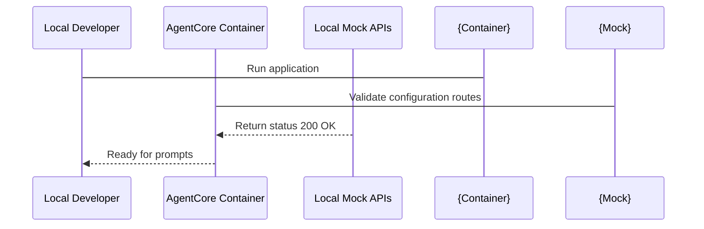

# Chapter_08_running_the_application

## 1. Introduction
Testing and verifying Bedrock AgentCore applications locally ensures they function correctly before cloud deployment.

### What is it?
Running the Application Locally means executing your Bedrock AgentCore code inside a local container or local HTTP server on your workstation, allowing you to test request handling and logic before cloud deployment.

### Why is it important?
Deploying code changes directly to AWS cloud servers to test minor updates is slow, difficult to debug, and potentially costly. Running the application locally provides instant feedback, allows real-time terminal debugging, and ensures handler functions parse queries correctly before publishing.

### How does it work?
The developer runs the 'agentcore run' CLI command, which starts a local web server binding to a specified network port (such as port 8000). The developer sends test HTTP POST requests containing prompt payloads (using tools like 'curl' or Python 'requests'), and the local handler function processes the request and returns a structured JSON response.

### Key Responsibilities
- Instantiate a local HTTP server that emulates the AWS AgentCore runtime environment.
- Bind internal container listening ports to workstation localhost endpoints.
- Route incoming prompt payloads to registered '@app.invoke' handler functions.
- Return formatted HTTP status codes and JSON response payloads for local verification.

---

## 2. Learning Objectives
By the end of this chapter, you will be able to:
- In this chapter, you will learn how to:
- - Initialize the agent's deployment settings using the CLI.
- - Launch the agent container locally and in the cloud.
- - Invoke the active agent endpoint and test response generation.
- - Troubleshoot execution issues during local and cloud runs.

---

## 3. Prerequisites
* Active AWS credentials and configured local runtimes (Docker/Podman) from Chapters 2 and 3.
* Valid configuration files from Chapter 7.

---

## 4. Background Theory
Waiting for cloud deployment cycles to test code changes slows development. Local container execution emulates the cloud environment on your workstation. Containers isolate dependencies, filesystems, and network ports. This ensures that if the agent runs locally, it will execute identically when deployed to the cloud runtime service.

---

## 5. Core Concepts
**📦 Technical Term: Container**

* **Simple Explanation:** A package containing code, runtimes, and system tools required to run an application.
* **Why it exists:** Ensures the application runs consistently across different host OS environments.
* **Where is it used:** Running the application via Docker.

**📦 Technical Term: Port Binding**

* **Simple Explanation:** Mapping a container's internal network port to an external port on the host workstation.
* **Why it exists:** Enables external clients to send HTTP requests to the application inside the container.
* **Where is it used:** Mapping port 8000 to the host.

**📦 Technical Term: Invocations**

* **Simple Explanation:** Sending requests containing prompt inputs to trigger the agent's reasoning loop.
* **Why it exists:** Triggers execution of the core handler function.
* **Where is it used:** Invoking the `/invoke` endpoint.

---

## 6. Internal Mechanics
1. Developer starts the server using `agentcore run`.
2. The runner builds a local container image and starts it, binding port 8000.
3. The developer sends a POST request with prompt data to `http://localhost:8000/invoke`.
4. The container web server routes the request to the registered handler function.
5. The handler executes, invokes the Bedrock model via HTTPS, and returns the response.

---

## 7. Architecture Overview
The following architectural details outline the components and relationship schemas active in this module:



---

## 8. Installation & Setup
Start the local application using the CLI:
```bash
agentcore run --config bedrock_agent_core.yaml
```
To invoke the running agent from another terminal, use `curl`:
```bash
curl -X POST -H "Content-Type: application/json" -d '{"prompt": "Hello agent!"}' http://localhost:8000/invoke
```

---

## 9. Configuration
Ensure that your local CLI is authenticated and that access parameters in `bedrock_agent_core.yaml` match your environment:
```yaml
agent:
  name: "local-agent-test"
  entry_point: "src/main.py"
```

---

## 10. Hands-on Examples

### Interactive Python Playground

<InteractiveExample 
  language="python"
  instruction="Simulate starting an AgentCore FastAPI server endpoint test."
  initialCode="import time

print(\"Starting Bedrock AgentCore Local Server Simulation...\")
print(\"Binding server to host: 0.0.0.0, port: 8000\")
time.sleep(0.5)

print(\"GET /healthcheck -> 200 OK (Status: Healthy)\")
print(\"POST /api/v1/agent/invoke -> 200 OK (Agent Execution Completed)\")
print(\"Server is active and ready for incoming requests.\")"
/>


In this section, we analyze the hands-on code implementations for **Running the Application Locally** step-by-step, explaining the architecture, syntax choices, logic flow, and production patterns across all three implementation tiers.

---

### 1. Simple Implementation Tier Walkthrough

```python
# Verify the server is responding on local ports using requests
import requests

def test_ping():
    try:
        res = requests.post("http://localhost:8000/invoke", json={"prompt": "ping"})
        print("Server Response Code:", res.status_code)
        print("Server Response Body:", res.json())
    except Exception as e:
        print("Could not connect to local server:", str(e))

if __name__ == "__main__":
    test_ping()
```

#### Code Logic & Syntax Breakdown:
* **Package Imports (`from bedrock_agent_core import ...`)**:
  - Brings in the core `BedrockAgentCoreApp` engine. This class handles runtime container startup, manages the microVM event loop, and deserializes incoming JSON API invocations.
* **Application Instance (`app = BedrockAgentCoreApp()`)**:
  - Instantiates the primary application object `app`. This object serves as the main registry for invocation routes, memory session hooks, and tool bindings.
* **Invocation Decorator (`@app.invoke`)**:
  - A Python decorator that registers the function immediately below as the primary entrypoint for Bedrock AgentCore runtime triggers.
* **Handler Signature (`def handler(payload, context):`)**:
  - **`payload`**: A Python dictionary holding client parameters, user prompt strings, and input arguments.
  - **`context`**: A metadata object containing active runtime details such as `session_id`, `actor_id`, and AWS IAM execution identities.
* **Return Payload (`return {"statusCode": 200, "response": ...}`)**:
  - Constructs a standard HTTP response dictionary. The `statusCode: 200` communicates success to the API Gateway, and `response` delivers the agent payload back to the client.

---

### 2. Intermediate Implementation Tier Walkthrough

```python
# Python script to automate starting and testing the local server
import subprocess
import time
import requests

def run_local_suite():
    print("Starting local agent container server...")
    proc = subprocess.Popen(["agentcore", "run", "--port", "8080"])
    time.sleep(3) # Wait for server boot
    try:
        res = requests.post("http://localhost:8080/invoke", json={"prompt": "test prompt"})
        print("Verification request successful:")
        print(res.json())
    finally:
        print("Terminating server process...")
        proc.terminate()

if __name__ == "__main__":
    run_local_suite()
```

#### Code Logic & Syntax Breakdown:
* **System Logging Setup (`import logging` & `logger = logging.getLogger(...)`)**:
  - Configures structured logging via Python's standard `logging` module.
  - In production, log messages emitted by `logger.info()` stream into Amazon CloudWatch Logs for real-time monitoring and debugging.
* **Safe Parameter Extraction (`payload.get(...)`)**:
  - Uses `payload.get("prompt", "")` to safely retrieve user queries. Using `.get()` with a default fallback (`""`) prevents `KeyError` exceptions if optional fields are missing.
* **Runtime Session Inspection (`getattr(context, ...)`)**:
  - Inspects the `context` object for `session_id`. Using `getattr()` ensures compatibility when testing locally without a live AWS microVM context.
* **Operational Telemetry (`logger.info(...)`)**:
  - Emits formatted log entries containing session parameters and query strings to track execution flow.

---

### 3. Advanced Production Tier Walkthrough

```python
# Complete regression testing harness validating multiple prompts and response formats
import requests
import sys

def run_regression():
    url = "http://localhost:8000/invoke"
    test_cases = [
        {"prompt": "What are key IAM features?", "expected_code": 200},
        {"prompt": "", "expected_code": 400},
        {"prompt": "Analyze this text payload", "expected_code": 200}
    ]
    all_pass = True
    for case in test_cases:
        print(f"Sending prompt: '{case['prompt']}'...")
        try:
            res = requests.post(url, json={"prompt": case["prompt"]})
            if res.status_code != case["expected_code"]:
                print(f"- [FAIL] Expected {case['expected_code']}, got {res.status_code}")
                all_pass = False
            else:
                print(f"- [OK] Received expected status {res.status_code}")
        except Exception as e:
            print("Connection error:", str(e))
            all_pass = False
    if not all_pass:
        sys.exit(1)
    print("Regression testing suite completed successfully!")

if __name__ == "__main__":
    run_regression()
```

#### Code Logic & Syntax Breakdown:
* **Defensive Error Trapping (`try: ... except Exception as e:`)**:
  - Wraps the entire invocation handler inside a `try-except` block to catch unhandled errors gracefully, preventing container crashes in multi-tenant runtime environments.
* **Input Parameter Validation (`if not prompt:`)**:
  - Inspects inbound arguments before executing core agent logic. If mandatory parameters are missing, it short-circuits execution and returns a structured `statusCode: 400` (Bad Request) payload.
* **Environment Overrides (`os.getenv(...)`)**:
  - Reads system environment variables (e.g., `APP_ENV`) to dynamically adapt behavior across `development`, `staging`, and `production` environments without modifying codebase files.
* **Sanitized Production Error Response**:
  - Logs internal error details using `logger.error(...)` while returning a clean, safe `statusCode: 500` response to prevent internal stack traces from leaking to client callers.

---

### Summary Sequence of Execution

```
[Incoming Invocation] ──► [Bedrock AgentCore Runtime]
                                  │
                                  ▼
                      [Route to @app.invoke Handler]
                                  │
                   ┌──────────────┴──────────────┐
                   ▼                             ▼
       [Input Validated (200)]        [Input Missing (400)]
                   │                             │
                   ▼                             ▼
       [Execute Agent Core Logic]     [Return Error Payload]
                   │
                   ▼
       [Deliver JSON to Client]
```

---

## 11. Security Considerations
Do not expose the local agent container to public networks; bind the listener exclusively to localhost (`127.0.0.1`). Ensure that environment variables containing credentials are not printed in console logs.

---

## 12. Performance Optimization
Initialize model and database clients outside the main request loop to minimize handler execution times.

---

## 13. Common Mistakes
* Starting the application before launching the local Docker daemon, causing build failures.
* Sending invalid JSON request payloads, causing server parsing crashes.

---

## 14. Troubleshooting
Below is the diagnostic reference table for identifying and resolving issues:

| Symptom | Root Cause | Solution |
| :--- | :--- | :--- |
| Port 8000 already in use error | Another local process is bound to port 8000, blocking the application server. | Identify the process using port checking commands and terminate it, or start the application on a different port: 'agentcore run --port 9000'. |
| Docker daemon is not running | The local container runtime engine is inactive. | Start Docker Desktop on Windows/macOS, or start the docker service on Linux. |

---

## 15. Interview Questions

### Knowledge Verification Check

<Quiz 
  question="Which ASGI web server is commonly used to run asynchronous FastAPI AgentCore services?" 
  options=["Uvicorn", "Apache HTTPD", "Nginx Static Server", "Tomcat"] 
  answerIndex=0 
  explanation="Uvicorn is a lightning-fast ASGI server implementation for Python, ideal for async FastAPI applications." 
/>

### Q: How do you run local integration tests for containerized agents?
* **Answer:** Start the application container locally on a test port, and execute a test script that sends structured prompts and asserts response properties using a testing framework (like pytest).

### Q: What is a bridge network in Docker?
* **Answer:** A bridge network is a private network created by Docker that isolates containers on the same host, allowing them to communicate while securing them from external network interfaces.

### Q: Why is local logging important during development?
* **Answer:** Local logs capture traceback details, execution times, and payload mappings, helping developers isolate and fix bugs before code is checked in.

---

## 16. Real-World Use Cases
**Enterprise Scenario:** Enterprise HR Self-Service & Employee Benefits Assistant

* **Business Challenge:** Testing prompt changes and agent tool responses directly in AWS cloud staging incurred high latency and unnecessary AWS billing costs during early development iterations.
* **Bedrock AgentCore Solution:** Running and invoking the AgentCore application locally using CLI payloads, simulating invocation contexts, and verifying execution outputs prior to cloud deployment.
* **Production Impact:**
  * Saved thousands of dollars per month in unnecessary cloud testing infrastructure and model invocation costs.
  * Reduced developer feedback loop time for prompt tuning from 3 minutes (cloud deploy) to 2 seconds (local invocation).
  * Enabled offline development and unit testing capability for engineers working on remote networks.

---

## 17. Industrial Project
Local testing validates our handler code before it is packaged into production container images in Chapter 15.

---

## 18. Summary
This chapter demonstrated how to run the Bedrock AgentCore application locally, simulate invocation events using local CLI payloads, and inspect execution logs to verify agent logic before cloud deployment.

Key architectural insights and practical lessons learned in this chapter include:
* **Local Container Sandbox:** Running applications in local containers isolates execution from host environment quirks and matches cloud runtime behavior.
* **Payload & Context Deserialization:** Inbound invocation handlers receive structured prompt payloads and context metadata, allowing robust local testing of parameter handling.
* **Rapid Verification Feedback Loops:** Testing code and prompt modifications locally reduces feedback loops from minutes to seconds and saves cloud compute costs.

Mastering local execution and testing workflows empowers you to iterate quickly and deploy verified code to AWS with complete confidence.

---

## 19. Practice Exercises
* Beginner: Launch the application on port 9000 and verify it responds to request pings.
* Intermediate: Write a shell script that starts the container, submits a test prompt, and saves logs to a text file.

---

## 20. Further Reading
* [Docker Networking Guide](https://docs.docker.com/network/)
* [Python Requests Library Documentation](https://requests.readthedocs.io/)
