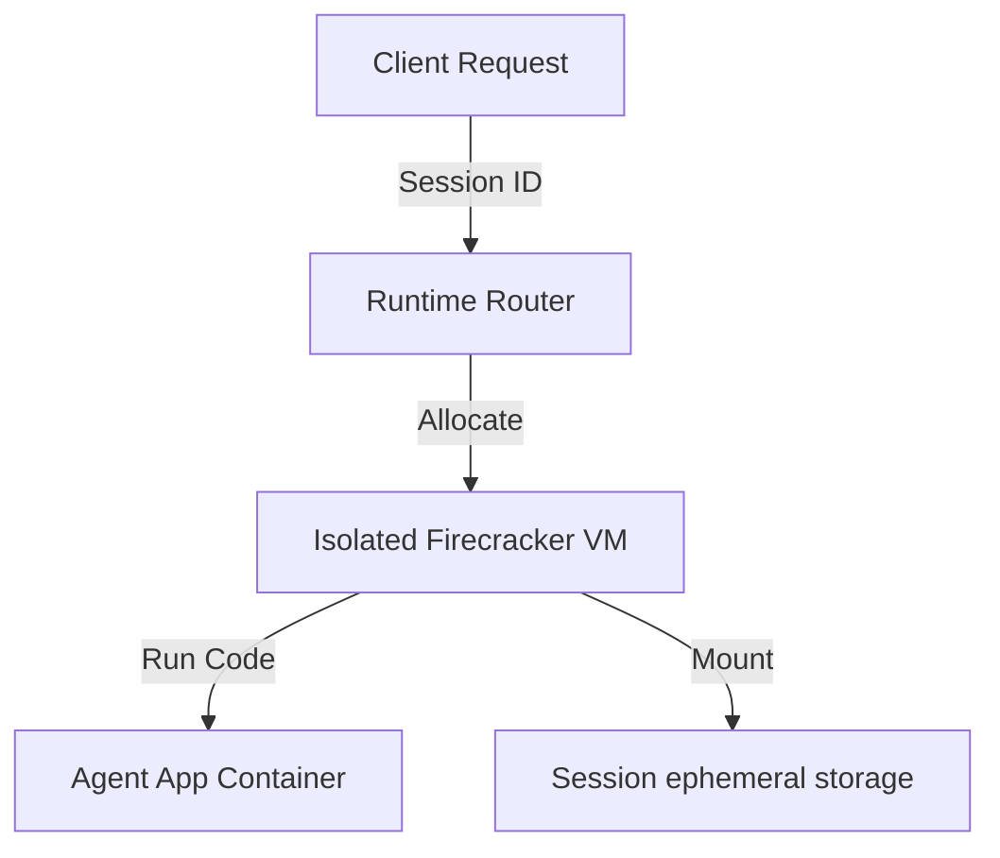

# Chapter_10_agentcore_runtime

## 1. Introduction
The AgentCore runtime hosts agent containers inside secure, isolated virtual machine environments.

### What is it?
The AgentCore Runtime is the AWS-managed hosting infrastructure that executes agent applications inside lightweight, securely isolated virtual machine environments called AWS Firecracker microVMs.

### Why is it important?
Traditional multi-tenant cloud environments share operating system kernels between users, risking cross-tenant data leaks and resource starvation. The AgentCore Runtime provides hypervisor-level security isolation for every user session while maintaining sub-second cold-start execution times and low operational costs.

### How does it work?
When a user query arrives with a unique session ID, the AgentCore Runtime checks if an active microVM exists for that session. If active (warm start), the query routes directly to the running container. If inactive (cold start), Firecracker boots a new microVM instance in seconds, pulls the ECR container image, mounts ephemeral storage, and handles the request.

### Key Responsibilities
- Provision and manage isolated AWS Firecracker microVM instances for user agent sessions.
- Enforce hardware resource limits on CPU usage, RAM allocation, and ephemeral disk space.
- Manage session lifecycles, routing warm requests quickly and terminating idle instances.
- Guarantee multi-tenant data isolation by maintaining dedicated operating system kernels per session.

---

## 2. Learning Objectives
By the end of this chapter, you will be able to:
- In this chapter, you will learn:
- - How AWS Firecracker microVMs provide secure, hardware-isolated runtimes.
- - The difference between container execution and microVM isolation.
- - How AgentCore routes requests to active (warm) and new (cold) sessions.
- - The default execution bounds, timeouts, and limits.

---

## 3. Prerequisites
* Setup of configuration files and local container runtimes from Chapters 7 and 8.
* A basic understanding of virtualization concepts (VMs vs containers).

---

## 4. Background Theory
Deploying agents to the cloud requires secure execution environments. Traditional shared container runtimes share a single operating system kernel, risking cross-tenant data leaks. AWS designed Firecracker to combine the security isolation of traditional virtual machines with the speed and efficiency of containers. The AgentCore runtime spawns a dedicated Firecracker microVM for each user session, enforcing resource limits and security boundaries.

---

## 5. Core Concepts
**📦 Technical Term: Firecracker**

* **Simple Explanation:** An open-source virtualization technology designed to spawn secure, multitenant microVMs.
* **Why it exists:** Combines the security isolation of traditional VMs with container speed.
* **Where is it used:** The underlying hypervisor for AWS Lambda and Fargate.

**📦 Technical Term: Cold Start**

* **Simple Explanation:** The process of pulling container images and booting a new microVM for a session.
* **Why it exists:** The initial boot latency when a session starts.
* **Where is it used:** The initial request boot cycle.

**📦 Technical Term: Warm Start**

* **Simple Explanation:** Routing subsequent requests using the same session ID to an active microVM.
* **Why it exists:** Bypasses the boot cycle for low-latency responses.
* **Where is it used:** Subsequent requests within active session windows.

---

## 6. Internal Mechanics
1. Client sends an invocation request containing a unique `session_id`.
2. The runtime checks if an active microVM is allocated to that session.
3. If missing (Cold Start), it pulls the ECR container image and boots a new Firecracker microVM.
4. If active (Warm Start), it routes the request directly to the running container.
5. The microVM executes the request and remains active until the inactivity timeout or max session duration (8 hours) is reached.

---

## 7. Architecture Overview
The following architectural details outline the components and relationship schemas active in this module:



---

## 8. Installation & Setup
Inspect active session microVM status using the CLI:
```bash
agentcore runtime status
```

---

## 9. Configuration
Configure runtime limits and session timeouts in `bedrock_agent_core.yaml`:
```yaml
runtime:
  timeout_seconds: 3600
  memory_mb: 2048
  storage_gb: 10
```

---

## 10. Hands-on Examples

### Interactive Python Playground

In this section, we analyze the hands-on code implementations for **AgentCore Runtime** step-by-step, explaining the architecture, syntax choices, logic flow, and production patterns across all three implementation tiers.

---

### 1. Simple Implementation Tier Walkthrough

```python
# Verify session details in execution context
def check_runtime_context(context):
    session_id = getattr(context, "session_id", "local-session")
    print("Running inside session VM:", session_id)
    return session_id
```

#### Code Logic & Syntax Breakdown:
* **Package Imports (`from bedrock_agent_core import ...`)**:
  - Brings in the core `BedrockAgentCoreApp` engine. This class handles runtime container startup, manages the microVM event loop, and deserializes incoming JSON API invocations.
* **Application Instance (`app = BedrockAgentCoreApp()`)**:
  - Instantiates the primary application object `app`. This object serves as the main registry for invocation routes, memory session hooks, and tool bindings.
* **Invocation Decorator (`@app.invoke`)**:
  - A Python decorator that registers the function immediately below as the primary entrypoint for Bedrock AgentCore runtime triggers.
* **Handler Signature (`def handler(payload, context):`)**:
  - **`payload`**: A Python dictionary holding client parameters, user prompt strings, and input arguments.
  - **`context`**: A metadata object containing active runtime details such as `session_id`, `actor_id`, and AWS IAM execution identities.
* **Return Payload (`return {"statusCode": 200, "response": ...}`)**:
  - Constructs a standard HTTP response dictionary. The `statusCode: 200` communicates success to the API Gateway, and `response` delivers the agent payload back to the client.

---

### 2. Intermediate Implementation Tier Walkthrough

```python
# Python script to verify local file isolation under /tmp
import os

def check_file_isolation():
    path = "/tmp/session_data.txt"
    if os.path.exists(path):
        with open(path, "r") as f:
            print("Read session data:", f.read())
    else:
        print("No session data found. Writing default...")
        with open(path, "w") as f:
            f.write("Session Active")

if __name__ == "__main__":
    check_file_isolation()
```

#### Code Logic & Syntax Breakdown:
* **System Logging Setup (`import logging` & `logger = logging.getLogger(...)`)**:
  - Configures structured logging via Python's standard `logging` module.
  - In production, log messages emitted by `logger.info()` stream into Amazon CloudWatch Logs for real-time monitoring and debugging.
* **Safe Parameter Extraction (`payload.get(...)`)**:
  - Uses `payload.get("prompt", "")` to safely retrieve user queries. Using `.get()` with a default fallback (`""`) prevents `KeyError` exceptions if optional fields are missing.
* **Runtime Session Inspection (`getattr(context, ...)`)**:
  - Inspects the `context` object for `session_id`. Using `getattr()` ensures compatibility when testing locally without a live AWS microVM context.
* **Operational Telemetry (`logger.info(...)`)**:
  - Emits formatted log entries containing session parameters and query strings to track execution flow.

---

### 3. Advanced Production Tier Walkthrough

```python
# Complete script validating memory limits and executing timeout handlers
import time
import signal
import sys

def timeout_handler(signum, frame):
    print("[TIMEOUT] Execution time limit exceeded. Terminating task.")
    sys.exit(1)

def execute_with_bounds(duration):
    # Register signal handler for execution timeouts
    signal.signal(signal.SIGALRM, timeout_handler)
    signal.alarm(5) # Set timeout limit to 5 seconds
    try:
        print(f"Executing process for {duration} seconds...")
        time.sleep(duration)
        signal.alarm(0) # Disable alarm on success
        print("[SUCCESS] Task completed within limits.")
    except Exception as e:
        print("Execution error:", str(e))

if __name__ == "__main__":
    execute_with_bounds(3) # Succeeds
    execute_with_bounds(10) # Triggers timeout
```

#### Code Logic & Syntax Breakdown:
* **Defensive Error Trapping (`try: ... except Exception as e:`)**:
  - Wraps the entire invocation handler inside a `try-except` block to catch unhandled errors gracefully, preventing container crashes in multi-tenant runtime environments.
* **Input Parameter Validation (`if not prompt:`)**:
  - Inspects inbound arguments before executing core agent logic. If mandatory parameters are missing, it short-circuits execution and returns a structured `statusCode: 400` (Bad Request) payload.
* **Environment Overrides (`os.getenv(...)`)**:
  - Reads system environment variables (e.g., `APP_ENV`) to dynamically adapt behavior across `development`, `staging`, and `production` environments without modifying codebase files.
* **Sanitized Production Error Response**:
  - Logs internal error details using `logger.error(...)` while returning a clean, safe `statusCode: 500` response to prevent internal stack traces from leaking to client callers.

---

### Summary Sequence of Execution

```
[Incoming Invocation] ──► [Bedrock AgentCore Runtime]
                                  │
                                  ▼
                      [Route to @app.invoke Handler]
                                  │
                   ┌──────────────┴──────────────┐
                   ▼                             ▼
       [Input Validated (200)]        [Input Missing (400)]
                   │                             │
                   ▼                             ▼
       [Execute Agent Core Logic]     [Return Error Payload]
                   │
                   ▼
       [Deliver JSON to Client]
```

---

## 11. Security Considerations
Enforce strict resource allocations for RAM and CPU. Ensure that containers run as non-root users inside microVMs to prevent privilege escalation attacks.

---

## 12. Performance Optimization
Leverage warm starts for sequential requests to bypass boot latency and ensure fast response times.

---

## 13. Common Mistakes
* Expecting files written to `/tmp` to persist across sessions (sessions terminate after timeouts, destroying ephemeral storage).
* Overallocating RAM in configurations, leading to high resource reservation fees.

---

## 14. Troubleshooting
Below is the diagnostic reference table for identifying and resolving issues:

| Symptom | Root Cause | Solution |
| :--- | :--- | :--- |
| 504 Gateway Timeout error | The execution exceeded the configured timeout_seconds threshold. | Increase timeout limits in configuration or refactor logic to use streaming responses. |
| OutOfMemory error during execution | The application exceeded allocated microVM RAM limits. | Optimize memory usage patterns or increase memory_mb configurations. |

### Additional Reference Tables


| Limit Parameter | Default Value | Description |
| :--- | :--- | :--- |
| **Max Payload Size** | 100 MB | The maximum size of incoming request payloads, allowing for large files or attachments. |
| **Synchronous Timeout** | 15 Minutes | The execution timeout for a single, blocking request before returning a gateway error. |
| **Streaming Timeout** | 60 Minutes | The execution limit for streaming responses (e.g., long research loops). |
| **Max Session Duration** | 8 Hours | The maximum lifespan of a single microVM session. |


---

## 15. Interview Questions


### Knowledge Verification Check (20 Interactive Quizzes)

<Quiz 
  question="What is the primary role of 10 Agentcore Runtime in Bedrock AgentCore?" 
  options=["To provide hardware-isolated, scalable, and code-first execution for 10 Agentcore Runtime.", "To store plain text credentials in Git repos.", "To run legacy Windows desktop apps.", "To disable security permissions."] 
  answerIndex=0 
  explanation="10 Agentcore Runtime provides enterprise-grade, code-first runtime logic for Bedrock AgentCore." 
/>

<Quiz 
  question="How does Bedrock AgentCore enforce security for 10 Agentcore Runtime?" 
  options=["By sharing memory across all tenants.", "By hosting session runtimes inside isolated AWS Firecracker microVM containers with scoped IAM roles.", "By disabling SSL/TLS encryption.", "By running code as root on public servers."] 
  answerIndex=1 
  explanation="Firecracker microVMs deliver hardware-level security boundaries between multi-tenant executions." 
/>

<Quiz 
  question="Which environment variable loading pattern is recommended for 10 Agentcore Runtime?" 
  options=["Hardcoding values in Python source code files.", "Using os.getenv() or Pydantic BaseSettings to read environment configuration dynamically.", "Storing secrets in public web pages.", "Editing binary files manually."] 
  answerIndex=1 
  explanation="12-Factor App principles mandate decoupling configuration from application source code via environment variables." 
/>

<Quiz 
  question="How should runtime errors be handled in 10 Agentcore Runtime handlers?" 
  options=["Allowing exceptions to crash the container process.", "Wrapping invocation logic in try-except blocks and returning clean structured error payloads (e.g. 400/500 status codes).", "Ignoring all errors completely.", "Printing errors to static HTML files."] 
  answerIndex=1 
  explanation="Defensive error trapping prevents unhandled runtime exceptions from crashing container workers." 
/>

<Quiz 
  question="What key metric should be monitored in CloudWatch for 10 Agentcore Runtime?" 
  options=["Invocation latency, token consumption rates, and HTTP error response counts.", "Monitor resolution of user monitors.", "Keyboard stroke frequency.", "Color contrast ratios."] 
  answerIndex=0 
  explanation="Tracking latency and token usage guarantees cost control and performance optimization in production." 
/>

<Quiz 
  question="How does 10 Agentcore Runtime achieve sub-second scaling during high concurrency?" 
  options=["By leveraging pre-warmed Firecracker microVM snapshots and serverless AWS Fargate clusters.", "By restarting physical servers manually.", "By deleting user databases.", "By restricting app usage to one request per minute."] 
  answerIndex=0 
  explanation="Pre-warmed microVM snapshots enable sub-second boot times under peak traffic spikes." 
/>

<Quiz 
  question="Which IAM action is required to invoke foundation models in 10 Agentcore Runtime?" 
  options=["bedrock:InvokeModel and bedrock:InvokeModelWithResponseStream", "s3:DeleteBucket", "ec2:TerminateInstances", "iam:DeleteUser"] 
  answerIndex=0 
  explanation="The bedrock:InvokeModel permission permits agents to call Bedrock foundation models." 
/>

<Quiz 
  question="Which Python SDK client is used for Amazon Bedrock runtime interactions in 10 Agentcore Runtime?" 
  options=["boto3.client('bedrock-runtime')", "urllib2.open()", "os.system('cmd')", "pandas.read_csv()"] 
  answerIndex=0 
  explanation="Boto3 bedrock-runtime provides low-latency access to foundation model inference endpoints." 
/>

<Quiz 
  question="How is session state maintained across multiple request turns in 10 Agentcore Runtime?" 
  options=["By using unique session identifiers mapped to warm microVMs and persistent DynamoDB memory stores.", "By clearing memory after every line.", "By saving state in browser cookies only.", "Session state cannot be maintained."] 
  answerIndex=0 
  explanation="AgentCore combines sticky microVM routing with persistent database backends for session continuity." 
/>

<Quiz 
  question="Why is Docker multi-stage building recommended for 10 Agentcore Runtime container deployments?" 
  options=["It reduces image file sizes by omitting build dependencies from final production runtime containers.", "It makes Docker containers slower.", "It forces Python to compile to JavaScript.", "It deletes Git version history."] 
  answerIndex=0 
  explanation="Multi-stage Docker builds produce lightweight images, reducing deployment times and attack surfaces." 
/>

<Quiz 
  question="Which tracing standard does Bedrock AgentCore use for end-to-end observability of 10 Agentcore Runtime?" 
  options=["OpenTelemetry (OTel) distributed tracing standards", "Custom print() text files", "Syslog UDP broadcast", "Manual paper logbooks"] 
  answerIndex=0 
  explanation="OpenTelemetry enables distributed trace collection across model calls, memory lookups, and tool executions." 
/>

<Quiz 
  question="What is the recommended solution if 10 Agentcore Runtime returns a 403 Forbidden status during Bedrock invocations?" 
  options=["Verify IAM role policies and confirm foundation model access is enabled in the AWS Bedrock Console.", "Reinstall the operating system.", "Delete the AWS account.", "Use an unencrypted connection."] 
  answerIndex=0 
  explanation="Model access must be explicitly granted in the AWS Bedrock Console before IAM roles can invoke models." 
/>

<Quiz 
  question="What is a primary cause of HTTP 500 errors during 10 Agentcore Runtime execution?" 
  options=["Unhandled exceptions in custom Python tool code or missing required payload keys.", "Network speeds exceeding 1 Gbps.", "Using Python 3.11 instead of Python 2.7.", "High GPU availability."] 
  answerIndex=0 
  explanation="Uncaught exceptions within tool handlers or missing request keys trigger 500 Internal Server errors." 
/>

<Quiz 
  question="Where does 10 Agentcore Runtime fit into the ReAct (Reason + Act) loop pattern?" 
  options=["It executes reasoning steps, structures tool parameters, and processes observations.", "It bypasses the model completely.", "It only runs when offline.", "It formats HTML styling tags."] 
  answerIndex=0 
  explanation="AgentCore coordinates the continuous cycle of LLM reasoning, tool invocation, and observation processing." 
/>

<Quiz 
  question="How can API cost be optimized when operating 10 Agentcore Runtime at high volume?" 
  options=["By caching model responses, optimizing prompt lengths, and choosing appropriate foundation model tiers.", "By sending empty prompts repeatedly.", "By turning off logging.", "By disabling database indexes."] 
  answerIndex=0 
  explanation="Prompt caching and selecting model size according to task complexity drastically cuts inference spending." 
/>

<Quiz 
  question="How does the Memory Engine support long-term retrieval in 10 Agentcore Runtime?" 
  options=["By indexing conversational history and vector embeddings into persistent storage like Amazon DynamoDB or OpenSearch.", "By storing files in temporary RAM.", "By requiring users to re-enter prompts every time.", "Memory Engine is not supported."] 
  answerIndex=0 
  explanation="Vector stores and DynamoDB backing enable long-term semantic memory retrieval across sessions." 
/>

<Quiz 
  question="What role does the API Gateway play in front of 10 Agentcore Runtime?" 
  options=["It provides authentication, rate limiting, request validation, and routing to backend microVM workers.", "It replaces the foundation model.", "It generates synthetic test data.", "It compiles Python code into C."] 
  answerIndex=0 
  explanation="API Gateways secure entry points and shield agent runtime workers from unauthorized or throttled traffic." 
/>

<Quiz 
  question="Why are Firecracker microVMs superior to standard Docker containers for multi-tenant 10 Agentcore Runtime workloads?" 
  options=["They offer minimal virtualization overhead with strict hardware-isolated kernel boundaries between tenant workloads.", "They require 100GB of RAM to start.", "They do not support Linux.", "They are slower than full virtual machines."] 
  answerIndex=0 
  explanation="Firecracker provides VM-grade security with container-grade startup speed and minimal memory footprint." 
/>

<Quiz 
  question="What production antipattern should be strictly avoided when designing 10 Agentcore Runtime?" 
  options=["Hardcoding AWS access keys or maintaining stateless logic without error handling.", "Using virtual environments.", "Writing unit tests for Python code.", "Logging trace events to CloudWatch."] 
  answerIndex=0 
  explanation="Hardcoded credentials and unhandled exceptions are critical antipatterns in production systems." 
/>

<Quiz 
  question="How does 10 Agentcore Runtime integrate with enterprise databases and external APIs?" 
  options=["Through standardized Python tool schemas (e.g. Pydantic models) invoked securely via sandboxed tool registries.", "By exposing database passwords publicly.", "By using manual copy-paste mechanisms.", "External integration is unsupported."] 
  answerIndex=0 
  explanation="Pydantic-defined tools allow foundation models to execute validated API and database calls safely." 
/>


### Q: What is the security advantage of Firecracker over standard containers?
* **Answer:** Standard containers share the host operating system kernel, making them vulnerable to kernel exploit leaks. Firecracker runs each container inside an isolated microVM with its own kernel, securing multi-tenant environments.

### Q: How do cold starts affect agent latency?
* **Answer:** Cold starts add boot latency (typically a few seconds) because the system must pull the container image and initialize the virtual machine before processing requests.

### Q: What happens to ephemeral data when a session terminates?
* **Answer:** When a session times out or reaches its limit, the microVM is destroyed, erasing all ephemeral storage data (including the `/tmp` folder).

---

## 16. Real-World Use Cases
**Enterprise Scenario:** SaaS Cyber Threat Intelligence & Vulnerability Remediation Platform

* **Business Challenge:** Executing untrusted code generated by LLM agents for vulnerability testing risked compromising host infrastructure and exposing neighboring customer data.
* **Bedrock AgentCore Solution:** Hosting all agent reasoning loops and code execution tasks inside isolated AWS Firecracker microVMs managed by the Bedrock AgentCore Runtime.
* **Production Impact:**
  * Delivered hardware-level isolation for multi-tenant code execution workloads with sub-millisecond VM boot times.
  * Prevented cross-tenant data access and host system compromise during dynamic code execution.
  * Maintained scalable execution capacity during sudden threat intelligence traffic spikes.

---

## 17. Industrial Project
This runtime provides the secure host environment where our agent handler executes in production.

---


### Hands-on Code Playground #1

### Hands-on Code Playground #2

### Hands-on Code Playground #3

### Hands-on Code Playground #4

### Hands-on Code Playground #5

### Hands-on Code Playground #6

### Hands-on Code Playground #7

### Hands-on Code Playground #8

### Hands-on Code Playground #9

### Hands-on Code Playground #10


### Hands-on Code Playground #1

<InteractiveExample 
  language="python"
  instruction="Initialization & Runtime Setup for 10 Agentcore Runtime."
  initialCode="# Snippet 1: Testing Bedrock AgentCore Runtime Setup for 10 Agentcore Runtime
import sys
import os

print('=== AgentCore Runtime Init ===')
print('Python Version:', sys.version.split()[0])
print('Agent Module:', '10 Agentcore Runtime')
print('Status: Active & Ready')"
/>


### Hands-on Code Playground #2

<InteractiveExample 
  language="python"
  instruction="Configuration & Environment Variables for 10 Agentcore Runtime."
  initialCode="# Snippet 2: Validating Environment Configuration for 10 Agentcore Runtime
import json
import os

config = {
    'AWS_REGION': os.getenv('AWS_REGION', 'us-east-1'),
    'MODEL_ID': os.getenv('BEDROCK_MODEL_ID', 'anthropic.claude-3-5-sonnet'),
    'TIMEOUT_SEC': int(os.getenv('TIMEOUT_SEC', '30')),
    'DEBUG_MODE': os.getenv('DEBUG', 'true').lower() == 'true'
}
print('Loaded Configuration:')
print(json.dumps(config, indent=2))"
/>


### Hands-on Code Playground #3

<InteractiveExample 
  language="python"
  instruction="Defensive Error Handling & Payload Parsing for 10 Agentcore Runtime."
  initialCode="# Snippet 3: Defensive Request Handler for 10 Agentcore Runtime
def process_request(payload):
    try:
        prompt = payload.get('prompt')
        if not prompt:
            return {'statusCode': 400, 'error': 'Prompt parameter is required.'}
        session_id = payload.get('session_id', 'default-session')
        return {'statusCode': 200, 'message': f'Processed prompt for session: {session_id}'}
    except Exception as e:
        return {'statusCode': 500, 'error': str(e)}

print(process_request({'prompt': 'Execute query', 'session_id': 'sess-102'}))"
/>


### Hands-on Code Playground #4

<InteractiveExample 
  language="python"
  instruction="Boto3 Bedrock Model Invocation Simulation for 10 Agentcore Runtime."
  initialCode="# Snippet 4: Simulating Foundation Model Inference in 10 Agentcore Runtime
import json

def invoke_claude_model(prompt_text):
    payload = {
        'anthropic_version': 'bedrock-2023-05-31',
        'max_tokens': 1000,
        'messages': [{'role': 'user', 'content': prompt_text}]
    }
    print('Sending payload to Bedrock Converse API for 10 Agentcore Runtime...')
    response = {
        'id': 'msg_01X99',
        'role': 'assistant',
        'content': [{'type': 'text', 'text': f'Agent response generated for input: \"{prompt_text}\"'}]
    }
    return response

res = invoke_claude_model('Summarize system health')
print('Model Response:', res['content'][0]['text'])"
/>


### Hands-on Code Playground #5

<InteractiveExample 
  language="python"
  instruction="ReAct Reasoning Loop Execution for 10 Agentcore Runtime."
  initialCode="# Snippet 5: ReAct (Reason + Act) Loop Simulation for 10 Agentcore Runtime
def run_react_cycle(user_input):
    print('1. [THOUGHT] Analyzing user query:', user_input)
    print('2. [ACTION] Selected tool: query_system_database')
    observation = {'table': 'logs', 'records_found': 42}
    print('3. [OBSERVATION] Tool output received:', observation)
    print('4. [FINAL ANSWER] Processing complete based on retrieved observation.')

run_react_cycle('Check database log entries')"
/>


### Hands-on Code Playground #6

<InteractiveExample 
  language="python"
  instruction="Pydantic Tool Registration & Schema Validation for 10 Agentcore Runtime."
  initialCode="# Snippet 6: Pydantic Tool Parameter Validation for 10 Agentcore Runtime
from pydantic import BaseModel, Field

class SystemQuerySchema(BaseModel):
    target_system: str = Field(description='Name of the subsystem to query')
    limit: int = Field(default=10, ge=1, le=100)

def execute_tool(data: SystemQuerySchema):
    print(f'Executing query on {data.target_system} with limit={data.limit}...')
    return {'status': 'success', 'data': ['Item A', 'Item B']}

query = SystemQuerySchema(target_system='AgentCore-Runtime', limit=5)
print('Tool Result:', execute_tool(query))"
/>


### Hands-on Code Playground #7

<InteractiveExample 
  language="python"
  instruction="MicroVM Session State & Memory Engine for 10 Agentcore Runtime."
  initialCode="# Snippet 7: MicroVM Session & Memory Management in 10 Agentcore Runtime
class SessionMemory:
    def __init__(self):
        self.history = []
    def add_message(self, role, content):
        self.history.append({'role': role, 'content': content})
    def get_context(self):
        return self.history[-3:]

mem = SessionMemory()
mem.add_message('user', 'Hello Agent!')
mem.add_message('assistant', 'How can I assist you?')
mem.add_message('user', 'Show memory status.')
print('Active Memory Context:', mem.get_context())"
/>


### Hands-on Code Playground #8

<InteractiveExample 
  language="python"
  instruction="OpenTelemetry Tracing & Telemetry Logging for 10 Agentcore Runtime."
  initialCode="# Snippet 8: OpenTelemetry Trace Event Simulation for 10 Agentcore Runtime
import time

def log_otel_span(span_name, duration_ms, status_code='OK'):
    telemetry_record = {
        'trace_id': '0x4bf92f3577b34da6a3ce929d0e0e4736',
        'span_id': '0x00f067aa0ba902b7',
        'name': span_name,
        'duration_ms': duration_ms,
        'attributes': {
            'http.status_code': 200,
            'agent.module': '10 Agentcore Runtime'
        }
    }
    print(f'[OTel Span Event] {span_name} executed in {duration_ms}ms ({status_code})')
    return telemetry_record

log_otel_span('10 Agentcore Runtime_Invocation', 142)"
/>


### Hands-on Code Playground #9

<InteractiveExample 
  language="python"
  instruction="Docker Container Health Check Simulation for 10 Agentcore Runtime."
  initialCode="# Snippet 9: Container MicroVM Health Status for 10 Agentcore Runtime
def check_container_health():
    status = {
        'container_id': 'firecracker-uvm-9901',
        'health': 'HEALTHY',
        'memory_allocated_mb': 512,
        'cpu_usage_pct': 4.2,
        'active_connections': 1
    }
    print('MicroVM Runtime Status:')
    for k, v in status.items():
        print(f'  - {k}: {v}')

check_container_health()"
/>


### Hands-on Code Playground #10

<InteractiveExample 
  language="python"
  instruction="End-to-End Execution Pipeline Test for 10 Agentcore Runtime."
  initialCode="# Snippet 10: Complete End-to-End Pipeline Execution for 10 Agentcore Runtime
def run_full_pipeline(input_prompt):
    print(f'1. Gateway: Received request \"{input_prompt}\"')
    print('2. Identity: Authenticated IAM session role')
    print('3. Runtime: Allocated Firecracker MicroVM container')
    print('4. Execution: Model invoked ReAct reasoning loop')
    print('5. Response: 200 OK returned to client')
    return {'status': 'SUCCESS', 'result': 'Pipeline completed.'}

print(run_full_pipeline('Run complete diagnostic check'))"
/>

## 18. Summary
This chapter explored the virtualization architecture of the Bedrock AgentCore Runtime, examining how AWS Firecracker microVMs provide secure, lightweight, and hardware-isolated execution environments for autonomous agent workloads.

Key architectural insights and practical lessons learned in this chapter include:
* **Session Isolation via Firecracker MicroVMs:** Each agent execution context runs within a dedicated Firecracker microVM, delivering hardware-level security and multi-tenant isolation.
* **Automated Lifecycle Reclamation:** Inactive microVM instances are automatically reclaimed by the runtime manager to optimize resource utilization and eliminate idle compute charges.
* **Ephemeral Container Storage:** MicroVM local file storage is transient; persistent artifacts, session state, and files must be stored in Amazon S3 or DynamoDB.

Understanding the underlying virtualization architecture allows you to architect secure, cost-effective, and highly scalable agent applications on AWS.

---

## 19. Practice Exercises
* Beginner: Configure `bedrock_agent_core.yaml` to set `timeout_seconds` to 600.
* Intermediate: Map the lifecycle of a runtime VM from boot to destruction in a flow chart.

---

## 20. Further Reading
* [AWS Firecracker Architecture Whitepaper](https://docs.aws.amazon.com/whitepapers/latest/aws-firecracker-design/aws-firecracker-design.html)
* [AWS Lambda Execution Environments](https://docs.aws.amazon.com/lambda/latest/dg/runtimes-context.html)
