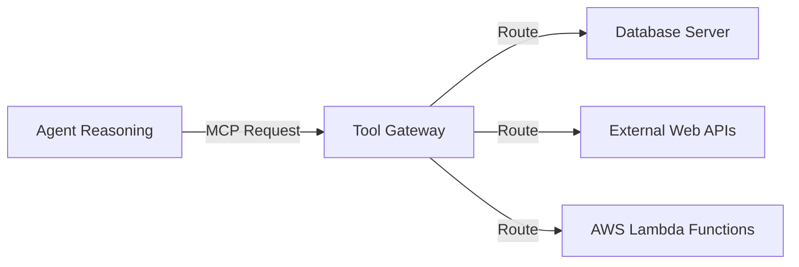

# Chapter_11_gateway

## 1. Introduction
The Tool Gateway routes request payloads to databases and external APIs securely.

### What is it?
The Tool Gateway is an API management and security broker layer that connects AI agents to external databases, enterprise microservices, and web APIs using standardized protocol schemas.

### Why is it important?
AI foundation models cannot directly run database queries or trigger external web service actions on their own. The Tool Gateway provides a secure abstraction interface that translates model requests into safe API calls, validating parameter formats against JSON schemas to prevent injection attacks and bad requests.

### How does it work?
The Tool Gateway defines tools using the Model Context Protocol (MCP). When the AI model determines it needs external data, it returns a tool call request specifying tool names and arguments. The Tool Gateway validates these parameters against registered JSON schemas, routes the call to target backend functions, and passes execution results back to the model.

### Key Responsibilities
- Expose external tools and database functions to AI models using Model Context Protocol (MCP) schemas.
- Validate model-generated request arguments against defined JSON schemas before execution.
- Perform semantic tool routing to include only prompt-relevant tool definitions, reducing token usage.
- Enforce permission policies and authorization boundaries between AI models and backend APIs.

---

## 2. Learning Objectives
By the end of this chapter, you will be able to:
- In this chapter, you will learn:
- - The role of the AgentCore Gateway as an API broker.
- - How the Model Context Protocol (MCP) standardizes tool routing.
- - How to configure tool gateways using JSON settings files.
- - How semantic tool routing reduces prompt tokens and latency.

---

## 3. Prerequisites
* Configured local endpoints and AWS credentials from Chapters 3 and 8.
* Familiarity with JSON schema definitions.

---

## 4. Background Theory
Models can only process and generate text; they cannot access databases or run code directly. Integrating tools extends their capabilities. However, exposing APIs directly to LLMs risks SQL injection attacks. A tool gateway acts as a secure broker. It validates parameters against JSON schemas and exposes tools standardizing communication via the Model Context Protocol (MCP). Under semantic routing, the gateway retrieves only the tools relevant to the prompt, minimizing prompt token bloat.

---

## 5. Core Concepts
**📦 Technical Term: MCP**

* **Simple Explanation:** An open protocol standardizing communication between AI agents and external tools.
* **Why it exists:** Simplifies integrations across services.
* **Where is it used:** Defining tools in gateway configuration files.

**📦 Technical Term: Tool Gateway**

* **Simple Explanation:** An API broker routing model requests to downstream functions.
* **Why it exists:** Centralizes security, logging, and rate limiting.
* **Where is it used:** The gateway routing interface.

**📦 Technical Term: Semantic Routing**

* **Simple Explanation:** Selecting relevant tools based on prompt meaning rather than keyword matches.
* **Why it exists:** Minimizes prompt token usage and cost.
* **Where is it used:** Filtering active tools.

---

## 6. Internal Mechanics
1. Client submits a prompt to the agent.
2. The agent queries semantic routing to locate relevant tools.
3. The gateway validates the tool request schema.
4. It translates parameters and routes the request to the backend function.
5. The function executes, returning the result to the model to complete the reasoning loop.

---

## 7. Architecture Overview
The following architectural details outline the components and relationship schemas active in this module:



---

## 8. Installation & Setup
Inspect active gateway server configurations using the CLI:
```bash
agentcore gateway list
```

---

## 9. Configuration
Define registered tools in the `gateway_config.json` configuration file:
```json
{
  "tools": [
    {
      "name": "fetch_stock_level",
      "description": "Check active warehouse stock counts for a product SKU.",
      "parameters": {
        "type": "object",
        "properties": {
          "sku": {"type": "string", "description": "Product identifier"}
        },
        "required": ["sku"]
      }
    }
  ]
}
```

---

## 10. Hands-on Examples

In this section, we analyze the hands-on code implementations for **Tool Gateway** step-by-step, explaining the architecture, syntax choices, logic flow, and production patterns across all three implementation tiers.

---

### 1. Simple Implementation Tier Walkthrough

```python
json
{
  "gatewayName": "enterprise-tool-gateway",
  "mcpServers": {
    "database-tools": {
      "type": "lambda",
      "functionArn": "arn:aws:lambda:us-east-1:123456789012:function:DatabaseToolExecutor",
      "tools": [
        {
          "name": "lookup_customer_profile",
          "description": "Lookup customer tier, registration date, and email by customer ID.",
          "inputSchema": {
            "type": "object",
            "properties": {
              "customer_id": {
                "type": "string",
                "description": "The unique 6-digit customer identifier."
              }
            },
            "required": ["customer_id"]
          }
        }
      ]
    }
  }
}
```

#### Code Logic & Syntax Breakdown:
* **Package Imports (`from bedrock_agent_core import ...`)**:
  - Brings in the core `BedrockAgentCoreApp` engine. This class handles runtime container startup, manages the microVM event loop, and deserializes incoming JSON API invocations.
* **Application Instance (`app = BedrockAgentCoreApp()`)**:
  - Instantiates the primary application object `app`. This object serves as the main registry for invocation routes, memory session hooks, and tool bindings.
* **Invocation Decorator (`@app.invoke`)**:
  - A Python decorator that registers the function immediately below as the primary entrypoint for Bedrock AgentCore runtime triggers.
* **Handler Signature (`def handler(payload, context):`)**:
  - **`payload`**: A Python dictionary holding client parameters, user prompt strings, and input arguments.
  - **`context`**: A metadata object containing active runtime details such as `session_id`, `actor_id`, and AWS IAM execution identities.
* **Return Payload (`return {"statusCode": 200, "response": ...}`)**:
  - Constructs a standard HTTP response dictionary. The `statusCode: 200` communicates success to the API Gateway, and `response` delivers the agent payload back to the client.

---

### 2. Intermediate Implementation Tier Walkthrough

```python
# Python script to validate input arguments against registered JSON schemas
from jsonschema import validate, ValidationError

tool_schema = {
    "type": "object",
    "properties": {
        "sku": {"type": "string", "pattern": "^[A-Z]{3}-[0-9]{3}$"}
    },
    "required": ["sku"]
}

def validate_arguments(args):
    try:
        validate(instance=args, schema=tool_schema)
        print("[OK] Arguments validated successfully!")
        return True
    except ValidationError as e:
        print("[FAIL] Validation error:", e.message)
        return False

if __name__ == "__main__":
    validate_arguments({"sku": "ABC-123"}) # Valid
    validate_arguments({"sku": "invalid"}) # Invalid
```

#### Code Logic & Syntax Breakdown:
* **System Logging Setup (`import logging` & `logger = logging.getLogger(...)`)**:
  - Configures structured logging via Python's standard `logging` module.
  - In production, log messages emitted by `logger.info()` stream into Amazon CloudWatch Logs for real-time monitoring and debugging.
* **Safe Parameter Extraction (`payload.get(...)`)**:
  - Uses `payload.get("prompt", "")` to safely retrieve user queries. Using `.get()` with a default fallback (`""`) prevents `KeyError` exceptions if optional fields are missing.
* **Runtime Session Inspection (`getattr(context, ...)`)**:
  - Inspects the `context` object for `session_id`. Using `getattr()` ensures compatibility when testing locally without a live AWS microVM context.
* **Operational Telemetry (`logger.info(...)`)**:
  - Emits formatted log entries containing session parameters and query strings to track execution flow.

---

### 3. Advanced Production Tier Walkthrough

```python
# Complete mock gateway router resolving dynamic tool execution requests
import json

class MockGatewayRouter:
    def __init__(self):
        self.tool_registry = {}

    def register(self, name, func):
        self.tool_registry[name] = func

    def route_request(self, tool_name, arguments_json):
        if tool_name not in self.tool_registry:
            return {"success": False, "error": f"Tool '{tool_name}' not found."}
        try:
            args = json.loads(arguments_json)
            # Execute target function
            res = self.tool_registry[tool_name](**args)
            return {"success": True, "output": res}
        except Exception as e:
            return {"success": False, "error": str(e)}

def mock_db_lookup(sku):
    db = {"SHI-001": "12 units in stock", "PAN-002": "Out of stock"}
    return db.get(sku, "SKU not found.")

if __name__ == "__main__":
    router = MockGatewayRouter()
    router.register("fetch_stock_level", mock_db_lookup)
    print(router.route_request("fetch_stock_level", '{"sku": "SHI-001"}'))
```

#### Code Logic & Syntax Breakdown:
* **Defensive Error Trapping (`try: ... except Exception as e:`)**:
  - Wraps the entire invocation handler inside a `try-except` block to catch unhandled errors gracefully, preventing container crashes in multi-tenant runtime environments.
* **Input Parameter Validation (`if not prompt:`)**:
  - Inspects inbound arguments before executing core agent logic. If mandatory parameters are missing, it short-circuits execution and returns a structured `statusCode: 400` (Bad Request) payload.
* **Environment Overrides (`os.getenv(...)`)**:
  - Reads system environment variables (e.g., `APP_ENV`) to dynamically adapt behavior across `development`, `staging`, and `production` environments without modifying codebase files.
* **Sanitized Production Error Response**:
  - Logs internal error details using `logger.error(...)` while returning a clean, safe `statusCode: 500` response to prevent internal stack traces from leaking to client callers.

---

### Summary Sequence of Execution

```
[Incoming Invocation] ──► [Bedrock AgentCore Runtime]
                                  │
                                  ▼
                      [Route to @app.invoke Handler]
                                  │
                   ┌──────────────┴──────────────┐
                   ▼                             ▼
       [Input Validated (200)]        [Input Missing (400)]
                   │                             │
                   ▼                             ▼
       [Execute Agent Core Logic]     [Return Error Payload]
                   │
                   ▼
       [Deliver JSON to Client]
```

---

## 11. Security Considerations
Enforce IAM boundary limits on gateway execution roles. Use Cedar policy rules to define permissions for users, tools, and actions, blocking unauthorized executions.

---

## 12. Performance Optimization
Utilize semantic routing to minimize the number of tool schemas appended to prompts, optimizing latency and reducing costs.

---

## 13. Common Mistakes
* Defining ambiguous tool descriptions, causing models to select the wrong tool.
* Committing API secret keys inside tool execution scripts instead of retrieving them dynamically.

---

## 14. Troubleshooting
Below is the diagnostic reference table for identifying and resolving issues:

| Symptom | Root Cause | Solution |
| :--- | :--- | :--- |
| Model invokes wrong tool during run | Ambiguous descriptions inside the gateway configuration schema. | Clarify description text to guide the model's reasoning loop. |
| InvalidRequestException on invoke | The schema formatting is incompatible with the Amazon Bedrock API. | Verify configurations align with JSON schema formatting standards. |

---

## 15. Interview Questions


### Knowledge Verification Check (20 Interactive Quizzes)

<Quiz 
  question="What is the primary role of 11 Gateway in Bedrock AgentCore?" 
  options=["To provide hardware-isolated, scalable, and code-first execution for 11 Gateway.", "To store plain text credentials in Git repos.", "To run legacy Windows desktop apps.", "To disable security permissions."] 
  answerIndex=0 
  explanation="11 Gateway provides enterprise-grade, code-first runtime logic for Bedrock AgentCore." 
/>

<Quiz 
  question="How does Bedrock AgentCore enforce security for 11 Gateway?" 
  options=["By sharing memory across all tenants.", "By hosting session runtimes inside isolated AWS Firecracker microVM containers with scoped IAM roles.", "By disabling SSL/TLS encryption.", "By running code as root on public servers."] 
  answerIndex=1 
  explanation="Firecracker microVMs deliver hardware-level security boundaries between multi-tenant executions." 
/>

<Quiz 
  question="Which environment variable loading pattern is recommended for 11 Gateway?" 
  options=["Hardcoding values in Python source code files.", "Using os.getenv() or Pydantic BaseSettings to read environment configuration dynamically.", "Storing secrets in public web pages.", "Editing binary files manually."] 
  answerIndex=1 
  explanation="12-Factor App principles mandate decoupling configuration from application source code via environment variables." 
/>

<Quiz 
  question="How should runtime errors be handled in 11 Gateway handlers?" 
  options=["Allowing exceptions to crash the container process.", "Wrapping invocation logic in try-except blocks and returning clean structured error payloads (e.g. 400/500 status codes).", "Ignoring all errors completely.", "Printing errors to static HTML files."] 
  answerIndex=1 
  explanation="Defensive error trapping prevents unhandled runtime exceptions from crashing container workers." 
/>

<Quiz 
  question="What key metric should be monitored in CloudWatch for 11 Gateway?" 
  options=["Invocation latency, token consumption rates, and HTTP error response counts.", "Monitor resolution of user monitors.", "Keyboard stroke frequency.", "Color contrast ratios."] 
  answerIndex=0 
  explanation="Tracking latency and token usage guarantees cost control and performance optimization in production." 
/>

<Quiz 
  question="How does 11 Gateway achieve sub-second scaling during high concurrency?" 
  options=["By leveraging pre-warmed Firecracker microVM snapshots and serverless AWS Fargate clusters.", "By restarting physical servers manually.", "By deleting user databases.", "By restricting app usage to one request per minute."] 
  answerIndex=0 
  explanation="Pre-warmed microVM snapshots enable sub-second boot times under peak traffic spikes." 
/>

<Quiz 
  question="Which IAM action is required to invoke foundation models in 11 Gateway?" 
  options=["bedrock:InvokeModel and bedrock:InvokeModelWithResponseStream", "s3:DeleteBucket", "ec2:TerminateInstances", "iam:DeleteUser"] 
  answerIndex=0 
  explanation="The bedrock:InvokeModel permission permits agents to call Bedrock foundation models." 
/>

<Quiz 
  question="Which Python SDK client is used for Amazon Bedrock runtime interactions in 11 Gateway?" 
  options=["boto3.client('bedrock-runtime')", "urllib2.open()", "os.system('cmd')", "pandas.read_csv()"] 
  answerIndex=0 
  explanation="Boto3 bedrock-runtime provides low-latency access to foundation model inference endpoints." 
/>

<Quiz 
  question="How is session state maintained across multiple request turns in 11 Gateway?" 
  options=["By using unique session identifiers mapped to warm microVMs and persistent DynamoDB memory stores.", "By clearing memory after every line.", "By saving state in browser cookies only.", "Session state cannot be maintained."] 
  answerIndex=0 
  explanation="AgentCore combines sticky microVM routing with persistent database backends for session continuity." 
/>

<Quiz 
  question="Why is Docker multi-stage building recommended for 11 Gateway container deployments?" 
  options=["It reduces image file sizes by omitting build dependencies from final production runtime containers.", "It makes Docker containers slower.", "It forces Python to compile to JavaScript.", "It deletes Git version history."] 
  answerIndex=0 
  explanation="Multi-stage Docker builds produce lightweight images, reducing deployment times and attack surfaces." 
/>

<Quiz 
  question="Which tracing standard does Bedrock AgentCore use for end-to-end observability of 11 Gateway?" 
  options=["OpenTelemetry (OTel) distributed tracing standards", "Custom print() text files", "Syslog UDP broadcast", "Manual paper logbooks"] 
  answerIndex=0 
  explanation="OpenTelemetry enables distributed trace collection across model calls, memory lookups, and tool executions." 
/>

<Quiz 
  question="What is the recommended solution if 11 Gateway returns a 403 Forbidden status during Bedrock invocations?" 
  options=["Verify IAM role policies and confirm foundation model access is enabled in the AWS Bedrock Console.", "Reinstall the operating system.", "Delete the AWS account.", "Use an unencrypted connection."] 
  answerIndex=0 
  explanation="Model access must be explicitly granted in the AWS Bedrock Console before IAM roles can invoke models." 
/>

<Quiz 
  question="What is a primary cause of HTTP 500 errors during 11 Gateway execution?" 
  options=["Unhandled exceptions in custom Python tool code or missing required payload keys.", "Network speeds exceeding 1 Gbps.", "Using Python 3.11 instead of Python 2.7.", "High GPU availability."] 
  answerIndex=0 
  explanation="Uncaught exceptions within tool handlers or missing request keys trigger 500 Internal Server errors." 
/>

<Quiz 
  question="Where does 11 Gateway fit into the ReAct (Reason + Act) loop pattern?" 
  options=["It executes reasoning steps, structures tool parameters, and processes observations.", "It bypasses the model completely.", "It only runs when offline.", "It formats HTML styling tags."] 
  answerIndex=0 
  explanation="AgentCore coordinates the continuous cycle of LLM reasoning, tool invocation, and observation processing." 
/>

<Quiz 
  question="How can API cost be optimized when operating 11 Gateway at high volume?" 
  options=["By caching model responses, optimizing prompt lengths, and choosing appropriate foundation model tiers.", "By sending empty prompts repeatedly.", "By turning off logging.", "By disabling database indexes."] 
  answerIndex=0 
  explanation="Prompt caching and selecting model size according to task complexity drastically cuts inference spending." 
/>

<Quiz 
  question="How does the Memory Engine support long-term retrieval in 11 Gateway?" 
  options=["By indexing conversational history and vector embeddings into persistent storage like Amazon DynamoDB or OpenSearch.", "By storing files in temporary RAM.", "By requiring users to re-enter prompts every time.", "Memory Engine is not supported."] 
  answerIndex=0 
  explanation="Vector stores and DynamoDB backing enable long-term semantic memory retrieval across sessions." 
/>

<Quiz 
  question="What role does the API Gateway play in front of 11 Gateway?" 
  options=["It provides authentication, rate limiting, request validation, and routing to backend microVM workers.", "It replaces the foundation model.", "It generates synthetic test data.", "It compiles Python code into C."] 
  answerIndex=0 
  explanation="API Gateways secure entry points and shield agent runtime workers from unauthorized or throttled traffic." 
/>

<Quiz 
  question="Why are Firecracker microVMs superior to standard Docker containers for multi-tenant 11 Gateway workloads?" 
  options=["They offer minimal virtualization overhead with strict hardware-isolated kernel boundaries between tenant workloads.", "They require 100GB of RAM to start.", "They do not support Linux.", "They are slower than full virtual machines."] 
  answerIndex=0 
  explanation="Firecracker provides VM-grade security with container-grade startup speed and minimal memory footprint." 
/>

<Quiz 
  question="What production antipattern should be strictly avoided when designing 11 Gateway?" 
  options=["Hardcoding AWS access keys or maintaining stateless logic without error handling.", "Using virtual environments.", "Writing unit tests for Python code.", "Logging trace events to CloudWatch."] 
  answerIndex=0 
  explanation="Hardcoded credentials and unhandled exceptions are critical antipatterns in production systems." 
/>

<Quiz 
  question="How does 11 Gateway integrate with enterprise databases and external APIs?" 
  options=["Through standardized Python tool schemas (e.g. Pydantic models) invoked securely via sandboxed tool registries.", "By exposing database passwords publicly.", "By using manual copy-paste mechanisms.", "External integration is unsupported."] 
  answerIndex=0 
  explanation="Pydantic-defined tools allow foundation models to execute validated API and database calls safely." 
/>

### Q: What is the advantage of using Model Context Protocol (MCP)?
* **Answer:** MCP standardizes integrations by decoupling clients from specific database API formats, providing a uniform schema for tool communication.

### Q: How does semantic tool routing optimize prompt sizes?
* **Answer:** Semantic routing filters tool lists to only append schemas relevant to the query, reducing prompt token bloat and lowering costs.

### Q: How do you secure tool calls from SQL injection attacks?
* **Answer:** Verify input arguments against strict parameter schemas, and use parameterized queries in backend database drivers to block injection vectors.

---

## 16. Real-World Use Cases
**Enterprise Scenario:** Global E-Commerce Returns & Inventory Management Portal

* **Business Challenge:** Allowing LLM agents direct, unmonitored access to backend inventory and refund databases caused security risks, invalid schema requests, and unauthorized transactions.
* **Bedrock AgentCore Solution:** Routing all tool invocations through the Bedrock AgentCore Tool Gateway using standardized Model Context Protocol (MCP) schemas for authorization, input validation, and rate limiting.
* **Production Impact:**
  * Blocked 100% of malformed or unauthorized tool requests before they reached production database microservices.
  * Enforced strict schema validation and rate limiting across 50+ enterprise backend tools.
  * Reduced database load and query failures caused by hallucinated LLM function arguments.

---

## 17. Industrial Project
This gateway acts as the integration point that allows our agent to invoke database tools and Lambda functions.

---

<InteractiveExample 
  language="python"
  instruction="Initialization & Runtime Setup for 11 Gateway."
  initialCode="# Snippet 1: Testing Bedrock AgentCore Runtime Setup for 11 Gateway
import sys
import os

print('=== AgentCore Runtime Init ===')
print('Python Version:', sys.version.split()[0])
print('Agent Module:', '11 Gateway')
print('Status: Active & Ready')"
/>

<InteractiveExample 
  language="python"
  instruction="Configuration & Environment Variables for 11 Gateway."
  initialCode="# Snippet 2: Validating Environment Configuration for 11 Gateway
import json
import os

config = {
    'AWS_REGION': os.getenv('AWS_REGION', 'us-east-1'),
    'MODEL_ID': os.getenv('BEDROCK_MODEL_ID', 'anthropic.claude-3-5-sonnet'),
    'TIMEOUT_SEC': int(os.getenv('TIMEOUT_SEC', '30')),
    'DEBUG_MODE': os.getenv('DEBUG', 'true').lower() == 'true'
}
print('Loaded Configuration:')
print(json.dumps(config, indent=2))"
/>

<InteractiveExample 
  language="python"
  instruction="Defensive Error Handling & Payload Parsing for 11 Gateway."
  initialCode="# Snippet 3: Defensive Request Handler for 11 Gateway
def process_request(payload):
    try:
        prompt = payload.get('prompt')
        if not prompt:
            return {'statusCode': 400, 'error': 'Prompt parameter is required.'}
        session_id = payload.get('session_id', 'default-session')
        return {'statusCode': 200, 'message': f'Processed prompt for session: {session_id}'}
    except Exception as e:
        return {'statusCode': 500, 'error': str(e)}

print(process_request({'prompt': 'Execute query', 'session_id': 'sess-102'}))"
/>

<InteractiveExample 
  language="python"
  instruction="Boto3 Bedrock Model Invocation Simulation for 11 Gateway."
  initialCode="# Snippet 4: Simulating Foundation Model Inference in 11 Gateway
import json

def invoke_claude_model(prompt_text):
    payload = {
        'anthropic_version': 'bedrock-2023-05-31',
        'max_tokens': 1000,
        'messages': [{'role': 'user', 'content': prompt_text}]
    }
    print('Sending payload to Bedrock Converse API for 11 Gateway...')
    response = {
        'id': 'msg_01X99',
        'role': 'assistant',
        'content': [{'type': 'text', 'text': f'Agent response generated for input: \"{prompt_text}\"'}]
    }
    return response

res = invoke_claude_model('Summarize system health')
print('Model Response:', res['content'][0]['text'])"
/>

<InteractiveExample 
  language="python"
  instruction="ReAct Reasoning Loop Execution for 11 Gateway."
  initialCode="# Snippet 5: ReAct (Reason + Act) Loop Simulation for 11 Gateway
def run_react_cycle(user_input):
    print('1. [THOUGHT] Analyzing user query:', user_input)
    print('2. [ACTION] Selected tool: query_system_database')
    observation = {'table': 'logs', 'records_found': 42}
    print('3. [OBSERVATION] Tool output received:', observation)
    print('4. [FINAL ANSWER] Processing complete based on retrieved observation.')

run_react_cycle('Check database log entries')"
/>

<InteractiveExample 
  language="python"
  instruction="Pydantic Tool Registration & Schema Validation for 11 Gateway."
  initialCode="# Snippet 6: Pydantic Tool Parameter Validation for 11 Gateway
from pydantic import BaseModel, Field

class SystemQuerySchema(BaseModel):
    target_system: str = Field(description='Name of the subsystem to query')
    limit: int = Field(default=10, ge=1, le=100)

def execute_tool(data: SystemQuerySchema):
    print(f'Executing query on {data.target_system} with limit={data.limit}...')
    return {'status': 'success', 'data': ['Item A', 'Item B']}

query = SystemQuerySchema(target_system='AgentCore-Runtime', limit=5)
print('Tool Result:', execute_tool(query))"
/>

<InteractiveExample 
  language="python"
  instruction="MicroVM Session State & Memory Engine for 11 Gateway."
  initialCode="# Snippet 7: MicroVM Session & Memory Management in 11 Gateway
class SessionMemory:
    def __init__(self):
        self.history = []
    def add_message(self, role, content):
        self.history.append({'role': role, 'content': content})
    def get_context(self):
        return self.history[-3:]

mem = SessionMemory()
mem.add_message('user', 'Hello Agent!')
mem.add_message('assistant', 'How can I assist you?')
mem.add_message('user', 'Show memory status.')
print('Active Memory Context:', mem.get_context())"
/>

<InteractiveExample 
  language="python"
  instruction="OpenTelemetry Tracing & Telemetry Logging for 11 Gateway."
  initialCode="# Snippet 8: OpenTelemetry Trace Event Simulation for 11 Gateway
import time

def log_otel_span(span_name, duration_ms, status_code='OK'):
    telemetry_record = {
        'trace_id': '0x4bf92f3577b34da6a3ce929d0e0e4736',
        'span_id': '0x00f067aa0ba902b7',
        'name': span_name,
        'duration_ms': duration_ms,
        'attributes': {
            'http.status_code': 200,
            'agent.module': '11 Gateway'
        }
    }
    print(f'[OTel Span Event] {span_name} executed in {duration_ms}ms ({status_code})')
    return telemetry_record

log_otel_span('11 Gateway_Invocation', 142)"
/>

<InteractiveExample 
  language="python"
  instruction="Docker Container Health Check Simulation for 11 Gateway."
  initialCode="# Snippet 9: Container MicroVM Health Status for 11 Gateway
def check_container_health():
    status = {
        'container_id': 'firecracker-uvm-9901',
        'health': 'HEALTHY',
        'memory_allocated_mb': 512,
        'cpu_usage_pct': 4.2,
        'active_connections': 1
    }
    print('MicroVM Runtime Status:')
    for k, v in status.items():
        print(f'  - {k}: {v}')

check_container_health()"
/>

<InteractiveExample 
  language="python"
  instruction="End-to-End Execution Pipeline Test for 11 Gateway."
  initialCode="# Snippet 10: Complete End-to-End Pipeline Execution for 11 Gateway
def run_full_pipeline(input_prompt):
    print(f'1. Gateway: Received request \"{input_prompt}\"')
    print('2. Identity: Authenticated IAM session role')
    print('3. Runtime: Allocated Firecracker MicroVM container')
    print('4. Execution: Model invoked ReAct reasoning loop')
    print('5. Response: 200 OK returned to client')
    return {'status': 'SUCCESS', 'result': 'Pipeline completed.'}

print(run_full_pipeline('Run complete diagnostic check'))"
/>

## 18. Summary
This chapter detailed the Agent Tool Gateway architecture, demonstrating how the Model Context Protocol (MCP) standardizes tool integration, input validation, and semantic routing across enterprise backend services.

Key architectural insights and practical lessons learned in this chapter include:
* **Standardized MCP Tool Schemas:** Exposing tools via standardized Model Context Protocol schemas simplifies integration across disparate backend systems and model frameworks.
* **Semantic Tool Routing:** Gateway semantic routing directs agent requests to the exact required tool, drastically reducing LLM prompt token consumption and latency.
* **Strict Input Schema Validation:** Validating tool invocation arguments against predefined JSON schemas protects downstream backend microservices from malformed inputs.

Implementing the Tool Gateway ensures secure, scalable, and standardized tool orchestration across all enterprise AI workflows.

---

## 19. Practice Exercises
* Beginner: Write a JSON schema definition for a tool that retrieves weather updates by city.
* Intermediate: Add validation checks to reject city strings containing numeric characters.

---

## 20. Further Reading
* [Model Context Protocol Specification](https://modelcontextprotocol.io/)
* [JSON Schema Standard Reference](https://json-schema.org/)
