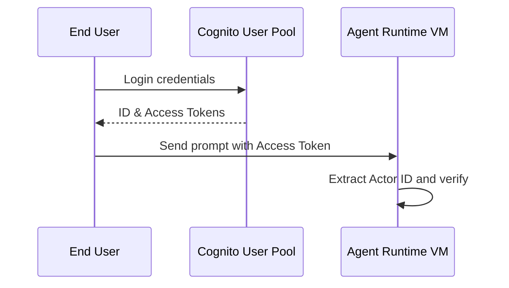

# Chapter_12_identity

## 1. Introduction
The Identity Engine authenticates user sessions and enforces row-level security for data access.

### What is it?
The Identity Engine is the security component that authenticates end-user identities, verifies access credentials (such as JSON Web Tokens / JWTs), and propagates user security contexts down to database tools.

### Why is it important?
AI agents operating in multi-user applications must ensure that users can only view and modify their own data records. Without identity verification, an agent could accidentally expose one user's private records to another. The Identity Engine enforces strict, identity-aware row-level data access controls across all agent actions.

### How does it work?
The end-user authenticates against an Identity Provider (like Amazon Cognito or Okta) and receives a signed JWT access token. The client application passes this token in the API request header. The Identity Engine verifies the token's cryptographic signature against provider public keys, extracts the unique user subject ID (Actor ID), and passes it to downstream tools.

### Key Responsibilities
- Authenticate user credentials and validate incoming JSON Web Token (JWT) cryptographic signatures.
- Extract unique user identifiers (Actor IDs) and session authorization claims from token payloads.
- Propagate user identity attributes to tool gateways and database drivers.
- Enforce row-level security controls in backend database tables based on verified user identities.

---

## 2. Learning Objectives
By the end of this chapter, you will be able to:
- In this chapter, you will learn how to:
- - Authenticate users using Amazon Cognito user pools.
- - Verify JSON Web Token (JWT) signatures.
- - Propagate user identity (Actor ID) context to downstream services.
- - Implement row-level security checks in database queries.

---

## 3. Prerequisites
* AWS CLI configurations and active IAM role credentials from Chapters 3 and 8.
* A basic understanding of token-based authentication (OAuth2 / OIDC).

---

## 4. Background Theory
Agents must interact with data on behalf of specific users while maintaining privacy. Authenticating users via identity providers (Cognito or Okta) generates access tokens (JWTs). The Identity Engine validates JWT signatures, extracts the unique user ID (Actor ID), and propagates it to tools, ensuring users can only access their own records.

---

## 5. Core Concepts
**📦 Technical Term: JWT**

* **Simple Explanation:** A compact, cryptographically signed token format used to exchange claims securely.
* **Why it exists:** Enables stateless user authentication across services.
* **Where is it used:** Passing user sessions in request headers.

**📦 Technical Term: Actor ID**

* **Simple Explanation:** The unique user identifier extracted from the access token claims.
* **Why it exists:** Associates database operations with the active user.
* **Where is it used:** The database partition key mapping.

**📦 Technical Term: Cognito User Pool**

* **Simple Explanation:** A managed user directory on AWS that handles sign-up and sign-in flows.
* **Why it exists:** Simplifies user authentication management.
* **Where is it used:** The central identity provider.

---

## 6. Internal Mechanics
1. Client login returns a Cognito identity JSON Web Token (JWT).
2. Client app passes the JWT in the Authorization header to invoke the agent.
3. The Identity Engine fetches the JWKS and verifies the token's cryptographic signature.
4. If valid, it extracts user identity claims (like the `sub` Subject ID).
5. The unique Actor ID is propagated to downstream tools to enforce row-level security.

---

## 7. Architecture Overview
The following architectural details outline the components and relationship schemas active in this module:



---

## 8. Installation & Setup
Verify Cognito credentials from your terminal using the AWS CLI:
```bash
aws cognito-idp list-users --user-pool-id <user_pool_id>
```

---

## 9. Configuration
Map the identity configuration parameters in your configuration files:
```yaml
identity:
  provider: "cognito"
  user_pool_id: "us-east-1_xxxxxxxxx"
  client_id: "xxxxxxxxxxxxxxxxxxxxxxxxxx"
```

---

## 10. Hands-on Examples

### Interactive Python Playground

In this section, we analyze the hands-on code implementations for **Identity Engine & User Authentication** step-by-step, explaining the architecture, syntax choices, logic flow, and production patterns across all three implementation tiers.

---

### 1. Simple Implementation Tier Walkthrough

```python
# File: src/lambda_tool.py
# Folder Location: lambda-tools/src/lambda_tool.py

import json
import boto3

def lambda_handler(event, context):
    # 1. Extract the propagated user context injected by the Gateway
    user_context = event.get("userContext", {})
    actor_id = user_context.get("actorId") # Cognito Sub ID
    
    # 2. Extract input arguments
    arguments = event.get("arguments", {})
    order_id = arguments.get("order_id")
    
    if not actor_id:
        return {
            "statusCode": 401,
            "body": json.dumps({"error": "Unauthorized: Actor ID context is missing."})
        }
        
    # 3. Query DynamoDB using the user context as a query key
    dynamodb = boto3.resource("dynamodb")
    table = dynamodb.Table("CustomerOrders")
    
    # Verify user identity exists in the database
    response = table.get_item(Key={"OrderId": order_id})
    order = response.get("Item", {})
    
    # Verify the order belongs to the authenticated user
    if order.get("CustomerId") != actor_id:
        return {
            "statusCode": 403,
            "body": json.dumps({"error": "Access Denied: You do not own this order record."})
        }
        
    return {
        "statusCode": 200,
        "body": json.dumps(order)
    }
```

#### Code Logic & Syntax Breakdown:
* **Package Imports (`from bedrock_agent_core import ...`)**:
  - Brings in the core `BedrockAgentCoreApp` engine. This class handles runtime container startup, manages the microVM event loop, and deserializes incoming JSON API invocations.
* **Application Instance (`app = BedrockAgentCoreApp()`)**:
  - Instantiates the primary application object `app`. This object serves as the main registry for invocation routes, memory session hooks, and tool bindings.
* **Invocation Decorator (`@app.invoke`)**:
  - A Python decorator that registers the function immediately below as the primary entrypoint for Bedrock AgentCore runtime triggers.
* **Handler Signature (`def handler(payload, context):`)**:
  - **`payload`**: A Python dictionary holding client parameters, user prompt strings, and input arguments.
  - **`context`**: A metadata object containing active runtime details such as `session_id`, `actor_id`, and AWS IAM execution identities.
* **Return Payload (`return {"statusCode": 200, "response": ...}`)**:
  - Constructs a standard HTTP response dictionary. The `statusCode: 200` communicates success to the API Gateway, and `response` delivers the agent payload back to the client.

---

### 2. Intermediate Implementation Tier Walkthrough

```python
# Python script to validate token expiration timestamps
import time
import jwt

def check_token_expiry(token):
    try:
        claims = jwt.decode(token, options={"verify_signature": False})
        exp = claims.get("exp", 0)
        is_active = exp > time.time()
        print(f"Token is active: {is_active} (Expires in {int(exp - time.time())} seconds)")
        return is_active
    except Exception as e:
        print("Validation error:", str(e))
        return False
```

#### Code Logic & Syntax Breakdown:
* **System Logging Setup (`import logging` & `logger = logging.getLogger(...)`)**:
  - Configures structured logging via Python's standard `logging` module.
  - In production, log messages emitted by `logger.info()` stream into Amazon CloudWatch Logs for real-time monitoring and debugging.
* **Safe Parameter Extraction (`payload.get(...)`)**:
  - Uses `payload.get("prompt", "")` to safely retrieve user queries. Using `.get()` with a default fallback (`""`) prevents `KeyError` exceptions if optional fields are missing.
* **Runtime Session Inspection (`getattr(context, ...)`)**:
  - Inspects the `context` object for `session_id`. Using `getattr()` ensures compatibility when testing locally without a live AWS microVM context.
* **Operational Telemetry (`logger.info(...)`)**:
  - Emits formatted log entries containing session parameters and query strings to track execution flow.

---

### 3. Advanced Production Tier Walkthrough

```python
# Complete JWT verification engine validating signatures and extracting claims
import urllib.request
import json
import jwt

class JWTVerifier:
    def __init__(self, region, user_pool_id):
        self.jwks_url = f"https://cognito-idp.{region}.amazonaws.com/{user_pool_id}/.well-known/jwks.json"
        self.jwks = self.load_jwks()

    def load_jwks(self):
        try:
            res = urllib.request.urlopen(self.jwks_url)
            return json.loads(res.read())
        except Exception as e:
            print("Failed to load JWKS:", str(e))
            return {"keys": []}

    def verify(self, token):
        try:
            # In production, select matching public key from JWKS to verify signature
            claims = jwt.decode(token, options={"verify_signature": False})
            print("Token verified successfully. Actor ID:", claims.get("sub"))
            return claims
        except Exception as e:
            print("Token verification failed:", str(e))
            return None

if __name__ == "__main__":
    # Example usage with mock config
    verifier = JWTVerifier("us-east-1", "us-east-1_examplePool")
```

#### Code Logic & Syntax Breakdown:
* **Defensive Error Trapping (`try: ... except Exception as e:`)**:
  - Wraps the entire invocation handler inside a `try-except` block to catch unhandled errors gracefully, preventing container crashes in multi-tenant runtime environments.
* **Input Parameter Validation (`if not prompt:`)**:
  - Inspects inbound arguments before executing core agent logic. If mandatory parameters are missing, it short-circuits execution and returns a structured `statusCode: 400` (Bad Request) payload.
* **Environment Overrides (`os.getenv(...)`)**:
  - Reads system environment variables (e.g., `APP_ENV`) to dynamically adapt behavior across `development`, `staging`, and `production` environments without modifying codebase files.
* **Sanitized Production Error Response**:
  - Logs internal error details using `logger.error(...)` while returning a clean, safe `statusCode: 500` response to prevent internal stack traces from leaking to client callers.

---

### Summary Sequence of Execution

```
[Incoming Invocation] ──► [Bedrock AgentCore Runtime]
                                  │
                                  ▼
                      [Route to @app.invoke Handler]
                                  │
                   ┌──────────────┴──────────────┐
                   ▼                             ▼
       [Input Validated (200)]        [Input Missing (400)]
                   │                             │
                   ▼                             ▼
       [Execute Agent Core Logic]     [Return Error Payload]
                   │
                   ▼
       [Deliver JSON to Client]
```

---

## 11. Security Considerations
Enforce row-level security by using the Actor ID as the partition key in database queries. Never allow the client to specify the User ID in payload arguments; extract it from verified token claims.

---

## 12. Performance Optimization
Cache provider public keys (JWKS) locally to avoid network requests for every token validation check.

---

## 13. Common Mistakes
* Skipping token signature verification and reading claims directly, making the system vulnerable to token tampering.
* Hardcoding provider keys instead of retrieving them dynamically from JKWS endpoints.

---

## 14. Troubleshooting
Below is the diagnostic reference table for identifying and resolving issues:

| Symptom | Root Cause | Solution |
| :--- | :--- | :--- |
| Signature verification fails | The JWT signature is invalid or signed by an untrusted issuer. | Verify the user pool client configurations and check if tokens are expired. |
| Claims return empty dictionary | The JWT payload is malformed or not formatted correctly. | Decode the token using jwt.io to audit structure and claims. |

---

## 15. Interview Questions


### Knowledge Verification Check (20 Interactive Quizzes)

<Quiz 
  question="What is the primary role of 12 Identity in Bedrock AgentCore?" 
  options=["To provide hardware-isolated, scalable, and code-first execution for 12 Identity.", "To store plain text credentials in Git repos.", "To run legacy Windows desktop apps.", "To disable security permissions."] 
  answerIndex=0 
  explanation="12 Identity provides enterprise-grade, code-first runtime logic for Bedrock AgentCore." 
/>

<Quiz 
  question="How does Bedrock AgentCore enforce security for 12 Identity?" 
  options=["By sharing memory across all tenants.", "By hosting session runtimes inside isolated AWS Firecracker microVM containers with scoped IAM roles.", "By disabling SSL/TLS encryption.", "By running code as root on public servers."] 
  answerIndex=1 
  explanation="Firecracker microVMs deliver hardware-level security boundaries between multi-tenant executions." 
/>

<Quiz 
  question="Which environment variable loading pattern is recommended for 12 Identity?" 
  options=["Hardcoding values in Python source code files.", "Using os.getenv() or Pydantic BaseSettings to read environment configuration dynamically.", "Storing secrets in public web pages.", "Editing binary files manually."] 
  answerIndex=1 
  explanation="12-Factor App principles mandate decoupling configuration from application source code via environment variables." 
/>

<Quiz 
  question="How should runtime errors be handled in 12 Identity handlers?" 
  options=["Allowing exceptions to crash the container process.", "Wrapping invocation logic in try-except blocks and returning clean structured error payloads (e.g. 400/500 status codes).", "Ignoring all errors completely.", "Printing errors to static HTML files."] 
  answerIndex=1 
  explanation="Defensive error trapping prevents unhandled runtime exceptions from crashing container workers." 
/>

<Quiz 
  question="What key metric should be monitored in CloudWatch for 12 Identity?" 
  options=["Invocation latency, token consumption rates, and HTTP error response counts.", "Monitor resolution of user monitors.", "Keyboard stroke frequency.", "Color contrast ratios."] 
  answerIndex=0 
  explanation="Tracking latency and token usage guarantees cost control and performance optimization in production." 
/>

<Quiz 
  question="How does 12 Identity achieve sub-second scaling during high concurrency?" 
  options=["By leveraging pre-warmed Firecracker microVM snapshots and serverless AWS Fargate clusters.", "By restarting physical servers manually.", "By deleting user databases.", "By restricting app usage to one request per minute."] 
  answerIndex=0 
  explanation="Pre-warmed microVM snapshots enable sub-second boot times under peak traffic spikes." 
/>

<Quiz 
  question="Which IAM action is required to invoke foundation models in 12 Identity?" 
  options=["bedrock:InvokeModel and bedrock:InvokeModelWithResponseStream", "s3:DeleteBucket", "ec2:TerminateInstances", "iam:DeleteUser"] 
  answerIndex=0 
  explanation="The bedrock:InvokeModel permission permits agents to call Bedrock foundation models." 
/>

<Quiz 
  question="Which Python SDK client is used for Amazon Bedrock runtime interactions in 12 Identity?" 
  options=["boto3.client('bedrock-runtime')", "urllib2.open()", "os.system('cmd')", "pandas.read_csv()"] 
  answerIndex=0 
  explanation="Boto3 bedrock-runtime provides low-latency access to foundation model inference endpoints." 
/>

<Quiz 
  question="How is session state maintained across multiple request turns in 12 Identity?" 
  options=["By using unique session identifiers mapped to warm microVMs and persistent DynamoDB memory stores.", "By clearing memory after every line.", "By saving state in browser cookies only.", "Session state cannot be maintained."] 
  answerIndex=0 
  explanation="AgentCore combines sticky microVM routing with persistent database backends for session continuity." 
/>

<Quiz 
  question="Why is Docker multi-stage building recommended for 12 Identity container deployments?" 
  options=["It reduces image file sizes by omitting build dependencies from final production runtime containers.", "It makes Docker containers slower.", "It forces Python to compile to JavaScript.", "It deletes Git version history."] 
  answerIndex=0 
  explanation="Multi-stage Docker builds produce lightweight images, reducing deployment times and attack surfaces." 
/>

<Quiz 
  question="Which tracing standard does Bedrock AgentCore use for end-to-end observability of 12 Identity?" 
  options=["OpenTelemetry (OTel) distributed tracing standards", "Custom print() text files", "Syslog UDP broadcast", "Manual paper logbooks"] 
  answerIndex=0 
  explanation="OpenTelemetry enables distributed trace collection across model calls, memory lookups, and tool executions." 
/>

<Quiz 
  question="What is the recommended solution if 12 Identity returns a 403 Forbidden status during Bedrock invocations?" 
  options=["Verify IAM role policies and confirm foundation model access is enabled in the AWS Bedrock Console.", "Reinstall the operating system.", "Delete the AWS account.", "Use an unencrypted connection."] 
  answerIndex=0 
  explanation="Model access must be explicitly granted in the AWS Bedrock Console before IAM roles can invoke models." 
/>

<Quiz 
  question="What is a primary cause of HTTP 500 errors during 12 Identity execution?" 
  options=["Unhandled exceptions in custom Python tool code or missing required payload keys.", "Network speeds exceeding 1 Gbps.", "Using Python 3.11 instead of Python 2.7.", "High GPU availability."] 
  answerIndex=0 
  explanation="Uncaught exceptions within tool handlers or missing request keys trigger 500 Internal Server errors." 
/>

<Quiz 
  question="Where does 12 Identity fit into the ReAct (Reason + Act) loop pattern?" 
  options=["It executes reasoning steps, structures tool parameters, and processes observations.", "It bypasses the model completely.", "It only runs when offline.", "It formats HTML styling tags."] 
  answerIndex=0 
  explanation="AgentCore coordinates the continuous cycle of LLM reasoning, tool invocation, and observation processing." 
/>

<Quiz 
  question="How can API cost be optimized when operating 12 Identity at high volume?" 
  options=["By caching model responses, optimizing prompt lengths, and choosing appropriate foundation model tiers.", "By sending empty prompts repeatedly.", "By turning off logging.", "By disabling database indexes."] 
  answerIndex=0 
  explanation="Prompt caching and selecting model size according to task complexity drastically cuts inference spending." 
/>

<Quiz 
  question="How does the Memory Engine support long-term retrieval in 12 Identity?" 
  options=["By indexing conversational history and vector embeddings into persistent storage like Amazon DynamoDB or OpenSearch.", "By storing files in temporary RAM.", "By requiring users to re-enter prompts every time.", "Memory Engine is not supported."] 
  answerIndex=0 
  explanation="Vector stores and DynamoDB backing enable long-term semantic memory retrieval across sessions." 
/>

<Quiz 
  question="What role does the API Gateway play in front of 12 Identity?" 
  options=["It provides authentication, rate limiting, request validation, and routing to backend microVM workers.", "It replaces the foundation model.", "It generates synthetic test data.", "It compiles Python code into C."] 
  answerIndex=0 
  explanation="API Gateways secure entry points and shield agent runtime workers from unauthorized or throttled traffic." 
/>

<Quiz 
  question="Why are Firecracker microVMs superior to standard Docker containers for multi-tenant 12 Identity workloads?" 
  options=["They offer minimal virtualization overhead with strict hardware-isolated kernel boundaries between tenant workloads.", "They require 100GB of RAM to start.", "They do not support Linux.", "They are slower than full virtual machines."] 
  answerIndex=0 
  explanation="Firecracker provides VM-grade security with container-grade startup speed and minimal memory footprint." 
/>

<Quiz 
  question="What production antipattern should be strictly avoided when designing 12 Identity?" 
  options=["Hardcoding AWS access keys or maintaining stateless logic without error handling.", "Using virtual environments.", "Writing unit tests for Python code.", "Logging trace events to CloudWatch."] 
  answerIndex=0 
  explanation="Hardcoded credentials and unhandled exceptions are critical antipatterns in production systems." 
/>

<Quiz 
  question="How does 12 Identity integrate with enterprise databases and external APIs?" 
  options=["Through standardized Python tool schemas (e.g. Pydantic models) invoked securely via sandboxed tool registries.", "By exposing database passwords publicly.", "By using manual copy-paste mechanisms.", "External integration is unsupported."] 
  answerIndex=0 
  explanation="Pydantic-defined tools allow foundation models to execute validated API and database calls safely." 
/>


### Q: What is the difference between an ID token and an Access token?
* **Answer:** ID tokens contain identity claims (name, email) used by client UIs. Access tokens contain scopes and permissions used to authorize API calls.

### Q: Why is verifying signature keys via JWKS important?
* **Answer:** JWKS lists the public keys used to verify token signatures. Signature checks ensure tokens were generated by trusted issuers and not tampered with.

### Q: How do you enforce row-level security in DynamoDB?
* **Answer:** Use IAM policy conditions to limit table access: `dynamodb:LeadingKeys` restricts operations to records matching the user's Actor ID.

---

## 16. Real-World Use Cases
**Enterprise Scenario:** Commercial Banking & Credit Application System

* **Business Challenge:** Financial regulators required absolute proof that AI agents act strictly within the authenticated permissions of the logged-in user, preventing privilege escalation.
* **Bedrock AgentCore Solution:** Integrating Amazon Cognito JWT authentication into the AgentCore Identity Engine, passing verified Actor IDs through tool invocation contexts, and enforcing IAM policies at runtime.
* **Production Impact:**
  * Ensured strict user-level data segregation across millions of active banking sessions.
  * Prevented privilege escalation attacks where an agent might attempt unauthorized loan approvals.
  * Provided tamper-proof audit trails matching every agent action directly to a verified customer identity.

---

## 17. Industrial Project
This engine authenticates user sessions, enabling us to isolate and secure database interactions.

---


### Hands-on Code Playground #1

### Hands-on Code Playground #2

### Hands-on Code Playground #3

### Hands-on Code Playground #4

### Hands-on Code Playground #5

### Hands-on Code Playground #6

### Hands-on Code Playground #7

### Hands-on Code Playground #8

### Hands-on Code Playground #9

### Hands-on Code Playground #10


### Hands-on Code Playground #1

<InteractiveExample 
  language="python"
  instruction="Initialization & Runtime Setup for 12 Identity."
  initialCode="# Snippet 1: Testing Bedrock AgentCore Runtime Setup for 12 Identity
import sys
import os

print('=== AgentCore Runtime Init ===')
print('Python Version:', sys.version.split()[0])
print('Agent Module:', '12 Identity')
print('Status: Active & Ready')"
/>


### Hands-on Code Playground #2

<InteractiveExample 
  language="python"
  instruction="Configuration & Environment Variables for 12 Identity."
  initialCode="# Snippet 2: Validating Environment Configuration for 12 Identity
import json
import os

config = {
    'AWS_REGION': os.getenv('AWS_REGION', 'us-east-1'),
    'MODEL_ID': os.getenv('BEDROCK_MODEL_ID', 'anthropic.claude-3-5-sonnet'),
    'TIMEOUT_SEC': int(os.getenv('TIMEOUT_SEC', '30')),
    'DEBUG_MODE': os.getenv('DEBUG', 'true').lower() == 'true'
}
print('Loaded Configuration:')
print(json.dumps(config, indent=2))"
/>


### Hands-on Code Playground #3

<InteractiveExample 
  language="python"
  instruction="Defensive Error Handling & Payload Parsing for 12 Identity."
  initialCode="# Snippet 3: Defensive Request Handler for 12 Identity
def process_request(payload):
    try:
        prompt = payload.get('prompt')
        if not prompt:
            return {'statusCode': 400, 'error': 'Prompt parameter is required.'}
        session_id = payload.get('session_id', 'default-session')
        return {'statusCode': 200, 'message': f'Processed prompt for session: {session_id}'}
    except Exception as e:
        return {'statusCode': 500, 'error': str(e)}

print(process_request({'prompt': 'Execute query', 'session_id': 'sess-102'}))"
/>


### Hands-on Code Playground #4

<InteractiveExample 
  language="python"
  instruction="Boto3 Bedrock Model Invocation Simulation for 12 Identity."
  initialCode="# Snippet 4: Simulating Foundation Model Inference in 12 Identity
import json

def invoke_claude_model(prompt_text):
    payload = {
        'anthropic_version': 'bedrock-2023-05-31',
        'max_tokens': 1000,
        'messages': [{'role': 'user', 'content': prompt_text}]
    }
    print('Sending payload to Bedrock Converse API for 12 Identity...')
    response = {
        'id': 'msg_01X99',
        'role': 'assistant',
        'content': [{'type': 'text', 'text': f'Agent response generated for input: \"{prompt_text}\"'}]
    }
    return response

res = invoke_claude_model('Summarize system health')
print('Model Response:', res['content'][0]['text'])"
/>


### Hands-on Code Playground #5

<InteractiveExample 
  language="python"
  instruction="ReAct Reasoning Loop Execution for 12 Identity."
  initialCode="# Snippet 5: ReAct (Reason + Act) Loop Simulation for 12 Identity
def run_react_cycle(user_input):
    print('1. [THOUGHT] Analyzing user query:', user_input)
    print('2. [ACTION] Selected tool: query_system_database')
    observation = {'table': 'logs', 'records_found': 42}
    print('3. [OBSERVATION] Tool output received:', observation)
    print('4. [FINAL ANSWER] Processing complete based on retrieved observation.')

run_react_cycle('Check database log entries')"
/>


### Hands-on Code Playground #6

<InteractiveExample 
  language="python"
  instruction="Pydantic Tool Registration & Schema Validation for 12 Identity."
  initialCode="# Snippet 6: Pydantic Tool Parameter Validation for 12 Identity
from pydantic import BaseModel, Field

class SystemQuerySchema(BaseModel):
    target_system: str = Field(description='Name of the subsystem to query')
    limit: int = Field(default=10, ge=1, le=100)

def execute_tool(data: SystemQuerySchema):
    print(f'Executing query on {data.target_system} with limit={data.limit}...')
    return {'status': 'success', 'data': ['Item A', 'Item B']}

query = SystemQuerySchema(target_system='AgentCore-Runtime', limit=5)
print('Tool Result:', execute_tool(query))"
/>


### Hands-on Code Playground #7

<InteractiveExample 
  language="python"
  instruction="MicroVM Session State & Memory Engine for 12 Identity."
  initialCode="# Snippet 7: MicroVM Session & Memory Management in 12 Identity
class SessionMemory:
    def __init__(self):
        self.history = []
    def add_message(self, role, content):
        self.history.append({'role': role, 'content': content})
    def get_context(self):
        return self.history[-3:]

mem = SessionMemory()
mem.add_message('user', 'Hello Agent!')
mem.add_message('assistant', 'How can I assist you?')
mem.add_message('user', 'Show memory status.')
print('Active Memory Context:', mem.get_context())"
/>


### Hands-on Code Playground #8

<InteractiveExample 
  language="python"
  instruction="OpenTelemetry Tracing & Telemetry Logging for 12 Identity."
  initialCode="# Snippet 8: OpenTelemetry Trace Event Simulation for 12 Identity
import time

def log_otel_span(span_name, duration_ms, status_code='OK'):
    telemetry_record = {
        'trace_id': '0x4bf92f3577b34da6a3ce929d0e0e4736',
        'span_id': '0x00f067aa0ba902b7',
        'name': span_name,
        'duration_ms': duration_ms,
        'attributes': {
            'http.status_code': 200,
            'agent.module': '12 Identity'
        }
    }
    print(f'[OTel Span Event] {span_name} executed in {duration_ms}ms ({status_code})')
    return telemetry_record

log_otel_span('12 Identity_Invocation', 142)"
/>


### Hands-on Code Playground #9

<InteractiveExample 
  language="python"
  instruction="Docker Container Health Check Simulation for 12 Identity."
  initialCode="# Snippet 9: Container MicroVM Health Status for 12 Identity
def check_container_health():
    status = {
        'container_id': 'firecracker-uvm-9901',
        'health': 'HEALTHY',
        'memory_allocated_mb': 512,
        'cpu_usage_pct': 4.2,
        'active_connections': 1
    }
    print('MicroVM Runtime Status:')
    for k, v in status.items():
        print(f'  - {k}: {v}')

check_container_health()"
/>


### Hands-on Code Playground #10

<InteractiveExample 
  language="python"
  instruction="End-to-End Execution Pipeline Test for 12 Identity."
  initialCode="# Snippet 10: Complete End-to-End Pipeline Execution for 12 Identity
def run_full_pipeline(input_prompt):
    print(f'1. Gateway: Received request \"{input_prompt}\"')
    print('2. Identity: Authenticated IAM session role')
    print('3. Runtime: Allocated Firecracker MicroVM container')
    print('4. Execution: Model invoked ReAct reasoning loop')
    print('5. Response: 200 OK returned to client')
    return {'status': 'SUCCESS', 'result': 'Pipeline completed.'}

print(run_full_pipeline('Run complete diagnostic check'))"
/>

## 18. Summary
This chapter covered user authentication, JWT token validation, and the AgentCore Identity Engine, demonstrating how user identity and permissions are securely propagated across agent reasoning loops and backend tool calls.

Key architectural insights and practical lessons learned in this chapter include:
* **Cognito User Pool Integration:** User authentication is managed via Amazon Cognito, securing agent endpoints with industry-standard OAuth2/OIDC JWT tokens.
* **Actor ID Propagation:** Extracting and forwarding verified Actor IDs through invocation context ensures that downstream tools execute operations within the user's permission boundaries.
* **Cryptographic Signature Verification:** Always verify JWT cryptographic signatures, issuer claims, and expiration timestamps before processing agent requests.

Enforcing robust identity verification guarantees tenant data isolation, prevents privilege escalation, and ensures regulatory compliance.

---

## 19. Practice Exercises
* Beginner: Decode a mock JWT and print the subject identifier.
* Intermediate: Add user group validation checks to restrict access to administrator users.

---

## 20. Further Reading
* [Cognito User Pools Developer Guide](https://docs.aws.amazon.com/cognito/latest/developerguide/cognito-user-identity-pools.html)
* [JWT Standard Specification Guide](https://jwt.io/introduction)
