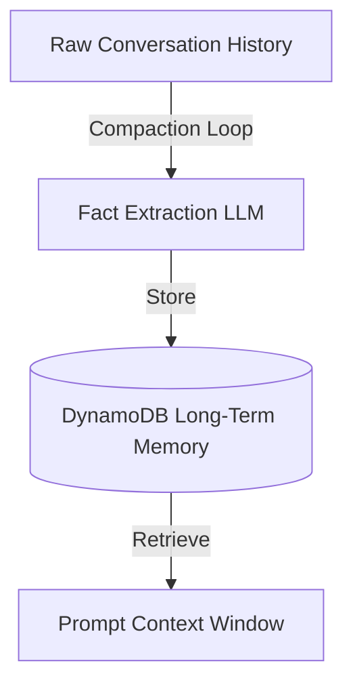

# Chapter_13_memory

## 1. Introduction
The Memory Engine manages short-term conversational history and long-term user profiles.

### What is it?
The Memory Engine is the state management system responsible for storing, compacting, and retrieving short-term chat history and long-term user profile facts across conversation sessions.

### Why is it important?
AI foundation models are inherently stateless and forget all context once a single prompt request finishes. Re-sending full conversation histories with every prompt bloats context windows, increases response latency, and drastically raises API token costs. The Memory Engine maintains state efficiently while keeping prompt context windows small.

### How does it work?
Short-term dialogue turns are saved to an active session cache. When a session finishes or reaches a turn limit, an automated compaction loop runs. The compaction loop uses a fast LLM to extract key user facts, preferences, and state summaries from raw dialogue logs, saving these structured summaries to an AWS DynamoDB table while clearing raw history logs.

### Key Responsibilities
- Persist short-term dialogue history for ongoing multi-turn conversations within active sessions.
- Store long-term user profiles and preferences in Amazon DynamoDB tables across sessions.
- Execute background compaction loops to summarize long dialogue logs into structured facts.
- Inject relevant user profile summaries into model prompt templates to personalize responses efficiently.

---

## 2. Learning Objectives
By the end of this chapter, you will be able to:
- In this chapter, you will learn:
- - The difference between short-term (RAM) and long-term (DynamoDB) agent memory.
- - How to implement a session memory manager class in Python.
- - How to set up DynamoDB tables for user profiles.
- - How to implement a Memory Compaction loop to extract user facts.

---

## 3. Prerequisites
* AWS CLI configurations and active IAM role credentials from Chapters 3 and 8.
* A basic understanding of database operations (DynamoDB).

---

## 4. Background Theory
Models are stateless and do not remember past interactions. Appending raw history to prompt context windows increases latency, token count, and cost. The Memory Engine resolves this by managing short-term session cache and long-term profiles in DynamoDB. The memory manager runs compaction loops, using the LLM to extract key user facts and save them, pruning raw dialogue history.

---

## 5. Core Concepts
**📦 Technical Term: Short-Term Memory**

* **Simple Explanation:** Dialogue cache storing conversation turns within an active session.
* **Why it exists:** Tracks dialogue turns during an active chat session.
* **Where is it used:** The temporary session cache.

**📦 Technical Term: Long-Term Memory**

* **Simple Explanation:** Durable storage hosting user profile facts and preferences across sessions.
* **Why it exists:** Personalizes responses over weeks or months.
* **Where is it used:** DynamoDB table records.

**📦 Technical Term: Compaction Loop**

* **Simple Explanation:** A process that summarizes raw history logs into structured key facts.
* **Why it exists:** Minimizes prompt context size and cost.
* **Where is it used:** The memory compaction workflow.

---

## 6. Internal Mechanics
1. Inbound prompt triggers retrieval of user profiles from DynamoDB.
2. The system appends these facts to the model prompt template.
3. Dialogue turns are appended to the short-term session cache.
4. When the session ends, the compaction loop processes the raw history.
5. The compaction function extracts new facts, updates the profile database, and clears the session cache.

---

## 7. Architecture Overview
The following architectural details outline the components and relationship schemas active in this module:



---

## 8. Installation & Setup
Verify your DynamoDB tables list from your terminal using the AWS CLI:
```bash
aws dynamodb list-tables
```

---

## 9. Configuration
Ensure your database configuration mappings match your execution environment:
```yaml
memory:
  table_name: "agentcore-memory-table"
  partition_key: "user_id"
  compaction_trigger_turns: 10
```

---

## 10. Hands-on Examples

### Interactive Python Playground

In this section, we analyze the hands-on code implementations for **Memory Engine & State Management** step-by-step, explaining the architecture, syntax choices, logic flow, and production patterns across all three implementation tiers.

---

### 1. Simple Implementation Tier Walkthrough

```python
# File: src/memory_manager.py
# Folder Location: agentcore-samples/src/memory_manager.py

import json
from typing import List, Dict, Any

class SessionMemory:
    def __init__(self, session_id: str):
        self.session_id = session_id
        self.turns: List[Dict[str, str]] = []

    def add_message(self, role: str, content: str):
        self.turns.append({"role": role, "content": content})

    def get_conversation_history(self) -> List[Dict[str, str]]:
        return self.turns

class LongTermMemoryStore:
    def __init__(self):
        self.db: Dict[str, Dict[str, Any]] = {}

    def fetch_user_profile(self, user_id: str) -> Dict[str, Any]:
        return self.db.get(user_id, {
            "user_id": user_id,
            "interests": [],
            "past_topics": [],
            "summary": "New user. No historical context."
        })

    def update_user_profile(self, user_id: str, new_profile: Dict[str, Any]):
        self.db[user_id] = new_profile

class MemoryManager:
    def __init__(self, db_store: LongTermMemoryStore):
        self.db_store = db_store

    def run_end_of_session_compaction(self, user_id: str, history: List[Dict[str, str]]):
        profile = self.db_store.fetch_user_profile(user_id)
        for turn in history:
            content = turn["content"].lower()
            if "like" in content or "prefer" in content:
                preference = turn["content"].split("prefer")[-1].strip(" .")
                if preference not in profile["interests"]:
                    profile["interests"].append(preference)
            if "learn" in content or "study" in content:
                topic = turn["content"].split("study")[-1].strip(" .")
                if topic not in profile["past_topics"]:
                    profile["past_topics"].append(topic)
                    
        profile["summary"] = f"User is studying {', '.join(profile['past_topics'])}. Prefers {', '.join(profile['interests'])}."
        self.db_store.update_user_profile(user_id, profile)
```

#### Code Logic & Syntax Breakdown:
* **Package Imports (`from bedrock_agent_core import ...`)**:
  - Brings in the core `BedrockAgentCoreApp` engine. This class handles runtime container startup, manages the microVM event loop, and deserializes incoming JSON API invocations.
* **Application Instance (`app = BedrockAgentCoreApp()`)**:
  - Instantiates the primary application object `app`. This object serves as the main registry for invocation routes, memory session hooks, and tool bindings.
* **Invocation Decorator (`@app.invoke`)**:
  - A Python decorator that registers the function immediately below as the primary entrypoint for Bedrock AgentCore runtime triggers.
* **Handler Signature (`def handler(payload, context):`)**:
  - **`payload`**: A Python dictionary holding client parameters, user prompt strings, and input arguments.
  - **`context`**: A metadata object containing active runtime details such as `session_id`, `actor_id`, and AWS IAM execution identities.
* **Return Payload (`return {"statusCode": 200, "response": ...}`)**:
  - Constructs a standard HTTP response dictionary. The `statusCode: 200` communicates success to the API Gateway, and `response` delivers the agent payload back to the client.

---

### 2. Intermediate Implementation Tier Walkthrough

```python
# Python script to update user profiles using mock database clients
class MockDBStore:
    def __init__(self):
        self.store = {}

    def get_profile(self, user_id):
        return self.store.get(user_id, {"user_id": user_id, "facts": []})

    def put_profile(self, user_id, profile):
        self.store[user_id] = profile
        print(f"Updated database profile for: {user_id}")

if __name__ == "__main__":
    db = MockDBStore()
    profile = db.get_profile("user_123")
    profile["facts"].append("Prefers Python")
    db.put_profile("user_123", profile)
```

#### Code Logic & Syntax Breakdown:
* **System Logging Setup (`import logging` & `logger = logging.getLogger(...)`)**:
  - Configures structured logging via Python's standard `logging` module.
  - In production, log messages emitted by `logger.info()` stream into Amazon CloudWatch Logs for real-time monitoring and debugging.
* **Safe Parameter Extraction (`payload.get(...)`)**:
  - Uses `payload.get("prompt", "")` to safely retrieve user queries. Using `.get()` with a default fallback (`""`) prevents `KeyError` exceptions if optional fields are missing.
* **Runtime Session Inspection (`getattr(context, ...)`)**:
  - Inspects the `context` object for `session_id`. Using `getattr()` ensures compatibility when testing locally without a live AWS microVM context.
* **Operational Telemetry (`logger.info(...)`)**:
  - Emits formatted log entries containing session parameters and query strings to track execution flow.

---

### 3. Advanced Production Tier Walkthrough

```python
# Complete memory manager with a compaction loop parsing preference keys
import json

class MemoryManager:
    def __init__(self):
        self.db = {}

    def fetch_profile(self, user_id):
        return self.db.get(user_id, {"user_id": user_id, "interests": [], "summary": "New User"})

    def compact_history(self, user_id, history):
        profile = self.fetch_profile(user_id)
        for turn in history:
            content = turn["content"].lower()
            # Scan for preference keywords
            if "like" in content or "prefer" in content:
                pref = turn["content"].split("prefer")[-1].strip(" .")
                if pref not in profile["interests"]:
                     profile["interests"].append(pref)
        
        profile["summary"] = f"User prefers: {', '.join(profile['interests'])}"
        self.db[user_id] = profile
        print(f"Compacted Profile: {json.dumps(profile)}")

if __name__ == "__main__":
    mgr = MemoryManager()
    chat_log = [
        {"role": "user", "content": "I prefer working with Python"},
        {"role": "assistant", "content": "Understood."}
    ]
    mgr.compact_history("user_789", chat_log)
```

#### Code Logic & Syntax Breakdown:
* **Defensive Error Trapping (`try: ... except Exception as e:`)**:
  - Wraps the entire invocation handler inside a `try-except` block to catch unhandled errors gracefully, preventing container crashes in multi-tenant runtime environments.
* **Input Parameter Validation (`if not prompt:`)**:
  - Inspects inbound arguments before executing core agent logic. If mandatory parameters are missing, it short-circuits execution and returns a structured `statusCode: 400` (Bad Request) payload.
* **Environment Overrides (`os.getenv(...)`)**:
  - Reads system environment variables (e.g., `APP_ENV`) to dynamically adapt behavior across `development`, `staging`, and `production` environments without modifying codebase files.
* **Sanitized Production Error Response**:
  - Logs internal error details using `logger.error(...)` while returning a clean, safe `statusCode: 500` response to prevent internal stack traces from leaking to client callers.

---

### Summary Sequence of Execution

```
[Incoming Invocation] ──► [Bedrock AgentCore Runtime]
                                  │
                                  ▼
                      [Route to @app.invoke Handler]
                                  │
                   ┌──────────────┴──────────────┐
                   ▼                             ▼
       [Input Validated (200)]        [Input Missing (400)]
                   │                             │
                   ▼                             ▼
       [Execute Agent Core Logic]     [Return Error Payload]
                   │
                   ▼
       [Deliver JSON to Client]
```

---

## 11. Security Considerations
Encrypt database records at rest using AWS KMS keys. Restrict IAM permissions to ensure only the agent execution role can read and write from the memory tables.

---

## 12. Performance Optimization
Implement caching for user profiles to bypass database reads during high-frequency API invocations.

---

## 13. Common Mistakes
* Appending raw, uncompacted dialogue history to prompts, bloating token usage and cost.
* Running database calls synchronously inside request loops, adding execution latency.

---

## 14. Troubleshooting
Below is the diagnostic reference table for identifying and resolving issues:

| Symptom | Root Cause | Solution |
| :--- | :--- | :--- |
| OptimisticLockingException on write | Parallel requests attempted to update the same profile record concurrently. | Implement retry logic with exponential backoff on write operations. |
| ProvisionedThroughputExceededException | Database read/write rates exceeded configured limits. | Enable DynamoDB auto-scaling or switch the table to on-demand pricing mode. |

---

## 15. Interview Questions


### Knowledge Verification Check (20 Interactive Quizzes)

<Quiz 
  question="What is the primary role of 13 Memory in Bedrock AgentCore?" 
  options=["To provide hardware-isolated, scalable, and code-first execution for 13 Memory.", "To store plain text credentials in Git repos.", "To run legacy Windows desktop apps.", "To disable security permissions."] 
  answerIndex=0 
  explanation="13 Memory provides enterprise-grade, code-first runtime logic for Bedrock AgentCore." 
/>

<Quiz 
  question="How does Bedrock AgentCore enforce security for 13 Memory?" 
  options=["By sharing memory across all tenants.", "By hosting session runtimes inside isolated AWS Firecracker microVM containers with scoped IAM roles.", "By disabling SSL/TLS encryption.", "By running code as root on public servers."] 
  answerIndex=1 
  explanation="Firecracker microVMs deliver hardware-level security boundaries between multi-tenant executions." 
/>

<Quiz 
  question="Which environment variable loading pattern is recommended for 13 Memory?" 
  options=["Hardcoding values in Python source code files.", "Using os.getenv() or Pydantic BaseSettings to read environment configuration dynamically.", "Storing secrets in public web pages.", "Editing binary files manually."] 
  answerIndex=1 
  explanation="12-Factor App principles mandate decoupling configuration from application source code via environment variables." 
/>

<Quiz 
  question="How should runtime errors be handled in 13 Memory handlers?" 
  options=["Allowing exceptions to crash the container process.", "Wrapping invocation logic in try-except blocks and returning clean structured error payloads (e.g. 400/500 status codes).", "Ignoring all errors completely.", "Printing errors to static HTML files."] 
  answerIndex=1 
  explanation="Defensive error trapping prevents unhandled runtime exceptions from crashing container workers." 
/>

<Quiz 
  question="What key metric should be monitored in CloudWatch for 13 Memory?" 
  options=["Invocation latency, token consumption rates, and HTTP error response counts.", "Monitor resolution of user monitors.", "Keyboard stroke frequency.", "Color contrast ratios."] 
  answerIndex=0 
  explanation="Tracking latency and token usage guarantees cost control and performance optimization in production." 
/>

<Quiz 
  question="How does 13 Memory achieve sub-second scaling during high concurrency?" 
  options=["By leveraging pre-warmed Firecracker microVM snapshots and serverless AWS Fargate clusters.", "By restarting physical servers manually.", "By deleting user databases.", "By restricting app usage to one request per minute."] 
  answerIndex=0 
  explanation="Pre-warmed microVM snapshots enable sub-second boot times under peak traffic spikes." 
/>

<Quiz 
  question="Which IAM action is required to invoke foundation models in 13 Memory?" 
  options=["bedrock:InvokeModel and bedrock:InvokeModelWithResponseStream", "s3:DeleteBucket", "ec2:TerminateInstances", "iam:DeleteUser"] 
  answerIndex=0 
  explanation="The bedrock:InvokeModel permission permits agents to call Bedrock foundation models." 
/>

<Quiz 
  question="Which Python SDK client is used for Amazon Bedrock runtime interactions in 13 Memory?" 
  options=["boto3.client('bedrock-runtime')", "urllib2.open()", "os.system('cmd')", "pandas.read_csv()"] 
  answerIndex=0 
  explanation="Boto3 bedrock-runtime provides low-latency access to foundation model inference endpoints." 
/>

<Quiz 
  question="How is session state maintained across multiple request turns in 13 Memory?" 
  options=["By using unique session identifiers mapped to warm microVMs and persistent DynamoDB memory stores.", "By clearing memory after every line.", "By saving state in browser cookies only.", "Session state cannot be maintained."] 
  answerIndex=0 
  explanation="AgentCore combines sticky microVM routing with persistent database backends for session continuity." 
/>

<Quiz 
  question="Why is Docker multi-stage building recommended for 13 Memory container deployments?" 
  options=["It reduces image file sizes by omitting build dependencies from final production runtime containers.", "It makes Docker containers slower.", "It forces Python to compile to JavaScript.", "It deletes Git version history."] 
  answerIndex=0 
  explanation="Multi-stage Docker builds produce lightweight images, reducing deployment times and attack surfaces." 
/>

<Quiz 
  question="Which tracing standard does Bedrock AgentCore use for end-to-end observability of 13 Memory?" 
  options=["OpenTelemetry (OTel) distributed tracing standards", "Custom print() text files", "Syslog UDP broadcast", "Manual paper logbooks"] 
  answerIndex=0 
  explanation="OpenTelemetry enables distributed trace collection across model calls, memory lookups, and tool executions." 
/>

<Quiz 
  question="What is the recommended solution if 13 Memory returns a 403 Forbidden status during Bedrock invocations?" 
  options=["Verify IAM role policies and confirm foundation model access is enabled in the AWS Bedrock Console.", "Reinstall the operating system.", "Delete the AWS account.", "Use an unencrypted connection."] 
  answerIndex=0 
  explanation="Model access must be explicitly granted in the AWS Bedrock Console before IAM roles can invoke models." 
/>

<Quiz 
  question="What is a primary cause of HTTP 500 errors during 13 Memory execution?" 
  options=["Unhandled exceptions in custom Python tool code or missing required payload keys.", "Network speeds exceeding 1 Gbps.", "Using Python 3.11 instead of Python 2.7.", "High GPU availability."] 
  answerIndex=0 
  explanation="Uncaught exceptions within tool handlers or missing request keys trigger 500 Internal Server errors." 
/>

<Quiz 
  question="Where does 13 Memory fit into the ReAct (Reason + Act) loop pattern?" 
  options=["It executes reasoning steps, structures tool parameters, and processes observations.", "It bypasses the model completely.", "It only runs when offline.", "It formats HTML styling tags."] 
  answerIndex=0 
  explanation="AgentCore coordinates the continuous cycle of LLM reasoning, tool invocation, and observation processing." 
/>

<Quiz 
  question="How can API cost be optimized when operating 13 Memory at high volume?" 
  options=["By caching model responses, optimizing prompt lengths, and choosing appropriate foundation model tiers.", "By sending empty prompts repeatedly.", "By turning off logging.", "By disabling database indexes."] 
  answerIndex=0 
  explanation="Prompt caching and selecting model size according to task complexity drastically cuts inference spending." 
/>

<Quiz 
  question="How does the Memory Engine support long-term retrieval in 13 Memory?" 
  options=["By indexing conversational history and vector embeddings into persistent storage like Amazon DynamoDB or OpenSearch.", "By storing files in temporary RAM.", "By requiring users to re-enter prompts every time.", "Memory Engine is not supported."] 
  answerIndex=0 
  explanation="Vector stores and DynamoDB backing enable long-term semantic memory retrieval across sessions." 
/>

<Quiz 
  question="What role does the API Gateway play in front of 13 Memory?" 
  options=["It provides authentication, rate limiting, request validation, and routing to backend microVM workers.", "It replaces the foundation model.", "It generates synthetic test data.", "It compiles Python code into C."] 
  answerIndex=0 
  explanation="API Gateways secure entry points and shield agent runtime workers from unauthorized or throttled traffic." 
/>

<Quiz 
  question="Why are Firecracker microVMs superior to standard Docker containers for multi-tenant 13 Memory workloads?" 
  options=["They offer minimal virtualization overhead with strict hardware-isolated kernel boundaries between tenant workloads.", "They require 100GB of RAM to start.", "They do not support Linux.", "They are slower than full virtual machines."] 
  answerIndex=0 
  explanation="Firecracker provides VM-grade security with container-grade startup speed and minimal memory footprint." 
/>

<Quiz 
  question="What production antipattern should be strictly avoided when designing 13 Memory?" 
  options=["Hardcoding AWS access keys or maintaining stateless logic without error handling.", "Using virtual environments.", "Writing unit tests for Python code.", "Logging trace events to CloudWatch."] 
  answerIndex=0 
  explanation="Hardcoded credentials and unhandled exceptions are critical antipatterns in production systems." 
/>

<Quiz 
  question="How does 13 Memory integrate with enterprise databases and external APIs?" 
  options=["Through standardized Python tool schemas (e.g. Pydantic models) invoked securely via sandboxed tool registries.", "By exposing database passwords publicly.", "By using manual copy-paste mechanisms.", "External integration is unsupported."] 
  answerIndex=0 
  explanation="Pydantic-defined tools allow foundation models to execute validated API and database calls safely." 
/>


### Q: What is the benefit of memory compaction?
* **Answer:** Memory compaction summarizes dialogue logs into key facts, keeping prompt context windows small to reduce latency and lower token costs.

### Q: Why is DynamoDB suitable for managing agent state?
* **Answer:** DynamoDB is a serverless NoSQL database that scales automatically and provides low-latency key-value lookups, making it ideal for managing session states.

### Q: How does optimistic locking secure database updates?
* **Answer:** Optimistic locking uses a version attribute. Updates are rejected if the database version exceeds the record version read by the application, preventing data overwrites.

---

## 16. Real-World Use Cases
**Enterprise Scenario:** Healthcare Patient Triage & Chronic Care Assistant

* **Business Challenge:** LLM context window limitations caused agents to forget prior medical history, patient allergies, and previous symptoms during long multi-turn telehealth conversations.
* **Bedrock AgentCore Solution:** Implementing Bedrock AgentCore Memory Engine to store raw chat histories, generate compacted session summaries, and persist long-term patient facts into Amazon DynamoDB.
* **Production Impact:**
  * Reduced LLM prompt token consumption by 55% through intelligent context compaction and summarization.
  * Maintained seamless conversational context across weeks of patient-doctor check-ins.
  * Ensured instant retrieval of critical medical facts (allergies, ongoing prescriptions) without hitting model context limits.

---

## 17. Industrial Project
This memory engine manages agent state, enabling us to personalize our chatbot application.

---


### Hands-on Code Playground #1

### Hands-on Code Playground #2

### Hands-on Code Playground #3

### Hands-on Code Playground #4

### Hands-on Code Playground #5

### Hands-on Code Playground #6

### Hands-on Code Playground #7

### Hands-on Code Playground #8

### Hands-on Code Playground #9

### Hands-on Code Playground #10


### Hands-on Code Playground #1

<InteractiveExample 
  language="python"
  instruction="Initialization & Runtime Setup for 13 Memory."
  initialCode="# Snippet 1: Testing Bedrock AgentCore Runtime Setup for 13 Memory
import sys
import os

print('=== AgentCore Runtime Init ===')
print('Python Version:', sys.version.split()[0])
print('Agent Module:', '13 Memory')
print('Status: Active & Ready')"
/>


### Hands-on Code Playground #2

<InteractiveExample 
  language="python"
  instruction="Configuration & Environment Variables for 13 Memory."
  initialCode="# Snippet 2: Validating Environment Configuration for 13 Memory
import json
import os

config = {
    'AWS_REGION': os.getenv('AWS_REGION', 'us-east-1'),
    'MODEL_ID': os.getenv('BEDROCK_MODEL_ID', 'anthropic.claude-3-5-sonnet'),
    'TIMEOUT_SEC': int(os.getenv('TIMEOUT_SEC', '30')),
    'DEBUG_MODE': os.getenv('DEBUG', 'true').lower() == 'true'
}
print('Loaded Configuration:')
print(json.dumps(config, indent=2))"
/>


### Hands-on Code Playground #3

<InteractiveExample 
  language="python"
  instruction="Defensive Error Handling & Payload Parsing for 13 Memory."
  initialCode="# Snippet 3: Defensive Request Handler for 13 Memory
def process_request(payload):
    try:
        prompt = payload.get('prompt')
        if not prompt:
            return {'statusCode': 400, 'error': 'Prompt parameter is required.'}
        session_id = payload.get('session_id', 'default-session')
        return {'statusCode': 200, 'message': f'Processed prompt for session: {session_id}'}
    except Exception as e:
        return {'statusCode': 500, 'error': str(e)}

print(process_request({'prompt': 'Execute query', 'session_id': 'sess-102'}))"
/>


### Hands-on Code Playground #4

<InteractiveExample 
  language="python"
  instruction="Boto3 Bedrock Model Invocation Simulation for 13 Memory."
  initialCode="# Snippet 4: Simulating Foundation Model Inference in 13 Memory
import json

def invoke_claude_model(prompt_text):
    payload = {
        'anthropic_version': 'bedrock-2023-05-31',
        'max_tokens': 1000,
        'messages': [{'role': 'user', 'content': prompt_text}]
    }
    print('Sending payload to Bedrock Converse API for 13 Memory...')
    response = {
        'id': 'msg_01X99',
        'role': 'assistant',
        'content': [{'type': 'text', 'text': f'Agent response generated for input: \"{prompt_text}\"'}]
    }
    return response

res = invoke_claude_model('Summarize system health')
print('Model Response:', res['content'][0]['text'])"
/>


### Hands-on Code Playground #5

<InteractiveExample 
  language="python"
  instruction="ReAct Reasoning Loop Execution for 13 Memory."
  initialCode="# Snippet 5: ReAct (Reason + Act) Loop Simulation for 13 Memory
def run_react_cycle(user_input):
    print('1. [THOUGHT] Analyzing user query:', user_input)
    print('2. [ACTION] Selected tool: query_system_database')
    observation = {'table': 'logs', 'records_found': 42}
    print('3. [OBSERVATION] Tool output received:', observation)
    print('4. [FINAL ANSWER] Processing complete based on retrieved observation.')

run_react_cycle('Check database log entries')"
/>


### Hands-on Code Playground #6

<InteractiveExample 
  language="python"
  instruction="Pydantic Tool Registration & Schema Validation for 13 Memory."
  initialCode="# Snippet 6: Pydantic Tool Parameter Validation for 13 Memory
from pydantic import BaseModel, Field

class SystemQuerySchema(BaseModel):
    target_system: str = Field(description='Name of the subsystem to query')
    limit: int = Field(default=10, ge=1, le=100)

def execute_tool(data: SystemQuerySchema):
    print(f'Executing query on {data.target_system} with limit={data.limit}...')
    return {'status': 'success', 'data': ['Item A', 'Item B']}

query = SystemQuerySchema(target_system='AgentCore-Runtime', limit=5)
print('Tool Result:', execute_tool(query))"
/>


### Hands-on Code Playground #7

<InteractiveExample 
  language="python"
  instruction="MicroVM Session State & Memory Engine for 13 Memory."
  initialCode="# Snippet 7: MicroVM Session & Memory Management in 13 Memory
class SessionMemory:
    def __init__(self):
        self.history = []
    def add_message(self, role, content):
        self.history.append({'role': role, 'content': content})
    def get_context(self):
        return self.history[-3:]

mem = SessionMemory()
mem.add_message('user', 'Hello Agent!')
mem.add_message('assistant', 'How can I assist you?')
mem.add_message('user', 'Show memory status.')
print('Active Memory Context:', mem.get_context())"
/>


### Hands-on Code Playground #8

<InteractiveExample 
  language="python"
  instruction="OpenTelemetry Tracing & Telemetry Logging for 13 Memory."
  initialCode="# Snippet 8: OpenTelemetry Trace Event Simulation for 13 Memory
import time

def log_otel_span(span_name, duration_ms, status_code='OK'):
    telemetry_record = {
        'trace_id': '0x4bf92f3577b34da6a3ce929d0e0e4736',
        'span_id': '0x00f067aa0ba902b7',
        'name': span_name,
        'duration_ms': duration_ms,
        'attributes': {
            'http.status_code': 200,
            'agent.module': '13 Memory'
        }
    }
    print(f'[OTel Span Event] {span_name} executed in {duration_ms}ms ({status_code})')
    return telemetry_record

log_otel_span('13 Memory_Invocation', 142)"
/>


### Hands-on Code Playground #9

<InteractiveExample 
  language="python"
  instruction="Docker Container Health Check Simulation for 13 Memory."
  initialCode="# Snippet 9: Container MicroVM Health Status for 13 Memory
def check_container_health():
    status = {
        'container_id': 'firecracker-uvm-9901',
        'health': 'HEALTHY',
        'memory_allocated_mb': 512,
        'cpu_usage_pct': 4.2,
        'active_connections': 1
    }
    print('MicroVM Runtime Status:')
    for k, v in status.items():
        print(f'  - {k}: {v}')

check_container_health()"
/>


### Hands-on Code Playground #10

<InteractiveExample 
  language="python"
  instruction="End-to-End Execution Pipeline Test for 13 Memory."
  initialCode="# Snippet 10: Complete End-to-End Pipeline Execution for 13 Memory
def run_full_pipeline(input_prompt):
    print(f'1. Gateway: Received request \"{input_prompt}\"')
    print('2. Identity: Authenticated IAM session role')
    print('3. Runtime: Allocated Firecracker MicroVM container')
    print('4. Execution: Model invoked ReAct reasoning loop')
    print('5. Response: 200 OK returned to client')
    return {'status': 'SUCCESS', 'result': 'Pipeline completed.'}

print(run_full_pipeline('Run complete diagnostic check'))"
/>

## 18. Summary
This chapter explored the Bedrock AgentCore Memory Engine, detailing how short-term session caching, long-term profile persistence, and background compaction loops manage conversational state across multi-turn interactions.

Key architectural insights and practical lessons learned in this chapter include:
* **Context Compaction Efficiency:** Continuously appending full chat histories to LLM prompts increases token costs and latency; intelligent compaction summaries solve context bloat.
* **Durable State Persistence:** The Memory Engine leverages Amazon DynamoDB to persist user session state, preferences, and facts across independent agent invocations.
* **Background Compaction Loops:** Background compaction processes asynchronously condense raw multi-turn dialogue into structured memory facts without blocking user responses.

Mastering state management enables your agents to maintain rich, personalized, and long-term conversational memory while optimizing token costs and latency.

---

## 19. Practice Exercises
* Beginner: Modify the compaction function to extract location preference keywords.
* Intermediate: Add expiration attributes (TTL) to raw history records to delete them after 30 days.

---

## 20. Further Reading
* [DynamoDB Developer Guide](https://docs.aws.amazon.com/amazondynamodb/latest/developerguide/Introduction.html)
* [LangChain Memory Integration Guide](https://python.langchain.com/docs/modules/memory/)
