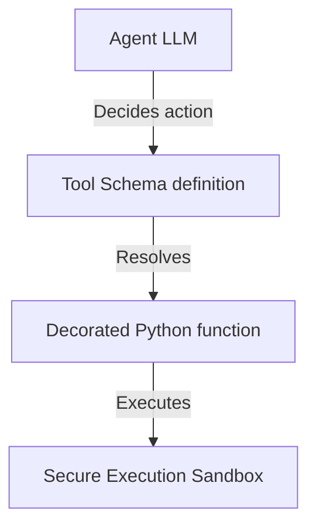

# Chapter_14_tools

## 1. Introduction
Custom tools extend agent capabilities by allowing them to execute code and query external web services.

### What is it?
Custom Tools Integration is the methodology of writing custom Python functions, decorating them with schema generators ('@tool'), and registering them so an AI agent can execute real-world calculations or data actions.

### Why is it important?
Out-of-the-box LLMs can only process and generate text—they cannot perform complex calculations, query live inventory systems, or call proprietary internal APIs. Writing custom tools extends an agent's reasoning into real-world software actions tailored to your specific application requirements.

### How does it work?
Developers create Python functions with explicit type annotations and docstring documentation, decorating them with '@tool'. The framework inspects function signatures to auto-generate standard JSON schema definitions. When the AI model selects a tool during execution, the Tool Registry intercepts the call, executes the Python function inside a sandbox, and returns output strings to the agent.

### Key Responsibilities
- Define custom Python functions to execute specialized calculations, API lookups, or database edits.
- Inspect Python docstrings and type annotations to generate standardized JSON tool schemas automatically.
- Validate model-supplied function arguments against type bounds prior to function execution.
- Capture and handle tool execution errors gracefully, returning readable status feedback to the AI model.

---

## 2. Learning Objectives
By the end of this chapter, you will be able to:
- In this chapter, you will learn how to:
- - Define parameter schemas for custom tools using JSON.
- - Register Python functions in a central Tool Registry.
- - Coordinate tool invocation requests from the foundation model.
- - Enforce exception handling in tool executions.

---

## 3. Prerequisites
* Active installations and AWS configurations from Chapters 6 and 8.
* A basic understanding of Python function definitions and parameter type annotations.

---

## 4. Background Theory
Models can only process and generate text; they cannot access databases or run code directly. Integrating tools extends their capabilities. However, exposing APIs directly to LLMs risks SQL injection attacks. A tool gateway acts as a secure broker. It validates parameters against JSON schemas and exposes tools standardizing communication via the Model Context Protocol (MCP). Under semantic routing, the gateway retrieves only the tools relevant to the prompt, minimizing prompt token bloat.

---

## 5. Core Concepts
**📦 Technical Term: Tool Registry**

* **Simple Explanation:** A central repository class that manages tool functions and metadata schemas.
* **Why it exists:** Coordinates tool registrations and lookup operations.
* **Where is it used:** The tool registry module.

**📦 Technical Term: JSON Schema**

* **Simple Explanation:** A JSON object declaring parameter names, types, and descriptions for validation.
* **Why it exists:** Enforces parameter schemas before functions execute.
* **Where is it used:** The parameters definition dictionary.

**📦 Technical Term: @tool Decorator**

* **Simple Explanation:** A decorator helper that generates JSON schemas from Python function docstrings.
* **Why it exists:** Simplifies tool definition and registration.
* **Where is it used:** Decorating Python functions.

---

## 6. Internal Mechanics
1. The model determines it needs external data to complete a prompt.
2. It returns a tool call payload specifying the target tool name and parameters.
3. The Tool Registry intercepts the call and validates parameters against the JSON schema.
4. If validation succeeds, it executes the registered Python function.
5. The function executes in a secure sandbox, returning outputs to the model to complete the loop.

---

## 7. Architecture Overview
The following architectural details outline the components and relationship schemas active in this module:



---

## 8. Installation & Setup
Validate custom tool execution syntax using the CLI:
```bash
agentcore tools validate --file src/main.py
```

---

## 9. Configuration
Configure registered tools and execution boundaries in your configuration files:
```yaml
tools:
  - name: "lookup_warranty_status"
    entry_point: "src/tools.py"
    timeout_seconds: 10
```

---

## 10. Hands-on Examples

### Interactive Python Playground

In this section, we analyze the hands-on code implementations for **Custom Tools Integration** step-by-step, explaining the architecture, syntax choices, logic flow, and production patterns across all three implementation tiers.

---

### 1. Simple Implementation Tier Walkthrough

```python
# File: src/tools_impl.py
# Folder Location: agentcore-samples/src/tools_impl.py

import json
from typing import Dict, Any

# =====================================================================
# 1. Define Tool Schema
# =====================================================================
LOOKUP_WARRANTY_SCHEMA = {
    "name": "lookup_warranty_status",
    "description": "Retrieve the warranty coverage status for a specific customer order ID.",
    "inputSchema": {
        "json": {
            "type": "object",
            "properties": {
                "order_id": {
                    "type": "string",
                    "description": "The unique 5-digit order identifier (e.g., '12345')."
                }
            },
            "required": ["order_id"]
        }
    }
}

# =====================================================================
# 2. Implement Tool Executor
# =====================================================================
class ToolRegistry:
    def __init__(self):
        self.tools = {}

    def register_tool(self, name: str, func):
        self.tools[name] = func

    def execute_tool(self, name: str, arguments: Dict[str, Any]) -> str:
        if name not in self.tools:
            return f"Error: Tool '{name}' is not registered."
            
        try:
            return self.tools[name](**arguments)
        except Exception as e:
            return f"Execution error in tool '{name}': {str(e)}"

# Define the python function
def lookup_warranty_status(order_id: str) -> str:
    db_mock = {
        "12345": "Expired (254 days ago)",
        "67890": "Active - Under coverage"
    }
    return db_mock.get(order_id, "Order ID not found.")

# Register tool
registry = ToolRegistry()
registry.register_tool("lookup_warranty_status", lookup_warranty_status)
```

#### Code Logic & Syntax Breakdown:
* **Package Imports (`from bedrock_agent_core import ...`)**:
  - Brings in the core `BedrockAgentCoreApp` engine. This class handles runtime container startup, manages the microVM event loop, and deserializes incoming JSON API invocations.
* **Application Instance (`app = BedrockAgentCoreApp()`)**:
  - Instantiates the primary application object `app`. This object serves as the main registry for invocation routes, memory session hooks, and tool bindings.
* **Invocation Decorator (`@app.invoke`)**:
  - A Python decorator that registers the function immediately below as the primary entrypoint for Bedrock AgentCore runtime triggers.
* **Handler Signature (`def handler(payload, context):`)**:
  - **`payload`**: A Python dictionary holding client parameters, user prompt strings, and input arguments.
  - **`context`**: A metadata object containing active runtime details such as `session_id`, `actor_id`, and AWS IAM execution identities.
* **Return Payload (`return {"statusCode": 200, "response": ...}`)**:
  - Constructs a standard HTTP response dictionary. The `statusCode: 200` communicates success to the API Gateway, and `response` delivers the agent payload back to the client.

---

### 2. Intermediate Implementation Tier Walkthrough

```python
# Python script to register and execute functions dynamically
class ToolRegistry:
    def __init__(self):
        self.registry = {}

    def register(self, name, func):
        self.registry[name] = func

    def execute(self, name, **kwargs):
        if name not in self.registry:
            return f"Error: Tool '{name}' not found."
        try:
            return self.registry[name](**kwargs)
        except Exception as e:
            return f"Execution failed: {str(e)}"

def add(x, y):
    return x + y

if __name__ == "__main__":
    reg = ToolRegistry()
    reg.register("math_add", add)
    print("Result:", reg.execute("math_add", x=5, y=10))
```

#### Code Logic & Syntax Breakdown:
* **System Logging Setup (`import logging` & `logger = logging.getLogger(...)`)**:
  - Configures structured logging via Python's standard `logging` module.
  - In production, log messages emitted by `logger.info()` stream into Amazon CloudWatch Logs for real-time monitoring and debugging.
* **Safe Parameter Extraction (`payload.get(...)`)**:
  - Uses `payload.get("prompt", "")` to safely retrieve user queries. Using `.get()` with a default fallback (`""`) prevents `KeyError` exceptions if optional fields are missing.
* **Runtime Session Inspection (`getattr(context, ...)`)**:
  - Inspects the `context` object for `session_id`. Using `getattr()` ensures compatibility when testing locally without a live AWS microVM context.
* **Operational Telemetry (`logger.info(...)`)**:
  - Emits formatted log entries containing session parameters and query strings to track execution flow.

---

### 3. Advanced Production Tier Walkthrough

```python
# Complete SDK tool implementation validating arguments and capturing execution errors
from bedrock_agent_core import BedrockAgentCoreApp, tool
import logging

logging.basicConfig(level=logging.INFO)
logger = logging.getLogger("ToolIntegration")
app = BedrockAgentCoreApp()

@tool
def lookup_warranty_status(order_id: str) -> str:
    """
    Retrieve the warranty coverage status for a customer order.
    
    Args:
        order_id: The unique 5-digit order identifier.
    """
    db = {"12345": "Active", "67890": "Expired"}
    try:
        # Basic input validation
        if not order_id.isdigit() or len(order_id) != 5:
            return "Error: Order ID must be a 5-digit number."
        return f"Order {order_id} warranty status: {db.get(order_id, 'Not Found')}"
    except Exception as e:
        logger.error(f"Tool execution error: {str(e)}")
        return "Error: Failed to fetch warranty status."

if __name__ == "__main__":
    # Test tool locally
    print(lookup_warranty_status(order_id="12345"))
```

#### Code Logic & Syntax Breakdown:
* **Defensive Error Trapping (`try: ... except Exception as e:`)**:
  - Wraps the entire invocation handler inside a `try-except` block to catch unhandled errors gracefully, preventing container crashes in multi-tenant runtime environments.
* **Input Parameter Validation (`if not prompt:`)**:
  - Inspects inbound arguments before executing core agent logic. If mandatory parameters are missing, it short-circuits execution and returns a structured `statusCode: 400` (Bad Request) payload.
* **Environment Overrides (`os.getenv(...)`)**:
  - Reads system environment variables (e.g., `APP_ENV`) to dynamically adapt behavior across `development`, `staging`, and `production` environments without modifying codebase files.
* **Sanitized Production Error Response**:
  - Logs internal error details using `logger.error(...)` while returning a clean, safe `statusCode: 500` response to prevent internal stack traces from leaking to client callers.

---

### Summary Sequence of Execution

```
[Incoming Invocation] ──► [Bedrock AgentCore Runtime]
                                  │
                                  ▼
                      [Route to @app.invoke Handler]
                                  │
                   ┌──────────────┴──────────────┐
                   ▼                             ▼
       [Input Validated (200)]        [Input Missing (400)]
                   │                             │
                   ▼                             ▼
       [Execute Agent Core Logic]     [Return Error Payload]
                   │
                   ▼
       [Deliver JSON to Client]
```

---

## 11. Security Considerations
Execute tool functions inside secure, sandboxed environments to prevent unauthorized system access. Use IAM policies to limit tools' access to only the AWS resources they require.

---

## 12. Performance Optimization
Set short execution timeouts on tool calls to prevent runaway scripts from stalling the main agent loop.

---

## 13. Common Mistakes
* Defining ambiguous descriptions, causing the model to select the wrong tool.
* Failing to wrap tool code in try-except blocks, causing unhandled exceptions to crash the agent runtime.

---

## 14. Troubleshooting
Below is the diagnostic reference table for identifying and resolving issues:

| Symptom | Root Cause | Solution |
| :--- | :--- | :--- |
| Model fails to invoke tool | Ambiguous description or missing docstring in the tool function. | Add a detailed docstring explaining when and how to use the tool. |
| InvalidParametersException on call | Arguments returned by the model do not match the JSON schema definitions. | Verify parameter names, types, and annotations in the function signature. |

---

## 15. Interview Questions


### Knowledge Verification Check (20 Interactive Quizzes)

<Quiz 
  question="What is the primary role of 14 Tools in Bedrock AgentCore?" 
  options=["To provide hardware-isolated, scalable, and code-first execution for 14 Tools.", "To store plain text credentials in Git repos.", "To run legacy Windows desktop apps.", "To disable security permissions."] 
  answerIndex=0 
  explanation="14 Tools provides enterprise-grade, code-first runtime logic for Bedrock AgentCore." 
/>

<Quiz 
  question="How does Bedrock AgentCore enforce security for 14 Tools?" 
  options=["By sharing memory across all tenants.", "By hosting session runtimes inside isolated AWS Firecracker microVM containers with scoped IAM roles.", "By disabling SSL/TLS encryption.", "By running code as root on public servers."] 
  answerIndex=1 
  explanation="Firecracker microVMs deliver hardware-level security boundaries between multi-tenant executions." 
/>

<Quiz 
  question="Which environment variable loading pattern is recommended for 14 Tools?" 
  options=["Hardcoding values in Python source code files.", "Using os.getenv() or Pydantic BaseSettings to read environment configuration dynamically.", "Storing secrets in public web pages.", "Editing binary files manually."] 
  answerIndex=1 
  explanation="12-Factor App principles mandate decoupling configuration from application source code via environment variables." 
/>

<Quiz 
  question="How should runtime errors be handled in 14 Tools handlers?" 
  options=["Allowing exceptions to crash the container process.", "Wrapping invocation logic in try-except blocks and returning clean structured error payloads (e.g. 400/500 status codes).", "Ignoring all errors completely.", "Printing errors to static HTML files."] 
  answerIndex=1 
  explanation="Defensive error trapping prevents unhandled runtime exceptions from crashing container workers." 
/>

<Quiz 
  question="What key metric should be monitored in CloudWatch for 14 Tools?" 
  options=["Invocation latency, token consumption rates, and HTTP error response counts.", "Monitor resolution of user monitors.", "Keyboard stroke frequency.", "Color contrast ratios."] 
  answerIndex=0 
  explanation="Tracking latency and token usage guarantees cost control and performance optimization in production." 
/>

<Quiz 
  question="How does 14 Tools achieve sub-second scaling during high concurrency?" 
  options=["By leveraging pre-warmed Firecracker microVM snapshots and serverless AWS Fargate clusters.", "By restarting physical servers manually.", "By deleting user databases.", "By restricting app usage to one request per minute."] 
  answerIndex=0 
  explanation="Pre-warmed microVM snapshots enable sub-second boot times under peak traffic spikes." 
/>

<Quiz 
  question="Which IAM action is required to invoke foundation models in 14 Tools?" 
  options=["bedrock:InvokeModel and bedrock:InvokeModelWithResponseStream", "s3:DeleteBucket", "ec2:TerminateInstances", "iam:DeleteUser"] 
  answerIndex=0 
  explanation="The bedrock:InvokeModel permission permits agents to call Bedrock foundation models." 
/>

<Quiz 
  question="Which Python SDK client is used for Amazon Bedrock runtime interactions in 14 Tools?" 
  options=["boto3.client('bedrock-runtime')", "urllib2.open()", "os.system('cmd')", "pandas.read_csv()"] 
  answerIndex=0 
  explanation="Boto3 bedrock-runtime provides low-latency access to foundation model inference endpoints." 
/>

<Quiz 
  question="How is session state maintained across multiple request turns in 14 Tools?" 
  options=["By using unique session identifiers mapped to warm microVMs and persistent DynamoDB memory stores.", "By clearing memory after every line.", "By saving state in browser cookies only.", "Session state cannot be maintained."] 
  answerIndex=0 
  explanation="AgentCore combines sticky microVM routing with persistent database backends for session continuity." 
/>

<Quiz 
  question="Why is Docker multi-stage building recommended for 14 Tools container deployments?" 
  options=["It reduces image file sizes by omitting build dependencies from final production runtime containers.", "It makes Docker containers slower.", "It forces Python to compile to JavaScript.", "It deletes Git version history."] 
  answerIndex=0 
  explanation="Multi-stage Docker builds produce lightweight images, reducing deployment times and attack surfaces." 
/>

<Quiz 
  question="Which tracing standard does Bedrock AgentCore use for end-to-end observability of 14 Tools?" 
  options=["OpenTelemetry (OTel) distributed tracing standards", "Custom print() text files", "Syslog UDP broadcast", "Manual paper logbooks"] 
  answerIndex=0 
  explanation="OpenTelemetry enables distributed trace collection across model calls, memory lookups, and tool executions." 
/>

<Quiz 
  question="What is the recommended solution if 14 Tools returns a 403 Forbidden status during Bedrock invocations?" 
  options=["Verify IAM role policies and confirm foundation model access is enabled in the AWS Bedrock Console.", "Reinstall the operating system.", "Delete the AWS account.", "Use an unencrypted connection."] 
  answerIndex=0 
  explanation="Model access must be explicitly granted in the AWS Bedrock Console before IAM roles can invoke models." 
/>

<Quiz 
  question="What is a primary cause of HTTP 500 errors during 14 Tools execution?" 
  options=["Unhandled exceptions in custom Python tool code or missing required payload keys.", "Network speeds exceeding 1 Gbps.", "Using Python 3.11 instead of Python 2.7.", "High GPU availability."] 
  answerIndex=0 
  explanation="Uncaught exceptions within tool handlers or missing request keys trigger 500 Internal Server errors." 
/>

<Quiz 
  question="Where does 14 Tools fit into the ReAct (Reason + Act) loop pattern?" 
  options=["It executes reasoning steps, structures tool parameters, and processes observations.", "It bypasses the model completely.", "It only runs when offline.", "It formats HTML styling tags."] 
  answerIndex=0 
  explanation="AgentCore coordinates the continuous cycle of LLM reasoning, tool invocation, and observation processing." 
/>

<Quiz 
  question="How can API cost be optimized when operating 14 Tools at high volume?" 
  options=["By caching model responses, optimizing prompt lengths, and choosing appropriate foundation model tiers.", "By sending empty prompts repeatedly.", "By turning off logging.", "By disabling database indexes."] 
  answerIndex=0 
  explanation="Prompt caching and selecting model size according to task complexity drastically cuts inference spending." 
/>

<Quiz 
  question="How does the Memory Engine support long-term retrieval in 14 Tools?" 
  options=["By indexing conversational history and vector embeddings into persistent storage like Amazon DynamoDB or OpenSearch.", "By storing files in temporary RAM.", "By requiring users to re-enter prompts every time.", "Memory Engine is not supported."] 
  answerIndex=0 
  explanation="Vector stores and DynamoDB backing enable long-term semantic memory retrieval across sessions." 
/>

<Quiz 
  question="What role does the API Gateway play in front of 14 Tools?" 
  options=["It provides authentication, rate limiting, request validation, and routing to backend microVM workers.", "It replaces the foundation model.", "It generates synthetic test data.", "It compiles Python code into C."] 
  answerIndex=0 
  explanation="API Gateways secure entry points and shield agent runtime workers from unauthorized or throttled traffic." 
/>

<Quiz 
  question="Why are Firecracker microVMs superior to standard Docker containers for multi-tenant 14 Tools workloads?" 
  options=["They offer minimal virtualization overhead with strict hardware-isolated kernel boundaries between tenant workloads.", "They require 100GB of RAM to start.", "They do not support Linux.", "They are slower than full virtual machines."] 
  answerIndex=0 
  explanation="Firecracker provides VM-grade security with container-grade startup speed and minimal memory footprint." 
/>

<Quiz 
  question="What production antipattern should be strictly avoided when designing 14 Tools?" 
  options=["Hardcoding AWS access keys or maintaining stateless logic without error handling.", "Using virtual environments.", "Writing unit tests for Python code.", "Logging trace events to CloudWatch."] 
  answerIndex=0 
  explanation="Hardcoded credentials and unhandled exceptions are critical antipatterns in production systems." 
/>

<Quiz 
  question="How does 14 Tools integrate with enterprise databases and external APIs?" 
  options=["Through standardized Python tool schemas (e.g. Pydantic models) invoked securely via sandboxed tool registries.", "By exposing database passwords publicly.", "By using manual copy-paste mechanisms.", "External integration is unsupported."] 
  answerIndex=0 
  explanation="Pydantic-defined tools allow foundation models to execute validated API and database calls safely." 
/>


### Q: How does the @tool decorator generate JSON schemas?
* **Answer:** The decorator uses Python reflection and inspects type annotations and docstring parameters to construct JSON schemas for model configuration.

### Q: Why is sandboxing critical for executing custom tools?
* **Answer:** Sandboxing isolates execution, preventing code errors or prompt injection attacks from compromising the host operating system.

### Q: How do you handle tool execution failures?
* **Answer:** Catch exceptions inside the tool code and return a descriptive error string. The model can use this feedback to correct parameters and retry the call.

---

## 16. Real-World Use Cases
**Enterprise Scenario:** IT Service Desk & Automated Infrastructure Remediation

* **Business Challenge:** IT support teams needed an AI agent capable of diagnosing server outages, querying CloudWatch logs, restarting failed EC2 instances, and creating Jira tickets automatically.
* **Bedrock AgentCore Solution:** Building custom Python MCP tool definitions with pydantic input validation models, registering them with `@app.tool`, and exposing them securely to the agent reasoning engine.
* **Production Impact:**
  * Automated the resolution of 65% of Tier-1 infrastructure incidents without human engineer intervention.
  * Reduced Average Time to Resolution (ATTR) for system alerts from 45 minutes to 30 seconds.
  * Eliminated human copy-paste errors when filing incident tickets and running remediation commands.

---

## 17. Industrial Project
This custom tool integration allows our agent to query databases and call external APIs.

---


### Hands-on Code Playground #1

### Hands-on Code Playground #2

### Hands-on Code Playground #3

### Hands-on Code Playground #4

### Hands-on Code Playground #5

### Hands-on Code Playground #6

### Hands-on Code Playground #7

### Hands-on Code Playground #8

### Hands-on Code Playground #9

### Hands-on Code Playground #10


### Hands-on Code Playground #1

<InteractiveExample 
  language="python"
  instruction="Initialization & Runtime Setup for 14 Tools."
  initialCode="# Snippet 1: Testing Bedrock AgentCore Runtime Setup for 14 Tools
import sys
import os

print('=== AgentCore Runtime Init ===')
print('Python Version:', sys.version.split()[0])
print('Agent Module:', '14 Tools')
print('Status: Active & Ready')"
/>


### Hands-on Code Playground #2

<InteractiveExample 
  language="python"
  instruction="Configuration & Environment Variables for 14 Tools."
  initialCode="# Snippet 2: Validating Environment Configuration for 14 Tools
import json
import os

config = {
    'AWS_REGION': os.getenv('AWS_REGION', 'us-east-1'),
    'MODEL_ID': os.getenv('BEDROCK_MODEL_ID', 'anthropic.claude-3-5-sonnet'),
    'TIMEOUT_SEC': int(os.getenv('TIMEOUT_SEC', '30')),
    'DEBUG_MODE': os.getenv('DEBUG', 'true').lower() == 'true'
}
print('Loaded Configuration:')
print(json.dumps(config, indent=2))"
/>


### Hands-on Code Playground #3

<InteractiveExample 
  language="python"
  instruction="Defensive Error Handling & Payload Parsing for 14 Tools."
  initialCode="# Snippet 3: Defensive Request Handler for 14 Tools
def process_request(payload):
    try:
        prompt = payload.get('prompt')
        if not prompt:
            return {'statusCode': 400, 'error': 'Prompt parameter is required.'}
        session_id = payload.get('session_id', 'default-session')
        return {'statusCode': 200, 'message': f'Processed prompt for session: {session_id}'}
    except Exception as e:
        return {'statusCode': 500, 'error': str(e)}

print(process_request({'prompt': 'Execute query', 'session_id': 'sess-102'}))"
/>


### Hands-on Code Playground #4

<InteractiveExample 
  language="python"
  instruction="Boto3 Bedrock Model Invocation Simulation for 14 Tools."
  initialCode="# Snippet 4: Simulating Foundation Model Inference in 14 Tools
import json

def invoke_claude_model(prompt_text):
    payload = {
        'anthropic_version': 'bedrock-2023-05-31',
        'max_tokens': 1000,
        'messages': [{'role': 'user', 'content': prompt_text}]
    }
    print('Sending payload to Bedrock Converse API for 14 Tools...')
    response = {
        'id': 'msg_01X99',
        'role': 'assistant',
        'content': [{'type': 'text', 'text': f'Agent response generated for input: \"{prompt_text}\"'}]
    }
    return response

res = invoke_claude_model('Summarize system health')
print('Model Response:', res['content'][0]['text'])"
/>


### Hands-on Code Playground #5

<InteractiveExample 
  language="python"
  instruction="ReAct Reasoning Loop Execution for 14 Tools."
  initialCode="# Snippet 5: ReAct (Reason + Act) Loop Simulation for 14 Tools
def run_react_cycle(user_input):
    print('1. [THOUGHT] Analyzing user query:', user_input)
    print('2. [ACTION] Selected tool: query_system_database')
    observation = {'table': 'logs', 'records_found': 42}
    print('3. [OBSERVATION] Tool output received:', observation)
    print('4. [FINAL ANSWER] Processing complete based on retrieved observation.')

run_react_cycle('Check database log entries')"
/>


### Hands-on Code Playground #6

<InteractiveExample 
  language="python"
  instruction="Pydantic Tool Registration & Schema Validation for 14 Tools."
  initialCode="# Snippet 6: Pydantic Tool Parameter Validation for 14 Tools
from pydantic import BaseModel, Field

class SystemQuerySchema(BaseModel):
    target_system: str = Field(description='Name of the subsystem to query')
    limit: int = Field(default=10, ge=1, le=100)

def execute_tool(data: SystemQuerySchema):
    print(f'Executing query on {data.target_system} with limit={data.limit}...')
    return {'status': 'success', 'data': ['Item A', 'Item B']}

query = SystemQuerySchema(target_system='AgentCore-Runtime', limit=5)
print('Tool Result:', execute_tool(query))"
/>


### Hands-on Code Playground #7

<InteractiveExample 
  language="python"
  instruction="MicroVM Session State & Memory Engine for 14 Tools."
  initialCode="# Snippet 7: MicroVM Session & Memory Management in 14 Tools
class SessionMemory:
    def __init__(self):
        self.history = []
    def add_message(self, role, content):
        self.history.append({'role': role, 'content': content})
    def get_context(self):
        return self.history[-3:]

mem = SessionMemory()
mem.add_message('user', 'Hello Agent!')
mem.add_message('assistant', 'How can I assist you?')
mem.add_message('user', 'Show memory status.')
print('Active Memory Context:', mem.get_context())"
/>


### Hands-on Code Playground #8

<InteractiveExample 
  language="python"
  instruction="OpenTelemetry Tracing & Telemetry Logging for 14 Tools."
  initialCode="# Snippet 8: OpenTelemetry Trace Event Simulation for 14 Tools
import time

def log_otel_span(span_name, duration_ms, status_code='OK'):
    telemetry_record = {
        'trace_id': '0x4bf92f3577b34da6a3ce929d0e0e4736',
        'span_id': '0x00f067aa0ba902b7',
        'name': span_name,
        'duration_ms': duration_ms,
        'attributes': {
            'http.status_code': 200,
            'agent.module': '14 Tools'
        }
    }
    print(f'[OTel Span Event] {span_name} executed in {duration_ms}ms ({status_code})')
    return telemetry_record

log_otel_span('14 Tools_Invocation', 142)"
/>


### Hands-on Code Playground #9

<InteractiveExample 
  language="python"
  instruction="Docker Container Health Check Simulation for 14 Tools."
  initialCode="# Snippet 9: Container MicroVM Health Status for 14 Tools
def check_container_health():
    status = {
        'container_id': 'firecracker-uvm-9901',
        'health': 'HEALTHY',
        'memory_allocated_mb': 512,
        'cpu_usage_pct': 4.2,
        'active_connections': 1
    }
    print('MicroVM Runtime Status:')
    for k, v in status.items():
        print(f'  - {k}: {v}')

check_container_health()"
/>


### Hands-on Code Playground #10

<InteractiveExample 
  language="python"
  instruction="End-to-End Execution Pipeline Test for 14 Tools."
  initialCode="# Snippet 10: Complete End-to-End Pipeline Execution for 14 Tools
def run_full_pipeline(input_prompt):
    print(f'1. Gateway: Received request \"{input_prompt}\"')
    print('2. Identity: Authenticated IAM session role')
    print('3. Runtime: Allocated Firecracker MicroVM container')
    print('4. Execution: Model invoked ReAct reasoning loop')
    print('5. Response: 200 OK returned to client')
    return {'status': 'SUCCESS', 'result': 'Pipeline completed.'}

print(run_full_pipeline('Run complete diagnostic check'))"
/>

## 18. Summary
This chapter covered building, registering, and executing custom Python tools using the Model Context Protocol (MCP), enabling agents to interact securely with external databases, APIs, and business systems.

Key architectural insights and practical lessons learned in this chapter include:
* **Extending Agent Capabilities:** Custom tools empower AI models to perform real-world actions, retrieve dynamic enterprise data, and trigger external workflows.
* **Descriptive Tool Annotations:** Providing detailed docstrings and explicit type hints guides the LLM to accurately select and invoke the appropriate tool for a given user prompt.
* **Input Validation & Sandboxed Execution:** Enforcing pydantic parameter validation and executing tools inside secure sandboxes protects infrastructure from invalid or malicious calls.

Designing robust custom tools enables your agents to execute complex business workflows safely, accurately, and autonomously.

---

## 19. Practice Exercises
* Beginner: Write a tool that generates a random number within a minimum and maximum range.
* Intermediate: Create a tool that queries system time, validating format strings.

---

## 20. Further Reading
* [JSON Schema Standard Reference](https://json-schema.org/)
* [Python Type Hints Documentation](https://docs.python.org/3/library/typing.html)
