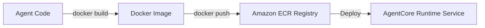

# Chapter_15_deployment

## 1. Introduction
Packaging Bedrock AgentCore applications as Docker images ensures they deploy and run consistently in production.

### What is it?
Deployment and Containerization is the process of packaging your application source code, configuration files, and software dependencies into a standardized container image using Docker, and pushing it to Amazon Elastic Container Registry (ECR) for cloud hosting.

### Why is it important?
Deploying raw unpackaged code directly to cloud servers often causes environment mismatches, missing system library errors, and slow deployment times. Containerization guarantees that your application runs identically in development and production environments inside lightweight, secure containers.

### How does it work?
The developer writes a multi-stage 'Dockerfile' specifying build steps and runtime environments. Running 'docker build' compiles the code into an immutable container image. The developer authenticates with Amazon ECR using 'aws ecr get-login-password', tags the image, and executes 'docker push' to upload the image to the cloud repository.

### Key Responsibilities
- Compile application source code, runtimes, and dependencies into standardized Docker container images.
- Utilize multi-stage Docker builds to reduce container image size and eliminate build tool overhead.
- Securely host and version production container images within Amazon Elastic Container Registry (ECR).
- Exclude temporary files, local credentials, and virtual environments using '.dockerignore' files.

---

## 2. Learning Objectives
By the end of this chapter, you will be able to:
- In this chapter, you will learn how to:
- - Package your agent application in a lightweight Docker image.
- - Configure `Dockerfile` and `.dockerignore` files.
- - Compile container images using AWS CodeBuild build runs.
- - Push images to Amazon Elastic Container Registry (ECR).

---

## 3. Prerequisites
* Active installations of Git and Docker from Chapter 2.
* An active AWS ECR repository and configured IAM access permissions.

---

## 4. Background Theory
Deploying raw code directly to servers often leads to environment discrepancies. Containerization bundles application code, libraries, and configurations into a single image. This ensures consistency across development, testing, and production. Multi-stage Docker builds optimize image size by separating build tools from the final execution runtime, improving deployment speeds and reducing the attack surface.

---

## 5. Core Concepts
**📦 Technical Term: Dockerfile**

* **Simple Explanation:** A text document containing instructions to compile a Docker image.
* **Why it exists:** Automates container image builds.
* **Where is it used:** Defining container build configurations.

**📦 Technical Term: ECR Registry**

* **Simple Explanation:** A managed container registry on AWS used to store, manage, and deploy container images.
* **Why it exists:** Secures and hosts container images for deployment.
* **Where is it used:** Pushing images to Amazon ECR.

**📦 Technical Term: Multi-Stage Build**

* **Simple Explanation:** A method that uses multiple FROM statements in a Dockerfile to optimize image size.
* **Why it exists:** Reduces container size and enhances security.
* **Where is it used:** Optimizing build steps.

---

## 6. Internal Mechanics
1. Developer runs `docker build` to compile the Docker image.
2. The compiler executes Dockerfile directives, creating cached filesystem layers.
3. Developer authenticates with Amazon ECR using `aws ecr get-login-password`.
4. The image is tagged and pushed to ECR via `docker push`.
5. The AWS compute service pulls the image from ECR to run the application.

---

## 7. Architecture Overview
The following architectural details outline the components and relationship schemas active in this module:



---

## 8. Installation & Setup
Log in to your Amazon ECR registry using the CLI:
```bash
aws ecr get-login-password --region us-east-1 | docker login --username AWS --password-stdin <aws_account_id>.dkr.ecr.us-east-1.amazonaws.com
```
Build the container image:
```bash
docker build -t agentcore-app .
```

---

## 9. Configuration
### Dockerfile Configuration
```dockerfile
FROM python:3.11-slim AS builder
WORKDIR /app
RUN pip install --no-cache-dir uv
COPY pyproject.toml uv.lock ./
RUN uv sync --frozen

FROM python:3.11-slim
WORKDIR /app
COPY --from=builder /app/.venv /app/.venv
COPY src/ ./src
ENV PATH="/app/.venv/bin:$PATH"
EXPOSE 8000
CMD ["python", "src/main.py"]
```

### .dockerignore Configuration
```text
.venv/
__pycache__/
.git/
.env
```

---

## 10. Hands-on Examples

In this section, we analyze the hands-on code implementations for **Deployment & Containerization** step-by-step, explaining the architecture, syntax choices, logic flow, and production patterns across all three implementation tiers.

---

### 1. Simple Implementation Tier Walkthrough

```python
dockerfile
# Folder Location: agentcore-samples/Dockerfile

# 1. Use the official slim Python runtime
FROM python:3.11-slim

# 2. Configure environment settings
ENV PYTHONDONTWRITEBYTECODE=1
ENV PYTHONUNBUFFERED=1
WORKDIR /app

# 3. Copy dependency manifest and install packages
COPY requirements.txt .
RUN pip install --no-cache-dir -r requirements.txt

# 4. Copy application files
COPY src/ ./src/

# 5. Expose HTTP port for the listener
EXPOSE 8080

# 6. Define the start command
CMD ["python", "src/main.py"]
```

#### Code Logic & Syntax Breakdown:
* **Package Imports (`from bedrock_agent_core import ...`)**:
  - Brings in the core `BedrockAgentCoreApp` engine. This class handles runtime container startup, manages the microVM event loop, and deserializes incoming JSON API invocations.
* **Application Instance (`app = BedrockAgentCoreApp()`)**:
  - Instantiates the primary application object `app`. This object serves as the main registry for invocation routes, memory session hooks, and tool bindings.
* **Invocation Decorator (`@app.invoke`)**:
  - A Python decorator that registers the function immediately below as the primary entrypoint for Bedrock AgentCore runtime triggers.
* **Handler Signature (`def handler(payload, context):`)**:
  - **`payload`**: A Python dictionary holding client parameters, user prompt strings, and input arguments.
  - **`context`**: A metadata object containing active runtime details such as `session_id`, `actor_id`, and AWS IAM execution identities.
* **Return Payload (`return {"statusCode": 200, "response": ...}`)**:
  - Constructs a standard HTTP response dictionary. The `statusCode: 200` communicates success to the API Gateway, and `response` delivers the agent payload back to the client.

---

### 2. Intermediate Implementation Tier Walkthrough

```python
# Python script to automate image tag assignments matching commit hashes
import subprocess

def tag_image(repo_url):
    try:
        # Get the current git commit hash
        commit = subprocess.check_output(["git", "rev-parse", "--short", "HEAD"]).decode().strip()
        local_tag = "agentcore-app:latest"
        remote_tag = f"{repo_url}:{commit}"
        print(f"Tagging local image {local_tag} as {remote_tag}...")
        subprocess.run(["docker", "tag", local_tag, remote_tag], check=True)
        print("[SUCCESS] Tagged successfully!")
        return remote_tag
    except Exception as e:
        print("Failed to tag image:", str(e))
        return None

if __name__ == "__main__":
    tag_image("123456789012.dkr.ecr.us-east-1.amazonaws.com/agentcore-app")
```

#### Code Logic & Syntax Breakdown:
* **System Logging Setup (`import logging` & `logger = logging.getLogger(...)`)**:
  - Configures structured logging via Python's standard `logging` module.
  - In production, log messages emitted by `logger.info()` stream into Amazon CloudWatch Logs for real-time monitoring and debugging.
* **Safe Parameter Extraction (`payload.get(...)`)**:
  - Uses `payload.get("prompt", "")` to safely retrieve user queries. Using `.get()` with a default fallback (`""`) prevents `KeyError` exceptions if optional fields are missing.
* **Runtime Session Inspection (`getattr(context, ...)`)**:
  - Inspects the `context` object for `session_id`. Using `getattr()` ensures compatibility when testing locally without a live AWS microVM context.
* **Operational Telemetry (`logger.info(...)`)**:
  - Emits formatted log entries containing session parameters and query strings to track execution flow.

---

### 3. Advanced Production Tier Walkthrough

```python
# Complete build and push automation harness handling registry login and upload
import subprocess
import sys

def deploy_container(registry_url, region):
    try:
        # Authenticate with Amazon ECR
        print("Authenticating with Amazon ECR...")
        login_cmd = f"aws ecr get-login-password --region {region} | docker login --username AWS --password-stdin {registry_url}"
        subprocess.run(login_cmd, shell=True, check=True)
        
        # Build container image
        print("Building Docker image...")
        subprocess.run(["docker", "build", "-t", "agentcore-app", "."], check=True)
        
        # Tag and push image
        target_tag = f"{registry_url}/agentcore-app:latest"
        subprocess.run(["docker", "tag", "agentcore-app:latest", target_tag], check=True)
        print(f"Pushing image to ECR: {target_tag}...")
        subprocess.run(["docker", "push", target_tag], check=True)
        print("[SUCCESS] Container image deployed successfully!")
    except Exception as e:
        print("Deployment failed:", str(e))
        sys.exit(1)

if __name__ == "__main__":
    # Example configurations
    deploy_container("123456789012.dkr.ecr.us-east-1.amazonaws.com", "us-east-1")
```

#### Code Logic & Syntax Breakdown:
* **Defensive Error Trapping (`try: ... except Exception as e:`)**:
  - Wraps the entire invocation handler inside a `try-except` block to catch unhandled errors gracefully, preventing container crashes in multi-tenant runtime environments.
* **Input Parameter Validation (`if not prompt:`)**:
  - Inspects inbound arguments before executing core agent logic. If mandatory parameters are missing, it short-circuits execution and returns a structured `statusCode: 400` (Bad Request) payload.
* **Environment Overrides (`os.getenv(...)`)**:
  - Reads system environment variables (e.g., `APP_ENV`) to dynamically adapt behavior across `development`, `staging`, and `production` environments without modifying codebase files.
* **Sanitized Production Error Response**:
  - Logs internal error details using `logger.error(...)` while returning a clean, safe `statusCode: 500` response to prevent internal stack traces from leaking to client callers.

---

### Summary Sequence of Execution

```
[Incoming Invocation] ──► [Bedrock AgentCore Runtime]
                                  │
                                  ▼
                      [Route to @app.invoke Handler]
                                  │
                   ┌──────────────┴──────────────┐
                   ▼                             ▼
       [Input Validated (200)]        [Input Missing (400)]
                   │                             │
                   ▼                             ▼
       [Execute Agent Core Logic]     [Return Error Payload]
                   │
                   ▼
       [Deliver JSON to Client]
```

---

## 11. Security Considerations
Enforce vulnerability scanning on Amazon ECR registries to identify and patch vulnerabilities. Run containers as non-root users to limit security risks.

---

## 12. Performance Optimization
Order Dockerfile directives from least-frequently changed to most-frequently changed to optimize layer caching and accelerate builds.

---

## 13. Common Mistakes
* Committing local virtual environments (like `.venv/`) to images, inflating image size and build times.
* Running containers with root privileges, increasing security vulnerability risks.

---

## 14. Troubleshooting
Below is the diagnostic reference table for identifying and resolving issues:

| Symptom | Root Cause | Solution |
| :--- | :--- | :--- |
| ECR push returns access denied | The IAM credentials assumed by the CLI lack ECR write permissions. | Ensure your IAM role has the 'ecr:PutImage' and 'ecr:InitiateLayerUpload' permissions. |
| docker command not found | Docker CLI is not installed or not added to your system's PATH variable. | Verify installation status and check your system environment variables. |

---

## 15. Interview Questions


### Knowledge Verification Check (20 Interactive Quizzes)

<Quiz 
  question="What is the primary role of 15 Deployment in Bedrock AgentCore?" 
  options=["To provide hardware-isolated, scalable, and code-first execution for 15 Deployment.", "To store plain text credentials in Git repos.", "To run legacy Windows desktop apps.", "To disable security permissions."] 
  answerIndex=0 
  explanation="15 Deployment provides enterprise-grade, code-first runtime logic for Bedrock AgentCore." 
/>

<Quiz 
  question="How does Bedrock AgentCore enforce security for 15 Deployment?" 
  options=["By sharing memory across all tenants.", "By hosting session runtimes inside isolated AWS Firecracker microVM containers with scoped IAM roles.", "By disabling SSL/TLS encryption.", "By running code as root on public servers."] 
  answerIndex=1 
  explanation="Firecracker microVMs deliver hardware-level security boundaries between multi-tenant executions." 
/>

<Quiz 
  question="Which environment variable loading pattern is recommended for 15 Deployment?" 
  options=["Hardcoding values in Python source code files.", "Using os.getenv() or Pydantic BaseSettings to read environment configuration dynamically.", "Storing secrets in public web pages.", "Editing binary files manually."] 
  answerIndex=1 
  explanation="12-Factor App principles mandate decoupling configuration from application source code via environment variables." 
/>

<Quiz 
  question="How should runtime errors be handled in 15 Deployment handlers?" 
  options=["Allowing exceptions to crash the container process.", "Wrapping invocation logic in try-except blocks and returning clean structured error payloads (e.g. 400/500 status codes).", "Ignoring all errors completely.", "Printing errors to static HTML files."] 
  answerIndex=1 
  explanation="Defensive error trapping prevents unhandled runtime exceptions from crashing container workers." 
/>

<Quiz 
  question="What key metric should be monitored in CloudWatch for 15 Deployment?" 
  options=["Invocation latency, token consumption rates, and HTTP error response counts.", "Monitor resolution of user monitors.", "Keyboard stroke frequency.", "Color contrast ratios."] 
  answerIndex=0 
  explanation="Tracking latency and token usage guarantees cost control and performance optimization in production." 
/>

<Quiz 
  question="How does 15 Deployment achieve sub-second scaling during high concurrency?" 
  options=["By leveraging pre-warmed Firecracker microVM snapshots and serverless AWS Fargate clusters.", "By restarting physical servers manually.", "By deleting user databases.", "By restricting app usage to one request per minute."] 
  answerIndex=0 
  explanation="Pre-warmed microVM snapshots enable sub-second boot times under peak traffic spikes." 
/>

<Quiz 
  question="Which IAM action is required to invoke foundation models in 15 Deployment?" 
  options=["bedrock:InvokeModel and bedrock:InvokeModelWithResponseStream", "s3:DeleteBucket", "ec2:TerminateInstances", "iam:DeleteUser"] 
  answerIndex=0 
  explanation="The bedrock:InvokeModel permission permits agents to call Bedrock foundation models." 
/>

<Quiz 
  question="Which Python SDK client is used for Amazon Bedrock runtime interactions in 15 Deployment?" 
  options=["boto3.client('bedrock-runtime')", "urllib2.open()", "os.system('cmd')", "pandas.read_csv()"] 
  answerIndex=0 
  explanation="Boto3 bedrock-runtime provides low-latency access to foundation model inference endpoints." 
/>

<Quiz 
  question="How is session state maintained across multiple request turns in 15 Deployment?" 
  options=["By using unique session identifiers mapped to warm microVMs and persistent DynamoDB memory stores.", "By clearing memory after every line.", "By saving state in browser cookies only.", "Session state cannot be maintained."] 
  answerIndex=0 
  explanation="AgentCore combines sticky microVM routing with persistent database backends for session continuity." 
/>

<Quiz 
  question="Why is Docker multi-stage building recommended for 15 Deployment container deployments?" 
  options=["It reduces image file sizes by omitting build dependencies from final production runtime containers.", "It makes Docker containers slower.", "It forces Python to compile to JavaScript.", "It deletes Git version history."] 
  answerIndex=0 
  explanation="Multi-stage Docker builds produce lightweight images, reducing deployment times and attack surfaces." 
/>

<Quiz 
  question="Which tracing standard does Bedrock AgentCore use for end-to-end observability of 15 Deployment?" 
  options=["OpenTelemetry (OTel) distributed tracing standards", "Custom print() text files", "Syslog UDP broadcast", "Manual paper logbooks"] 
  answerIndex=0 
  explanation="OpenTelemetry enables distributed trace collection across model calls, memory lookups, and tool executions." 
/>

<Quiz 
  question="What is the recommended solution if 15 Deployment returns a 403 Forbidden status during Bedrock invocations?" 
  options=["Verify IAM role policies and confirm foundation model access is enabled in the AWS Bedrock Console.", "Reinstall the operating system.", "Delete the AWS account.", "Use an unencrypted connection."] 
  answerIndex=0 
  explanation="Model access must be explicitly granted in the AWS Bedrock Console before IAM roles can invoke models." 
/>

<Quiz 
  question="What is a primary cause of HTTP 500 errors during 15 Deployment execution?" 
  options=["Unhandled exceptions in custom Python tool code or missing required payload keys.", "Network speeds exceeding 1 Gbps.", "Using Python 3.11 instead of Python 2.7.", "High GPU availability."] 
  answerIndex=0 
  explanation="Uncaught exceptions within tool handlers or missing request keys trigger 500 Internal Server errors." 
/>

<Quiz 
  question="Where does 15 Deployment fit into the ReAct (Reason + Act) loop pattern?" 
  options=["It executes reasoning steps, structures tool parameters, and processes observations.", "It bypasses the model completely.", "It only runs when offline.", "It formats HTML styling tags."] 
  answerIndex=0 
  explanation="AgentCore coordinates the continuous cycle of LLM reasoning, tool invocation, and observation processing." 
/>

<Quiz 
  question="How can API cost be optimized when operating 15 Deployment at high volume?" 
  options=["By caching model responses, optimizing prompt lengths, and choosing appropriate foundation model tiers.", "By sending empty prompts repeatedly.", "By turning off logging.", "By disabling database indexes."] 
  answerIndex=0 
  explanation="Prompt caching and selecting model size according to task complexity drastically cuts inference spending." 
/>

<Quiz 
  question="How does the Memory Engine support long-term retrieval in 15 Deployment?" 
  options=["By indexing conversational history and vector embeddings into persistent storage like Amazon DynamoDB or OpenSearch.", "By storing files in temporary RAM.", "By requiring users to re-enter prompts every time.", "Memory Engine is not supported."] 
  answerIndex=0 
  explanation="Vector stores and DynamoDB backing enable long-term semantic memory retrieval across sessions." 
/>

<Quiz 
  question="What role does the API Gateway play in front of 15 Deployment?" 
  options=["It provides authentication, rate limiting, request validation, and routing to backend microVM workers.", "It replaces the foundation model.", "It generates synthetic test data.", "It compiles Python code into C."] 
  answerIndex=0 
  explanation="API Gateways secure entry points and shield agent runtime workers from unauthorized or throttled traffic." 
/>

<Quiz 
  question="Why are Firecracker microVMs superior to standard Docker containers for multi-tenant 15 Deployment workloads?" 
  options=["They offer minimal virtualization overhead with strict hardware-isolated kernel boundaries between tenant workloads.", "They require 100GB of RAM to start.", "They do not support Linux.", "They are slower than full virtual machines."] 
  answerIndex=0 
  explanation="Firecracker provides VM-grade security with container-grade startup speed and minimal memory footprint." 
/>

<Quiz 
  question="What production antipattern should be strictly avoided when designing 15 Deployment?" 
  options=["Hardcoding AWS access keys or maintaining stateless logic without error handling.", "Using virtual environments.", "Writing unit tests for Python code.", "Logging trace events to CloudWatch."] 
  answerIndex=0 
  explanation="Hardcoded credentials and unhandled exceptions are critical antipatterns in production systems." 
/>

<Quiz 
  question="How does 15 Deployment integrate with enterprise databases and external APIs?" 
  options=["Through standardized Python tool schemas (e.g. Pydantic models) invoked securely via sandboxed tool registries.", "By exposing database passwords publicly.", "By using manual copy-paste mechanisms.", "External integration is unsupported."] 
  answerIndex=0 
  explanation="Pydantic-defined tools allow foundation models to execute validated API and database calls safely." 
/>

### Q: What is the benefit of multi-stage Docker builds?
* **Answer:** Multi-stage builds separate build tools from execution runtimes, keeping production images small and secure by excluding compiler tools and intermediate files.

### Q: How do you authenticate the Docker CLI with Amazon ECR?
* **Answer:** Generate a temporary access token using the 'aws ecr get-login-password' command, and pipe it to the 'docker login' command.

### Q: Why is a .dockerignore file important?
* **Answer:** The `.dockerignore` file prevents copying unnecessary local files (like virtual environments and git histories) into images, reducing image size and build times.

---

## 16. Real-World Use Cases
**Enterprise Scenario:** Global Travel & Flight Reservation Platform

* **Business Challenge:** Manual deployment processes for agent application updates caused downtime, configuration drift, and deployment rollbacks during peak holiday booking seasons.
* **Bedrock AgentCore Solution:** Containerizing the agent application into Docker images, uploading artifacts to Amazon ECR, and deploying auto-scaling microservices on AWS Fargate via automated GitHub Actions CI/CD pipelines.
* **Production Impact:**
  * Achieved zero-downtime rolling deployments during high-traffic booking events.
  * Reduced release deployment times from 2 hours to 8 minutes.
  * Auto-scaled agent container tasks dynamically from 2 to 100+ instances during traffic spikes.

---

## 17. Industrial Project
This containerization step packages our agent application into a Docker image, ready for deployment to production.

---

<InteractiveExample 
  language="python"
  instruction="Initialization & Runtime Setup for 15 Deployment."
  initialCode="# Snippet 1: Testing Bedrock AgentCore Runtime Setup for 15 Deployment
import sys
import os

print('=== AgentCore Runtime Init ===')
print('Python Version:', sys.version.split()[0])
print('Agent Module:', '15 Deployment')
print('Status: Active & Ready')"
/>

<InteractiveExample 
  language="python"
  instruction="Configuration & Environment Variables for 15 Deployment."
  initialCode="# Snippet 2: Validating Environment Configuration for 15 Deployment
import json
import os

config = {
    'AWS_REGION': os.getenv('AWS_REGION', 'us-east-1'),
    'MODEL_ID': os.getenv('BEDROCK_MODEL_ID', 'anthropic.claude-3-5-sonnet'),
    'TIMEOUT_SEC': int(os.getenv('TIMEOUT_SEC', '30')),
    'DEBUG_MODE': os.getenv('DEBUG', 'true').lower() == 'true'
}
print('Loaded Configuration:')
print(json.dumps(config, indent=2))"
/>

<InteractiveExample 
  language="python"
  instruction="Defensive Error Handling & Payload Parsing for 15 Deployment."
  initialCode="# Snippet 3: Defensive Request Handler for 15 Deployment
def process_request(payload):
    try:
        prompt = payload.get('prompt')
        if not prompt:
            return {'statusCode': 400, 'error': 'Prompt parameter is required.'}
        session_id = payload.get('session_id', 'default-session')
        return {'statusCode': 200, 'message': f'Processed prompt for session: {session_id}'}
    except Exception as e:
        return {'statusCode': 500, 'error': str(e)}

print(process_request({'prompt': 'Execute query', 'session_id': 'sess-102'}))"
/>

<InteractiveExample 
  language="python"
  instruction="Boto3 Bedrock Model Invocation Simulation for 15 Deployment."
  initialCode="# Snippet 4: Simulating Foundation Model Inference in 15 Deployment
import json

def invoke_claude_model(prompt_text):
    payload = {
        'anthropic_version': 'bedrock-2023-05-31',
        'max_tokens': 1000,
        'messages': [{'role': 'user', 'content': prompt_text}]
    }
    print('Sending payload to Bedrock Converse API for 15 Deployment...')
    response = {
        'id': 'msg_01X99',
        'role': 'assistant',
        'content': [{'type': 'text', 'text': f'Agent response generated for input: \"{prompt_text}\"'}]
    }
    return response

res = invoke_claude_model('Summarize system health')
print('Model Response:', res['content'][0]['text'])"
/>

<InteractiveExample 
  language="python"
  instruction="ReAct Reasoning Loop Execution for 15 Deployment."
  initialCode="# Snippet 5: ReAct (Reason + Act) Loop Simulation for 15 Deployment
def run_react_cycle(user_input):
    print('1. [THOUGHT] Analyzing user query:', user_input)
    print('2. [ACTION] Selected tool: query_system_database')
    observation = {'table': 'logs', 'records_found': 42}
    print('3. [OBSERVATION] Tool output received:', observation)
    print('4. [FINAL ANSWER] Processing complete based on retrieved observation.')

run_react_cycle('Check database log entries')"
/>

<InteractiveExample 
  language="python"
  instruction="Pydantic Tool Registration & Schema Validation for 15 Deployment."
  initialCode="# Snippet 6: Pydantic Tool Parameter Validation for 15 Deployment
from pydantic import BaseModel, Field

class SystemQuerySchema(BaseModel):
    target_system: str = Field(description='Name of the subsystem to query')
    limit: int = Field(default=10, ge=1, le=100)

def execute_tool(data: SystemQuerySchema):
    print(f'Executing query on {data.target_system} with limit={data.limit}...')
    return {'status': 'success', 'data': ['Item A', 'Item B']}

query = SystemQuerySchema(target_system='AgentCore-Runtime', limit=5)
print('Tool Result:', execute_tool(query))"
/>

<InteractiveExample 
  language="python"
  instruction="MicroVM Session State & Memory Engine for 15 Deployment."
  initialCode="# Snippet 7: MicroVM Session & Memory Management in 15 Deployment
class SessionMemory:
    def __init__(self):
        self.history = []
    def add_message(self, role, content):
        self.history.append({'role': role, 'content': content})
    def get_context(self):
        return self.history[-3:]

mem = SessionMemory()
mem.add_message('user', 'Hello Agent!')
mem.add_message('assistant', 'How can I assist you?')
mem.add_message('user', 'Show memory status.')
print('Active Memory Context:', mem.get_context())"
/>

<InteractiveExample 
  language="python"
  instruction="OpenTelemetry Tracing & Telemetry Logging for 15 Deployment."
  initialCode="# Snippet 8: OpenTelemetry Trace Event Simulation for 15 Deployment
import time

def log_otel_span(span_name, duration_ms, status_code='OK'):
    telemetry_record = {
        'trace_id': '0x4bf92f3577b34da6a3ce929d0e0e4736',
        'span_id': '0x00f067aa0ba902b7',
        'name': span_name,
        'duration_ms': duration_ms,
        'attributes': {
            'http.status_code': 200,
            'agent.module': '15 Deployment'
        }
    }
    print(f'[OTel Span Event] {span_name} executed in {duration_ms}ms ({status_code})')
    return telemetry_record

log_otel_span('15 Deployment_Invocation', 142)"
/>

<InteractiveExample 
  language="python"
  instruction="Docker Container Health Check Simulation for 15 Deployment."
  initialCode="# Snippet 9: Container MicroVM Health Status for 15 Deployment
def check_container_health():
    status = {
        'container_id': 'firecracker-uvm-9901',
        'health': 'HEALTHY',
        'memory_allocated_mb': 512,
        'cpu_usage_pct': 4.2,
        'active_connections': 1
    }
    print('MicroVM Runtime Status:')
    for k, v in status.items():
        print(f'  - {k}: {v}')

check_container_health()"
/>

<InteractiveExample 
  language="python"
  instruction="End-to-End Execution Pipeline Test for 15 Deployment."
  initialCode="# Snippet 10: Complete End-to-End Pipeline Execution for 15 Deployment
def run_full_pipeline(input_prompt):
    print(f'1. Gateway: Received request \"{input_prompt}\"')
    print('2. Identity: Authenticated IAM session role')
    print('3. Runtime: Allocated Firecracker MicroVM container')
    print('4. Execution: Model invoked ReAct reasoning loop')
    print('5. Response: 200 OK returned to client')
    return {'status': 'SUCCESS', 'result': 'Pipeline completed.'}

print(run_full_pipeline('Run complete diagnostic check'))"
/>

## 18. Summary
This chapter demonstrated how to containerize Bedrock AgentCore applications with Docker, optimize image size using multi-stage builds, publish images to Amazon ECR, and automate serverless deployment to AWS Fargate via GitHub Actions CI/CD pipelines.

Key architectural insights and practical lessons learned in this chapter include:
* **Containerization Parity:** Packaging applications inside Docker containers ensures consistent execution across development, staging, and production environments.
* **Multi-Stage Build Optimization:** Utilizing multi-stage Dockerfiles minimizes final image sizes, accelerates deployment times, and reduces container attack surfaces.
* **Automated ECR & Fargate Deployment:** Storing production images in Amazon ECR and deploying to AWS Fargate enables zero-downtime rolling updates and auto-scaling.

Automating your deployment pipeline ensures predictable, repeatable, and scalable cloud delivery for production agent services.

---

## 19. Practice Exercises
* Beginner: Create a `.dockerignore` file that excludes virtual environments and git histories.
* Intermediate: Configure a multi-stage Dockerfile that compiles build tools in stage 1 and exports the application package to stage 2.

---

## 20. Further Reading
* [Docker Architecture Guide](https://docs.docker.com/get-started/overview/)
* [Amazon ECR Developer Guide](https://docs.aws.amazon.com/AmazonECR/latest/userguide/what-is-ecr.html)
