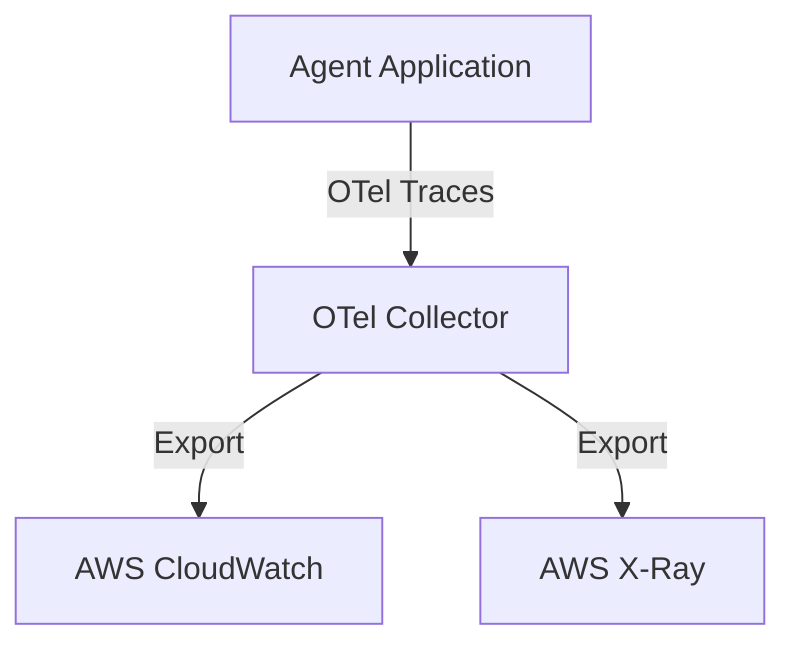

# Chapter_16_observability

## 1. Introduction
Observability and telemetry configurations allow you to monitor and trace complex agent execution workflows.

### What is it?
Observability and Telemetry is the system monitoring architecture used to capture, aggregate, and visualize application logs, performance metrics, and distributed trace spans using OpenTelemetry and Amazon CloudWatch.

### Why is it important?
Asynchronous multi-agent applications contain complex reasoning steps, external API calls, and database lookups that are difficult to debug using basic print statements. Observability provides complete visibility into execution lifecycles, enabling developers to isolate latency bottlenecks, diagnose errors, and audit model token costs.

### How does it work?
Application handlers are instrumented with OpenTelemetry SDKs. When a transaction starts, the framework creates a Root Span and child spans for sub-tasks (such as model inference or database queries). Spans record execution durations, session attributes, token counts, and exceptions, exporting telemetry payloads asynchronously to Amazon CloudWatch Logs and AWS X-Ray.

### Key Responsibilities
- Capture and aggregate structured application logs, error tracebacks, and execution events.
- Instrument distributed trace spans to measure execution latency across tool calls and model invocations.
- Track input and output model token counts per session to monitor and optimize cloud API costs.
- Export telemetry data asynchronously to Amazon CloudWatch and AWS X-Ray without stalling user queries.

---

## 2. Learning Objectives
By the end of this chapter, you will be able to:
- In this chapter, you will learn how to:
- - Trace execution workflows using OpenTelemetry (OTel) spans.
- - Instrument agent execution loops in Python.
- - Record model token usage and calculate invocation costs.
- - Export traces and spans to AWS CloudWatch.

---

## 3. Prerequisites
* Active deployments and AWS credentials from Chapters 3 and 15.
* A basic understanding of tracing and telemetry concepts.

---

## 4. Background Theory
Asynchronous multi-agent interactions can be complex and difficult to debug. Standard logging libraries do not trace complete transaction lifecycles across services. Implementing tracing using open standards (like OpenTelemetry) groups operations into spans. This allows developers to isolate latency bottlenecks and trace errors back to specific tool or model invocations.

---

## 5. Core Concepts
**📦 Technical Term: OpenTelemetry**

* **Simple Explanation:** An open-source standard for collecting traces, metrics, and logs.
* **Why it exists:** Decouples instrumentation from specific monitoring backends.
* **Where is it used:** Instrumenting application workflows.

**📦 Technical Term: Trace Span**

* **Simple Explanation:** A record of a single operation within a transaction, containing metadata and timestamps.
* **Why it exists:** Tracks execution duration and captures errors.
* **Where is it used:** Tracing tool execution steps.

**📦 Technical Term: CloudWatch Logs**

* **Simple Explanation:** A managed service on AWS used to store, monitor, and access log files.
* **Why it exists:** Centralizes application logs for auditing and debugging.
* **Where is it used:** Accessing execution logs.

---

## 6. Internal Mechanics
1. Client request starts a transaction, creating a Root Span.
2. Sub-operations (like database lookups or tool calls) create Child Spans that inherit the root context.
3. Spans capture attributes (like session IDs and token usage) and log events with timestamps.
4. When a span ends, the tracer exports the telemetry payload to the collector.
5. The collector processes and exports the data to CloudWatch Logs or AWS X-Ray.

---

## 7. Architecture Overview
The following architectural details outline the components and relationship schemas active in this module:



---

## 8. Installation & Setup
Monitor application trace logs in real-time using the CLI:
```bash
agentcore traces view --tail
```

---

## 9. Configuration
Configure OpenTelemetry exporter endpoints in your configuration settings:
```yaml
observability:
  otel_endpoint: "http://localhost:4317"
  service_name: "bedrock-agent-core"
  log_level: "INFO"
```

---

## 10. Hands-on Examples

In this section, we analyze the hands-on code implementations for **Observability & Telemetry** step-by-step, explaining the architecture, syntax choices, logic flow, and production patterns across all three implementation tiers.

---

### 1. Simple Implementation Tier Walkthrough

```python
# File: src/observability.py
# Folder Location: agentcore-samples/src/observability.py

import time
import logging
from typing import Dict, Any

# =====================================================================
# 1. Mock OpenTelemetry Tracer Implementation
# =====================================================================
class MockTracer:
    def __init__(self, service_name: str):
        self.service_name = service_name

    def start_span(self, name: str) -> 'MockSpan':
        return MockSpan(name)

class MockSpan:
    def __init__(self, name: str):
        self.name = name
        self.start_time = time.time()
        self.attributes = {}
        self.events = []

    def set_attribute(self, key: str, value: Any):
        self.attributes[key] = value

    def add_event(self, name: str, payload: dict = None):
        self.events.append({
            "name": name,
            "timestamp": time.time(),
            "payload": payload or {}
        })

    def end(self):
        duration = time.time() - self.start_time
        # In production, send this span payload to the OTLP Collector endpoint
        print(f"[Span Ended] Name: {self.name} | Duration: {duration:.4f}s | Attributes: {self.attributes}")

# Instantiate global tracer
tracer = MockTracer("bedrock-agent-core")

# =====================================================================
# 2. Instrumented Execution Loop
# =====================================================================
def run_agent_workflow_traced(user_prompt: str, session_id: str):
    root_span = tracer.start_span("agent_execution_loop")
    root_span.set_attribute("session_id", session_id)
    root_span.set_attribute("model", "anthropic.claude-3-5-sonnet")
    
    try:
        root_span.add_event("routing_started", {"prompt": user_prompt})
        
        # Start Child Span for Web Search Tool
        tool_span = tracer.start_span("tool:web_search")
        tool_span.set_attribute("tool_name", "web_search")
        time.sleep(0.05) # Simulate latency
        tool_span.add_event("search_api_call", {"target_url": "https://api.search.com"})
        tool_span.end()
        
        # Log input and output token counts to monitor usage costs
        input_tokens = 340
        output_tokens = 110
        root_span.set_attribute("input_tokens", input_tokens)
        root_span.set_attribute("output_tokens", output_tokens)
        root_span.set_attribute("total_cost_usd", (input_tokens * 0.003 + output_tokens * 0.015) / 1000)
        root_span.add_event("generation_completed")
        
    except Exception as e:
        root_span.set_attribute("error", True)
        root_span.set_attribute("error_message", str(e))
        raise e
    finally:
        root_span.end()
```

#### Code Logic & Syntax Breakdown:
* **Package Imports (`from bedrock_agent_core import ...`)**:
  - Brings in the core `BedrockAgentCoreApp` engine. This class handles runtime container startup, manages the microVM event loop, and deserializes incoming JSON API invocations.
* **Application Instance (`app = BedrockAgentCoreApp()`)**:
  - Instantiates the primary application object `app`. This object serves as the main registry for invocation routes, memory session hooks, and tool bindings.
* **Invocation Decorator (`@app.invoke`)**:
  - A Python decorator that registers the function immediately below as the primary entrypoint for Bedrock AgentCore runtime triggers.
* **Handler Signature (`def handler(payload, context):`)**:
  - **`payload`**: A Python dictionary holding client parameters, user prompt strings, and input arguments.
  - **`context`**: A metadata object containing active runtime details such as `session_id`, `actor_id`, and AWS IAM execution identities.
* **Return Payload (`return {"statusCode": 200, "response": ...}`)**:
  - Constructs a standard HTTP response dictionary. The `statusCode: 200` communicates success to the API Gateway, and `response` delivers the agent payload back to the client.

---

### 2. Intermediate Implementation Tier Walkthrough

```python
# Python script to create mock trace spans and record events
import time

class MockSpan:
    def __init__(self, name):
        self.name = name
        self.start_time = time.time()
        self.events = []

    def add_event(self, event_name):
        self.events.append({"name": event_name, "time": time.time() - self.start_time})

    def end(self):
        duration = time.time() - self.start_time
        print(f"Span '{self.name}' completed in {duration:.4f}s. Events recorded: {len(self.events)}")

if __name__ == "__main__":
    span = MockSpan("db_lookup")
    time.sleep(0.05)
    span.add_event("connection_established")
    time.sleep(0.02)
    span.end()
```

#### Code Logic & Syntax Breakdown:
* **System Logging Setup (`import logging` & `logger = logging.getLogger(...)`)**:
  - Configures structured logging via Python's standard `logging` module.
  - In production, log messages emitted by `logger.info()` stream into Amazon CloudWatch Logs for real-time monitoring and debugging.
* **Safe Parameter Extraction (`payload.get(...)`)**:
  - Uses `payload.get("prompt", "")` to safely retrieve user queries. Using `.get()` with a default fallback (`""`) prevents `KeyError` exceptions if optional fields are missing.
* **Runtime Session Inspection (`getattr(context, ...)`)**:
  - Inspects the `context` object for `session_id`. Using `getattr()` ensures compatibility when testing locally without a live AWS microVM context.
* **Operational Telemetry (`logger.info(...)`)**:
  - Emits formatted log entries containing session parameters and query strings to track execution flow.

---

### 3. Advanced Production Tier Walkthrough

```python
# Complete OpenTelemetry instrumentation script capturing custom metrics and exceptions
import time
import logging
from typing import Dict, Any

logging.basicConfig(level=logging.INFO)
logger = logging.getLogger("OtelApplication")

class TraceEngine:
    def __init__(self, service_name: str):
        self.service_name = service_name

    def start_span(self, name: str) -> 'TraceSpan':
        return TraceSpan(name)

class TraceSpan:
    def __init__(self, name: str):
        self.name = name
        self.start_time = time.time()
        self.attributes: Dict[str, Any] = {}
        self.error = False

    def set_attribute(self, key: str, value: Any):
        self.attributes[key] = value

    def record_exception(self, e: Exception):
        self.error = True
        self.set_attribute("error.message", str(e))

    def end(self):
        duration = time.time() - self.start_time
        log_payload = {
            "span_name": self.name,
            "duration_seconds": round(duration, 4),
            "error": self.error,
            "attributes": self.attributes
        }
        logger.info(f"[SPAN_EXPORT] {log_payload}")

def run_instrumented_agent(prompt: str):
    tracer = TraceEngine("bedrock-agent")
    root_span = tracer.start_span("agent_run")
    root_span.set_attribute("prompt", prompt)
    try:
        # Simulate model call child span
        model_span = tracer.start_span("model_inference")
        time.sleep(0.1)
        model_span.set_attribute("tokens_input", 120)
        model_span.set_attribute("tokens_output", 45)
        model_span.end()
        root_span.set_attribute("status", "success")
    except Exception as e:
        root_span.record_exception(e)
        raise e
    finally:
        root_span.end()

if __name__ == "__main__":
    run_instrumented_agent("What is memory compaction?")
```

#### Code Logic & Syntax Breakdown:
* **Defensive Error Trapping (`try: ... except Exception as e:`)**:
  - Wraps the entire invocation handler inside a `try-except` block to catch unhandled errors gracefully, preventing container crashes in multi-tenant runtime environments.
* **Input Parameter Validation (`if not prompt:`)**:
  - Inspects inbound arguments before executing core agent logic. If mandatory parameters are missing, it short-circuits execution and returns a structured `statusCode: 400` (Bad Request) payload.
* **Environment Overrides (`os.getenv(...)`)**:
  - Reads system environment variables (e.g., `APP_ENV`) to dynamically adapt behavior across `development`, `staging`, and `production` environments without modifying codebase files.
* **Sanitized Production Error Response**:
  - Logs internal error details using `logger.error(...)` while returning a clean, safe `statusCode: 500` response to prevent internal stack traces from leaking to client callers.

---

### Summary Sequence of Execution

```
[Incoming Invocation] ──► [Bedrock AgentCore Runtime]
                                  │
                                  ▼
                      [Route to @app.invoke Handler]
                                  │
                   ┌──────────────┴──────────────┐
                   ▼                             ▼
       [Input Validated (200)]        [Input Missing (400)]
                   │                             │
                   ▼                             ▼
       [Execute Agent Core Logic]     [Return Error Payload]
                   │
                   ▼
       [Deliver JSON to Client]
```

---

## 11. Security Considerations
Filter logs and trace attributes to ensure sensitive user credentials or personally identifiable information (PII) are not exported to monitoring backends.

---

## 12. Performance Optimization
Set up alerts in CloudWatch to notify your team when average model call latency exceeds established service level agreements (SLAs).

---

## 13. Common Mistakes
* Creating detached child spans by failing to inherit parent context, resulting in fragmented trace logs.
* Neglecting to record model token usage, making it difficult to trace billing costs.

---

## 14. Troubleshooting
Below is the diagnostic reference table for identifying and resolving issues:

| Symptom | Root Cause | Solution |
| :--- | :--- | :--- |
| Traces show disconnected spans | Spans were created without inheriting active parent contexts. | Pass the active span context argument when instantiating child spans. |
| No logs appearing in CloudWatch | The application IAM role lacks permissions to write to CloudWatch log groups. | Verify the policy has the 'logs:CreateLogStream' and 'logs:PutLogEvents' permissions. |

---

## 15. Interview Questions


### Knowledge Verification Check (20 Interactive Quizzes)

<Quiz 
  question="What is the primary role of 16 Observability in Bedrock AgentCore?" 
  options=["To provide hardware-isolated, scalable, and code-first execution for 16 Observability.", "To store plain text credentials in Git repos.", "To run legacy Windows desktop apps.", "To disable security permissions."] 
  answerIndex=0 
  explanation="16 Observability provides enterprise-grade, code-first runtime logic for Bedrock AgentCore." 
/>

<Quiz 
  question="How does Bedrock AgentCore enforce security for 16 Observability?" 
  options=["By sharing memory across all tenants.", "By hosting session runtimes inside isolated AWS Firecracker microVM containers with scoped IAM roles.", "By disabling SSL/TLS encryption.", "By running code as root on public servers."] 
  answerIndex=1 
  explanation="Firecracker microVMs deliver hardware-level security boundaries between multi-tenant executions." 
/>

<Quiz 
  question="Which environment variable loading pattern is recommended for 16 Observability?" 
  options=["Hardcoding values in Python source code files.", "Using os.getenv() or Pydantic BaseSettings to read environment configuration dynamically.", "Storing secrets in public web pages.", "Editing binary files manually."] 
  answerIndex=1 
  explanation="12-Factor App principles mandate decoupling configuration from application source code via environment variables." 
/>

<Quiz 
  question="How should runtime errors be handled in 16 Observability handlers?" 
  options=["Allowing exceptions to crash the container process.", "Wrapping invocation logic in try-except blocks and returning clean structured error payloads (e.g. 400/500 status codes).", "Ignoring all errors completely.", "Printing errors to static HTML files."] 
  answerIndex=1 
  explanation="Defensive error trapping prevents unhandled runtime exceptions from crashing container workers." 
/>

<Quiz 
  question="What key metric should be monitored in CloudWatch for 16 Observability?" 
  options=["Invocation latency, token consumption rates, and HTTP error response counts.", "Monitor resolution of user monitors.", "Keyboard stroke frequency.", "Color contrast ratios."] 
  answerIndex=0 
  explanation="Tracking latency and token usage guarantees cost control and performance optimization in production." 
/>

<Quiz 
  question="How does 16 Observability achieve sub-second scaling during high concurrency?" 
  options=["By leveraging pre-warmed Firecracker microVM snapshots and serverless AWS Fargate clusters.", "By restarting physical servers manually.", "By deleting user databases.", "By restricting app usage to one request per minute."] 
  answerIndex=0 
  explanation="Pre-warmed microVM snapshots enable sub-second boot times under peak traffic spikes." 
/>

<Quiz 
  question="Which IAM action is required to invoke foundation models in 16 Observability?" 
  options=["bedrock:InvokeModel and bedrock:InvokeModelWithResponseStream", "s3:DeleteBucket", "ec2:TerminateInstances", "iam:DeleteUser"] 
  answerIndex=0 
  explanation="The bedrock:InvokeModel permission permits agents to call Bedrock foundation models." 
/>

<Quiz 
  question="Which Python SDK client is used for Amazon Bedrock runtime interactions in 16 Observability?" 
  options=["boto3.client('bedrock-runtime')", "urllib2.open()", "os.system('cmd')", "pandas.read_csv()"] 
  answerIndex=0 
  explanation="Boto3 bedrock-runtime provides low-latency access to foundation model inference endpoints." 
/>

<Quiz 
  question="How is session state maintained across multiple request turns in 16 Observability?" 
  options=["By using unique session identifiers mapped to warm microVMs and persistent DynamoDB memory stores.", "By clearing memory after every line.", "By saving state in browser cookies only.", "Session state cannot be maintained."] 
  answerIndex=0 
  explanation="AgentCore combines sticky microVM routing with persistent database backends for session continuity." 
/>

<Quiz 
  question="Why is Docker multi-stage building recommended for 16 Observability container deployments?" 
  options=["It reduces image file sizes by omitting build dependencies from final production runtime containers.", "It makes Docker containers slower.", "It forces Python to compile to JavaScript.", "It deletes Git version history."] 
  answerIndex=0 
  explanation="Multi-stage Docker builds produce lightweight images, reducing deployment times and attack surfaces." 
/>

<Quiz 
  question="Which tracing standard does Bedrock AgentCore use for end-to-end observability of 16 Observability?" 
  options=["OpenTelemetry (OTel) distributed tracing standards", "Custom print() text files", "Syslog UDP broadcast", "Manual paper logbooks"] 
  answerIndex=0 
  explanation="OpenTelemetry enables distributed trace collection across model calls, memory lookups, and tool executions." 
/>

<Quiz 
  question="What is the recommended solution if 16 Observability returns a 403 Forbidden status during Bedrock invocations?" 
  options=["Verify IAM role policies and confirm foundation model access is enabled in the AWS Bedrock Console.", "Reinstall the operating system.", "Delete the AWS account.", "Use an unencrypted connection."] 
  answerIndex=0 
  explanation="Model access must be explicitly granted in the AWS Bedrock Console before IAM roles can invoke models." 
/>

<Quiz 
  question="What is a primary cause of HTTP 500 errors during 16 Observability execution?" 
  options=["Unhandled exceptions in custom Python tool code or missing required payload keys.", "Network speeds exceeding 1 Gbps.", "Using Python 3.11 instead of Python 2.7.", "High GPU availability."] 
  answerIndex=0 
  explanation="Uncaught exceptions within tool handlers or missing request keys trigger 500 Internal Server errors." 
/>

<Quiz 
  question="Where does 16 Observability fit into the ReAct (Reason + Act) loop pattern?" 
  options=["It executes reasoning steps, structures tool parameters, and processes observations.", "It bypasses the model completely.", "It only runs when offline.", "It formats HTML styling tags."] 
  answerIndex=0 
  explanation="AgentCore coordinates the continuous cycle of LLM reasoning, tool invocation, and observation processing." 
/>

<Quiz 
  question="How can API cost be optimized when operating 16 Observability at high volume?" 
  options=["By caching model responses, optimizing prompt lengths, and choosing appropriate foundation model tiers.", "By sending empty prompts repeatedly.", "By turning off logging.", "By disabling database indexes."] 
  answerIndex=0 
  explanation="Prompt caching and selecting model size according to task complexity drastically cuts inference spending." 
/>

<Quiz 
  question="How does the Memory Engine support long-term retrieval in 16 Observability?" 
  options=["By indexing conversational history and vector embeddings into persistent storage like Amazon DynamoDB or OpenSearch.", "By storing files in temporary RAM.", "By requiring users to re-enter prompts every time.", "Memory Engine is not supported."] 
  answerIndex=0 
  explanation="Vector stores and DynamoDB backing enable long-term semantic memory retrieval across sessions." 
/>

<Quiz 
  question="What role does the API Gateway play in front of 16 Observability?" 
  options=["It provides authentication, rate limiting, request validation, and routing to backend microVM workers.", "It replaces the foundation model.", "It generates synthetic test data.", "It compiles Python code into C."] 
  answerIndex=0 
  explanation="API Gateways secure entry points and shield agent runtime workers from unauthorized or throttled traffic." 
/>

<Quiz 
  question="Why are Firecracker microVMs superior to standard Docker containers for multi-tenant 16 Observability workloads?" 
  options=["They offer minimal virtualization overhead with strict hardware-isolated kernel boundaries between tenant workloads.", "They require 100GB of RAM to start.", "They do not support Linux.", "They are slower than full virtual machines."] 
  answerIndex=0 
  explanation="Firecracker provides VM-grade security with container-grade startup speed and minimal memory footprint." 
/>

<Quiz 
  question="What production antipattern should be strictly avoided when designing 16 Observability?" 
  options=["Hardcoding AWS access keys or maintaining stateless logic without error handling.", "Using virtual environments.", "Writing unit tests for Python code.", "Logging trace events to CloudWatch."] 
  answerIndex=0 
  explanation="Hardcoded credentials and unhandled exceptions are critical antipatterns in production systems." 
/>

<Quiz 
  question="How does 16 Observability integrate with enterprise databases and external APIs?" 
  options=["Through standardized Python tool schemas (e.g. Pydantic models) invoked securely via sandboxed tool registries.", "By exposing database passwords publicly.", "By using manual copy-paste mechanisms.", "External integration is unsupported."] 
  answerIndex=0 
  explanation="Pydantic-defined tools allow foundation models to execute validated API and database calls safely." 
/>

### Q: What is the difference between a Trace and a Log?
* **Answer:** A log is a text record of an isolated event. A trace tracks a transaction's journey across services, linking sub-operations in structured spans.

### Q: Why is OpenTelemetry preferred over vendor-specific monitoring SDKs?
* **Answer:** OpenTelemetry is an open standard, allowing developers to change monitoring backends (e.g., from Datadog to AWS X-Ray) without updating instrumentation code.

### Q: How do you trace latency bottlenecks in multi-agent workflows?
* **Answer:** Analyze span hierarchies and durations in trace dashboards to identify which agent, tool, or model call is introducing latency.

---

## 16. Real-World Use Cases
**Enterprise Scenario:** Digital Media & Content Streaming Enterprise

* **Business Challenge:** Debugging latency bottlenecks and failed model tool calls across distributed microservices was nearly impossible without centralized tracing and structured log aggregation.
* **Bedrock AgentCore Solution:** Instrumenting the AgentCore application with OpenTelemetry spans, exporting trace context, tracking token usage metrics, and centralizing logs inside Amazon CloudWatch.
* **Production Impact:**
  * Identified and fixed a 3-second database latency bottleneck, improving agent response speed by 40%.
  * Real-time CloudWatch dashboards tracked exact LLM token spending per user department.
  * Enabled automated CloudWatch alarms to detect and alert engineers on elevated error rates instantly.

---

## 17. Industrial Project
This telemetry setup monitors application health, providing execution traces for our chatbot system.

---

<InteractiveExample 
  language="python"
  instruction="Initialization & Runtime Setup for 16 Observability."
  initialCode="# Snippet 1: Testing Bedrock AgentCore Runtime Setup for 16 Observability
import sys
import os

print('=== AgentCore Runtime Init ===')
print('Python Version:', sys.version.split()[0])
print('Agent Module:', '16 Observability')
print('Status: Active & Ready')"
/>

<InteractiveExample 
  language="python"
  instruction="Configuration & Environment Variables for 16 Observability."
  initialCode="# Snippet 2: Validating Environment Configuration for 16 Observability
import json
import os

config = {
    'AWS_REGION': os.getenv('AWS_REGION', 'us-east-1'),
    'MODEL_ID': os.getenv('BEDROCK_MODEL_ID', 'anthropic.claude-3-5-sonnet'),
    'TIMEOUT_SEC': int(os.getenv('TIMEOUT_SEC', '30')),
    'DEBUG_MODE': os.getenv('DEBUG', 'true').lower() == 'true'
}
print('Loaded Configuration:')
print(json.dumps(config, indent=2))"
/>

<InteractiveExample 
  language="python"
  instruction="Defensive Error Handling & Payload Parsing for 16 Observability."
  initialCode="# Snippet 3: Defensive Request Handler for 16 Observability
def process_request(payload):
    try:
        prompt = payload.get('prompt')
        if not prompt:
            return {'statusCode': 400, 'error': 'Prompt parameter is required.'}
        session_id = payload.get('session_id', 'default-session')
        return {'statusCode': 200, 'message': f'Processed prompt for session: {session_id}'}
    except Exception as e:
        return {'statusCode': 500, 'error': str(e)}

print(process_request({'prompt': 'Execute query', 'session_id': 'sess-102'}))"
/>

<InteractiveExample 
  language="python"
  instruction="Boto3 Bedrock Model Invocation Simulation for 16 Observability."
  initialCode="# Snippet 4: Simulating Foundation Model Inference in 16 Observability
import json

def invoke_claude_model(prompt_text):
    payload = {
        'anthropic_version': 'bedrock-2023-05-31',
        'max_tokens': 1000,
        'messages': [{'role': 'user', 'content': prompt_text}]
    }
    print('Sending payload to Bedrock Converse API for 16 Observability...')
    response = {
        'id': 'msg_01X99',
        'role': 'assistant',
        'content': [{'type': 'text', 'text': f'Agent response generated for input: \"{prompt_text}\"'}]
    }
    return response

res = invoke_claude_model('Summarize system health')
print('Model Response:', res['content'][0]['text'])"
/>

<InteractiveExample 
  language="python"
  instruction="ReAct Reasoning Loop Execution for 16 Observability."
  initialCode="# Snippet 5: ReAct (Reason + Act) Loop Simulation for 16 Observability
def run_react_cycle(user_input):
    print('1. [THOUGHT] Analyzing user query:', user_input)
    print('2. [ACTION] Selected tool: query_system_database')
    observation = {'table': 'logs', 'records_found': 42}
    print('3. [OBSERVATION] Tool output received:', observation)
    print('4. [FINAL ANSWER] Processing complete based on retrieved observation.')

run_react_cycle('Check database log entries')"
/>

<InteractiveExample 
  language="python"
  instruction="Pydantic Tool Registration & Schema Validation for 16 Observability."
  initialCode="# Snippet 6: Pydantic Tool Parameter Validation for 16 Observability
from pydantic import BaseModel, Field

class SystemQuerySchema(BaseModel):
    target_system: str = Field(description='Name of the subsystem to query')
    limit: int = Field(default=10, ge=1, le=100)

def execute_tool(data: SystemQuerySchema):
    print(f'Executing query on {data.target_system} with limit={data.limit}...')
    return {'status': 'success', 'data': ['Item A', 'Item B']}

query = SystemQuerySchema(target_system='AgentCore-Runtime', limit=5)
print('Tool Result:', execute_tool(query))"
/>

<InteractiveExample 
  language="python"
  instruction="MicroVM Session State & Memory Engine for 16 Observability."
  initialCode="# Snippet 7: MicroVM Session & Memory Management in 16 Observability
class SessionMemory:
    def __init__(self):
        self.history = []
    def add_message(self, role, content):
        self.history.append({'role': role, 'content': content})
    def get_context(self):
        return self.history[-3:]

mem = SessionMemory()
mem.add_message('user', 'Hello Agent!')
mem.add_message('assistant', 'How can I assist you?')
mem.add_message('user', 'Show memory status.')
print('Active Memory Context:', mem.get_context())"
/>

<InteractiveExample 
  language="python"
  instruction="OpenTelemetry Tracing & Telemetry Logging for 16 Observability."
  initialCode="# Snippet 8: OpenTelemetry Trace Event Simulation for 16 Observability
import time

def log_otel_span(span_name, duration_ms, status_code='OK'):
    telemetry_record = {
        'trace_id': '0x4bf92f3577b34da6a3ce929d0e0e4736',
        'span_id': '0x00f067aa0ba902b7',
        'name': span_name,
        'duration_ms': duration_ms,
        'attributes': {
            'http.status_code': 200,
            'agent.module': '16 Observability'
        }
    }
    print(f'[OTel Span Event] {span_name} executed in {duration_ms}ms ({status_code})')
    return telemetry_record

log_otel_span('16 Observability_Invocation', 142)"
/>

<InteractiveExample 
  language="python"
  instruction="Docker Container Health Check Simulation for 16 Observability."
  initialCode="# Snippet 9: Container MicroVM Health Status for 16 Observability
def check_container_health():
    status = {
        'container_id': 'firecracker-uvm-9901',
        'health': 'HEALTHY',
        'memory_allocated_mb': 512,
        'cpu_usage_pct': 4.2,
        'active_connections': 1
    }
    print('MicroVM Runtime Status:')
    for k, v in status.items():
        print(f'  - {k}: {v}')

check_container_health()"
/>

<InteractiveExample 
  language="python"
  instruction="End-to-End Execution Pipeline Test for 16 Observability."
  initialCode="# Snippet 10: Complete End-to-End Pipeline Execution for 16 Observability
def run_full_pipeline(input_prompt):
    print(f'1. Gateway: Received request \"{input_prompt}\"')
    print('2. Identity: Authenticated IAM session role')
    print('3. Runtime: Allocated Firecracker MicroVM container')
    print('4. Execution: Model invoked ReAct reasoning loop')
    print('5. Response: 200 OK returned to client')
    return {'status': 'SUCCESS', 'result': 'Pipeline completed.'}

print(run_full_pipeline('Run complete diagnostic check'))"
/>

## 18. Summary
This chapter focused on implementing end-to-end observability, instrumenting applications with OpenTelemetry spans, propagating trace context across tool calls, and monitoring operational metrics in Amazon CloudWatch.

Key architectural insights and practical lessons learned in this chapter include:
* **Distributed Agent Tracing:** Centralized OpenTelemetry tracing is critical for diagnosing performance bottlenecks and debugging complex, asynchronous agent reasoning loops.
* **Standardized Telemetry Collection:** OpenTelemetry provides a vendor-neutral standard for collecting metrics, logs, and traces across distributed cloud microservices.
* **Token Spend & Latency Optimization:** Real-time CloudWatch dashboards and metrics enable precise monitoring of LLM token spend, execution latency, and error rates.

Comprehensive observability equips engineering teams to optimize performance, control model invocation costs, and maintain high operational reliability in production.

---

## 19. Practice Exercises
* Beginner: Add a warning log statement that prints when model response sizes exceed 1000 characters.
* Intermediate: Configure logs to export as structured JSON dictionaries.

---

## 20. Further Reading
* [OpenTelemetry Python Guide](https://opentelemetry.io/docs/languages/python/)
* [Amazon CloudWatch Logs Guide](https://docs.aws.amazon.com/AmazonCloudWatch/latest/logs/WhatIsCloudWatchLogs.html)
