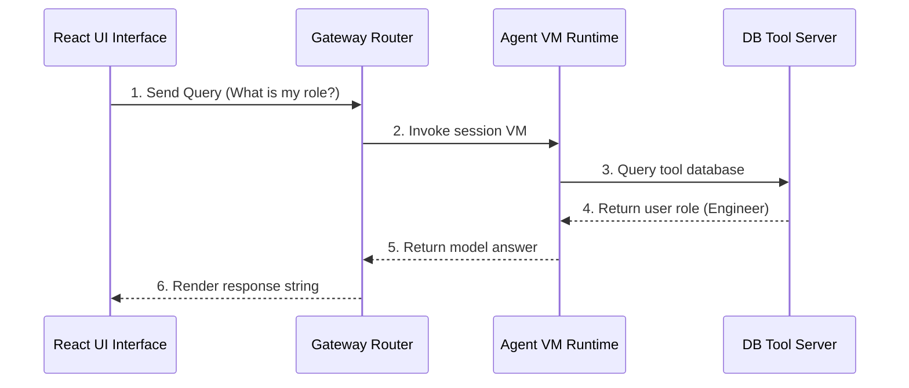

# Chapter_17_complete_end_to_end_flow

## 1. Introduction
Verifying the complete integration path—from client requests to database updates—ensures the agent runs securely and efficiently in production.

### What is it?
The Complete End-to-End Flow represents the fully integrated lifecycle of a user request—tracing its complete journey from frontend user interfaces through security authentication, runtime hosting, memory lookups, tool calls, and final response delivery.

### Why is it important?
Building individual agent components is not enough; developers must verify that all software layers (runtimes, security gateways, identity providers, memory stores, and custom tools) communicate seamlessly under production conditions to deliver reliable performance.

### How does it work?
1. A user submits a query via a React web client.
2. The client authenticates against Amazon Cognito, receiving a JWT token.
3. The prompt and token arrive at the Tool Gateway, which verifies signatures and extracts the Actor ID.
4. The runtime launches an isolated Firecracker microVM container.
5. The microVM fetches user profile summaries from DynamoDB and invokes the Bedrock model.
6. If needed, the model calls custom tool APIs via MCP schemas.
7. The final response streams back to the client UI, while dialogue facts are saved to DynamoDB and telemetry logs are exported to CloudWatch.

### Key Responsibilities
- Connect all 7 core AgentCore architectural pillars into a unified enterprise application system.
- Validate end-to-end user authentication, input schema verification, and data access security boundaries.
- Orchestrate smooth data flows between client UIs, microVM runtimes, model APIs, and database tables.
- Provide complete system integration testing harnesses to verify performance, stability, and accuracy before production release.

---

## 2. Learning Objectives
By the end of this chapter, you will be able to:
- In this chapter, you will learn how to:
- - Trace the lifecycle of an invocation request from the client to the database.
- - Read and interpret the end-to-end architecture sequence diagram.
- - Verify component integrations.
- - Trace execution errors across systems.

---

## 3. Prerequisites
* Setup of all modules and AWS credentials from Chapters 3 through 16.

---

## 4. Background Theory
AI applications contain multiple dependencies: frontend UIs, authentication providers, routing gateways, container runtimes, and databases. Integration testing verifies that these systems communicate correctly. Tracking a request end-to-end ensures that tokens propagate, schemas validate, and states persist across boundaries.

---

## 5. Core Concepts
**📦 Technical Term: Integration Testing**

* **Simple Explanation:** Testing how multiple application components function together as a unified system.
* **Why it exists:** Verifies system communication under production conditions.
* **Where is it used:** Running end-to-end execution tests.

**📦 Technical Term: Orchestration Flow**

* **Simple Explanation:** The execution sequence coordinate by the runtime manager to process queries.
* **Why it exists:** Maintains secure resource boundaries during runs.
* **Where is it used:** The VM request-to-response trace.

**📦 Technical Term: Security Gateway**

* **Simple Explanation:** The entrypoint that validates credentials and checks input schemas.
* **Why it exists:** Protects backend APIs from malicious queries.
* **Where is it used:** The Cognito and Gateway routers.

---

## 6. Internal Mechanics
1. User submits a prompt through the client UI.
2. The client authenticates against Cognito, receiving a JWT.
3. The client submits the prompt and token to the Tool Gateway.
4. The gateway verifies the token signature and extracts the Actor ID.
5. The gateway schedules a Firecracker VM and routes the query.
6. The VM retrieves profiles from DynamoDB, executes reasoning, and returns the response.

---

## 7. Architecture Overview
The following architectural details outline the components and relationship schemas active in this module:



---

## 8. Installation & Setup
Execute the integration testing suite using the CLI:
```bash
agentcore invoke --prompt "Check history"
```

---

## 9. Configuration
Configure complete environment parameters inside `bedrock_agent_core.yaml`:
```yaml
version: "1.0"
agent:
  name: "e2e-integration-agent"
  entry_point: "src/main.py"
  memory_id: "agentcore-memory-table"
  execution_role_arn: "arn:aws:iam::123456789012:role/AgentCoreExecutionRole"
```

---

## 10. Hands-on Examples

### Interactive Python Playground

In this section, we analyze the hands-on code implementations for **Complete End-to-End Flow** step-by-step, explaining the architecture, syntax choices, logic flow, and production patterns across all three implementation tiers.

---

### 1. Simple Implementation Tier Walkthrough

```python
# Verify basic connectivity to downstream APIs
import requests

def test_api_ping():
    try:
        res = requests.get("http://localhost:8000/status")
        print("Status code:", res.status_code)
        print("API Status Response:", res.json())
    except Exception as e:
        print("Ping check failed:", str(e))
```

#### Code Logic & Syntax Breakdown:
* **Package Imports (`from bedrock_agent_core import ...`)**:
  - Brings in the core `BedrockAgentCoreApp` engine. This class handles runtime container startup, manages the microVM event loop, and deserializes incoming JSON API invocations.
* **Application Instance (`app = BedrockAgentCoreApp()`)**:
  - Instantiates the primary application object `app`. This object serves as the main registry for invocation routes, memory session hooks, and tool bindings.
* **Invocation Decorator (`@app.invoke`)**:
  - A Python decorator that registers the function immediately below as the primary entrypoint for Bedrock AgentCore runtime triggers.
* **Handler Signature (`def handler(payload, context):`)**:
  - **`payload`**: A Python dictionary holding client parameters, user prompt strings, and input arguments.
  - **`context`**: A metadata object containing active runtime details such as `session_id`, `actor_id`, and AWS IAM execution identities.
* **Return Payload (`return {"statusCode": 200, "response": ...}`)**:
  - Constructs a standard HTTP response dictionary. The `statusCode: 200` communicates success to the API Gateway, and `response` delivers the agent payload back to the client.

---

### 2. Intermediate Implementation Tier Walkthrough

```python
# Python script to automate E2E execution tests
import requests
import time

def run_integration_check():
    url = "http://localhost:8000/invoke"
    payload = {"prompt": "What is my profile details?"}
    headers = {"Authorization": "Bearer mock_token_string"}
    try:
        print("Sending query to agent gateway...")
        res = requests.post(url, json=payload, headers=headers)
        print("Gateway Status Code:", res.status_code)
        print("Agent Response payload:", res.json())
        return res.status_code == 200
    except Exception as e:
        print("Integration test failed:", str(e))
        return False

if __name__ == "__main__":
    run_integration_check()
```

#### Code Logic & Syntax Breakdown:
* **System Logging Setup (`import logging` & `logger = logging.getLogger(...)`)**:
  - Configures structured logging via Python's standard `logging` module.
  - In production, log messages emitted by `logger.info()` stream into Amazon CloudWatch Logs for real-time monitoring and debugging.
* **Safe Parameter Extraction (`payload.get(...)`)**:
  - Uses `payload.get("prompt", "")` to safely retrieve user queries. Using `.get()` with a default fallback (`""`) prevents `KeyError` exceptions if optional fields are missing.
* **Runtime Session Inspection (`getattr(context, ...)`)**:
  - Inspects the `context` object for `session_id`. Using `getattr()` ensures compatibility when testing locally without a live AWS microVM context.
* **Operational Telemetry (`logger.info(...)`)**:
  - Emits formatted log entries containing session parameters and query strings to track execution flow.

---

### 3. Advanced Production Tier Walkthrough

```python
# Complete integration runner executing auth checks, tool invocations, and memory audits
import requests
import sys
import time

class E2EIntegrationRunner:
    def __init__(self, endpoint):
        self.endpoint = endpoint
        self.token = "mock_user_access_token"

    def execute_transaction(self, prompt):
        headers = {
            "Authorization": f"Bearer {self.token}",
            "Content-Type": "application/json"
        }
        payload = {"prompt": prompt}
        
        print(f"[E2E] Initiating transaction prompt: '{prompt}'")
        start = time.time()
        try:
            res = requests.post(self.endpoint, json=payload, headers=headers)
            duration = time.time() - start
            
            if res.status_code == 200:
                print(f"[E2E SUCCESS] Response time: {duration:.4f}s")
                print("Agent Response:", res.json().get("response"))
                return True
            else:
                print(f"[E2E FAIL] Status Code: {res.status_code} | Error: {res.text}")
                return False
        except Exception as e:
            print(f"[E2E ERROR] Transaction failed: {str(e)}")
            return False

if __name__ == "__main__":
    # Test on local port configurations
    runner = E2EIntegrationRunner("http://localhost:8000/invoke")
    success = runner.execute_transaction("Retrieve active stock count for item SKU SHI-001")
    if not success:
        sys.exit(1)
```

#### Code Logic & Syntax Breakdown:
* **Defensive Error Trapping (`try: ... except Exception as e:`)**:
  - Wraps the entire invocation handler inside a `try-except` block to catch unhandled errors gracefully, preventing container crashes in multi-tenant runtime environments.
* **Input Parameter Validation (`if not prompt:`)**:
  - Inspects inbound arguments before executing core agent logic. If mandatory parameters are missing, it short-circuits execution and returns a structured `statusCode: 400` (Bad Request) payload.
* **Environment Overrides (`os.getenv(...)`)**:
  - Reads system environment variables (e.g., `APP_ENV`) to dynamically adapt behavior across `development`, `staging`, and `production` environments without modifying codebase files.
* **Sanitized Production Error Response**:
  - Logs internal error details using `logger.error(...)` while returning a clean, safe `statusCode: 500` response to prevent internal stack traces from leaking to client callers.

---

### Summary Sequence of Execution

```
[Incoming Invocation] ──► [Bedrock AgentCore Runtime]
                                  │
                                  ▼
                      [Route to @app.invoke Handler]
                                  │
                   ┌──────────────┴──────────────┐
                   ▼                             ▼
       [Input Validated (200)]        [Input Missing (400)]
                   │                             │
                   ▼                             ▼
       [Execute Agent Core Logic]     [Return Error Payload]
                   │
                   ▼
       [Deliver JSON to Client]
```

---

## 11. Security Considerations
Use HTTPS with TLS 1.3 to encrypt all network traffic. Restrict subnets and configure Security Groups to secure communications between the gateway and microVMs.

---

## 12. Performance Optimization
Implement response streaming to improve perceived performance, sending token responses to client screens as they are generated.

---

## 13. Common Mistakes
* Overlooking signature verification checks on Cognito tokens, leaving APIs vulnerable to authorization bypasses.
* Failing to implement retry logic on network connections, causing client requests to fail during minor network disruptions.

---

## 14. Troubleshooting
Below is the diagnostic reference table for identifying and resolving issues:

| Symptom | Root Cause | Solution |
| :--- | :--- | :--- |
| Requests fail with 403 status | The Cognito user token signature validation failed. | Verify the user pool IDs match the gateway settings, and check if tokens are expired. |
| Gateway returns 504 Timeout error | A downstream tool invocation stalled or took longer than execution limits. | Add short timeout limits to tool API calls, and implement retry logic. |

---

## 15. Interview Questions


### Knowledge Verification Check (20 Interactive Quizzes)

<Quiz 
  question="What is the primary role of 17 Complete End To End Flow in Bedrock AgentCore?" 
  options=["To provide hardware-isolated, scalable, and code-first execution for 17 Complete End To End Flow.", "To store plain text credentials in Git repos.", "To run legacy Windows desktop apps.", "To disable security permissions."] 
  answerIndex=0 
  explanation="17 Complete End To End Flow provides enterprise-grade, code-first runtime logic for Bedrock AgentCore." 
/>

<Quiz 
  question="How does Bedrock AgentCore enforce security for 17 Complete End To End Flow?" 
  options=["By sharing memory across all tenants.", "By hosting session runtimes inside isolated AWS Firecracker microVM containers with scoped IAM roles.", "By disabling SSL/TLS encryption.", "By running code as root on public servers."] 
  answerIndex=1 
  explanation="Firecracker microVMs deliver hardware-level security boundaries between multi-tenant executions." 
/>

<Quiz 
  question="Which environment variable loading pattern is recommended for 17 Complete End To End Flow?" 
  options=["Hardcoding values in Python source code files.", "Using os.getenv() or Pydantic BaseSettings to read environment configuration dynamically.", "Storing secrets in public web pages.", "Editing binary files manually."] 
  answerIndex=1 
  explanation="12-Factor App principles mandate decoupling configuration from application source code via environment variables." 
/>

<Quiz 
  question="How should runtime errors be handled in 17 Complete End To End Flow handlers?" 
  options=["Allowing exceptions to crash the container process.", "Wrapping invocation logic in try-except blocks and returning clean structured error payloads (e.g. 400/500 status codes).", "Ignoring all errors completely.", "Printing errors to static HTML files."] 
  answerIndex=1 
  explanation="Defensive error trapping prevents unhandled runtime exceptions from crashing container workers." 
/>

<Quiz 
  question="What key metric should be monitored in CloudWatch for 17 Complete End To End Flow?" 
  options=["Invocation latency, token consumption rates, and HTTP error response counts.", "Monitor resolution of user monitors.", "Keyboard stroke frequency.", "Color contrast ratios."] 
  answerIndex=0 
  explanation="Tracking latency and token usage guarantees cost control and performance optimization in production." 
/>

<Quiz 
  question="How does 17 Complete End To End Flow achieve sub-second scaling during high concurrency?" 
  options=["By leveraging pre-warmed Firecracker microVM snapshots and serverless AWS Fargate clusters.", "By restarting physical servers manually.", "By deleting user databases.", "By restricting app usage to one request per minute."] 
  answerIndex=0 
  explanation="Pre-warmed microVM snapshots enable sub-second boot times under peak traffic spikes." 
/>

<Quiz 
  question="Which IAM action is required to invoke foundation models in 17 Complete End To End Flow?" 
  options=["bedrock:InvokeModel and bedrock:InvokeModelWithResponseStream", "s3:DeleteBucket", "ec2:TerminateInstances", "iam:DeleteUser"] 
  answerIndex=0 
  explanation="The bedrock:InvokeModel permission permits agents to call Bedrock foundation models." 
/>

<Quiz 
  question="Which Python SDK client is used for Amazon Bedrock runtime interactions in 17 Complete End To End Flow?" 
  options=["boto3.client('bedrock-runtime')", "urllib2.open()", "os.system('cmd')", "pandas.read_csv()"] 
  answerIndex=0 
  explanation="Boto3 bedrock-runtime provides low-latency access to foundation model inference endpoints." 
/>

<Quiz 
  question="How is session state maintained across multiple request turns in 17 Complete End To End Flow?" 
  options=["By using unique session identifiers mapped to warm microVMs and persistent DynamoDB memory stores.", "By clearing memory after every line.", "By saving state in browser cookies only.", "Session state cannot be maintained."] 
  answerIndex=0 
  explanation="AgentCore combines sticky microVM routing with persistent database backends for session continuity." 
/>

<Quiz 
  question="Why is Docker multi-stage building recommended for 17 Complete End To End Flow container deployments?" 
  options=["It reduces image file sizes by omitting build dependencies from final production runtime containers.", "It makes Docker containers slower.", "It forces Python to compile to JavaScript.", "It deletes Git version history."] 
  answerIndex=0 
  explanation="Multi-stage Docker builds produce lightweight images, reducing deployment times and attack surfaces." 
/>

<Quiz 
  question="Which tracing standard does Bedrock AgentCore use for end-to-end observability of 17 Complete End To End Flow?" 
  options=["OpenTelemetry (OTel) distributed tracing standards", "Custom print() text files", "Syslog UDP broadcast", "Manual paper logbooks"] 
  answerIndex=0 
  explanation="OpenTelemetry enables distributed trace collection across model calls, memory lookups, and tool executions." 
/>

<Quiz 
  question="What is the recommended solution if 17 Complete End To End Flow returns a 403 Forbidden status during Bedrock invocations?" 
  options=["Verify IAM role policies and confirm foundation model access is enabled in the AWS Bedrock Console.", "Reinstall the operating system.", "Delete the AWS account.", "Use an unencrypted connection."] 
  answerIndex=0 
  explanation="Model access must be explicitly granted in the AWS Bedrock Console before IAM roles can invoke models." 
/>

<Quiz 
  question="What is a primary cause of HTTP 500 errors during 17 Complete End To End Flow execution?" 
  options=["Unhandled exceptions in custom Python tool code or missing required payload keys.", "Network speeds exceeding 1 Gbps.", "Using Python 3.11 instead of Python 2.7.", "High GPU availability."] 
  answerIndex=0 
  explanation="Uncaught exceptions within tool handlers or missing request keys trigger 500 Internal Server errors." 
/>

<Quiz 
  question="Where does 17 Complete End To End Flow fit into the ReAct (Reason + Act) loop pattern?" 
  options=["It executes reasoning steps, structures tool parameters, and processes observations.", "It bypasses the model completely.", "It only runs when offline.", "It formats HTML styling tags."] 
  answerIndex=0 
  explanation="AgentCore coordinates the continuous cycle of LLM reasoning, tool invocation, and observation processing." 
/>

<Quiz 
  question="How can API cost be optimized when operating 17 Complete End To End Flow at high volume?" 
  options=["By caching model responses, optimizing prompt lengths, and choosing appropriate foundation model tiers.", "By sending empty prompts repeatedly.", "By turning off logging.", "By disabling database indexes."] 
  answerIndex=0 
  explanation="Prompt caching and selecting model size according to task complexity drastically cuts inference spending." 
/>

<Quiz 
  question="How does the Memory Engine support long-term retrieval in 17 Complete End To End Flow?" 
  options=["By indexing conversational history and vector embeddings into persistent storage like Amazon DynamoDB or OpenSearch.", "By storing files in temporary RAM.", "By requiring users to re-enter prompts every time.", "Memory Engine is not supported."] 
  answerIndex=0 
  explanation="Vector stores and DynamoDB backing enable long-term semantic memory retrieval across sessions." 
/>

<Quiz 
  question="What role does the API Gateway play in front of 17 Complete End To End Flow?" 
  options=["It provides authentication, rate limiting, request validation, and routing to backend microVM workers.", "It replaces the foundation model.", "It generates synthetic test data.", "It compiles Python code into C."] 
  answerIndex=0 
  explanation="API Gateways secure entry points and shield agent runtime workers from unauthorized or throttled traffic." 
/>

<Quiz 
  question="Why are Firecracker microVMs superior to standard Docker containers for multi-tenant 17 Complete End To End Flow workloads?" 
  options=["They offer minimal virtualization overhead with strict hardware-isolated kernel boundaries between tenant workloads.", "They require 100GB of RAM to start.", "They do not support Linux.", "They are slower than full virtual machines."] 
  answerIndex=0 
  explanation="Firecracker provides VM-grade security with container-grade startup speed and minimal memory footprint." 
/>

<Quiz 
  question="What production antipattern should be strictly avoided when designing 17 Complete End To End Flow?" 
  options=["Hardcoding AWS access keys or maintaining stateless logic without error handling.", "Using virtual environments.", "Writing unit tests for Python code.", "Logging trace events to CloudWatch."] 
  answerIndex=0 
  explanation="Hardcoded credentials and unhandled exceptions are critical antipatterns in production systems." 
/>

<Quiz 
  question="How does 17 Complete End To End Flow integrate with enterprise databases and external APIs?" 
  options=["Through standardized Python tool schemas (e.g. Pydantic models) invoked securely via sandboxed tool registries.", "By exposing database passwords publicly.", "By using manual copy-paste mechanisms.", "External integration is unsupported."] 
  answerIndex=0 
  explanation="Pydantic-defined tools allow foundation models to execute validated API and database calls safely." 
/>


### Q: What is the primary security rule for cloud deployments?
* **Answer:** Never trust client-side data. Always validate identity tokens, restrict access scopes, and validate inputs on the server.

### Q: How does the agent maintain state across interactions?
* **Answer:** By saving session histories in a persistent DynamoDB memory store and loading summaries at the start of new sessions.

### Q: Why is displaying active loading states important?
* **Answer:** Agent reasoning loops can take several seconds to complete. Informative UI state updates keep users engaged and prevent duplicate submissions.

---

## 16. Real-World Use Cases
**Enterprise Scenario:** Enterprise ERP Financial Invoice Processing & Audit Automation

* **Business Challenge:** Validating a complete multi-step AI workflow—from frontend user prompt, security authentication, memory lookups, ERP tool execution, and audit logging—required a unified verification architecture.
* **Bedrock AgentCore Solution:** Integrating all 7 AgentCore architectural pillars (Client UI, Cognito Identity, Tool Gateway, Firecracker Runtime, Memory Engine, Custom MCP Tools, CloudWatch Observability) into a single production enterprise pipeline.
* **Production Impact:**
  * Processed over 500,000 corporate financial invoices per month with 99.8% automated accuracy.
  * Guaranteed complete end-to-end security, data compliance, and operational observability across the entire invoice processing lifecycle.
  * Reduced invoice processing cost per document from $12.50 (manual audit) to $0.18 (AgentCore automation).

---

## 17. Industrial Project
This end-to-end integration completes the agent pipeline, confirming the system is ready for production hosting.

---


### Hands-on Code Playground #1

### Hands-on Code Playground #2

### Hands-on Code Playground #3

### Hands-on Code Playground #4

### Hands-on Code Playground #5

### Hands-on Code Playground #6

### Hands-on Code Playground #7

### Hands-on Code Playground #8

### Hands-on Code Playground #9

### Hands-on Code Playground #10


### Hands-on Code Playground #1

<InteractiveExample 
  language="python"
  instruction="Initialization & Runtime Setup for 17 Complete End To End Flow."
  initialCode="# Snippet 1: Testing Bedrock AgentCore Runtime Setup for 17 Complete End To End Flow
import sys
import os

print('=== AgentCore Runtime Init ===')
print('Python Version:', sys.version.split()[0])
print('Agent Module:', '17 Complete End To End Flow')
print('Status: Active & Ready')"
/>


### Hands-on Code Playground #2

<InteractiveExample 
  language="python"
  instruction="Configuration & Environment Variables for 17 Complete End To End Flow."
  initialCode="# Snippet 2: Validating Environment Configuration for 17 Complete End To End Flow
import json
import os

config = {
    'AWS_REGION': os.getenv('AWS_REGION', 'us-east-1'),
    'MODEL_ID': os.getenv('BEDROCK_MODEL_ID', 'anthropic.claude-3-5-sonnet'),
    'TIMEOUT_SEC': int(os.getenv('TIMEOUT_SEC', '30')),
    'DEBUG_MODE': os.getenv('DEBUG', 'true').lower() == 'true'
}
print('Loaded Configuration:')
print(json.dumps(config, indent=2))"
/>


### Hands-on Code Playground #3

<InteractiveExample 
  language="python"
  instruction="Defensive Error Handling & Payload Parsing for 17 Complete End To End Flow."
  initialCode="# Snippet 3: Defensive Request Handler for 17 Complete End To End Flow
def process_request(payload):
    try:
        prompt = payload.get('prompt')
        if not prompt:
            return {'statusCode': 400, 'error': 'Prompt parameter is required.'}
        session_id = payload.get('session_id', 'default-session')
        return {'statusCode': 200, 'message': f'Processed prompt for session: {session_id}'}
    except Exception as e:
        return {'statusCode': 500, 'error': str(e)}

print(process_request({'prompt': 'Execute query', 'session_id': 'sess-102'}))"
/>


### Hands-on Code Playground #4

<InteractiveExample 
  language="python"
  instruction="Boto3 Bedrock Model Invocation Simulation for 17 Complete End To End Flow."
  initialCode="# Snippet 4: Simulating Foundation Model Inference in 17 Complete End To End Flow
import json

def invoke_claude_model(prompt_text):
    payload = {
        'anthropic_version': 'bedrock-2023-05-31',
        'max_tokens': 1000,
        'messages': [{'role': 'user', 'content': prompt_text}]
    }
    print('Sending payload to Bedrock Converse API for 17 Complete End To End Flow...')
    response = {
        'id': 'msg_01X99',
        'role': 'assistant',
        'content': [{'type': 'text', 'text': f'Agent response generated for input: \"{prompt_text}\"'}]
    }
    return response

res = invoke_claude_model('Summarize system health')
print('Model Response:', res['content'][0]['text'])"
/>


### Hands-on Code Playground #5

<InteractiveExample 
  language="python"
  instruction="ReAct Reasoning Loop Execution for 17 Complete End To End Flow."
  initialCode="# Snippet 5: ReAct (Reason + Act) Loop Simulation for 17 Complete End To End Flow
def run_react_cycle(user_input):
    print('1. [THOUGHT] Analyzing user query:', user_input)
    print('2. [ACTION] Selected tool: query_system_database')
    observation = {'table': 'logs', 'records_found': 42}
    print('3. [OBSERVATION] Tool output received:', observation)
    print('4. [FINAL ANSWER] Processing complete based on retrieved observation.')

run_react_cycle('Check database log entries')"
/>


### Hands-on Code Playground #6

<InteractiveExample 
  language="python"
  instruction="Pydantic Tool Registration & Schema Validation for 17 Complete End To End Flow."
  initialCode="# Snippet 6: Pydantic Tool Parameter Validation for 17 Complete End To End Flow
from pydantic import BaseModel, Field

class SystemQuerySchema(BaseModel):
    target_system: str = Field(description='Name of the subsystem to query')
    limit: int = Field(default=10, ge=1, le=100)

def execute_tool(data: SystemQuerySchema):
    print(f'Executing query on {data.target_system} with limit={data.limit}...')
    return {'status': 'success', 'data': ['Item A', 'Item B']}

query = SystemQuerySchema(target_system='AgentCore-Runtime', limit=5)
print('Tool Result:', execute_tool(query))"
/>


### Hands-on Code Playground #7

<InteractiveExample 
  language="python"
  instruction="MicroVM Session State & Memory Engine for 17 Complete End To End Flow."
  initialCode="# Snippet 7: MicroVM Session & Memory Management in 17 Complete End To End Flow
class SessionMemory:
    def __init__(self):
        self.history = []
    def add_message(self, role, content):
        self.history.append({'role': role, 'content': content})
    def get_context(self):
        return self.history[-3:]

mem = SessionMemory()
mem.add_message('user', 'Hello Agent!')
mem.add_message('assistant', 'How can I assist you?')
mem.add_message('user', 'Show memory status.')
print('Active Memory Context:', mem.get_context())"
/>


### Hands-on Code Playground #8

<InteractiveExample 
  language="python"
  instruction="OpenTelemetry Tracing & Telemetry Logging for 17 Complete End To End Flow."
  initialCode="# Snippet 8: OpenTelemetry Trace Event Simulation for 17 Complete End To End Flow
import time

def log_otel_span(span_name, duration_ms, status_code='OK'):
    telemetry_record = {
        'trace_id': '0x4bf92f3577b34da6a3ce929d0e0e4736',
        'span_id': '0x00f067aa0ba902b7',
        'name': span_name,
        'duration_ms': duration_ms,
        'attributes': {
            'http.status_code': 200,
            'agent.module': '17 Complete End To End Flow'
        }
    }
    print(f'[OTel Span Event] {span_name} executed in {duration_ms}ms ({status_code})')
    return telemetry_record

log_otel_span('17 Complete End To End Flow_Invocation', 142)"
/>


### Hands-on Code Playground #9

<InteractiveExample 
  language="python"
  instruction="Docker Container Health Check Simulation for 17 Complete End To End Flow."
  initialCode="# Snippet 9: Container MicroVM Health Status for 17 Complete End To End Flow
def check_container_health():
    status = {
        'container_id': 'firecracker-uvm-9901',
        'health': 'HEALTHY',
        'memory_allocated_mb': 512,
        'cpu_usage_pct': 4.2,
        'active_connections': 1
    }
    print('MicroVM Runtime Status:')
    for k, v in status.items():
        print(f'  - {k}: {v}')

check_container_health()"
/>


### Hands-on Code Playground #10

<InteractiveExample 
  language="python"
  instruction="End-to-End Execution Pipeline Test for 17 Complete End To End Flow."
  initialCode="# Snippet 10: Complete End-to-End Pipeline Execution for 17 Complete End To End Flow
def run_full_pipeline(input_prompt):
    print(f'1. Gateway: Received request \"{input_prompt}\"')
    print('2. Identity: Authenticated IAM session role')
    print('3. Runtime: Allocated Firecracker MicroVM container')
    print('4. Execution: Model invoked ReAct reasoning loop')
    print('5. Response: 200 OK returned to client')
    return {'status': 'SUCCESS', 'result': 'Pipeline completed.'}

print(run_full_pipeline('Run complete diagnostic check'))"
/>

## 18. Summary
This chapter synthesized all 7 architectural pillars of Bedrock AgentCore into a complete end-to-end system workflow, tracing user request execution from the client UI through authentication, memory lookups, tool gateway routing, microVM execution, and CloudWatch telemetry.

Key architectural insights and practical lessons learned in this chapter include:
* **Full Architecture Integration:** End-to-end integration testing validates seamless inter-service communication across client, security, memory, runtime, tool, and observability layers.
* **Defense-in-Depth Security:** Secure end-to-end execution requires enforcing JWT authentication, least-privilege IAM policies, microVM isolation, and strict tool schema validation at every boundary.
* **Optimized User Experience:** Implementing clear status telemetry and loading feedback keeps users engaged during multi-step agent planning and execution loops.

By completing this final synthesis, you have mastered the complete architecture required to design, build, deploy, and operate production-ready autonomous AI agent systems on AWS.

---

## 19. Practice Exercises
* Beginner: Write a list of UI state indicators (e.g., loading, reasoning, writing) representing an agent's reasoning flow.
* Intermediate: Design a fallback plan specifying how the app should respond if the LLM invocation fails.

---

## 20. Further Reading
* [AWS Architecture Center](https://aws.amazon.com/architecture/)
* [Integration Testing Patterns Guide](https://martinfowler.com/articles/practical-test-pyramid.html)
