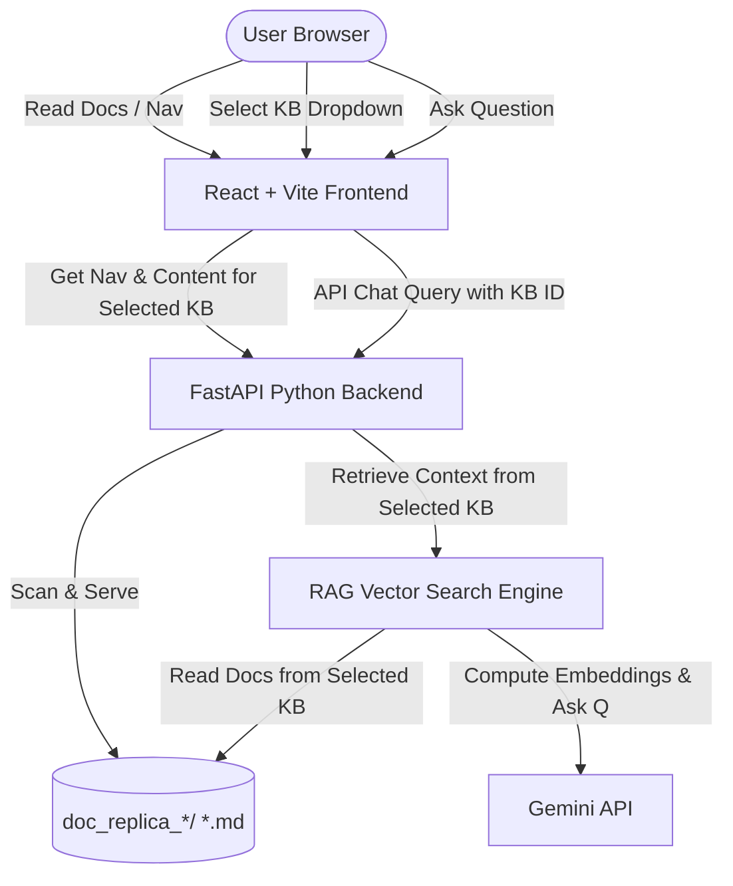

# AWS Bedrock Interactive Documentation Portal & Q&A Agent

The goal is to build an interactive, beautiful local web application that serves multiple downloaded markdown knowledge bases as a responsive HTML document portal, coupled with a Retrieval-Augmented Generation (RAG) AI Chat Agent that answers questions using the selected documentation.

## Proposed Architecture (Multi-KB RAG)



### 1. Frontend (React + Vite)
* **Design & Theme**: Sleek zinc/dark mode style with glassmorphism panels, smooth micro-animations, and responsive layouts.
* **KB Selector**: A top-bar dropdown allowing the user to select which Knowledge Base to load (e.g. AWS Bedrock Guide, Boto3 SDK, Terraform, etc.).
* **Doc Reader**: Left sidebar showing the collapsible navigation tree for the selected KB; center area rendering markdown files.
* **Chat Panel**: An interactive chatbot panel on the right showing agent responses with source citations (links to relevant documentation pages in the selected KB).

### 2. Backend (FastAPI Python)
* **Dynamic KB Scan API**: Detects all directories matching `doc_replica_*` and returns them as available KBs.
* **Directory Scan API**: Scans the chosen KB directory (e.g. `doc_replica_amazon/` or `doc_replica_boto3/`) and generates a clean hierarchical JSON for the sidebar menu.
* **Document Serve API**: Serves the raw/HTML content of the requested markdown file within the selected KB.
* **AI Chat API (`/api/chat`)**: Performs semantic search over the selected KB's markdown files, builds a prompt context, and queries Gemini (`gemini-2.5-flash`) for the answer.

### 3. Semantic Search Engine (`rag_engine.py`)
* A lightweight semantic indexer that splits the `.md` files of each KB into text chunks.
* Computes vector embeddings using the official Google GenAI SDK (`text-embedding-004`).
* Caches embeddings locally in `kb_doc_replica_amazon/backend/embeddings_<kb_id>_cache.json` for lightning-fast lookups.

---

## Directory Layout (Multi-KB Parallel Folders)

```
/Users/nishantsaxena/workspace/wscs_bedrock/
├── doc_replica_amazon/           # KB 1: Official AWS Bedrock Guide
│   ├── download_docs.py
│   └── ...
│
├── doc_replica_terraform/        # KB 2: Terraform AWS Provider Docs
│   └── ...
│
├── doc_replica_boto3/            # KB 3: Boto3 (Python SDK) Official Docs
│   └── ...
│
├── doc_replica_general/          # KB 4: General Bedrock scripts and notes
│   └── ...
│
└── kb_doc_replica_amazon/        # [New] The Web Application folder
    ├── backend/
    │   ├── app.py                # FastAPI Server (supports multiple doc_replica_* folders)
    │   ├── rag_engine.py         # Multi-KB semantic search and Gemini agent logic
    │   └── requirements.txt      # Python dependencies (fastapi, uvicorn, google-genai)
    └── frontend/
        ├── package.json
        ├── vite.config.js
        └── src/
            ├── App.jsx           # Main Portal Layout (with KB Selector Dropdown)
            ├── main.jsx
            ├── index.css         # Styling system
            └── components/
                ├── Sidebar.jsx   # Collapsible sidebar nav tree
                ├── DocReader.jsx # Markdown renderer panel
                └── ChatPanel.jsx # Q&A AI agent panel
```

---

## User Review Required

> [!IMPORTANT]
> The AI Chat Agent requires access to the Gemini API. We will use the Google GenAI SDK, which reads the `GEMINI_API_KEY` environment variable. You will need to provide a Gemini API Key to enable the Q&A features.

---

## Verification Plan

### Automated & Manual Verification
1. Initialize the project and verify backend startup.
2. Build and launch the React app.
3. Verify navigation tree loads correctly from the local markdown files.
4. Verify clicking pages in the sidebar loads the correct markdown contents.
5. Verify the Chat Agent responds to queries with accurate information sourced from the local docs.
