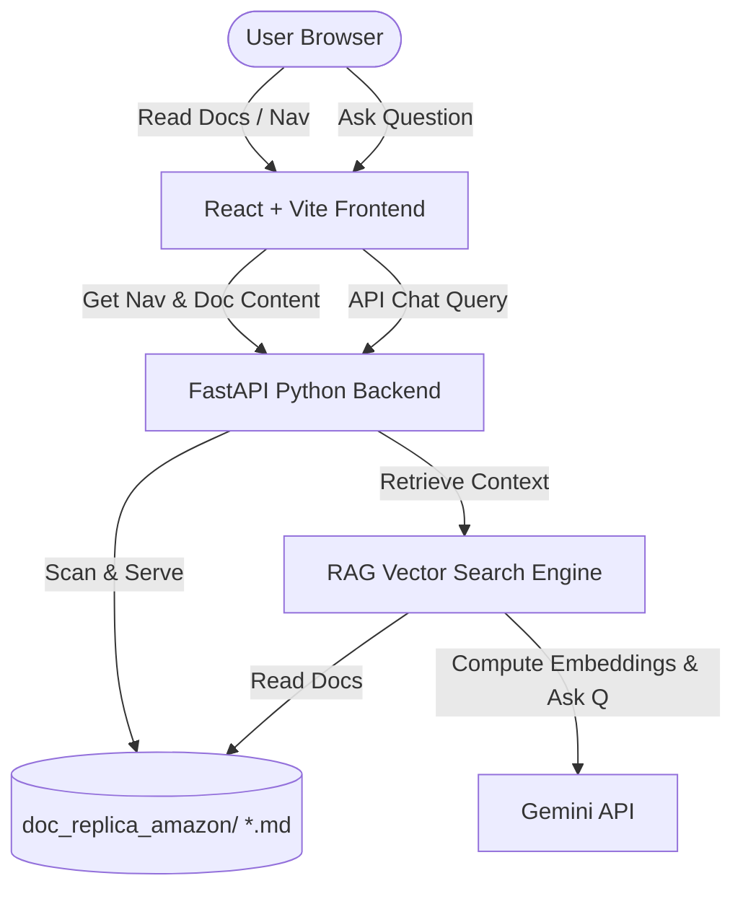

# AWS Bedrock Interactive Documentation Portal & Q&A Agent

The goal is to build an interactive, beautiful local web application that serves the downloaded AWS Bedrock markdown files as a responsive HTML document portal, coupled with a Retrieval-Augmented Generation (RAG) AI Chat Agent that answers questions using the documentation.

## Proposed Architecture



### 1. Frontend (React + Vite)
* **Design & Theme**: Sleek zinc/dark mode style with glassmorphism panels, smooth micro-animations, and responsive layouts.
* **Doc Reader**: Left sidebar showing the collapsible navigation tree; center area rendering markdown files.
* **Chat Panel**: An interactive chatbot panel on the right showing agent responses with source citations (links to relevant documentation pages).

### 2. Backend (FastAPI Python)
* **Directory Scan API**: Scans the `doc_replica_amazon/` directory and generates a clean hierarchical JSON for the sidebar menu.
* **Document Serve API**: Serves the raw/HTML content of the requested markdown files.
* **AI Chat API (`/api/chat`)**: Reads the query, performs semantic search over the docs, builds a prompt context, and queries Gemini (`gemini-2.5-flash`) for the answer.

### 3. Semantic Search Engine (`rag_engine.py`)
* A lightweight semantic indexer that splits the `.md` files into text chunks.
* Computes vector embeddings using the official Google GenAI SDK (`text-embedding-004`).
* Caches embeddings locally in `doc_replica_amazon/embeddings_cache.json` for lightning-fast lookups without recalculating them.

---

## Proposed Directory Layout

We will create a new directory `doc_viewer/` at the root of your workspace:

```
doc_viewer/
├── backend/
│   ├── app.py                # FastAPI Server
│   ├── rag_engine.py         # semantic search and Gemini agent logic
│   └── requirements.txt      # Python dependencies (fastapi, uvicorn, google-genai)
└── frontend/
    ├── package.json
    ├── vite.config.js
    └── src/
        ├── App.jsx           # Main Portal Layout
        ├── main.jsx
        ├── index.css         # Styling system
        └── components/
            ├── Sidebar.jsx   # Collapsible sidebar nav tree
            ├── DocReader.jsx # Markdown renderer panel
            └── ChatPanel.jsx # Q&A AI agent panel
```

---

## User Review Required

> [!IMPORTANT]
> The AI Chat Agent requires access to the Gemini API. We will use the Google GenAI SDK, which reads the `GEMINI_API_KEY` environment variable. You will need to provide a Gemini API Key to enable the Q&A features.

---

## Verification Plan

### Automated & Manual Verification
1. Initialize the project and verify backend startup.
2. Build and launch the React app.
3. Verify navigation tree loads correctly from the local markdown files.
4. Verify clicking pages in the sidebar loads the correct markdown contents.
5. Verify the Chat Agent responds to queries with accurate information sourced from the local docs.
